<div align="center">

# Evolith Core

> **Navegación Bilingüe:** [English](./README.md)

[](https://www.npmjs.com/package/@beyondnet/evolith-cli)
[](https://www.npmjs.com/package/@beyondnet/evolith-cli)
[](https://github.com/beyondnetcode/evolith_arch32/actions/workflows/ci-cd.yml)
[](./LICENSE)

**Tus reglas de arquitectura, ejecutándose en cada PR.**



<sub>Salida real del CLI publicado sobre un repositorio vacío (2026-09-14, abreviada; <a href="./docs/evidence/first-run-capture.es.md">captura completa de 71 filas</a>).</sub>

</div>

Las decisiones de arquitectura suelen vivir en documentos que nadie vuelve a leer. Evolith las convierte en reglas que se comprueban automáticamente cada vez que alguien abre un pull request.

**Qué hace**

Lee tu repositorio —carpetas, workflows, manifiestos, decisiones de arquitectura— y lo compara con una biblioteca de reglas sobre capas, dependencias, seguridad y CI/CD. Si una regla bloqueante no se cumple, el PR no pasa. Es un linter, pero para la arquitectura.

**Por qué es distinto**

1. **Cuenta lo que no pudo revisar.** Un linter normal solo reporta lo que falló. Evolith también reporta las reglas que no llegó a evaluar; si una de ellas es bloqueante, el PR falla igual. Así un "todo en verde" nunca significa "no revisé nada".

2. **Sigue el ciclo de vida del producto.** Cada producto está en una fase: Discovery → Design → Construction → QA → Delivery. Evolith evalúa los controles de la fase actual y no recomienda avanzar a la siguiente hasta que se cumplen, guardando evidencia de cada paso. Las decisiones de arquitectura (ADR) se escriben con la misma herramienta y muchas reglas nacen de ellas.

**Para quién es**

- **Equipos** que quieren que sus decisiones de arquitectura se apliquen solas, sin revisiones manuales.
- **Plataformas** que necesitan bloquear artefactos no conformes antes de llegar a producción.
- **Agentes de IA** que deben validar su propia salida con las mismas reglas que el equipo humano.

**Por dónde empezar**

1. [Pruébalo en dos minutos](#pruébalo-en-dos-minutos) — un `npx` y ves tu primer resultado.
2. [Cuatro términos que necesitas](#cuatro-términos-que-necesitas) — regla, pack, topología y fase.
3. [Úsalo en CI](#en-ci) — para que corra en cada PR.

¿Más contexto? [La compuerta de fase, en la CLI y en el Tracker](#la-compuerta-de-fase-en-la-cli-y-en-el-tracker) · [Qué hay dentro](#qué-hay-dentro) · [Cómo se compara](#cómo-se-compara) · [Qué no es](#qué-no-es) · [Documentación](#documentación) · [Atlas interactivo](https://beyondnetcode.github.io/evolith_arch32/)

---

## Pruébalo en dos minutos

Necesitas Node ≥ 18. Sin base de datos, sin servidor, sin Docker; tu código no sale de tu máquina.

```bash
npx -y @beyondnet/evolith-cli init --name mi-proyecto --yes   # escribe evolith.yaml en el directorio actual
npx -y @beyondnet/evolith-cli validate --engine opa           # evalúa; sale con 2 si algo bloqueante no pasó
```

**La primera ejecución fallará, y está bien:** es una línea base, no una nota. Muchas reglas asumen un layout que tu repositorio todavía no tiene. Para empezar solo por lo que ya has adoptado:

```bash
npx -y @beyondnet/evolith-cli rulesets                        # lista los packs que carga tu instalación
npx -y @beyondnet/evolith-cli validate --engine opa --select rulesets/acl/anti-corruption-layer.rules.json
```

`init` escribe `evolith.yaml` con el nombre, tipo y fase del producto y tu stack; `--engine opa` elige el motor con más cobertura hoy (el porqué, en [Estado real](./docs/known-limitations.es.md)). Cómo se ve una primera ejecución, fila por fila: [captura](./docs/evidence/first-run-capture.es.md). Guía completa: [Inicio rápido](./docs/guides/evolith-quickstart.es.md).

---

## Cuatro términos que necesitas

- **Regla** — un chequeo con id, prioridad (`MUST` / `SHOULD` / `COULD`) y un veredicto: `passed`, `failed` o `skipped` (no pudo evaluarse). Una `MUST` en `skipped` bloquea igual que una `failed`.
- **Pack** — un fichero `*.rules.json` que agrupa reglas por tema (ACL, seguridad, CI…). `evolith rulesets` los lista; `--select` elige cuáles aplicar.
- **Topología** — el estilo de arquitectura que declaras: `modular-monolith`, `distributed-modules`, `microservices`, `event-driven`, `serverless`, `edge-computing`, `data-mesh` o `agentic-ai`. Las mismas reglas te siguen cuando el monolito se parte en servicios.
- **Fase** — dónde está el producto en su ciclo de vida: Discovery → Design → Construction → QA → Delivery. Cada fase tiene controles que bloquean el paso a la siguiente.

Un **ADR** (Architecture Decision Record) es una decisión de arquitectura por escrito; `evolith adr create` lo redacta y muchas reglas se derivan de ellos. [Glosario completo](./reference/core/sdlc/glossary/glossary-ecosystem.es.md).

---

## La compuerta de fase, en la CLI y en el Tracker

El mismo corpus que hace fallar un PR decide también si un producto puede salir de su fase. Sobre el satélite de la primera ejecución, el gate de Discovery pide seis artefactos y no encuentra ninguno:



<sub>Salida real del CLI publicado (2026-09-20, abreviada; <a href="./docs/evidence/phase-gate-capture.es.md">captura completa</a>). <code>--core ../evolith</code> es un checkout de este repositorio: el tarball aún no trae las definiciones de gate (<a href="./reference/core/control-center/gaps/gap-tracking.es.md">GT-714</a>).</sub>

La CLI evalúa y propone; más allá de la evidencia que imprime, no guarda nada. Decidir, y conservar la decisión, es para lo que existe **Evolith Tracker**: el mismo gate alrededor de una iniciativa, con los criterios que deriva su tipo, la firma del product owner y las fases que siguen bloqueadas hasta que se aprueba el gate anterior.


<sub>Entorno UAT de Evolith Tracker el 2026-09-20, gobernando este repositorio como producto. Producto comercial, no lanzado, repositorio privado. El Core al que llama es el que ejecuta la CLI — y su llamada de conformidad del repositorio es la que destapó GT-715 ([Estado real](./docs/known-limitations.es.md#el-tracker-le-envió-un-repositorio-al-core-y-el-core-respondió-500)).</sub>

---

## En CI

```yaml
- uses: beyondnetcode/evolith_arch32@v1
  with:
    fail-on-violation: true
```

Códigos de salida: `0` pasa · `1` la herramienta falló · `2` la puerta bloqueó · `3` invocación inválida. `1` y `3` significan que el repositorio **no fue evaluado**: no son formas leves de no-conforme, y el resumen del job lo dice con palabras.

Para un agente de IA, el mismo motor como servidor MCP sobre stdio (Node ≥ 20):

```json
{ "mcpServers": { "evolith": { "command": "npx", "args": ["-y", "@beyondnet/evolith-mcp"] } } }
```

---

## Qué hay dentro

| Producto | Rol |
|---|---|
| **Evolith Core** | La biblioteca de reglas, ADRs y schemas de fase. MIT y gratis: ficheros que puedes leer, editar y versionar |
| **Evolith CLI** | Evalúa tu repositorio en local o en CI; gestiona ADRs y controles de fase |
| **MCP Services** | Las reglas como contexto vivo para un agente |
| **Core API** | REST para consultar y evaluar en remoto |
| **Agent Runtime** | Ejecuta el Core desde un agente, por Puertos y Adaptadores. Experimental |
| **Evolith Tracker** | Producto comercial de gobernanza del ciclo de vida: iniciativas, fases, decisiones de gate y su rastro de aprobación, sobre el Core. En UAT ([cómo se ve](#la-compuerta-de-fase-en-la-cli-y-en-el-tracker)); aún no lanzado; será el único de pago |

Cuántas reglas, packs y ADRs carga tu instalación lo imprime `evolith rulesets`; los conteos del árbol los mide CI en cada PR y los publica el [inventario del corpus](./reference/core/control-center/maturity-reports/inventory-summary.es.md).

<div align="center"><a href="https://beyondnetcode.github.io/evolith_arch32/master-view.html" title="Abrir el diagrama interactivo"></a><br/><sub><b><a href="https://beyondnetcode.github.io/evolith_arch32/master-view.html">Abrir visor interactivo</a></b> — arrastra para desplazar, rueda para zoom</sub></div>

---

## Cómo se compara

Las herramientas a las que uno acude primero comprueban cosas distintas, y las diferencias están en las filas, no en los adjetivos. Verificado contra la documentación de cada herramienta el 2026-09-19; las correcciones son bienvenidas como PR.

| | ArchUnit | dependency-cruiser | Conftest | Evolith |
|---|---|---|---|---|
| **Qué lee** | Bytecode de la JVM: clases, paquetes, capas | El grafo de imports de módulos JS/TS | Ficheros de configuración estructurados (YAML, JSON, HCL, Dockerfile…) | El repositorio alrededor del código: layout, workflows, manifiestos, ADRs — **no** el AST |
| **Lenguaje de reglas** | DSL fluido en Java, ejecutado como tests unitarios | Configuración JSON/JS (`forbidden` / `allowed`) | Rego | Rego, compilado a Wasm, en packs JSON |
| **Dónde viven las reglas** | En el código, por repositorio | En el repositorio (`.dependency-cruiser.js`) | Un directorio de políticas; compartible con `conftest pull` (git, OCI) | Una biblioteca fuera de los repositorios, adoptada por repositorio con `--select` |
| **Una regla que no se evaluó** | Falla la regla cuyo `should` recibió un conjunto vacío (`failOnEmptyShould`, activo por defecto) | `severity: ignore` la omite en silencio; no existe otro resultado | Sin resultado: un `deny` indefinido es un aprobado | `skipped` es un veredicto de primera clase, contado junto a `passed` y `failed`; un `skipped` **bloqueante** hace fallar la ejecución |
| **Código de salida** | Un test unitario que falla | El número de violaciones `error` | `1` si falla (`0`/`1`/`2` con `--fail-on-warn`) | `0` pasa · `1` falló la herramienta · `2` el gate bloqueó · `3` invocación inválida |
| **Superficies** | Tests Java | CLI (+ grafos de dependencias) | CLI | CLI · GitHub Action · servidor MCP · API REST |
| **Reglas derivadas de ADRs** | — | — | — | Sí: `evolith adr create`, y muchos packs se derivan de decisiones |
| **Alcance de lenguaje** | JVM | JavaScript / TypeScript | Cualquier fichero estructurado | Cualquier repositorio para reglas estructurales, de CI/CD y de ADR; Node/TypeScript para las de dependencias y linters |
| **Licencia** | Apache-2.0 | MIT | Apache-2.0 | MIT |

Son complementos, no sustitutos: ArchUnit y dependency-cruiser ven *dentro* del código, Conftest ve un fichero cada vez, Evolith ve el repositorio como unidad gobernada y cuenta lo que no pudo decidir. Ejecutar Evolith junto a una de ellas es la configuración prevista.

---

## Qué no es

- **No sustituye a ArchUnit, Conftest ni dependency-cruiser; los complementa.** Las reglas viven fuera del código, como datos que gobiernan muchos repositorios y que un agente puede leer. Evolith *es* OPA por debajo y añade la biblioteca de reglas, la derivación de ADR a regla y la contabilidad de cobertura.
- **No lee el AST de tu código.** Inspecciona estructura, workflows, manifiestos y artefactos de gobernanza; el subconjunto que mira dependencias y linters asume un repositorio Node/TypeScript.
- **No llama a ningún LLM.** Ningún comando de la CLI publicada alcanza uno; «el LLM propone, un verificador determinista dispone» es una dirección documentada, no comportamiento publicado. Divulgación de egreso de red: [Política de Seguridad](./SECURITY.es.md#salida-de-red-y-tratamiento-de-datos).

**Lo que esta portada no cuenta** —qué cubre cada motor, cifras que no cuadran, adopción real, plataformas sin verificar— está en una sola página con fecha: [Estado real del proyecto](./docs/known-limitations.es.md). Existe porque un README que solo cuenta lo bueno es exactamente el defecto que Evolith detecta.

---

## Documentación

| Para… | Ve a |
|---|---|
| Empezar según tu rol | [Inicio por Rol](./reference/core/foundations/inheritance-model/product-quick-start.es.md) |
| Entender las reglas y ADRs | [Hub de Evolith Core](./reference/core/README.es.md) |
| Ver el corpus ejecutable | [Rulesets](./src/rulesets/README.es.md) · [Políticas OPA](./src/rulesets/opa/README.es.md) · [Schemas](./src/rulesets/schema/README.es.md) |
| Elegir o migrar de topología | [Hub de Topologías](./reference/core/architecture/topologies/README.es.md) |
| Usar CLI, MCP o REST | [Hub de Interfaces](./reference/core/interfaces/README.es.md) · [Hub de Evolith CLI](./product/products/smart-cli/README.es.md) |
| Ver el estado del proyecto | [Estado real](./docs/known-limitations.es.md) · [Tablero de Gaps](./reference/core/control-center/gaps/gap-tracking.es.md) · [Madurez](./reference/core/control-center/README.es.md) |
| Resolver una duda concreta | [Q&A](./reference/core/sdlc/q-and-a.es.md) · [Glosario](./reference/core/sdlc/glossary/glossary-ecosystem.es.md) |
| Recorrer todo el corpus | [Índice Maestro](./MASTER_INDEX.es.md) · [Hub de Producto](./product/README.es.md) · [Taxonomía del Repositorio](./reference/core/control-center/taxonomy/repository-taxonomy.es.md) |

---

## Contribución

**Empieza por aquí:** [issues buenos para una primera contribución](https://github.com/beyondnetcode/evolith_arch32/issues?q=is%3Aopen+label%3A%22good+first+issue%22) — la mayoría toca un solo fichero. ¿Dudas antes de abrir un PR? [Discussions](https://github.com/beyondnetcode/evolith_arch32/discussions).

**Tres formas de aportar sin escribir TypeScript:** corregir una divergencia de conteo entre docs y código · traducir un hub al español · añadir una regla a `src/rulesets/`.

Antes del PR: [Guía de Contribución](./CONTRIBUTING.es.md) · [Política de Seguridad](./SECURITY.es.md) · [AGENTS.es.md](./AGENTS.es.md) · [CHANGELOG](./CHANGELOG.md) (EN)

---

## Licencia

Publicado bajo la [Licencia MIT](./LICENSE).
