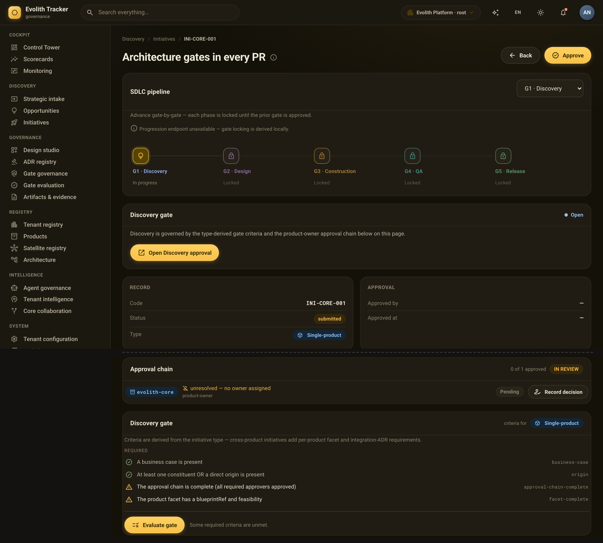

<div align="center">

# Evolith Core

> **Bilingual Navigation:** [Versión en Español](./README.es.md)

[](https://www.npmjs.com/package/@beyondnet/evolith-cli)
[](https://www.npmjs.com/package/@beyondnet/evolith-cli)
[](https://github.com/beyondnetcode/evolith_arch32/actions/workflows/ci-cd.yml)
[](./LICENSE)

**Your architecture rules, running on every PR.**



<sub>Real output of the published CLI on an empty repository (2026-09-14, abridged; <a href="./docs/evidence/first-run-capture.md">full 71-row capture</a>).</sub>

</div>

Architecture decisions tend to live in documents nobody reads again. Evolith turns them into rules that are checked automatically every time someone opens a pull request.

**What it does**

It reads your repository — folders, workflows, manifests, architecture decisions — and compares it against a library of rules about layering, dependencies, security and CI/CD. If a blocking rule is not met, the PR does not pass. It is a linter, but for architecture.

**What makes it different**

1. **It counts what it could not check.** A regular linter only reports what failed. Evolith also reports the rules it never got to evaluate; if one of them is blocking, the PR fails just the same. So "all green" never means "nothing was checked".

2. **It follows the product lifecycle.** Every product is in a phase: Discovery → Design → Construction → QA → Delivery. Evolith evaluates the gates of the current phase and does not recommend moving to the next one until they pass, keeping evidence of every step. Architecture decisions (ADRs) are written with the same tool and many rules derive from them.

**Who it is for**

- **Teams** that want their architecture decisions enforced automatically, not reviewed by hand.
- **Platforms** that need to block non-conformant artifacts before they reach production.
- **AI agents** that must validate their own output against the same rules as the human team.

**Where to start**

1. [Try it in two minutes](#try-it-in-two-minutes) — one `npx` and you see your first result.
2. [Four terms you need](#four-terms-you-need) — rule, pack, topology and phase.
3. [Use it in CI](#in-ci) — so it runs on every PR.

Want more context? [The phase gate, in the CLI and in the Tracker](#the-phase-gate-in-the-cli-and-in-the-tracker) · [What is inside](#what-is-inside) · [How it compares](#how-it-compares) · [What it is not](#what-it-is-not) · [Documentation](#documentation) · [Interactive atlas](https://beyondnetcode.github.io/evolith_arch32/)

---

## Try it in two minutes

You need Node ≥ 18. No database, no server, no Docker; your code never leaves your machine.

```bash
npx -y @beyondnet/evolith-cli init --name my-project --yes   # writes evolith.yaml in the current directory
npx -y @beyondnet/evolith-cli validate --engine opa          # evaluates; exits 2 if anything blocking did not pass
```

**The first run will fail, and that is fine:** it is a baseline, not a grade. Many rules assume a layout your repository does not have yet. To start only from what you have already adopted:

```bash
npx -y @beyondnet/evolith-cli rulesets                        # lists the packs your installation loads
npx -y @beyondnet/evolith-cli validate --engine opa --select rulesets/acl/anti-corruption-layer.rules.json
```

`init` writes `evolith.yaml` with the product's name, type and phase and your stack; `--engine opa` picks the engine with the most coverage today (why, in [Known limitations](./docs/known-limitations.md)). What a first run looks like, row by row: [capture](./docs/evidence/first-run-capture.md). Full guide: [Quickstart](./docs/guides/evolith-quickstart.md).

---

## Four terms you need

- **Rule** — a check with an id, a priority (`MUST` / `SHOULD` / `COULD`) and a verdict: `passed`, `failed` or `skipped` (could not be evaluated). A `MUST` that ends `skipped` blocks exactly as a `failed` one.
- **Pack** — a `*.rules.json` file grouping rules by topic (ACL, security, CI…). `evolith rulesets` lists them; `--select` picks which ones to apply.
- **Topology** — the architecture style you declare: `modular-monolith`, `distributed-modules`, `microservices`, `event-driven`, `serverless`, `edge-computing`, `data-mesh` or `agentic-ai`. The same rules follow you when the monolith splits into services.
- **Phase** — where the product is in its lifecycle: Discovery → Design → Construction → QA → Delivery. Each phase has gates that block the move to the next one.

An **ADR** (Architecture Decision Record) is an architecture decision in writing; `evolith adr create` drafts one, and many rules are derived from them. [Full glossary](./reference/core/sdlc/glossary/glossary-ecosystem.md).

---

## The phase gate, in the CLI and in the Tracker

The same corpus that fails a PR also decides whether a product may leave its phase. On the satellite from the first run, the Discovery gate asks for six artifacts and finds none:



<sub>Real output of the published CLI (2026-09-20, abridged; <a href="./docs/evidence/phase-gate-capture.md">full capture</a>). <code>--core ../evolith</code> is a checkout of this repository: the tarball does not carry the gate definitions yet (<a href="./reference/core/control-center/gaps/gap-tracking.md">GT-714</a>).</sub>

The CLI evaluates and proposes; beyond the evidence it prints, it keeps nothing. Deciding, and keeping the decision, is what **Evolith Tracker** is for: the same gate around an initiative, with the criteria its type derives, the product owner's sign-off, and the phases that stay locked until the previous gate is approved.



<sub>Evolith Tracker's UAT environment on 2026-09-20, governing this repository as a product. Commercial product, not launched, private repository. The Core it calls is the one the CLI runs — and its repository-conformance call is what found GT-715 ([Real status](./docs/known-limitations.md#the-tracker-sent-the-core-a-repository-and-the-core-answered-500)).</sub>

---

## In CI

```yaml
- uses: beyondnetcode/evolith_arch32@v1
  with:
    fail-on-violation: true
```

Exit codes: `0` pass · `1` the tool failed · `2` the gate blocked · `3` invalid invocation. `1` and `3` mean the repository was **not evaluated**: they are not weaker forms of non-compliant, and the job summary says so in words.

For an AI agent, the same engine as an MCP server over stdio (Node ≥ 20):

```json
{ "mcpServers": { "evolith": { "command": "npx", "args": ["-y", "@beyondnet/evolith-mcp"] } } }
```

---

## What is inside

| Product | Role |
|---|---|
| **Evolith Core** | The library of rules, ADRs and phase schemas. MIT and free: files you can read, edit and version |
| **Evolith CLI** | Evaluates your repository locally or in CI; manages ADRs and phase gates |
| **MCP Services** | The rules as live context for an agent |
| **Core API** | REST to query and evaluate remotely |
| **Agent Runtime** | Drives the Core from an agent, through Ports and Adapters. Experimental |
| **Evolith Tracker** | Commercial lifecycle-governance product: initiatives, phases, gate decisions and their approval trail, on top of the Core. In UAT ([what it looks like](#the-phase-gate-in-the-cli-and-in-the-tracker)); not yet launched; it will be the only paid one |

How many rules, packs and ADRs your installation loads is printed by `evolith rulesets`; the tree's counts are measured by CI on every PR and published in the [corpus inventory](./reference/core/control-center/maturity-reports/inventory-summary.md).

<div align="center"><a href="https://beyondnetcode.github.io/evolith_arch32/master-view.html" title="Open the interactive diagram"></a><br/><sub><b><a href="https://beyondnetcode.github.io/evolith_arch32/master-view.html">Open the interactive viewer</a></b> — guided tour in eleven stops · drag to pan · scroll to zoom · numbers derived from the tree on every build</sub></div>

---

## How it compares

The tools people reach for first check different things, and the differences are in the rows, not in the adjectives. Verified against each tool's own documentation on 2026-09-19; corrections welcome as a PR.

| | ArchUnit | dependency-cruiser | Conftest | Evolith |
|---|---|---|---|---|
| **What it reads** | JVM bytecode: classes, packages, layers | The JS/TS module import graph | Structured config files (YAML, JSON, HCL, Dockerfile…) | The repository around the code: layout, workflows, manifests, ADRs — **not** the AST |
| **Rule language** | Java fluent DSL, run as unit tests | JSON/JS config (`forbidden` / `allowed`) | Rego | Rego, compiled to Wasm, in JSON packs |
| **Where rules live** | In the code base, per repository | In the repository (`.dependency-cruiser.js`) | A policy directory; shareable with `conftest pull` (git, OCI) | A library outside the repositories, adopted per repository with `--select` |
| **A rule that did not evaluate** | Fails a rule whose `should` got an empty set (`failOnEmptyShould`, on by default) | `severity: ignore` skips it silently; no other outcome exists | No outcome: an undefined `deny` is a pass | `skipped` is a first-class verdict, counted next to `passed` and `failed`; a **blocking** `skipped` fails the run |
| **Exit code** | A failing unit test | The number of `error` violations | `1` on failure (`0`/`1`/`2` with `--fail-on-warn`) | `0` pass · `1` the tool failed · `2` the gate blocked · `3` invalid invocation |
| **Surfaces** | Java tests | CLI (+ dependency graphs) | CLI | CLI · GitHub Action · MCP server · REST API |
| **Rules derived from ADRs** | — | — | — | Yes: `evolith adr create`, and many packs are derived from decisions |
| **Language scope** | JVM | JavaScript / TypeScript | Any structured file | Any repository for structural, CI/CD and ADR rules; Node/TypeScript for the dependency and linter rules |
| **License** | Apache-2.0 | MIT | Apache-2.0 | MIT |

They are complements, not substitutes: ArchUnit and dependency-cruiser see *inside* the code, Conftest sees one file at a time, Evolith sees the repository as a governed unit and counts what it could not decide. Running Evolith next to one of them is the intended setup.

---

## What it is not

- **Not a replacement for ArchUnit, Conftest or dependency-cruiser; it complements them.** Rules live outside the codebase, as data that governs many repositories and that an agent can read. Evolith *is* OPA underneath, and adds the rule library, the ADR-to-rule derivation and the coverage accounting.
- **It does not read your code's AST.** It inspects structure, workflows, manifests and governance artifacts; the subset that looks at dependencies and linters assumes a Node/TypeScript repository.
- **It does not call any LLM.** No command in the published CLI reaches one; "the LLM proposes, a deterministic verifier disposes" is a documented direction, not shipped behaviour. Network egress disclosure: [Security Policy](./SECURITY.md#network-egress-and-data-handling).

**What this front page does not say** — what each engine covers, counts that disagree, real adoption, unverified platforms — lives on a single dated page: [Known limitations](./docs/known-limitations.md). It exists because a README that only tells the good part is exactly the defect Evolith detects.

---

## Documentation

| To… | Go to |
|---|---|
| Start from your role | [Start by Role](./reference/core/foundations/inheritance-model/product-quick-start.md) |
| Understand the rules and ADRs | [Evolith Core hub](./reference/core/README.md) |
| See the executable corpus | [Rulesets](./src/rulesets/README.md) · [OPA policies](./src/rulesets/opa/README.md) · [Schemas](./src/rulesets/schema/README.md) |
| Choose or migrate a topology | [Topologies hub](./reference/core/architecture/topologies/README.md) |
| Use the CLI, MCP or REST | [Interfaces hub](./reference/core/interfaces/README.md) · [Evolith CLI hub](./product/products/smart-cli/README.md) |
| See the project's state | [Known limitations](./docs/known-limitations.md) · [Gap board](./reference/core/control-center/gaps/gap-tracking.md) · [Maturity](./reference/core/control-center/README.md) |
| Answer a specific question | [Q&A](./reference/core/sdlc/q-and-a.md) · [Glossary](./reference/core/sdlc/glossary/glossary-ecosystem.md) |
| Walk the whole corpus | [Master Index](./MASTER_INDEX.md) · [Product hub](./product/README.md) · [Repository Taxonomy](./reference/core/control-center/taxonomy/repository-taxonomy.md) |

---

## Contributing

**Start here:** [issues that are good for a first contribution](https://github.com/beyondnetcode/evolith_arch32/issues?q=is%3Aopen+label%3A%22good+first+issue%22) — most touch a single file. Unsure before opening a PR? [Discussions](https://github.com/beyondnetcode/evolith_arch32/discussions).

**Three ways to contribute without writing TypeScript:** correct a count that disagrees between docs and code · translate a hub into Spanish · add a rule to `src/rulesets/`.

Before the PR: [Contribution Guide](./CONTRIBUTING.md) · [Security Policy](./SECURITY.md) · [AGENTS.md](./AGENTS.md) · [CHANGELOG](./CHANGELOG.md)

---

## License

Released under the [MIT License](./LICENSE).
