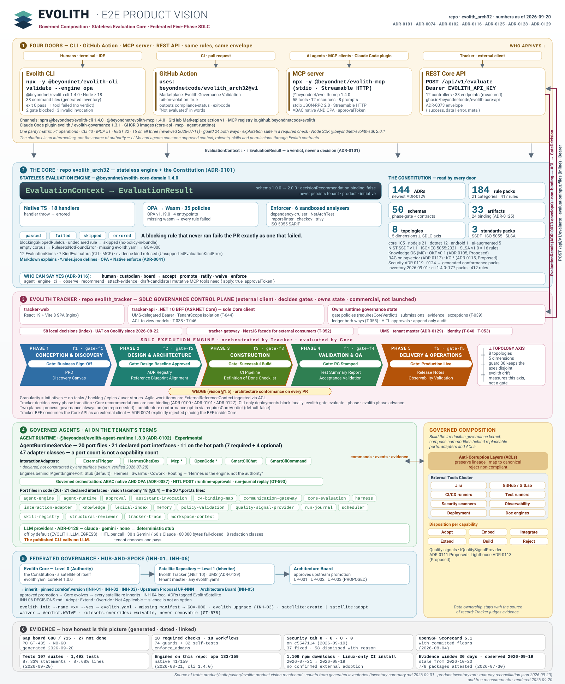

<div align="center">

# Evolith: Executable Architectural Governance Framework

> **Bilingual Navigation:** [Versión en Español](./README.es.md)

[]()
[]()
[]()
[](https://github.com/beyondnetcode/evolith_arch32/actions)

<br/>

<a href="https://beyondnetcode.github.io/evolith_arch32/master-view.html" title="Open the interactive diagram — pan & zoom">
  
</a>

<sub>↑ Evolith E2E Product Vision · <b><a href="https://beyondnetcode.github.io/evolith_arch32/master-view.html">Open interactive viewer</a></b> — drag to pan · scroll to zoom · fullscreen · <kbd>Ctrl</kbd>/<kbd>⌘</kbd>+click for a new tab</sub>

</div>

---

## Menu

- [What is Evolith?](#what-is-evolith)
- [Why Evolith?](#why-evolith)
- [Core Concepts](#core-concepts)
- [Product Ecosystem](#product-ecosystem)
- [How It Works](#how-it-works)
- [Architecture Overview](#architecture-overview)
- [Main Components](#main-components)
- [Quick Start](#quick-start)
- [Documentation](#documentation)
- [Use Cases](#use-cases)
- [Roadmap](#roadmap)
- [Contributing](#contributing)
- [License](#license)

---

## What is Evolith?

Evolith is an **executable architectural governance framework**. It encodes how software is built — across multiple architecture styles — as verifiable rules, ADRs, and phase gates that teams, platforms, and AI agents can actually run.

Governance in Evolith is not a document. It is an operational capability exposed through a CLI, an MCP server, and a REST API.

---

## Why Evolith?

Most projects accumulate ADRs and architecture docs that nobody reads and nobody enforces. Systems drift. Decisions are forgotten. Consistency breaks silently.

Evolith makes governance **executable**:

- Rules are validated automatically, not reviewed manually.
- Phase gates block progression until quality criteria are met.
- AI agents and CI pipelines consume the same governance artifacts as humans.
- Architecture decisions are traceable from ADR to production code.

---

## Core Concepts

| Concept | What it is |
|---|---|
| **SDLC Phases** | The five stages from idea to production: Discovery → Design → Construction → QA → Delivery |
| **Gates** | Automated checkpoints that close each phase before the next begins |
| **Topologies** | Architecture styles (e.g., modular monolith, microservices, event-driven, agentic-AI) |
| **ADRs** | Architecture Decision Records — the authoritative log of architectural choices |
| **Blueprints** | Canonical design templates for each topology |
| **Rulesets** | Machine-readable rules enforced by the CLI and Core API |
| **OPA Policies** | Open Policy Agent policies for fine-grained governance checks |
| **Artifacts** | Structured outputs at each phase: specs, schemas, manifests, contracts |
| **AI Agents** | Specialized agents (Winston and others) that participate in the SDLC as first-class contributors |

Full details: [Core Concepts](./reference/core/README.md) · [Topologies](./reference/core/architecture/topologies/README.md)

---

## Product Ecosystem

Evolith ships as a suite of coordinated products built on a common foundation.

| Product | Role |
|---|---|
| **[Evolith Core](reference/README.md)** | Provider-neutral constitution: principles, ADRs, rulesets, topologies, and contracts |
| **[Smart CLI](product/products/smart-cli/README.md)** | Local enforcement — validate code, run gates, manage ADRs, serve MCP |
| **[Core API](product/products/core-api/README.md)** | REST service for remote governance queries and evaluation |
| **[MCP Services](product/products/mcp-services/README.md)** | Governance as live context for LLMs and AI agents (27 tools, 9 resources, 8 prompts) |
| **[Agent Runtime](reference/core/architecture/foundations/README.md)** | Agentic mediation layer — orchestrates Core through Ports & Adapters; Hermes is one replaceable adapter |
| **[Evolith Tracker](product/products/evolith-tracker/README.md)** | Business lifecycle governance — phases, owners, funding, and ROI |
| **[Rulesets](src/rulesets/README.md)** | Machine-readable enforcement rules per topology |
| **[OPA Policies](src/rulesets/opa/README.md)** | Fine-grained policy checks integrated into the pipeline |
| **[Schemas & Manifests](src/rulesets/schema/README.md)** | Structured contracts for artifacts and topology definitions |

---

## How It Works

```
Developer / AI Agent / External Trigger
        │
        ▼
  Smart CLI  ──────────────────────────────► MCP Server
  (local enforcement)                        (AI agent context)
        │
        ▼
   Core API  ────────────────────────────►  Evolith Tracker
  (remote governance)                        (business lifecycle)
        │
        ▼
  Agent Runtime ───────────────────────────► Hermes (adapter)
  (agentic mediation, Ports & Adapters)       (.harness · OPA · Tracker · Memory)
        │
        ▼
  Rulesets · OPA Policies · ADRs · Blueprints
  (the shared governance artifacts)
```

1. **Smart CLI** validates code locally against rulesets and runs phase gates.
2. **Core API** exposes the same governance remotely for CI pipelines and orchestrators.
3. **MCP Server** feeds governance context to LLMs and AI agents in real time.
4. **Agent Runtime** orchestrates Core capabilities through a Ports & Adapters model — Hermes is one replaceable adapter.
5. **Evolith Tracker** coordinates the business side — who owns what, what's funded, what ships when.

All products share the same artifacts defined in **Evolith Core**.

---

## Architecture Overview

Evolith governs **8 topologies** across four axes:

| Axis | Topologies |
|---|---|
| Progressive | `modular-monolith` · `distributed-modules` · `microservices` |
| Integration | `event-driven` |
| Execution | `serverless` · `edge-computing` |
| Data | `data-mesh` |
| AI | `agentic-ai` |

Each topology has its own ADRs, OPA policies, AI rulesets, and UMS contracts. Systems migrate between topologies as the business scales — this is **Progressive Architecture**.

Full reference: [Architecture hub](./reference/core/architecture/README.md) · [C4 Master Architecture](./reference/core/architecture/demos/C4-MASTER-ARCHITECTURE.md)

---

## Main Components

```
evolith/
├── src/packages/agent-runtime/  # @evolith/agent-runtime — Ports & Adapters agentic layer
├── src/apps/agent-runtime-api/  # NestJS HTTP service wrapping the runtime (POST /v1/agent/handle)
├── reference/core/          # Engineering constitution and principles
├── reference/core/architecture/  # Topologies, blueprints, ADRs, and agent-runtime docs
├── reference/core/sdlc/    # SDLC phases, gates, standards, and glossary
├── product/products/      # Smart CLI, Core API, MCP, Tracker, UMS
└── product/operations/    # SRE, infra, quality gates
```

Entry point for each area: [Global Master Index](./reference/core/control-center/taxonomy/MASTER_INDEX.md)

---

## Quick Start

```bash
# Install Smart CLI (npm package @beyondnet/evolith-cli; command: evolith-cli)
npx @beyondnet/evolith-cli init

# Validate your code against your topology's rulesets
evolith-cli validate

# Validate a specific SDLC phase
evolith-cli validate --phase qa

# Manage Architecture Decision Records
evolith-cli adr create
evolith-cli adr list

# Serve governance as live context for AI agents — the MCP server ships as a
# separate package (@beyondnet/evolith-mcp); start it with its own bin:
evolith-mcp
```

Smart CLI ships **25 commands** and is configured via **`evolith.yaml`**. Full reference: [Smart CLI hub](./product/products/smart-cli/README.md)

---

## Documentation

| Area | Link |
|---|---|
| Core constitution | [Evolith Core hub](./reference/core/README.md) |
| Interface how-to (CLI / MCP / REST) | [Interface guides](./reference/core/interfaces/README.md) |
| Master Architecture | [C4 Master Architecture](./reference/core/architecture/demos/C4-MASTER-ARCHITECTURE.md) |
| SDLC governance | [SDLC Governance Center](./reference/core/sdlc/README.md) |
| Topologies | [Topologies hub](./reference/core/architecture/topologies/README.md) |
| Smart CLI | [Smart CLI hub](./product/products/smart-cli/README.md) |
| Core API | [Core API hub](./product/products/core-api/README.md) |
| MCP Services | [MCP Services hub](./product/products/mcp-services/README.md) |
| Agent Runtime | [Agent Runtime hub](./reference/core/architecture/foundations/README.md) |
| Evolith Tracker | [Tracker hub](./product/products/evolith-tracker/README.md) |
| Operations & SRE | [Operations hub](./product/operations/README.md) |
| Onboarding by role | Getting Started by Role |
| Ecosystem glossary | [Glossary](./reference/core/sdlc/glossary/glossary-ecosystem.md) |
| Gap tracking | [Gap Tracking Board](./reference/core/control-center/gaps/gap-tracking.md) |
| All artifacts | [Global Master Index](./reference/core/control-center/taxonomy/MASTER_INDEX.md) |

---

## Use Cases

**For engineering teams**
Enforce architecture decisions automatically. Run phase gates in CI. Keep ADRs alive and traceable.

**For platform teams**
Query governance remotely via Core API. Integrate rulesets into deployment pipelines. Block non-compliant artifacts before they reach production.

**For AI-assisted development**
Feed governance context to LLMs through MCP. Let AI agents validate their own outputs against architecture rulesets before committing.

**For growing products**
Start with a modular monolith. Migrate to distributed modules or microservices when the business demands it — Evolith tracks the transition and enforces consistency at every step.

---

## Roadmap

See the active gap tracking board for current priorities and open items:

- [Gap Tracking Board](./reference/core/control-center/gaps/gap-tracking.md)
- [Maturity & Gaps hub](./reference/core/control-center/README.md)

---

## Contributing

Read these before opening a PR:

- [Contributing Guide](./CONTRIBUTING.md)
- [Security Policy](./SECURITY.md)
- [AGENTS.md](./AGENTS.md) — conventions for AI agent contributors
- [Repository Taxonomy](./reference/core/control-center/taxonomy/repository-taxonomy.md) — what goes where

---

## License

Published under the [MIT License](./LICENSE).

---

<div align="center">
  <sub>Evolith — Executable Architectural Governance Framework | Multi-Topology Reference Corpus | Spec-driven AI-DD</sub>
</div>
