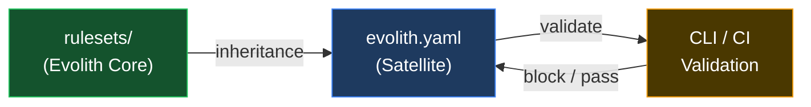

# Evolith Rulesets Hub

> **Navegación bilingüe:** [Versión en Español](./README.es.md)

Machine-readable governance rules that satellite repositories inherit and validate against.

---

## Purpose

> **Goal:** turn the human-authored constitution into automated, CI-enforceable rules that satellites cannot silently bypass.
>
> **Objectives:** version every rule, validate every artifact against a schema, and gate every phase transition automatically.

Evolith Rulesets are the **machine-readable enforcement layer** of the Evolith governance framework. While `reference/` contains human-authored standards, ADRs, and documentation, `rulesets/` contains the concrete rules, schemas, and contracts that tools (CLI, CI pipelines, linters) consume to **validate** satellite compliance.

---

## Rule Categories

If you are onboarding a new satellite repository, read the categories in this order — from inheritance contract to artifact validation:

| Document | Description | Goal / Objective | Type | Mandatory |
|---|---|---|---|---|
| [Governance Rules](./governance/README.md) | `evolith.yaml` contract and inheritance rules | Govern satellite inheritance | Ruleset category | Yes |
| [Architecture Rules](./architecture/README.md) | F1/F2/F3 phase progression rules | Gate architecture phases | Ruleset category | Yes |
| [ADR-Encoded Rules](./adr/README.md) | Rules derived from accepted ADRs | Enforce ADR decisions automatically | Ruleset category | Yes |
| [Cross-Cutting Rules](./cross-cutting/README.md) | Compliance baseline, Definition of Done, manifesto, and taxonomy rules | Enforce cross-cutting compliance | Ruleset category | Yes |
| [SDLC Rules](./sdlc/README.md) | Quality gates and threshold definitions | Enforce lifecycle quality | Ruleset category | Yes |
| [Anti-Corruption Layer Rules](./acl/README.md) | External system integration governance | Protect domain boundaries | Ruleset category | Yes |
| [CLI Rules](./cli/README.md) | Smart CLI release readiness and Core parity | Gate CLI releases | Ruleset category | Yes |
| [Evidence Rules](./evidence/README.md) | Auditable evidence manifests | Standardize evidence | Ruleset category | Yes |
| [MCP Rules](./mcp/README.md) | MCP protocol compliance | Validate MCP exposure | Ruleset category | Yes |
| [Observability Rules](./observability/README.md) | Telemetry evidence for operations | Verify telemetry evidence | Ruleset category | Yes |
| [Topology Rulesets](./topologies/README.md) | Executable topology-specific Native and OPA rules | Govern topology validation | Ruleset category | Yes |
| [Schemas](./schema/README.md) | JSON Schema for validating Evolith artifacts | Validate artifact structure | Schema collection | Yes |
| [OPA Policies](./opa/README.md) | OPA policies and their input schemas | Validate governance and architectural rules | Policy collection | Yes |

---

## Directory Structure

```
rulesets/
├── compliance-baseline/        # WS1 executable compliance baseline entrypoint
│   └── compliance-baseline.rules.json
├── definition-of-done/         # WS1 executable Definition of Done entrypoint
│   └── definition-of-done.rules.json
├── engineering-manifesto/      # WS1 executable Engineering Manifesto entrypoint
│   └── engineering-manifesto.rules.json
├── repository-taxonomy/        # WS1 executable Repository Taxonomy entrypoint
│   └── repository-taxonomy.rules.json
├── phase-gates/                # WS1 executable SDLC phase-gates entrypoint
│   └── phase-gates.rules.json
├── quality-thresholds/         # WS1 executable quality-thresholds entrypoint
│   └── quality-thresholds.rules.json
├── satellite-contracts/        # WS1 executable Satellite Contracts entrypoint
│   └── satellite-contracts.rules.json
├── opa/                        # OPA policies and inputs schemas
│   ├── schemas/                # OPA policy input schemas (9 schemas)
│   ├── *.rego                  # Rego policy files
│   └── README.md               # OPA index
├── schema/                     # JSON Schema definitions (19 schemas)
│   ├── adr.schema.json         # ADR artifact validation
│   ├── prd.schema.json         # PRD artifact validation
│   ├── discovery-canvas.schema.json     # Phase 1
│   ├── technical-feasibility.schema.json # Phase 1
│   ├── ballpark-estimation.schema.json   # Phase 1
│   ├── evolith-user-story.schema.json    # Phase 1
│   ├── agile-backlog.schema.json          # Phase 1
│   ├── cli-impact-analysis.schema.json   # Phase 1-2
│   ├── functional-story.schema.json      # Phase 2
│   ├── technical-story.schema.json       # Phase 3
│   ├── test-summary-report.schema.json   # Phase 4
│   ├── release-notes.schema.json         # Phase 5
│   ├── evolith-yaml.schema.json          # Satellite governance
│   └── topology-manifest.schema.json     # Topology manifest contract
├── architecture/               # F1/F2/F3 compatibility aliases and migration guidance
│   └── README.md               # Resolves aliases through topology manifests
├── topologies/                 # Topology-specific executable rules
│   └── README.md
├── adr/                        # ADR-encoded rules (7 ADRs)
│   ├── adr-0002-hexagonal-architecture.rules.json
│   ├── adr-0005-cicd-quality-gates.rules.json
│   ├── adr-0018-testing-pyramid.rules.json
│   ├── adr-0032-protocol-selection.rules.json
│   ├── adr-0040-multi-runtime.rules.json
│   ├── adr-0050-gitflow-branching.rules.json
│   └── adr-0010-multi-tenancy.rules.json
├── cross-cutting/              # Aliases only — canonical files are in domain-specific dirs above
│   ├── compliance-baseline.rules.json    # alias → compliance-baseline/compliance-baseline.rules.json
│   ├── definition-of-done.rules.json     # alias → definition-of-done/definition-of-done.rules.json
│   ├── engineering-manifesto.rules.json  # alias → engineering-manifesto/engineering-manifesto.rules.json
│   └── repository-taxonomy.rules.json    # alias → repository-taxonomy/repository-taxonomy.rules.json
├── acl/                        # Anti-Corruption Layer rules (NEW)
│   ├── anti-corruption-layer.rules.json  # ACL enforcement
│   └── anti-corruption-layer.rules.es.json
├── sdlc/                       # SDLC gate rules
│   ├── phase-gates.rules.json
│   └── quality-thresholds.rules.json
├── cli/                        # Smart CLI release and parity rules
│   ├── release-readiness.rules.json
│   └── core-parity.rules.json
├── evidence/                   # Auditable evidence contract
│   └── evidence-manifest.rules.json
├── mcp/                        # MCP protocol exposure rules
│   └── protocol-compliance.rules.json
├── observability/              # Telemetry evidence rules
│   └── telemetry-evidence.rules.json
└── governance/                 # Federated governance rules
    ├── inheritance.rules.json
    ├── satellite-contracts.rules.json
    ├── open-core-boundary.rules.json  # Core vs Enterprise separation
    └── executive-scorecards.rules.json  # DORA + SPACE metrics
```

---

The canonical topology rule artifact is the file declared by each `topology.manifest.json`; the current progressive-axis artifacts live under `reference/architecture/topologies/progressive-axis/`. Consumers must resolve the manifest rather than construct legacy `rulesets/architecture/f*.rules.json` paths.

## How Rulesets Work



1. **Evolith Core** publishes rulesets
2. **Satellites** declare `evolith.yaml` inheriting specific rule versions
3. **CLI / CI** validates satellite against inherited rules
4. **Failures** block phase gates or merge

---

## Key Principles

| Principle | Description |
|---|---|
| **Versioned rules** | Every rule has a version; satellites pin to a specific version |
| **Fail-fast validation** | CI must fail on rule violations; no bypass without explicit waiver |
| **Topology-aware** | F1/F2/F3 remain progressive-axis compatibility aliases while topology manifests drive broader topology-specific validation |
| **Federated inheritance** | Satellites inherit from Core; they do not modify Core rules |
| **Schema-first** | All artifacts have JSON Schema for machine validation |

---

## Related Documents

| Document | Description | Goal / Objective | Type | Mandatory |
|---|---|---|---|---|
| [AGENTS.md](../AGENTS.md) | Agent rules and conventions | Govern agent contributions | Standard | Yes |
| [Repository Taxonomy](../reference/governance/standards/repository-taxonomy.md) | What goes where in Evolith | Keep the repository organized | Governance standard | Yes |
| [Child Repository Inheritance](../reference/governance/standards/onboarding/child-repository-inheritance-guide.md) | How products inherit from Evolith | Standardize inheritance | Guide | Yes |
| [Navigation Hub](../reference/navigation/README.md) | Full repository navigation | Centralize navigation | Navigation hub | No |

---

<div align="center">
  <sub>Evolith — Enterprise Architecture Platform | Rulesets Hub</sub>
</div>
