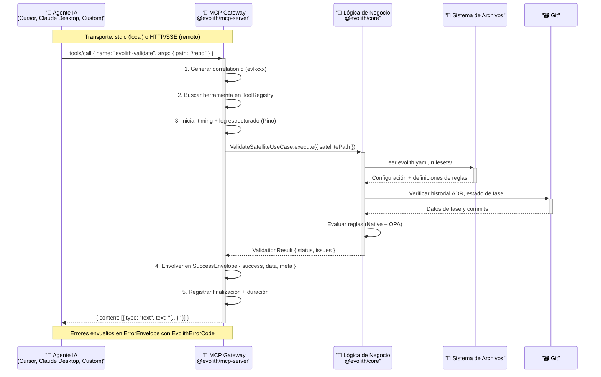

# @evolith/mcp-server

## Evolith MCP Gateway — Servidor de Protocolo de Contexto de Modelo de Primera Clase

> **Navegación bilingüe:** [English version](./README.md)

Desacopla el servidor MCP del CLI. Ahora es un producto de primera clase que expone las herramientas MCP como un **Gateway** que se comunica con `@evolith/core` (capa de lógica de negocio reutilizable), en lugar de ejecutar subprocesos del CLI.

---

## Diagrama de Arquitectura



---

## Transportes

| Transporte               | Uso                                     | Comando                                           |
| ------------------------ | --------------------------------------- | ------------------------------------------------- |
| **stdio** (JSON-RPC 2.0) | Agentes locales, Cursor, Claude Desktop | `evolith-mcp serve`                               |
| **HTTP + SSE**           | Agentes remotos, escalabilidad          | `evolith-mcp serve --transport http --port 49100` |

---

## Instalación

```bash
# Desde el monorepo
npm install @evolith/mcp-server

# O globalmente
npm install -g @evolith/mcp-server
```

## Uso

```bash
# stdio (default) — para Cursor, Claude Desktop, etc.
evolith-mcp serve

# HTTP — para integración remota
evolith-mcp serve --transport http --port 49100
```

### Variables de entorno

| Variable          | Default | Descripción                                    |
| ----------------- | ------- | ---------------------------------------------- |
| `TRANSPORT`       | `stdio` | Transporte: `stdio` o `http`                   |
| `PORT`            | `3000`  | Puerto para HTTP                               |
| `EVOLITH_API_KEY` | —       | API key para autenticación HTTP                |
| `LOG_LEVEL`       | `info`  | Nivel de log: `trace`, `debug`, `info`, `warn`, `error` |

> Los logs siempre se escriben a **stderr** (Pino); stdout queda reservado para el stream JSON-RPC del transporte stdio.

---

## Herramientas

Las 24 tools se obtienen en runtime con `tools/list`. Por familia: Validación
(`evolith-validate`), Arquitectura (`evolith-architecture-validate`,
`evolith-drift-detect`), Gates SDLC (`evolith-gate-evaluate`,
`evolith-phase-advance`), SDLC (`evolith-sdlc-status`, `evolith-sdlc-handoff`,
`evolith-dora-metrics`), MoSCoW (`evolith-moscow-create/load/update/remove/list/validate/report`),
Agentes (`evolith-agent-install/list/validate/upgrade/remove`), Remediación
(`evolith-auto-fix`), Configuración (`evolith-config-get/set`) y Observabilidad
(`evolith-metrics`). Además: **8 prompts** y **8 resources**.

> Las operaciones que escriben (`agent-install`, `config-set`, `sdlc-handoff`,
> `auto-fix`) son mutativas y exigen `{ "confirm": true }` o
> `mcp.allowMutations: true` en `evolith.yaml`.

---

## Arquitectura Interna

Aplicación **NestJS** (módulos + DI). El único seam con infraestructura concreta
es `DomainModule`; las tools dependen solo del servicio de dominio compartido.

```
@evolith/mcp-server/              ← Gateway NestJS
├── src/
│   ├── main.ts                   ← Bootstrap (parseArgs + NestFactory + transporte)
│   ├── app.module.ts             ← Módulo raíz
│   ├── common/
│   │   ├── errors.ts             ← ErrorCodes + DomainException
│   │   ├── envelopes.ts          ← SuccessEnvelope / ErrorEnvelope + correlationId
│   │   └── stderr-logger.ts      ← LoggerService de Nest sobre Pino → stderr
│   ├── mcp/
│   │   ├── tool.interface.ts     ← McpTool + token MCP_TOOLS
│   │   ├── tool-registry.service.ts
│   │   ├── metrics.service.ts
│   │   └── mcp-server.service.ts ← MCP SDK Server + dispatch + transportes stdio/HTTP
│   ├── tools/
│   │   └── validate.tool.ts      ← evolith-validate
│   └── domain/
│       └── domain.module.ts      ← Cablea @evolith/core con @evolith/infra-providers

@evolith/core               ← Lógica de negocio (RulesetValidatorService, use-cases, tipos)
@evolith/infra-providers    ← Adapters (NodeFileSystem, YamlConfigParser, DiskRulesetRepository)
```

---

## Guía de Extensión

Para añadir una nueva herramienta:

1. Crear `src/tools/mi-herramienta.tool.ts` implementando la interfaz `McpTool`
   (`schema`, `execute`, y `mutative: true` si modifica estado).
2. Inyectar el servicio de dominio que necesite desde `@evolith/core`.
3. Devolver datos crudos: `McpServerService` los envuelve en `SuccessEnvelope` /
   `ErrorEnvelope` automáticamente.
4. Registrar la tool en `tools.module.ts` (provider + factory `MCP_TOOLS`).

---

## Plan de Migración

### Fase 1: Coexistencia

El servidor MCP antiguo (`smart-cli mcp`) sigue funcionando. El nuevo comando `evolith-mcp serve` se publica como paquete independiente.

### Fase 2: Deprecación

- Marcar `smart-cli mcp` como **deprecated**
- Añadir advertencia al ejecutar `smart-cli mcp`
- Migrar integraciones a `evolith-mcp`

### Fase 3: Remoción

- Eliminar el código MCP de `@evolith/smart-cli` en una major version bump

### Configuración de Cursor / Claude Desktop

**Cursor** (`~/.cursor/config.json`):

```json
{
  "mcpServers": {
    "evolith": {
      "command": "evolith-mcp",
      "args": ["serve"],
      "env": { "LOG_LEVEL": "info" }
    }
  }
}
```

**Claude Desktop** (`claude_desktop_config.json`):

```json
{
  "mcpServers": {
    "evolith": {
      "command": "evolith-mcp",
      "args": ["serve"]
    }
  }
}
```

---

## Licencia

ISC — Beyondnet
