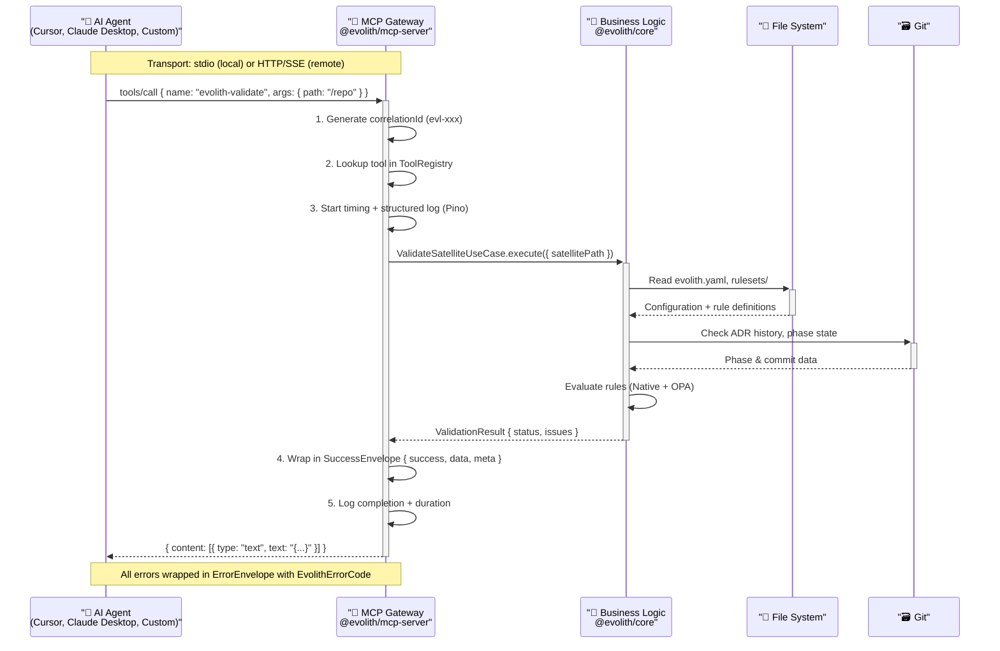

# @evolith/mcp-server

## Evolith MCP Gateway — First-Class Model Context Protocol Server

> **Bilingual navigation:** [Versión en Español](./README.es.md)

Desacopla el servidor MCP del CLI. Ahora es un producto de primera clase que expone las herramientas MCP como un **Gateway** que se comunica con `@evolith/core` (capa de lógica de negocio reutilizable), en lugar de ejecutar subprocesos del CLI.

---

## Diagrama de Arquitectura



---

## Transportes

| Transporte               | Uso                                     | Comando                                           |
| ------------------------ | --------------------------------------- | ------------------------------------------------- |
| **stdio** (JSON-RPC 2.0) | Agentes locales, Cursor, Claude Desktop | `evolith-mcp serve`                               |
| **HTTP + SSE**           | Agentes remotos, escalabilidad          | `evolith-mcp serve --transport http --port 49100` |

---

## Instalación

```bash
# Desde el monorepo
npm install @evolith/mcp-server

# O globalmente
npm install -g @evolith/mcp-server
```

## Uso

```bash
# stdio (default) — para Cursor, Claude Desktop, etc.
evolith-mcp serve

# HTTP — para integración remota
evolith-mcp serve --transport http --port 49100
```

### Variables de entorno

| Variable          | Default | Descripción                                    |
| ----------------- | ------- | ---------------------------------------------- |
| `TRANSPORT`       | `stdio` | Transporte: `stdio` o `http`                   |
| `PORT`            | `3000`  | Puerto para HTTP                               |
| `EVOLITH_API_KEY` | —       | API key para autenticación HTTP                |
| `LOG_LEVEL`       | `info`  | Nivel de log: `trace`, `debug`, `info`, `warn`, `error` |

> Los logs siempre se escriben a **stderr** (Pino), porque stdout está reservado para el stream JSON-RPC del transporte stdio.

---

## Herramientas

Las 24 tools se obtienen en runtime con la petición MCP `tools/list`. Resumen por familia:

| Familia              | Tools                                                                                                                                | Mutativa |
| -------------------- | ----------------------------------------------------------------------------------------------------------------------------------- | -------- |
| Validación           | `evolith-validate`                                                                                                                   | No       |
| Arquitectura         | `evolith-architecture-validate`, `evolith-drift-detect`                                                                              | No       |
| Gates SDLC           | `evolith-gate-evaluate`, `evolith-phase-advance`                                                                                     | No / Sí¹ |
| SDLC                 | `evolith-sdlc-status`, `evolith-sdlc-handoff`, `evolith-dora-metrics`                                                                | No / Sí  |
| MoSCoW               | `evolith-moscow-create/load/update/remove/list/validate/report`                                                                      | No²      |
| Agentes              | `evolith-agent-install/list/validate/upgrade/remove`                                                                                 | Sí²      |
| Remediación          | `evolith-auto-fix`                                                                                                                   | Sí       |
| Configuración        | `evolith-config-get`, `evolith-config-set`                                                                                           | No / Sí  |
| Observabilidad       | `evolith-metrics`                                                                                                                    | No       |

Además expone **8 prompts** (`prompts/list`) y **8 resources** (`resources/list`).

> ¹ `evolith-phase-advance` propone una transición (lectura). ² Las operaciones que escriben (`agent-install`, `config-set`, `sdlc-handoff`, `auto-fix`, mutaciones MoSCoW) están marcadas como mutativas y exigen `{ "confirm": true }` o `mcp.allowMutations: true` en `evolith.yaml`.

**Esquema I/O de herramientas**

Cada herramienta declara su `inputSchema` (JSON Schema) en su clase. El catálogo
completo se obtiene en runtime mediante la petición MCP estándar `tools/list`,
que devuelve el `schema` de cada tool registrada.

---

## Arquitectura Interna

El Gateway es una aplicación **NestJS** (módulos + inyección de dependencias). El
único punto donde toca infraestructura concreta es `DomainModule`; las tools
dependen solo del servicio de dominio compartido.

```
@evolith/mcp-server/              ← Este paquete (Gateway NestJS)
├── nest-cli.json                 ← builder: tsc
├── src/
│   ├── main.ts                   ← Bootstrap (parseArgs + NestFactory + arranque del transporte)
│   ├── app.module.ts             ← Módulo raíz
│   ├── common/
│   │   ├── errors.ts             ← ErrorCodes + DomainException
│   │   ├── envelopes.ts          ← SuccessEnvelope / ErrorEnvelope + correlationId
│   │   └── stderr-logger.ts      ← LoggerService de Nest sobre Pino → stderr
│   ├── mcp/
│   │   ├── mcp.module.ts
│   │   ├── tool.interface.ts     ← McpTool + token MCP_TOOLS
│   │   ├── tool-registry.service.ts
│   │   ├── metrics.service.ts
│   │   └── mcp-server.service.ts ← MCP SDK Server + dispatch + transportes stdio/HTTP
│   ├── tools/
│   │   ├── tools.module.ts       ← Agrega las tools y alimenta el registry
│   │   └── validate.tool.ts      ← evolith-validate
│   └── domain/
│       └── domain.module.ts      ← Cablea @evolith/core con @evolith/infra-providers

@evolith/core               ← Lógica de negocio (RulesetValidatorService, use-cases, tipos)
@evolith/infra-providers    ← Adapters (NodeFileSystem, YamlConfigParser, DiskRulesetRepository)
```

---

## Guía de Extensión

Para añadir una nueva herramienta:

1. Crear `src/tools/mi-herramienta.tool.ts` implementando la interfaz `McpTool`
   (`schema`, `execute`, y `mutative: true` si modifica estado).
2. Inyectar el servicio de dominio que necesite (desde `@evolith/core`).
3. Devolver datos crudos: `McpServerService` los envuelve en un `SuccessEnvelope`
   y captura los errores en un `ErrorEnvelope` automáticamente.
4. Registrar la tool en `tools.module.ts`: añadir el provider y sumarlo al
   factory de `MCP_TOOLS`.

**Patrón de tool:**

```typescript
import { Injectable } from "@nestjs/common";
import { McpTool, McpToolSchema } from "../mcp/tool.interface";

@Injectable()
export class MiHerramientaTool implements McpTool {
  readonly schema: McpToolSchema = {
    name: "evolith-mi-herramienta",
    description: "Descripción de lo que hace",
    inputSchema: {
      type: "object",
      properties: { param1: { type: "string", description: "..." } },
      required: ["param1"],
    },
  };

  // constructor(private readonly servicio: AlgunServicioDeCore) {}

  async execute(args: Record<string, unknown>): Promise<unknown> {
    if (!args.param1) throw new Error("param1 is required");
    // Lógica de negocio delegada a @evolith/core...
    return { ok: true };
  }
}
```

Para operaciones mutativas, marca `readonly mutative = true`: el dispatcher exige
`{ "confirm": true }` en los argumentos o `mcp.allowMutations: true` en `evolith.yaml`.

---

## Plan de Migración

### Fase 1: Coexistencia (actual → próximo release)

El servidor MCP antiguo (`@evolith/smart-cli` → `smart-cli mcp`) sigue funcionando. El nuevo comando `evolith-mcp serve` se publica como paquete independiente.

### Fase 2: Deprecación

- Marcar `smart-cli mcp` como **deprecated** en el README y CHANGELOG
- Añadir advertencia (`console.warn`) al ejecutar `smart-cli mcp`
- Migrar todas las integraciones (Cursor, Claude Desktop) a `evolith-mcp`

### Fase 3: Remoción

- Eliminar el código MCP de `@evolith/smart-cli` en una major version bump
- El CLI conserva sus comandos de validación, pero ya no incluye el servidor MCP

### Configuración de Cursor / Claude Desktop

**Cursor** (`~/.cursor/config.json`):

```json
{
  "mcpServers": {
    "evolith": {
      "command": "evolith-mcp",
      "args": ["serve"],
      "env": { "LOG_LEVEL": "info" }
    }
  }
}
```

**Claude Desktop** (`claude_desktop_config.json`):

```json
{
  "mcpServers": {
    "evolith": {
      "command": "evolith-mcp",
      "args": ["serve"]
    }
  }
}
```

---

## Licencia

ISC — Beyondnet
