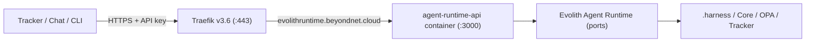

# Despliegue — Evolith Agent Runtime API (Coolify)

> **Navegación bilingüe:** [English version](./agent-runtime-deploy.md)

Cómo desplegar el servicio HTTP del Evolith Agent Runtime
([`src/apps/agent-runtime-api`](../../../src/apps/agent-runtime-api/Dockerfile)) en el VPS
de Hostinger mediante Coolify, expuesto en **`evolithruntime.beyondnet.cloud`**.
Sigue el mismo modelo Coolify + Traefik que `core-api`/`mcp-server` (ver la
[guía del VPS](./README.es.md)).



## Meta y objetivos

> **Meta:** llevar `agent-runtime-api` al VPS con SSL automático, un endpoint
> protegido por API key y despliegue por push de GitHub.

**Objetivos:** crear la aplicación en Coolify desde el repo, enrutar el dominio
por Traefik, configurar el entorno (API key + adaptadores opcionales) y verificar
que el pipeline gobernado responde por HTTPS.

## Prerrequisitos

- El VPS, Coolify y Traefik ya están corriendo (según la [guía del VPS](./README.es.md)).
- Repositorio de GitHub conectado a Coolify.
- Acceso al DNS de `beyondnet.cloud`.
- Una API key generada (p. ej. `openssl rand -hex 32`).

## Paso 1 — Apuntar el DNS

Crea un **registro A** de DNS para el subdominio apuntando a la IP pública del VPS:

```text
evolithruntime.beyondnet.cloud.  A  <IP_PUBLICA_VPS>
```

Espera la propagación (`dig +short evolithruntime.beyondnet.cloud` devuelve la IP).

## Paso 2 — Crear la aplicación en Coolify

En el panel de Coolify: **New Resource → Application → desde el repo de GitHub conectado**.

- Build pack: **Dockerfile**.
- Ubicación del Dockerfile: `src/apps/agent-runtime-api/Dockerfile`.
- Directorio base / contexto de build: `/` (raíz del repo — obligatorio, la
  imagen compila los paquetes workspace del repo).
- Rama: `main` (o tu rama de despliegue).

## Paso 3 — Configurar dominio y puerto

- Dominio: `https://evolithruntime.beyondnet.cloud`.
- Puerto (expuesto por el contenedor): `3000`.
- Habilita SSL (Let's Encrypt vía Traefik) y "Force HTTPS".
- Ruta de health check: `/health`.

## Paso 4 — Configurar variables de entorno

Agrégalas en Coolify (marca `AGENT_RUNTIME_API_KEY` como secreto). Ver
[`.env.example`](../../../src/apps/agent-runtime-api/.env.example) para la lista completa.

```text
NODE_ENV=production
PORT=3000
AGENT_RUNTIME_API_KEY=<tu-key-generada>
CORS_ORIGINS=https://tracker.beyondnet.cloud
```

Deja vacías las variables de adaptadores opcionales para correr con adaptadores
in-memory/stub seguros; ve la última sección para habilitar los reales.

## Paso 5 — Desplegar y verificar

Dispara **Deploy** en Coolify. Cuando esté sano, verifica:

```bash
# Health público (sin key)
curl -s https://evolithruntime.beyondnet.cloud/health

# Catálogo (requiere la API key)
curl -s https://evolithruntime.beyondnet.cloud/v1/agent/skills \
  -H "Authorization: Bearer <tu-key>"

# Ejecutar una petición gobernada
curl -s -X POST https://evolithruntime.beyondnet.cloud/v1/agent/handle \
  -H "Authorization: Bearer <tu-key>" -H "content-type: application/json" \
  -d '{"intent":"validate_discovery_gate","tool":"validate-discovery-gate","gate":"prd_readiness","parameters":{"requiredArtifacts":["prd"],"presentArtifacts":["prd"]}}'
```

Un `200` con `"status":"passed"` y un bloque `trace` confirma el despliegue.

## Opcional — Habilitar .harness, OPA y Tracker reales

La imagen incluye el corpus en `/repo/corpus`. Configura estas variables para
pasar de stubs a adaptadores reales (sin reconstruir):

```text
AGENT_RUNTIME_HARNESS_ROOT=/repo/corpus/.harness
AGENT_RUNTIME_OPA_ENABLED=true
AGENT_RUNTIME_OPA_PATH=/repo/corpus/.harness/bin/opa
AGENT_RUNTIME_OPA_POLICY_DIR=/repo/corpus/rulesets/opa
AGENT_RUNTIME_TRACKER_ENDPOINT=https://tracker.beyondnet.cloud/api/v1/traces
AGENT_RUNTIME_TRACKER_TOKEN=<token-del-tracker>
```

## Operación — redeploy, logs, rollback

- **Redeploy:** haz push a la rama de despliegue (webhook) o pulsa **Redeploy** en Coolify.
- **Logs:** la pestaña "Logs" de la aplicación en Coolify transmite el stdout del contenedor.
- **Rollback:** Coolify conserva despliegues previos; selecciona uno anterior y
  vuelve a desplegar. El servicio es sin estado, así que el rollback es seguro.
