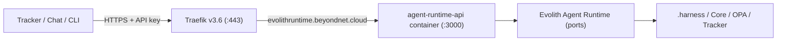

# Deploy — Evolith Agent Runtime API (Coolify)

> **Bilingual Navigation:** [Versión en Español](./agent-runtime-deploy.es.md)

How to deploy the Evolith Agent Runtime HTTP service
([`src/apps/agent-runtime-api`](../../../src/apps/agent-runtime-api/Dockerfile)) to the
Hostinger VPS via Coolify, exposed at **`evolithruntime.beyondnet.cloud`**. It
follows the same Coolify + Traefik model as `core-api`/`mcp-server` (see the
[VPS guide](./README.md)).



## Goal and Objectives

> **Goal:** ship `agent-runtime-api` to the VPS with automatic SSL, an API-key
> protected endpoint, and GitHub push-to-deploy.

**Objectives:** create the Coolify application from the repo, route the domain
through Traefik, configure the environment (API key + optional adapters), and
verify the governed pipeline answers over HTTPS.

## Prerequisites

- The VPS, Coolify, and Traefik are already running (per the [VPS guide](./README.md)).
- GitHub repository connected to Coolify.
- Access to DNS for `beyondnet.cloud`.
- A generated API key (e.g. `openssl rand -hex 32`).

## Step 1 — Point DNS

Create a DNS **A record** for the subdomain pointing at the VPS public IP:

```text
evolithruntime.beyondnet.cloud.  A  <VPS_PUBLIC_IP>
```

Wait for propagation (`dig +short evolithruntime.beyondnet.cloud` returns the IP).

## Step 2 — Create the Coolify application

In the Coolify panel: **New Resource → Application → from the connected GitHub repo**.

- Build pack: **Dockerfile**.
- Dockerfile location: `src/apps/agent-runtime-api/Dockerfile`.
- Base directory / build context: `/` (repository root — required, the image
  builds the in-repo workspace packages).
- Branch: `main` (or your deploy branch).

## Step 3 — Configure domain and port

- Domain: `https://evolithruntime.beyondnet.cloud`.
- Port (exposed by the container): `3000`.
- Enable SSL (Let's Encrypt via Traefik) and "Force HTTPS".
- Health check path: `/health`.

## Step 4 — Set environment variables

Add these in Coolify (mark `AGENT_RUNTIME_API_KEY` as a secret). See
[`.env.example`](../../../src/apps/agent-runtime-api/.env.example) for the full list.

```text
NODE_ENV=production
PORT=3000
AGENT_RUNTIME_API_KEY=<your-generated-key>
CORS_ORIGINS=https://tracker.beyondnet.cloud
```

Leave the optional adapter vars empty to run with safe in-memory/stub adapters;
see the last section to enable the real ones.

## Step 5 — Deploy and verify

Trigger **Deploy** in Coolify. Once healthy, verify:

```bash
# Public health (no key)
curl -s https://evolithruntime.beyondnet.cloud/health

# Catalog (requires the API key)
curl -s https://evolithruntime.beyondnet.cloud/v1/agent/skills \
  -H "Authorization: Bearer <your-key>"

# Run a governed request
curl -s -X POST https://evolithruntime.beyondnet.cloud/v1/agent/handle \
  -H "Authorization: Bearer <your-key>" -H "content-type: application/json" \
  -d '{"intent":"validate_discovery_gate","tool":"validate-discovery-gate","gate":"prd_readiness","parameters":{"requiredArtifacts":["prd"],"presentArtifacts":["prd"]}}'
```

A `200` with `"status":"passed"` and a `trace` block confirms the deployment.

## Optional — Enable real .harness, OPA, and Tracker

The image bundles the corpus at `/repo/corpus`. Set these env vars to graduate
from stubs to real adapters (no rebuild needed):

```text
AGENT_RUNTIME_HARNESS_ROOT=/repo/corpus/.harness
AGENT_RUNTIME_OPA_ENABLED=true
AGENT_RUNTIME_OPA_PATH=/repo/corpus/.harness/bin/opa
AGENT_RUNTIME_OPA_POLICY_DIR=/repo/corpus/rulesets/opa
AGENT_RUNTIME_TRACKER_ENDPOINT=https://tracker.beyondnet.cloud/api/v1/traces
AGENT_RUNTIME_TRACKER_TOKEN=<tracker-token>
```

## Operations — redeploy, logs, rollback

- **Redeploy:** push to the deploy branch (webhook) or click **Redeploy** in Coolify.
- **Logs:** the Coolify application "Logs" tab streams container stdout.
- **Rollback:** Coolify keeps previous deployments; select an earlier one and
  redeploy. The service is stateless, so rollback is safe.
