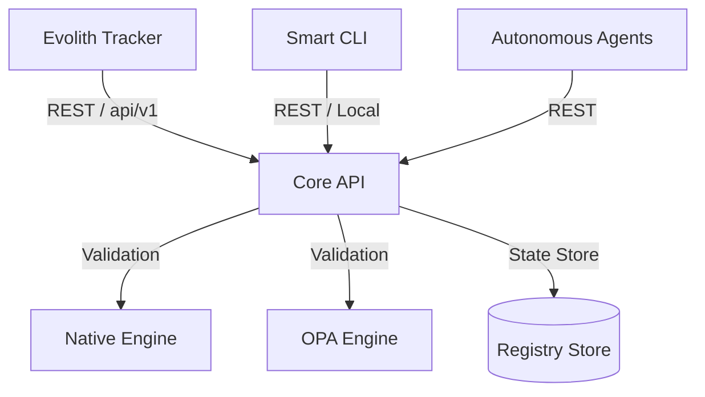

# Hub del Producto Evolith Core API

> **Navegación Bilingüe:** [English Version](./README.md)

Bienvenido al Hub del Producto **Evolith Core API**. El Core API es el motor central de validación, estado y gobernanza del ecosistema Evolith, exponiendo capacidades de verificación controladas por ejecución a desarrolladores, pipelines de CI y agentes de IA autónomos.

El Core API es la capa oficial de exposición REST del dominio Core de Evolith (`@evolith/core-domain`). Es el boundary de red que sirve el dominio sobre HTTP, junto a `@evolith/mcp-server` (protocolo MCP para agentes) y la Smart CLI. Los consumidores externos —incluido el **Evolith Tracker**— se conectan a ella como cliente HTTP. **No** es el BFF del Tracker: el Application Gateway del Tracker (ADR-0075) vive en el repositorio `evolith_tracker` y consume esta API como cliente externo.

---

## 1. Visión del Producto y Arquitectura

El Core API actúa como la implementación en tiempo de ejecución de las reglas de gobernanza de Evolith. Coordina los motores de validación (tanto el validador nativo de TypeScript como los motores de Open Policy Agent) para verificar aplicaciones satélite, procesar transiciones de fases del SDLC y rastrear la deriva arquitectónica (drift).



El Core API expone una superficie **exclusivamente REST** — no existe interfaz GraphQL. Todos los endpoints de dominio están versionados por URI bajo `/api/v1`.

### Capacidades Clave

1. **Evaluación de Gates:** Valida si un proyecto cumple con todos los criterios de calidad de sus gates para la fase actual del SDLC. Las cinco fases canónicas de gobernanza son **Conception & Discovery**, **Design & Architecture**, **Construction**, **Validation & QA** y **Delivery & Operations** (expuestas mediante las claves operativas de fase de la CLI/API `discovery`, `design`, `construction`, `qa`, `release`).
2. **Transición de Fases:** Automatiza las transiciones entre fases de SDLC basándose en la coincidencia de evidencias con reglas predefinidas.
3. **Verificación de Arquitectura:** Audita proyectos satélite contra rulesets multi-topología declarados (Monolito Modular, Distributed Modules, Microservicios, Serverless, Edge Computing, Event-Driven, Data Mesh y Agentic/AI-First).
4. **Detección de Deriva (Drift):** Rastrea en tiempo real la divergencia entre los estándares topológicos declarados y las configuraciones de los workspaces activos.

---

## 2. Stack Tecnológico y Estructura

- **Framework:** NestJS
- **Lenguaje:** TypeScript
- **Interfaces:** API REST (versionada por URI bajo `/api/v1`) y Swagger/OpenAPI. Sin GraphQL ni SSE.
- **Motores de Validación:**
  - **Validador Nativo de TypeScript:** Validador en memoria de alta velocidad.
  - **Validador OPA WASM:** Paridad de evaluación con motor dual ejecutando políticas compiladas en WebAssembly.
- **Aspectos transversales:** Cabeceras de seguridad Helmet, interceptor de envelope de respuesta ADR-0073, propagación de correlation-id, métricas Prometheus y tracing OpenTelemetry.

---

## 3. Directorio de Superficies del Proyecto

El Core API expone sus funcionalidades a través de controladores de NestJS:

- [ArchitectureController](../../../src/apps/core-api/src/presentation/controllers/architecture.controller.ts): Topologías, detección de deriva y verificación de satélites.
- [ComposableValidateController](../../../src/apps/core-api/src/presentation/controllers/composable-validate.controller.ts): Motor de validación composable GT-312 con 5 modos (SDLC, Arquitectura, Ruleset, ADR, Ad-hoc).
- [GatesController](../../../src/apps/core-api/src/presentation/controllers/gates.controller.ts): Evaluación de gates de fases del SDLC.
- [PhasesController](../../../src/apps/core-api/src/presentation/controllers/phases.controller.ts): Avance y transiciones de fases.
- [ProjectsController](../../../src/apps/core-api/src/presentation/controllers/projects.controller.ts): Inicialización de proyectos y propuestas de avance de fase.
- [ReferenceController](../../../src/apps/core-api/src/presentation/controllers/reference.controller.ts): Endpoints de consulta pública para rulesets activos, gates y requisitos.
- [HealthController](../../../src/apps/core-api/src/presentation/controllers/health.controller.ts): Health checks de liveness y readiness (version-neutral).
- [MetricsController](../../../src/apps/core-api/src/presentation/controllers/metrics.controller.ts): Exportador de métricas Prometheus (version-neutral).

### Endpoint de Validación Composable GT-312

El endpoint `POST /api/v1/validate/composable` expone el motor de validación composable, combinando hasta cinco modos (SDLC, Arquitectura, Ruleset, ADR, Ad-hoc) en una sola llamada:

```bash
# Solo validación de arquitectura
curl -X POST http://localhost:3000/api/v1/validate/composable \
  -H "Content-Type: application/json" \
  -d '{"workspaceRef": "op_01j7wq8e2n", "topology": "modular-monolith"}'

# Combinado: Arquitectura + Ruleset + ADR
curl -X POST http://localhost:3000/api/v1/validate/composable \
  -H "Content-Type: application/json" \
  -d '{
    "workspaceRef": "op_01j7wq8e2n",
    "topology": "modular-monolith",
    "ruleset": "governance/base",
    "adr": "adr-0002"
  }'
```

---

## 4. Descripción General del Consumo de la API

Los clientes se conectan al Core API a través de endpoints REST estándar versionados bajo `/api/v1/...`. Los endpoints `/health` y `/metrics` son version-neutral para compatibilidad con orquestadores. Todas las respuestas de dominio cumplen con el envelope unificado de payload definido en la **ADR-0073**:

```json
{
  "success": true,
  "data": {
    "verdict": "passed",
    "violations": []
  },
  "meta": {
    "command": "validate.composable",
    "executedAt": "2026-06-21T14:00:00Z",
    "durationMs": 45,
    "correlationId": "5f3a76ef-c5b9-478a-a92c-0e78fde14022",
    "context": {
      "initiative": "governance-audit",
      "tenant": "default",
      "phase": "discovery"
    },
    "schemaVersion": "1.0.0"
  }
}
```

La documentación detallada de los endpoints, payloads de request y envelopes de error se encuentra en la [Referencia de la API](./api-reference.md). Para la referencia operativa completa (instalación, configuración, modelo de seguridad, flujos por tenant y observabilidad), consulta el README de código autoritativo en [`apps/core-api/README.md`](../../../src/apps/core-api/README.md).

Para contribuir (clonar, construir, ejecutar las suites de tests, convenciones de ramas/commits), consulta la guía raíz [`CONTRIBUTING.md`](../../../CONTRIBUTING.md).

---

[Volver al Índice de Productos](../README.es.md)
