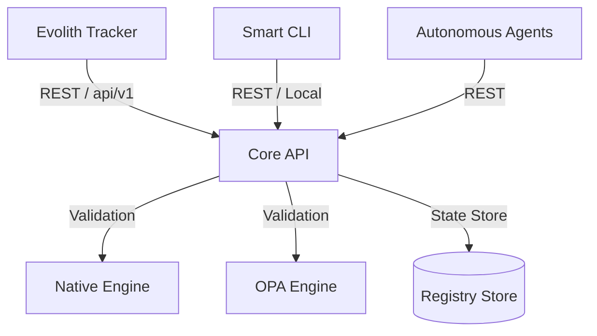

# Evolith Core API Product Hub

> **Bilingual Navigation:** [Versión en Español](./README.es.md)

Welcome to the **Evolith Core API** Product Hub. The Core API is the central validation, state, and governance engine of the Evolith ecosystem, exposing execution-gated verification capabilities to developers, CI pipelines, and autonomous AI agents.

The Core API is the official REST exposure layer of the Evolith Core domain (`@evolith/core-domain`). It is the network boundary that serves the domain over HTTP, alongside `@evolith/mcp-server` (MCP protocol for agents) and the Smart CLI. External consumers — including the **Evolith Tracker** — connect to it as an HTTP client. It is **not** the Tracker BFF: the Tracker's Application Gateway (ADR-0075) lives in the `evolith_tracker` repository and consumes this API as an external client.

---

## 1. Product Vision & Architecture

The Core API serves as the run-time implementation of the Evolith governance rulesets. It coordinates validation engines (both the Native TypeScript validator and the Open Policy Agent engines) to verify satellite applications, process SDLC phase transitions, and track architecture drift.



The Core API exposes a **REST-only** surface — there is no GraphQL interface. All domain endpoints are URI-versioned under `/api/v1`.

### Key Capabilities

1. **Gate Evaluation:** Validates whether a project satisfies all quality gate criteria for its current SDLC phase. The five canonical governance phases are **Conception & Discovery**, **Design & Architecture**, **Construction**, **Validation & QA**, and **Delivery & Operations** (surfaced through the CLI/API operational phase keys `discovery`, `design`, `construction`, `qa`, `release`).
2. **Phase Transitioning:** Automates transitions between SDLC phases based on evidence matching predefined rules.
3. **Architecture Verification:** Audits satellite projects against declared multi-topology rulesets (Modular Monolith, Distributed Modules, Microservices, Serverless, Edge Computing, Event-Driven, Data Mesh, and Agentic/AI-First).
4. **Drift Detection:** Tracks real-time divergence between declared topological standards and active workspace configurations.

---

## 2. Technical Stack & Structure

- **Framework:** NestJS
- **Language:** TypeScript
- **Interfaces:** REST API (URI-versioned under `/api/v1`) and Swagger/OpenAPI. No GraphQL and no SSE.
- **Validation Engines:**
  - **Native TypeScript Evaluator:** In-memory, high-speed validator.
  - **OPA WASM Evaluator:** Dual-engine evaluation parity running compiled WebAssembly policy targets.
- **Cross-cutting:** Helmet security headers, ADR-0073 response-envelope interceptor, correlation-id propagation, Prometheus metrics, and OpenTelemetry tracing.

---

## 3. Project Surface Directory

The Core API exposes its functionality via NestJS Controllers:

- [ArchitectureController](../../../apps/core-api/src/presentation/controllers/architecture.controller.ts): Topologies, drift detection, and satellite verification.
- [ComposableValidateController](../../../apps/core-api/src/presentation/controllers/composable-validate.controller.ts): GT-312 composable validation engine with 5 modes (SDLC, Architecture, Ruleset, ADR, Ad-hoc).
- [GatesController](../../../apps/core-api/src/presentation/controllers/gates.controller.ts): SDLC phase gate evaluation.
- [PhasesController](../../../apps/core-api/src/presentation/controllers/phases.controller.ts): Phase advance and transitions.
- [ProjectsController](../../../apps/core-api/src/presentation/controllers/projects.controller.ts): Project initialization and phase-advance proposals.
- [ReferenceController](../../../apps/core-api/src/presentation/controllers/reference.controller.ts): Public query endpoints for active rulesets, gates, and requirements.
- [HealthController](../../../apps/core-api/src/presentation/controllers/health.controller.ts): Liveness and readiness health checks (version-neutral).
- [MetricsController](../../../apps/core-api/src/presentation/controllers/metrics.controller.ts): Prometheus metrics exporter (version-neutral).

### GT-312: Composable Validation Endpoint

The `POST /api/v1/validate/composable` endpoint exposes the composable validation engine, combining up to five modes (SDLC, Architecture, Ruleset, ADR, Ad-hoc) in a single call:

```bash
# Architecture validation only
curl -X POST http://localhost:3000/api/v1/validate/composable \
  -H "Content-Type: application/json" \
  -d '{"workspaceRef": "op_01j7wq8e2n", "topology": "modular-monolith"}'

# Combined: Architecture + Ruleset + ADR
curl -X POST http://localhost:3000/api/v1/validate/composable \
  -H "Content-Type: application/json" \
  -d '{
    "workspaceRef": "op_01j7wq8e2n",
    "topology": "modular-monolith",
    "ruleset": "governance/base",
    "adr": "adr-0002"
  }'
```

---

## 4. API Consumption Overview

Clients connect to the Core API via standard REST endpoints versioned under `/api/v1/...`. The `/health` and `/metrics` endpoints are version-neutral for orchestrator compatibility. All domain responses conform to the **ADR-0073** unified payload envelope:

```json
{
  "success": true,
  "data": {
    "verdict": "passed",
    "violations": []
  },
  "meta": {
    "command": "validate.composable",
    "executedAt": "2026-06-21T14:00:00Z",
    "durationMs": 45,
    "correlationId": "5f3a76ef-c5b9-478a-a92c-0e78fde14022",
    "context": {
      "initiative": "governance-audit",
      "tenant": "default",
      "phase": "discovery"
    },
    "schemaVersion": "1.0.0"
  }
}
```

Detailed endpoint documentation, request bodies, and error response envelopes can be found in the [API Reference](./api-reference.md). For the complete operational reference (installation, configuration, security model, tenant flows, and observability), see the authoritative code README at [`apps/core-api/README.md`](../../../apps/core-api/README.md).

To contribute (clone, build, run the test suites, branch/commit conventions), see the repository-root [`CONTRIBUTING.md`](../../../CONTRIBUTING.md).

---

[Back to Products Index](../README.md)
