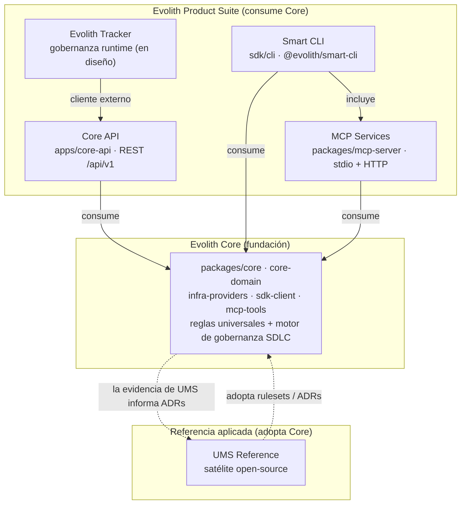
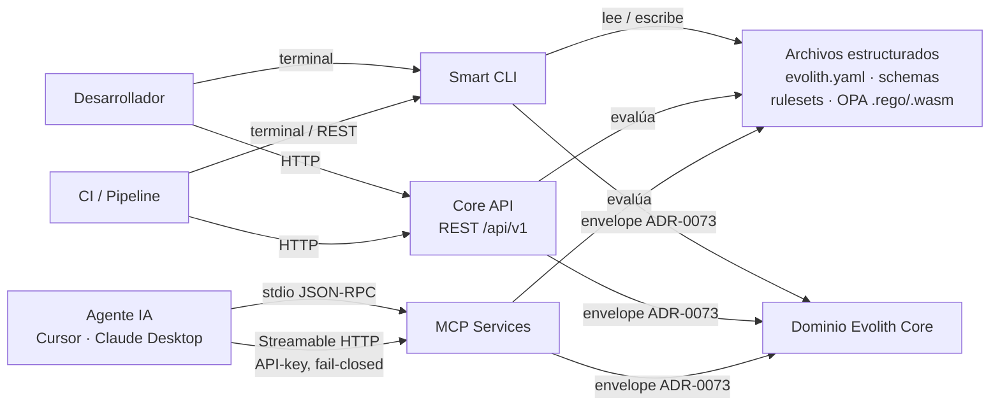
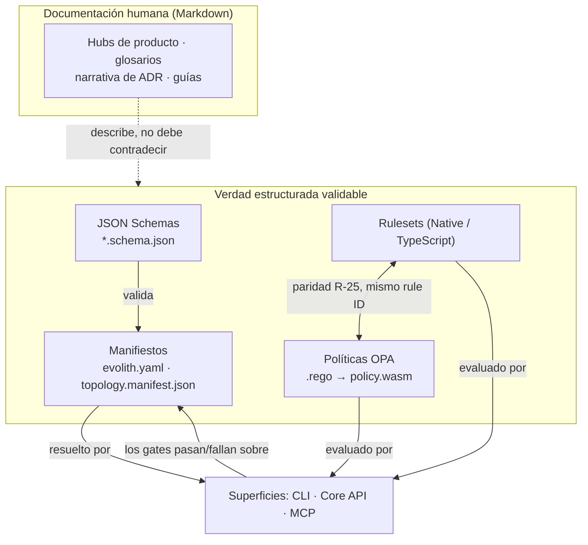

# Ecosistema y Mapa de Comunicación de Evolith

> **Navegación bilingüe:** [English version](./ecosystem-and-communication.md)

Este documento es el mapa de relaciones entre productos y de comunicación del ecosistema Evolith. Muestra cómo los productos de la Suite se apoyan en **Evolith Core**, cómo se comunican entre sí y con los consumidores, cómo una idea recorre el SDLC y dónde vive la verdad autoritativa. Es una orientación a nivel de hub: las definiciones canónicas permanecen en el [Glosario del Ecosistema](../../reference/core/sdlc/glossary/glossary-ecosystem.es.md); el detalle por producto permanece en cada hub de producto.

La dirección de dependencia es unidireccional e innegociable: **los productos consumen Core; nunca redefinen las reglas universales de Core.**

## Meta y Objetivos

> **Meta:** dar al hub de productos una única imagen del ecosistema — quién depende de quién, cómo se comunican las superficies y qué cuenta como verdad.

**Objetivos:**

- Hacer visible y auditable la dirección de dependencia de fundación a producto.
- Mapear las superficies de comunicación reales (REST `/api/v1`, CLI, MCP `stdio` + HTTP, archivos estructurados) sin inventar canales.
- Separar el modelo de **fases del SDLC** (de idea a producto) del modelo de **fuente de verdad** (docs humanas vs. contratos estructurados validables).

## 1. Ecosistema: la fundación Core y la Product Suite

Evolith Core (`packages/core`, `core-domain`, `infra-providers`, `sdk-client`, `mcp-tools`) es la fundación de la plataforma: las reglas universales más el motor de gobernanza del SDLC. Cada producto de la Suite consume Core y expone una porción de él a través de una superficie específica. **Core API** (`apps/core-api`) es la capa de exposición REST del dominio; **Smart CLI** (`sdk/cli`) es la superficie de terminal y además incluye los **MCP Services** (`packages/mcp-server`); **Tracker** es el producto de gobernanza en runtime, en etapa de diseño, que consume Core estrictamente como cliente externo; **UMS Reference** es un satélite open-source que *adopta* Core en lugar de implementar la plataforma.

**Notas.** Core es la fuente autoritativa de decisiones, estándares y patrones; los productos de la Suite lo implementan y no pueden redefinirlo. Core API, Smart CLI y MCP Services se enlazan directamente con el dominio Core. Los MCP Services se incluyen **dentro** de `@evolith/smart-cli` (sin instalación aparte) y además corren como servicio HTTP fail-closed. Tracker está documentado como **en etapa de diseño**: alcanza Core solo como cliente HTTP externo de la capa de exposición Core API (ADR-0074 / ADR-0075), nunca redefiniendo Core. UMS es *evidencia, no política* — adopta rulesets y ADRs de Core, y su evidencia puede informar nuevos ADRs de Core, pero nunca se vuelve autoritativa.

## 2. Cómo se comunican los productos

Existen cuatro superficies de comunicación reales, todas resolviendo a través de los mismos contratos Core y el envelope de salida compartido ADR-0073:

- **REST `/api/v1`** — Core API es REST-only (sin GraphQL, sin SSE), versionada por URI bajo `/api/v1`, con un envelope plano ADR-0073 (`success`, `data`, `meta` con `command` / `executedAt` / `durationMs` / `correlationId` / `context` / `schemaVersion`) y problem details RFC 9457 para errores. `/health` y `/metrics` son neutrales de versión.
- **CLI** — `smart-cli` ejecuta comandos de gobernanza, validación y SDLC desde la terminal contra un repositorio satélite.
- **MCP** — acceso gobernado a herramientas de IA sobre `stdio` (JSON-RPC 2.0) y Streamable HTTP (fail-closed, API-key).
- **Archivos estructurados** — schemas, manifiestos (`evolith.yaml`), rulesets y OPA `.rego`/`policy.wasm` son los contratos validables por máquina que cada superficie resuelve.

**Sync vs. async.** Todas las superficies actuales son **síncronas request/response**: las llamadas REST `/api/v1`, las invocaciones de la CLI y las llamadas a herramientas MCP por `stdio`/HTTP devuelven cada una un único envelope. **No hay bus de Eventos ni entrega por webhooks** en las superficies entregadas, y Core API no expone stream SSE — la integración asíncrona y orientada a eventos es una *opción* de topología (`event-driven`), no un canal actual del ecosistema. La única noción "async" en alcance es el propio SDLC: la evidencia se acumula a lo largo de las fases con el tiempo, pero cada llamada individual a una superficie es síncrona.

## 3. De la idea al producto a través de las fases del SDLC

El SDLC es el ciclo de vida gobernado de idea a producto, expresado como cinco **fases** ordenadas, cada una cerrada por un **gate** que evalúa los artefactos, schemas, rulesets, ADRs y políticas OPA requeridos antes de permitir una transición. Los nombres de fase de gobernanza son `f1` Conception & Discovery, `f2` Design & Architecture, `f3` Construction, `f4` Validation & QA, `f5` Delivery & Operations. La CLI/API exponen **claves de fase** operativas (`discovery`, `design`, `construction`, `qa`, `release`) que mapean sobre f1..f5 — una diferencia conocida de etiqueta de superficie, no un modelo distinto. La fase final es **Delivery & Operations**, no "Release"; Release es un acto que ocurre *dentro* de f5 y se cierra con `gate-f5`.

```mermaid
graph LR
    IDEA(["Idea"]) --> F1
    F1["f1 Conception & Discovery<br/>clave: discovery"] -->|gate-f1<br/>Business Sign-Off| F2
    F2["f2 Design & Architecture<br/>clave: design"] -->|gate-f2<br/>Design Baseline Approved| F3
    F3["f3 Construction<br/>clave: construction"] -->|gate-f3<br/>Successful Build| F4
    F4["f4 Validation & QA<br/>clave: qa"] -->|gate-f4<br/>RC Stamped| F5
    F5["f5 Delivery & Operations<br/>clave: release"] -->|gate-f5<br/>Production Live| PROD(["Producto en operación"])
```

**Notas.** Una fase avanza solo cuando pasa su gate de salida; un gate obligatorio fallido no puede anularse con aprobación informal (solo aplica un waiver de gobernanza explícito). Estas fases del SDLC son distintas de los **niveles de madurez F1–F5** (posiciones en el eje progresivo de arquitectura: `modular-monolith` → `distributed-modules` → `microservices`) y de las **8 topologías** (`modular-monolith`, `distributed-modules`, `microservices`, `event-driven`, `serverless`, `edge-computing`, `data-mesh`, `agentic-ai`). Las fases responden "¿en qué punto del ciclo de idea a producto estoy?"; la madurez y la topología responden "¿qué tan descompuesta / qué forma tiene la arquitectura?" — nunca las mezcles (ver [11](../../reference/core/architecture/topologies/topology-dimensions.md)).

## 4. Modelo de fuente de verdad

El ecosistema mantiene dos tipos complementarios de verdad. El **Markdown** es documentación orientada a humanos: hubs, glosarios, narrativa de ADR y guías — leída por personas, no enforzada por gates en su estructura. Los **contratos estructurados** — JSON Schemas, manifiestos, rulesets y políticas OPA — son la verdad validable por máquina: los gates los evalúan, y cada regla enforzable mantiene paridad Native (TypeScript) + OPA bajo el mismo rule ID (R-25), con el gate de paridad fallando ante drift.

**Notas.** La documentación describe la verdad estructurada y no debe contradecirla; cuando divergen, gana la capa de schema/ruleset/OPA porque los gates la enforzan. Los manifiestos son válidos solo contra su schema declarado, y un manifiesto expone únicamente el contrato técnico (no datos de negocio ni de Funnel-0, que pertenecen a Tracker). Esta separación es la razón por la que una edición solo de documentación no puede relajar un gate: la regla enforzable vive en el ruleset y su política `.rego` correspondiente, no en la prosa.

---

## Referencias relacionadas

- [Glosario del Ecosistema (canónico)](../../reference/core/sdlc/glossary/glossary-ecosystem.es.md) — terminología autoritativa para cada término usado arriba.
- [Dimensiones de topología](../../reference/core/architecture/topologies/topology-dimensions.md) — des-conflación de fase vs. madurez vs. topología.
- Hubs de producto: [Tracker](./evolith-tracker/README.es.md) · [Smart CLI](./smart-cli/README.es.md) · [Core API](./core-api/README.es.md) · [MCP Services](./mcp-services/README.es.md) · [UMS Reference](./ums-reference/README.es.md).

[Volver a Diseños Específicos de Productos](./README.es.md)
