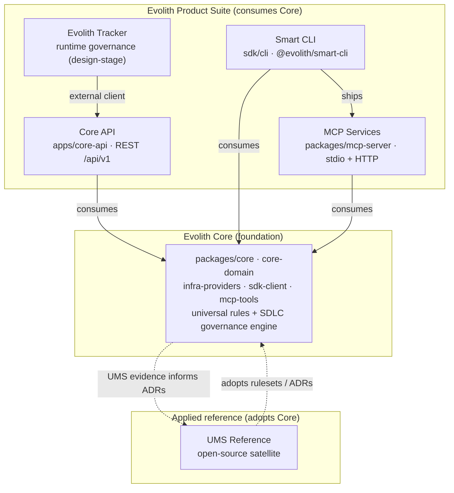
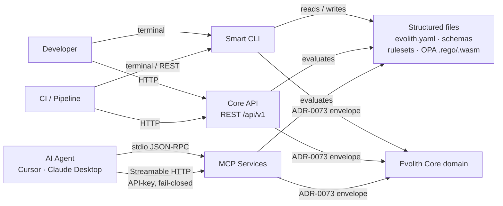
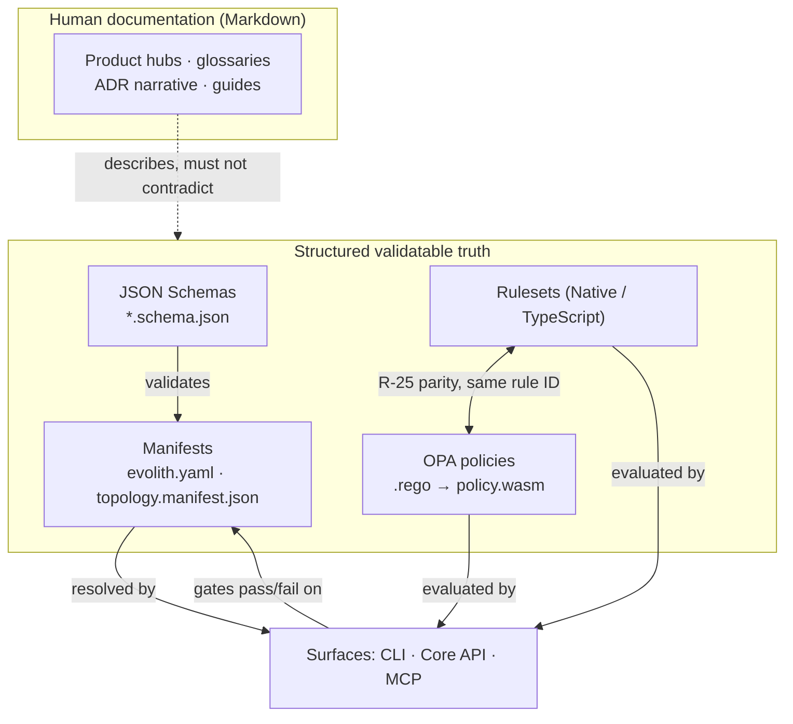

# Evolith Ecosystem and Communication Map

> **Bilingual navigation:** [Versión en Español](./ecosystem-and-communication.es.md)

This document is the cross-product relationship and communication map for the Evolith ecosystem. It shows how the Suite products sit on **Evolith Core**, how they talk to each other and to consumers, how an idea moves through the SDLC, and where the authoritative truth lives. It is a hub-level orientation: the canonical definitions stay in the [Ecosystem Glossary](../../reference/core/sdlc/glossary/glossary-ecosystem.md); the per-product detail stays in each product hub.

The dependency direction is one-way and non-negotiable: **products consume Core; they never redefine universal Core rules.**

## Goal and Objectives

> **Goal:** give the products hub a single picture of the ecosystem — who depends on whom, how surfaces communicate, and what counts as truth.

**Objectives:**

- Make the foundation-to-product dependency direction visible and auditable.
- Map the real communication surfaces (REST `/api/v1`, CLI, MCP `stdio` + HTTP, structured files) without inventing channels.
- Separate the **SDLC phase** model (idea to product) from the **source-of-truth** model (human docs vs. structured validatable contracts).

## 1. Ecosystem: Core foundation and the Product Suite

Evolith Core (`packages/core`, `core-domain`, `infra-providers`, `sdk-client`, `mcp-tools`) is the platform foundation: the universal rules plus the SDLC governance engine. Every product in the Suite consumes Core and exposes a slice of it through a specific surface. **Core API** (`apps/core-api`) is the REST exposure layer over the domain; **Smart CLI** (`sdk/cli`) is the terminal surface and also ships the **MCP Services** (`packages/mcp-server`); **Tracker** is the design-stage runtime-governance product that consumes Core strictly as an external client; **UMS Reference** is an open-source satellite that *adopts* Core rather than implementing the platform.

**Notes.** Core is the authoritative source of decisions, standards, and patterns; the Suite products implement it and cannot redefine it. Core API, Smart CLI, and MCP Services all bind directly to the Core domain. MCP Services ship **inside** `@evolith/smart-cli` (no separate install) and additionally run as a fail-closed HTTP service. Tracker is documented as **design-stage**: it reaches Core only as an external HTTP client of the Core API exposure layer (ADR-0074 / ADR-0075), never by redefining Core. UMS is *evidence, not policy* — it adopts Core rulesets and ADRs, and its evidence can inform new Core ADRs, but it never becomes authoritative.

## 2. How the products communicate

There are four real communication surfaces, all resolving through the same Core contracts and the shared ADR-0073 output envelope:

- **REST `/api/v1`** — Core API is REST-only (no GraphQL, no SSE), URI-versioned under `/api/v1`, with a flat ADR-0073 envelope (`success`, `data`, `meta` carrying `command` / `executedAt` / `durationMs` / `correlationId` / `context` / `schemaVersion`) and RFC 9457 problem details for errors. `/health` and `/metrics` are version-neutral.
- **CLI** — `smart-cli` runs governance, validation, and SDLC commands from the terminal against a satellite repo.
- **MCP** — governed AI tool access over `stdio` (JSON-RPC 2.0) and Streamable HTTP (fail-closed, API-key).
- **Structured files** — schemas, manifests (`evolith.yaml`), rulesets, and OPA `.rego`/`policy.wasm` are the machine-validatable contracts every surface resolves.

**Sync vs. async.** All current surfaces are **synchronous request/response**: REST `/api/v1` calls, CLI invocations, and MCP `stdio`/HTTP tool calls each return a single envelope. There is **no event bus and no webhook delivery** in the shipped surfaces, and Core API exposes no SSE stream — asynchronous, event-driven integration is a topology *option* (`event-driven`), not a current ecosystem channel. The only "async" notion in scope is the SDLC itself: evidence accumulates across phases over time, but each individual surface call is synchronous.

## 3. From idea to product across SDLC phases

The SDLC is the governed lifecycle from idea to product, expressed as five ordered **phases**, each closed by a **gate** that evaluates required artifacts, schemas, rulesets, ADRs, and OPA policies before a transition is allowed. The governance phase names are `f1` Conception & Discovery, `f2` Design & Architecture, `f3` Construction, `f4` Validation & QA, `f5` Delivery & Operations. The CLI/API expose operational **phase keys** (`discovery`, `design`, `construction`, `qa`, `release`) that map onto f1..f5 — a known surface-label difference, not a different model. The final phase is **Delivery & Operations**, not "Release"; Release is an act that occurs *within* f5 and is closed by `gate-f5`.

```mermaid
graph LR
    IDEA(["Idea"]) --> F1
    F1["f1 Conception & Discovery<br/>key: discovery"] -->|gate-f1<br/>Business Sign-Off| F2
    F2["f2 Design & Architecture<br/>key: design"] -->|gate-f2<br/>Design Baseline Approved| F3
    F3["f3 Construction<br/>key: construction"] -->|gate-f3<br/>Successful Build| F4
    F4["f4 Validation & QA<br/>key: qa"] -->|gate-f4<br/>RC Stamped| F5
    F5["f5 Delivery & Operations<br/>key: release"] -->|gate-f5<br/>Production Live| PROD(["Product in operation"])
```

**Notes.** A phase advances only when its exit gate passes; a failed mandatory gate cannot be overridden by informal approval (only an explicit governance waiver applies). These SDLC phases are distinct from the **maturity levels F1–F5** (positions on the progressive architecture axis: `modular-monolith` → `distributed-modules` → `microservices`) and from the **8 topologies** (`modular-monolith`, `distributed-modules`, `microservices`, `event-driven`, `serverless`, `edge-computing`, `data-mesh`, `agentic-ai`). Phases answer "where in the idea-to-product lifecycle am I?"; maturity and topology answer "how decomposed / what shape is the architecture?" — never conflate them (see [`topology-dimensions.md`](../../reference/core/architecture/topologies/topology-dimensions.md)).

## 4. Source-of-truth model

The ecosystem keeps two complementary kinds of truth. **Markdown** is human-facing documentation: hubs, glossaries, ADR narrative, and guides — read by people, not gate-enforced for structure. **Structured contracts** — JSON Schemas, manifests, rulesets, and OPA policies — are the machine-validatable truth: gates evaluate them, and every enforceable rule keeps Native (TypeScript) + OPA parity under the same rule ID (R-25), with the parity gate failing on drift.

**Notes.** Documentation describes the structured truth and must not contradict it; when they diverge, the schema/ruleset/OPA layer wins because gates enforce it. Manifests are valid only against their declared schema, and a manifest exposes only the technical contract (not business or Funnel-0 data, which belongs to Tracker). This split is why a doc-only edit cannot loosen a gate: the enforceable rule lives in the ruleset and its matching `.rego` policy, not in the prose.

---

## Related references

- [Ecosystem Glossary (canonical)](../../reference/core/sdlc/glossary/glossary-ecosystem.md) — authoritative terminology for every term used above.
- [Topology dimensions](../../reference/core/architecture/topologies/topology-dimensions.md) — phase vs. maturity vs. topology de-conflation.
- Product hubs: [Tracker](./evolith-tracker/README.md) · [Smart CLI](./smart-cli/README.md) · [Core API](./core-api/README.md) · [MCP Services](./mcp-services/README.md) · [UMS Reference](./ums-reference/README.md).

[Back to Product-Specific Designs](./README.md)
