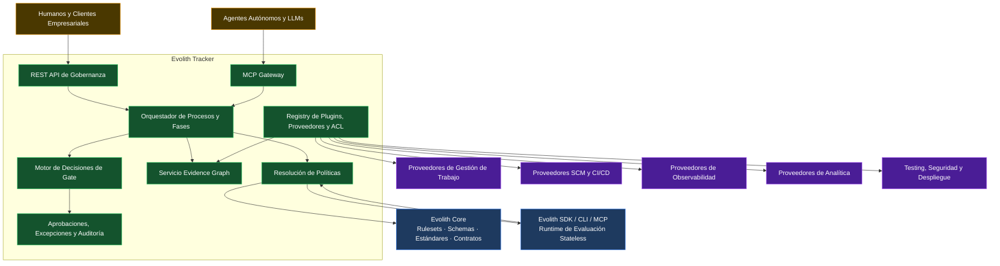
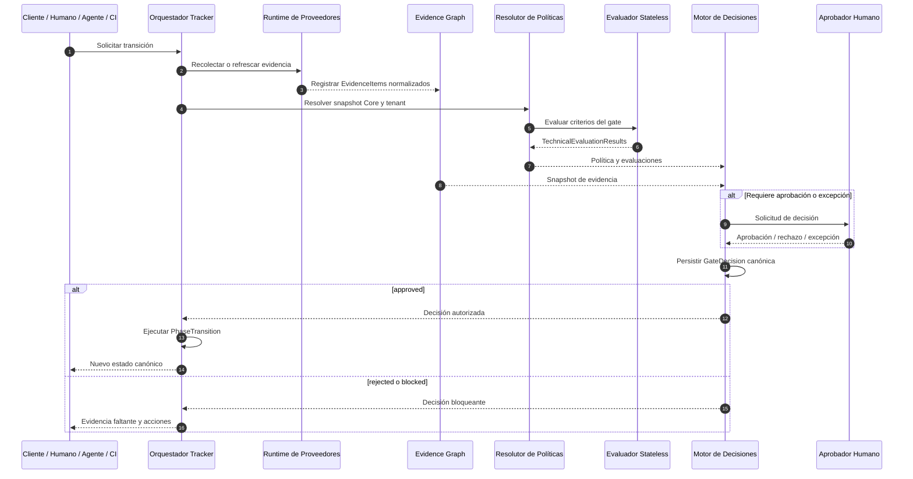
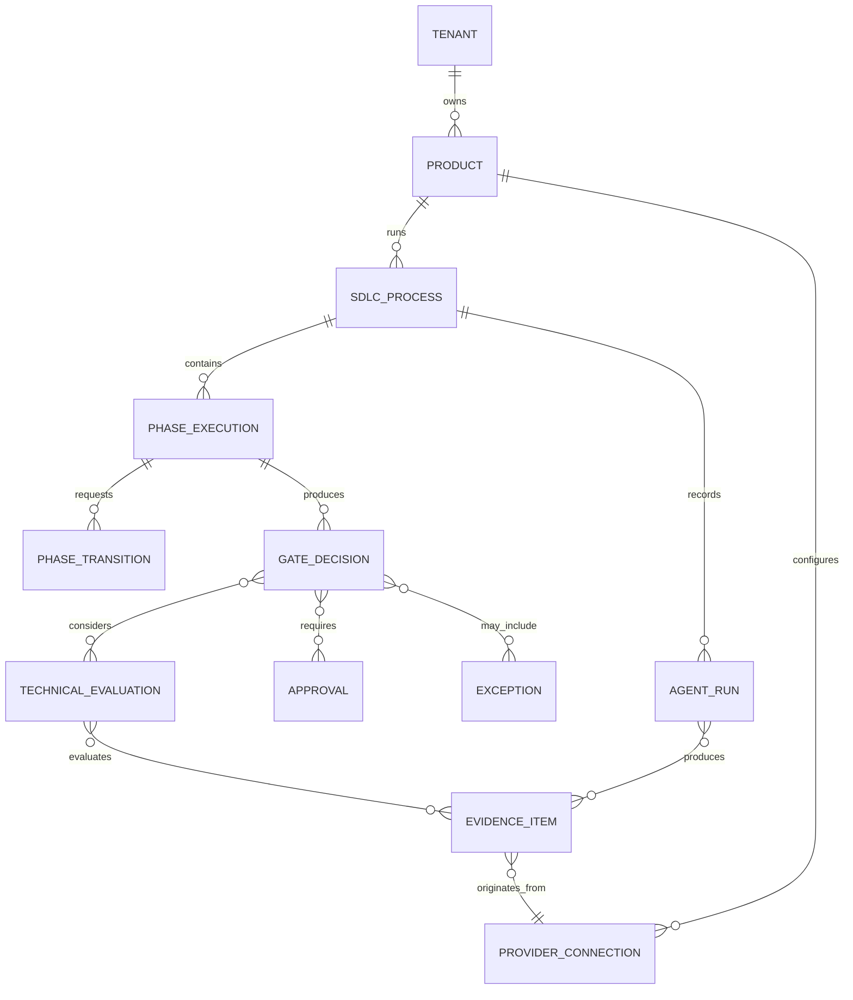

# SDLC Tracker — Diseño de Interfaces Técnicas

> **Navegación Bilingüe:** [English Version](./sdlc-tracker-technical-interfaces.md)

**Estado:** Diseño Propuesto — Pendiente de Revisión del Architecture Board  
**Propietario:** Evolith Architecture Board  
**Última Actualización:** 2026-06-10  
**Diseño Padre:** [Diseño Objetivo de Composición Gobernada](../../suite/architecture/evolith-governed-composition-target-design.es.md)  
**Estado de Implementación:** Solo documentación — no autoriza cambios de código

---

## 1. Propósito

Este documento define las interfaces técnicas mediante las cuales Evolith Tracker gobierna el SDLC componiendo sistemas de trabajo, agentes, observabilidad, analítica, repositorios, CI/CD, testing, seguridad y despliegue.

> **Core define. Los proveedores ejecutan. CLI y MCP evalúan. Tracker decide y audita.**

Tracker no es una extensión del CLI. Es el sistema canónico de gobernanza en runtime.

---

## 2. Invariantes Arquitectónicos

1. Tracker posee procesos, fases, gates, decisiones, aprobaciones, excepciones y auditoría.
2. Evolith Core es read-only en runtime y suministra reglas, schemas, estándares y contratos versionados.
3. CLI, MCP, CI y evaluadores externos retornan resultados técnicos; nunca mutan el estado canónico.
4. Los sistemas externos conservan autoridad sobre sus hechos operativos.
5. Tracker decide si esos hechos satisfacen la gobernanza Core y tenant.
6. Los agentes ejecutan actividades acotadas y producen evidencia; no aprueban gates.
7. Todo proveedor se aísla mediante un puerto neutral, plugin/adaptador y ACL.
8. Toda decisión canónica referencia políticas, evidencias, aprobaciones y excepciones exactas.
9. Toda herramienta es intercambiable; cualquier default es configurable y reemplazable.

---

## 3. Arquitectura de Interfaces Objetivo



---

## 4. Separación de Contratos Canónicos

### 4.1 Evidence Item

Un proveedor, humano, agente o sistema CI registra una referencia inmutable de evidencia.

```typescript
interface EvidenceItem {
  id: string;
  tenantId: string;
  productId: string;
  processId: string;
  phaseExecutionId: string;
  gateId?: string;
  criterionId?: string;

  evidenceType: string;
  schemaRef: string;
  schemaVersion: string;

  source: {
    providerConnectionId: string;
    providerType: string;
    externalId: string;
    sourceUrl?: string;
  };

  producer: {
    actorType: 'human' | 'agent' | 'ci' | 'system';
    actorId: string;
    modelRef?: string;
    promptVersion?: string;
    skillVersion?: string;
  };

  references: Array<{
    type: 'artifact' | 'commit' | 'pull_request' | 'pipeline' | 'test' | 'deployment' | 'trace' | 'document';
    id: string;
    url?: string;
  }>;

  integrity: {
    contentHash: string;
    capturedAt: string;
    signatureRef?: string;
  };

  telemetry?: {
    durationMs?: number;
    cost?: number;
    inputTokens?: number;
    outputTokens?: number;
  };

  classification: string;
  retentionPolicyRef: string;
}
```

### 4.2 Technical Evaluation Result

Lo producen SDK, CLI, MCP, CI o un evaluador especializado. No constituye una decisión canónica.

```typescript
interface TechnicalEvaluationResult {
  id: string;
  gateId: string;
  criterionId: string;
  status: 'compliant' | 'non_compliant' | 'indeterminate' | 'error';
  rulesetRef: string;
  rulesetVersion: string;
  evidenceIds: string[];
  findings: Array<{
    ruleId: string;
    severity: 'error' | 'warning' | 'info';
    location?: string;
    message: string;
  }>;
  evaluatedAt: string;
  evaluator: {
    type: 'cli' | 'mcp' | 'ci' | 'agent' | 'specialized_provider';
    version: string;
  };
}
```

### 4.3 Gate Decision

Solo la produce Tracker.

> **Nota de colisión de nombres.** Ya existe en Core un tipo `GateDecision` (`packages/core-domain/src/gates/decision/gate-decision.ts`) con una **forma distinta y más estrecha** — `{ gateId, phase: number, verdict: Verdict (PASS/FAIL), score, violations[], decidedAt, decidedBy, waiverRef? }`, creado por `makeGateDecision()` dentro de Core, no por Tracker. El `GateDecision` canónico de Tracker que se muestra abajo (registro rico con `status`, snapshots, aprobaciones, excepciones) es el **objetivo** y es distinto del value object existente en Core. Quienes implementen deben desambiguar ambos nombres (p. ej. namespace o renombrado) antes de construir Tracker.

```typescript
interface GateDecision {
  id: string;
  processId: string;
  phaseExecutionId: string;
  gateId: string;
  status: 'approved' | 'rejected' | 'blocked' | 'approved_with_exception';
  policySnapshotRef: string;
  evidenceSnapshotRef: string;
  technicalEvaluationIds: string[];
  approvalIds: string[];
  exceptionIds: string[];
  decidedAt: string;
  decidedBy: {
    system: 'evolith-tracker';
    accountableActorId?: string;
  };
  rationale: string;
}
```

### 4.4 Phase Transition

```typescript
interface PhaseTransition {
  id: string;
  processId: string;
  fromPhase: string;
  toPhase: string;
  gateDecisionId: string;
  status: 'requested' | 'authorized' | 'executed' | 'failed' | 'cancelled';
  requestedBy: string;
  requestedAt: string;
  executedAt?: string;
}
```

---

## 5. Secuencia de Decisión de Gate



---

## 6. API REST del Tracker

**Base URL:** `https://tracker.evolith.io/api/v1`  
**Autorización:** Bearer token delegado a UMS y grafo del tenant

### 6.1 Productos y Procesos

```typescript
interface RegisterProductRequest {
  tenantId: string;
  name: string;
  repositoryRef?: string;
  governanceProfileRef: string;
}

interface StartProcessRequest {
  productId: string;
  processTemplateRef: string;
}
```

### 6.2 Envío de Evidencia

```text
POST /evidence
POST /evidence/import
GET  /evidence/:id
GET  /processes/:id/evidence-graph
```

Todos los endpoints de evidencia validan la identidad del proveedor, la frontera del tenant, el schema, el linaje y la integridad antes de que un elemento se convierta en evidencia elegible.

### 6.3 Solicitud de Transición

```typescript
interface RequestTransition {
  requestedBy: string;
  targetPhase: string;
  notes?: string;
}

interface TransitionResponse {
  transitionId: string;
  decisionId?: string;
  status: 'requested' | 'authorized' | 'executed' | 'blocked' | 'failed';
  currentPhase: string;
  missingEvidence?: string[];
  requiredActions?: string[];
}
```

```text
POST /processes/:id/transitions
GET  /transitions/:id
GET  /decisions/:id
```

### 6.4 Aprobaciones y Excepciones

```text
POST /decisions/:id/approvals
POST /decisions/:id/exceptions
GET  /decisions/:id/audit
```

---

## 7. Interfaces CLI y MCP

CLI y MCP exponen los mismos casos de uso y envelope unificado, pero su semántica es técnica, no canónica.

### 7.1 Herramienta de Evaluación

```typescript
interface EvaluateCriterionRequest {
  processContext: {
    tenantId: string;
    productId: string;
    processId: string;
    phase: string;
    gateId: string;
  };
  rulesetRef: string;
  evidenceIds: string[];
}
```

```text
evolith criterion evaluate
evolith gate assess
MCP: evolith-criterion-evaluate
MCP: evolith-gate-assess
```

Estas operaciones retornan `TechnicalEvaluationResult`. Nunca crean ni persisten una `GateDecision`.

### 7.2 Herramientas de Contexto y Evidencia

```text
evolith-context-resolve
evolith-evidence-validate
evolith-artifact-validate
evolith-drift-detect
```

### 7.3 Interfaces Prohibidas

- ejecución remota genérica de shell;
- comandos CLI/MCP que muten estado canónico de fase;
- herramientas de agentes que autoaprueben gates;
- evidencia sin identidad de tenant y fuente;
- payloads de proveedores aceptados sin ACL;
- selección hard-coded de un proveedor por defecto.

> **Reconciliación con endpoint en vivo.** Core-API hoy entrega `POST /api/v1/phases/transition` (`apps/core-api/src/presentation/controllers/phases.controller.ts` → `PhaseTransitionUseCase`), que ejecuta transiciones `from → to` vía REST. Ese endpoint es anterior a este diseño; el invariante "no debe mutar estado canónico de fase" de arriba es un **objetivo** a aplicar una vez que Tracker posea el estado de fase, no un invariante que el Core-API actual ya respete. Hasta que Tracker exista, este endpoint REST es la única vía de transición.

---

## 8. Contratos de Provider Ports

```typescript
interface ProviderPort<TCapability, TRequest, TResult> {
  providerType: string;
  capabilities(): Promise<TCapability[]>;
  execute(request: TRequest): Promise<TResult>;
  health(): Promise<ProviderHealth>;
}
```

| Puerto | Resultado Principal |
|---|---|
| Work Management | Referencias y estado canónico de work items |
| Repository | Commits, ramas, PRs y tags |
| CI/CD | Evidencia de builds, pruebas, artefactos y deployments |
| Agent Execution | Artefacto, log de ejecución y uso |
| LLM Observability | Trace, evaluación, costo, latencia y prompts |
| Analytics | Dataset gobernado o referencia a visualización |
| Testing | Evidencia de pruebas y coverage |
| Security | Findings y clasificación de riesgo |
| Deployment | Entorno, release, rollout y rollback |
| Collaboration | Notificación, acknowledgment y delivery de aprobación |

Todo puerto admite múltiples plugins y defaults configurables por tenant.

---

## 9. Modelo de Dominio del Tracker



### 9.1 Propiedad de Agregados

| Agregado | Responsabilidad |
|---|---|
| **SDLC Process** | Fase actual y ciclo de vida |
| **Phase Execution** | Entrada, actividad, finalización e historial |
| **Evidence Graph** | Identidad, linaje, relaciones e integridad |
| **Gate Decision** | Resultado canónico de gobernanza |
| **Approval / Exception** | Responsabilidad humana y riesgo residual |
| **Provider Connection** | Configuración y salud por tenant |
| **Agent Run** | Ejecución acotada y evidencia generada |

---

## 10. Chatbox y Agentes

El chatbox es un intermediario gobernado sobre servicios del Tracker. Cada tool call se autoriza contra el grafo del tenant y se vincula a la evidencia resultante.

Los agentes reciben contrato de actividad, contexto aprobado, herramientas permitidas, schemas esperados, límites de costo/tiempo, evidencia requerida y condiciones de aprobación humana. Solo retornan outputs y evidencia.

---

## 11. Mapa de Migración de Diseño

| Concepto Anterior | Concepto Objetivo |
|---|---|
| `GateEvidence.verdict = passed/failed` | `TechnicalEvaluationResult.status = compliant/non_compliant/...` |
| CLI gestiona transición | Tracker posee `PhaseTransition` |
| Agente pasa/falla el gate | Agente produce evidencia y outcome de ejecución |
| CI recibe veredicto del evaluador | CI registra evidencia; Tracker retorna decisión canónica |
| Evidencia embebida en gate | Gate Decision referencia snapshot del Evidence Graph |
| ACL solo para Jira-like | Provider ports y plugins para toda capacidad externa |
| Default fijo | Default configurable y reemplazable por scope |

ADR 0073 continúa válido para el envelope unificado, pero requiere una decisión complementaria sobre semántica de evaluación versus decisión.

---

## 12. Checklist Previo a Código

- [ ] Diseño objetivo aprobado.
- [ ] Vocabulario evaluación/decisión aprobado.
- [ ] Agregados del Evidence Graph aprobados.
- [ ] Taxonomía de provider ports aprobada.
- [ ] Modelo de plugins y defaults aprobado.
- [ ] Contratos REST y MCP revisados.
- [ ] Flujo UMS revisado.
- [ ] Aislamiento y clasificación de datos revisados.
- [ ] ADRs requeridos identificados.
- [ ] Plan de migración de schemas/rulesets aprobado.
- [ ] No se inició implementación de código.

---

## 13. Documentos Relacionados

- [Diseño Objetivo de Composición Gobernada](../../suite/architecture/evolith-governed-composition-target-design.es.md)
- [Modelo de Abstracción de Proveedores y Plugins](../../../reference/core/foundations/principles/evolith-provider-abstraction-plugin-model.es.md)
- [Visión Maestra del Producto Evolith](../../suite/vision/evolith-product-vision-master.es.md)
- [Modelo de Trazabilidad SDLC](../../../reference/core/sdlc/traceability-model.es.md)
- [ADR 0073 — Contrato de Salida CLI/MCP](../../../reference/core/architecture/adrs/core/0073-unified-cli-output-contract.es.md)

---

*Esta es la baseline técnica objetivo. Sustituye la interpretación anterior, pero no autoriza cambios de código hasta su aprobación por el Architecture Board.*