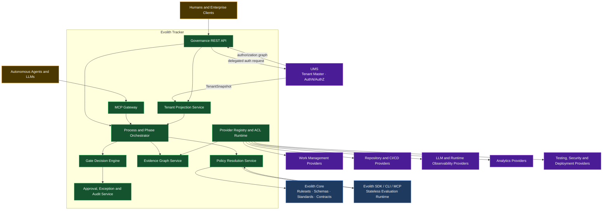
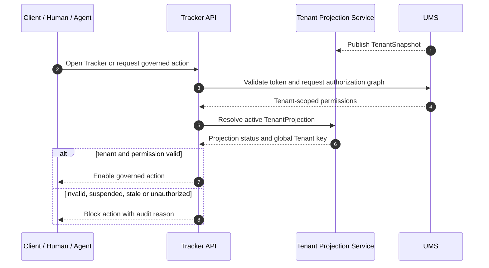
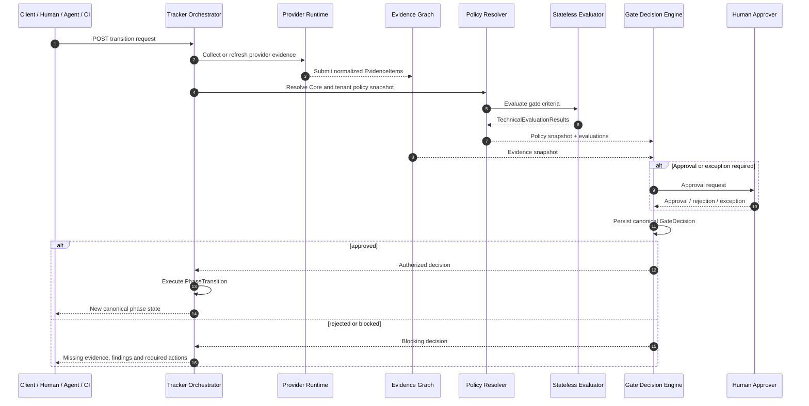
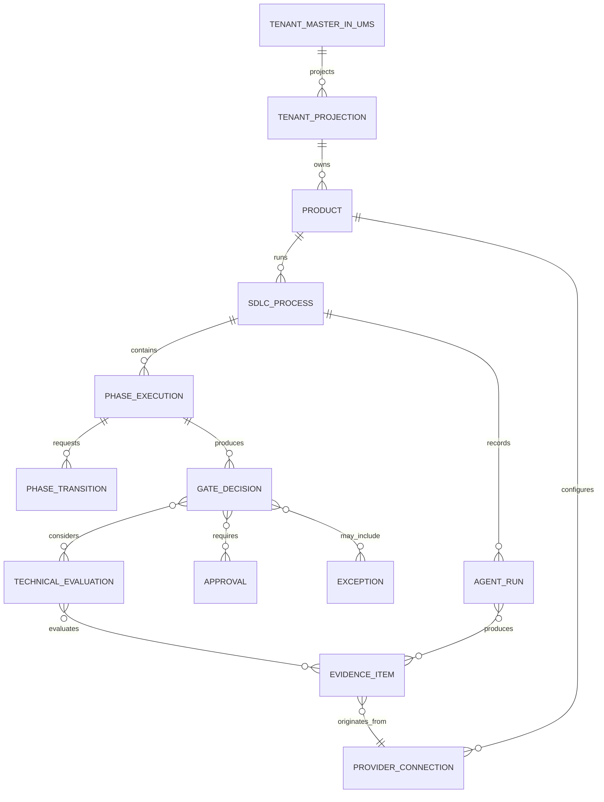

# SDLC Tracker — Technical Interface Design

> **Bilingual Navigation:** [Versión en Español](./sdlc-tracker-technical-interfaces.es.md)

**Status:** Proposed Design — Pending Architecture Board Review  
**Owner:** Evolith Architecture Board  
**Last Updated:** 2026-06-10  
**Parent Design:** [Governed Composition Target Design](../../suite/architecture/evolith-governed-composition-target-design.md)  
**Implementation Status:** Documentation only — no source-code change authorized

---

## 1. Purpose

This document defines the technical interfaces through which Evolith Tracker governs the SDLC while composing external work systems, agents, observability, analytics, repositories, CI/CD, testing, security, and deployment platforms.

The responsibility model is:

> **Core defines. Providers execute. CLI and MCP evaluate. Tracker decides and audits.**

The tenant responsibility model is:

> **UMS governs the Tenant master identity, and the user identity and authorization inside it. Tracker governs SDLC operation for the projected Tenant.**

Tracker is not an extension of the CLI. It is the canonical runtime governance system.

---

## 2. Architectural Invariants

1. Tracker owns process, phase, gate, decision, approval, exception, and audit state.
2. Tracker stores a Tenant projection, not the Tenant master record. The projection must reference the global Tenant key UMS publishes ([ADR-0129](../../../reference/core/architecture/adrs/core/0129-ums-is-the-tenant-master.md)).
3. Tracker delegates authentication and authorization to UMS and consumes a tenant-scoped authorization graph before enabling governed actions.
4. Evolith Core is read-only at runtime and supplies versioned rules, schemas, standards, and contracts.
5. CLI, MCP, CI, and external evaluators return technical results; they never mutate canonical phase state.
6. External systems remain authoritative for their native operational facts.
7. Tracker decides whether those facts satisfy Core and tenant governance.
8. Agents execute bounded activities and produce evidence; they cannot approve gates.
9. Every provider is isolated behind a provider-neutral port and ACL.
10. All canonical decisions reference the exact policy, evidence, approvals, and exceptions used.

---

## 3. Target Interface Architecture



---

## 4. Canonical Contract Separation

### 4.1 Tenant Projection

Tracker receives the Tenant snapshot UMS publishes. The projection is the local governance boundary and must not become a second Tenant master.

```typescript
interface TenantProjection {
  id: string;
  globalTenantKey: string;
  displayName: string;
  lifecycleStatus: 'active' | 'suspended' | 'closed' | 'pending';
  governanceProfileRef?: string;
  dataClassificationProfileRef?: string;
  projectionVersion: string;
  projectedAt: string;
  source: {
    system: 'mms';
    masterRecordRef: string;
  };
  sync: {
    status: 'active' | 'stale' | 'rejected';
    lastVerifiedAt: string;
    reason?: string;
  };
}
```

Tracker accepts governed commands only when:

- the request token is valid according to UMS;
- the UMS authorization graph includes the same `globalTenantKey`;
- the local `TenantProjection.lifecycleStatus` is `active`;
- the projection `sync.status` is `active`;
- the action permission exists in the UMS graph for the Tracker capability being requested.

### 4.2 Evidence Item

A provider, human, agent, or CI system submits an immutable evidence reference.

```typescript
interface EvidenceItem {
  id: string;
  tenantId: string;
  productId: string;
  processId: string;
  phaseExecutionId: string;
  gateId?: string;
  criterionId?: string;

  evidenceType: string;
  schemaRef: string;
  schemaVersion: string;

  source: {
    providerConnectionId: string;
    providerType: string;
    externalId: string;
    sourceUrl?: string;
  };

  producer: {
    actorType: 'human' | 'agent' | 'ci' | 'system';
    actorId: string;
    modelRef?: string;
    promptVersion?: string;
    skillVersion?: string;
  };

  references: Array<{
    type: 'artifact' | 'commit' | 'pull_request' | 'pipeline' | 'test' | 'deployment' | 'trace' | 'document';
    id: string;
    url?: string;
  }>;

  integrity: {
    contentHash: string;
    capturedAt: string;
    signatureRef?: string;
  };

  telemetry?: {
    durationMs?: number;
    cost?: number;
    inputTokens?: number;
    outputTokens?: number;
  };

  classification: string;
  retentionPolicyRef: string;
}
```

### 4.3 Technical Evaluation Result

Produced by SDK, CLI, MCP, CI, or a specialized evaluator. It is not a canonical gate decision.

```typescript
interface TechnicalEvaluationResult {
  id: string;
  gateId: string;
  criterionId: string;
  status: 'compliant' | 'non_compliant' | 'indeterminate' | 'error';
  rulesetRef: string;
  rulesetVersion: string;
  evidenceIds: string[];
  findings: Array<{
    ruleId: string;
    severity: 'error' | 'warning' | 'info';
    location?: string;
    message: string;
  }>;
  evaluatedAt: string;
  evaluator: {
    type: 'cli' | 'mcp' | 'ci' | 'agent' | 'specialized_provider';
    version: string;
  };
}
```

### 4.4 Gate Decision

Produced only by Tracker.

> **Naming-collision note.** A `GateDecision` type already ships in Core (`src/packages/core-domain/src/gates/decision/gate-decision.ts`) with a **different, narrower shape** — `{ gateId, phase: number, verdict: Verdict (PASS/FAIL), score, violations[], decidedAt, decidedBy, waiverRef? }`, created by `makeGateDecision()` inside Core, not by Tracker. The canonical Tracker `GateDecision` below (rich record with `status`, snapshots, approvals, exceptions) is the **target** and is distinct from the existing Core value object. Implementers must disambiguate the two names (e.g. namespace or rename) before building Tracker.

```typescript
interface GateDecision {
  id: string;
  processId: string;
  phaseExecutionId: string;
  gateId: string;
  status: 'approved' | 'rejected' | 'blocked' | 'approved_with_exception';
  policySnapshotRef: string;
  evidenceSnapshotRef: string;
  technicalEvaluationIds: string[];
  approvalIds: string[];
  exceptionIds: string[];
  decidedAt: string;
  decidedBy: {
    system: 'evolith-tracker';
    accountableActorId?: string;
  };
  rationale: string;
}
```

### 4.5 Phase Transition

```typescript
interface PhaseTransition {
  id: string;
  processId: string;
  fromPhase: string;
  toPhase: string;
  gateDecisionId: string;
  status: 'requested' | 'authorized' | 'executed' | 'failed' | 'cancelled';
  requestedBy: string;
  requestedAt: string;
  executedAt?: string;
}
```

---

## 5. Tenant Resolution and Gate Decision Sequence

### 5.1 Tenant Resolution



### 5.2 Gate Decision



---

## 6. Tracker REST API

**Base URL:** `https://tracker.evolith.io/api/v1`  
**Authorization:** UMS-delegated bearer token and tenant-scoped authorization graph. Every command also resolves an active Tracker `TenantProjection` for the same global Tenant key UMS published.

### 6.1 Tenant Projection Intake

```text
GET  /tenants/projections/:globalTenantKey
POST /tenants/projections/:globalTenantKey/verify
```

Projection intake is system-to-system and does not create users, memberships, or permissions in Tracker. Since T-059 it arrives over the bus rather than over HTTP: the Tracker consumes `Evolith.Contracts.Tenancy.TenantSnapshotIntegrationEvent` on `tracker.tenant-snapshot` and upserts by version. The read endpoints above remain the local way to inspect what was applied.

### 6.2 Products and Processes

```typescript
interface RegisterProductRequest {
  globalTenantKey: string;
  name: string;
  repositoryRef?: string;
  governanceProfileRef: string;
}

interface StartProcessRequest {
  productId: string;
  processTemplateRef: string;
}
```

### 6.3 Evidence Submission

```text
POST /evidence
POST /evidence/import
GET  /evidence/:id
GET  /processes/:id/evidence-graph
```

All submission endpoints validate provider identity, tenant boundary, schema, lineage, and integrity before an item becomes eligible evidence.

### 6.4 Transition Request

```typescript
interface RequestTransition {
  requestedBy: string;
  targetPhase: string;
  notes?: string;
}

interface TransitionResponse {
  transitionId: string;
  decisionId?: string;
  status: 'requested' | 'authorized' | 'executed' | 'blocked' | 'failed';
  currentPhase: string;
  missingEvidence?: string[];
  requiredActions?: string[];
}
```

```text
POST /processes/:id/transitions
GET  /transitions/:id
GET  /decisions/:id
```

### 6.5 Approvals and Exceptions

```text
POST /decisions/:id/approvals
POST /decisions/:id/exceptions
GET  /decisions/:id/audit
```

---

## 7. MCP and CLI Interfaces

CLI and MCP expose the same application use cases and unified output envelope, but their semantics are technical rather than canonical.

### 7.1 Evaluation Tool

```typescript
interface EvaluateCriterionRequest {
  processContext: {
    globalTenantKey: string;
    productId: string;
    processId: string;
    phase: string;
    gateId: string;
  };
  rulesetRef: string;
  evidenceIds: string[];
}
```

```text
evolith criterion evaluate
evolith gate assess
MCP: evolith-criterion-evaluate
MCP: evolith-gate-assess
```

These operations return `TechnicalEvaluationResult`. They never return or persist a `GateDecision`.

### 7.2 Context and Evidence Tools

```text
evolith-context-resolve
evolith-evidence-validate
evolith-artifact-validate
evolith-drift-detect
```

### 7.3 Prohibited Interfaces

The following interfaces are prohibited:

- generic remote shell execution;
- CLI or MCP command that mutates canonical Tracker phase state;
- agent tool that self-approves a gate;
- evidence submission without tenant and source identity;
- governed action whose UMS authorization graph does not match an active Tracker Tenant projection;
- provider payload accepted directly into the canonical domain without ACL mapping.

> **Live-endpoint reconciliation.** Core-API today ships `POST /api/v1/phases/transition` (`src/apps/core-api/src/presentation/controllers/phases.controller.ts` → `PhaseTransitionUseCase`), which executes `from → to` transitions over REST. That endpoint predates this design; the "must not mutate canonical phase state" invariant above is a **target** to be enforced once Tracker owns phase state, not an invariant the current Core-API already honors. Until Tracker exists, this REST endpoint remains the only transition path.

---

## 8. Provider Port Contracts

```typescript
interface ProviderPort<TCapability, TRequest, TResult> {
  providerType: string;
  capabilities(): Promise<TCapability[]>;
  execute(request: TRequest): Promise<TResult>;
  health(): Promise<ProviderHealth>;
}
```

| Port | Primary Result |
|---|---|
| Work Management | Canonical work-item references and status facts |
| Repository | Commit, branch, pull-request and tag references |
| CI/CD | Build, test, artifact and deployment-run evidence |
| Agent Execution | Output artifact, execution log and usage evidence |
| LLM Observability | Trace, evaluation, cost, latency and prompt metadata |
| Analytics | Published governed dataset or embedded-view reference |
| Testing | Test-result and coverage evidence |
| Security | Finding and risk-classification evidence |
| Deployment | Environment, release, rollout and rollback evidence |
| Collaboration | Notification, acknowledgment and approval-delivery facts |

---

## 9. Tracker Domain Model



### 9.1 Aggregate Ownership

| Aggregate | Primary Responsibility |
|---|---|
| **Tenant Projection** | Local Tracker boundary referencing the UMS Tenant master identity |
| **SDLC Process** | Current phase and lifecycle |
| **Phase Execution** | Entry, activity, completion and transition history |
| **Evidence Graph** | Evidence identity, lineage, relationships and integrity |
| **Gate Decision** | Canonical governance outcome |
| **Approval and Exception** | Human accountability and accepted residual risk |
| **Provider Connection** | Tenant-scoped provider configuration and health |
| **Agent Run** | Bounded execution and generated evidence |

---

## 10. Chatbox and Agent Interface

The chatbox is a governed intermediary over Tracker services.

```typescript
interface CreateChatSessionRequest {
  globalTenantKey: string;
  productId: string;
  processId: string;
  phaseExecutionId?: string;
  modelPolicyRef?: string;
}
```

Every tool call is authorized against the UMS tenant graph, checked against the active Tracker Tenant projection, logged as an execution reference, and linked to any resulting evidence.

Agents receive:

- an activity contract;
- approved context references;
- permitted tools;
- expected artifact schemas;
- evidence requirements;
- timeout and cost boundaries;
- human-approval conditions.

Agents return outputs and execution evidence only.

---

## 11. Design Migration Map

| Previous Concept | Target Concept |
|---|---|
| `GateEvidence.verdict = passed/failed` | `TechnicalEvaluationResult.status = compliant/non_compliant/...` |
| CLI manages phase transition | Tracker owns `PhaseTransition` |
| Agent outcome passes/fails gate | Agent produces evidence and execution outcome |
| CI receives gate verdict directly from evaluator | CI submits evidence; Tracker returns canonical decision status |
| One evidence payload embedded in gate record | Evidence Graph snapshot referenced by Gate Decision |
| ACL only for Jira-style systems | Provider ports and ACLs across all external capabilities |
| Tracker creates Tenant directly | UMS creates the Tenant master; Tracker consumes the published snapshot |

Existing ADR 0073 remains valid for the unified output envelope but requires a companion decision clarifying evaluation-versus-decision semantics before implementation.

---

## 12. Pre-Code Approval Checklist

- [ ] Target design approved.
- [ ] Evaluation and decision vocabulary approved.
- [ ] Evidence Graph aggregate boundaries approved.
- [ ] Provider-port taxonomy approved.
- [ ] REST and MCP contracts reviewed.
- [ ] UMS Tenant snapshot contract reviewed.
- [ ] UMS authorization flow reviewed.
- [ ] Tenant isolation and data-classification rules reviewed.
- [ ] Required ADRs identified.
- [ ] Ruleset and schema migration plan approved.
- [ ] No source-code implementation has begun.

---

## 13. Related Documents

- [Governed Composition Target Design](../../suite/architecture/evolith-governed-composition-target-design.md)
- [Evolith Product Vision Master](../../suite/vision/evolith-product-vision-master.md)
- [SDLC Traceability Model](../../../reference/core/sdlc/traceability-model.md)
- [ADR 0073 — Unified CLI/MCP Output Contract](../../../reference/core/architecture/adrs/core/0073-unified-cli-output-contract.md)

---

*This document is the target technical interface baseline. It supersedes the earlier design interpretation but does not authorize code changes until approved by the Architecture Board.*
