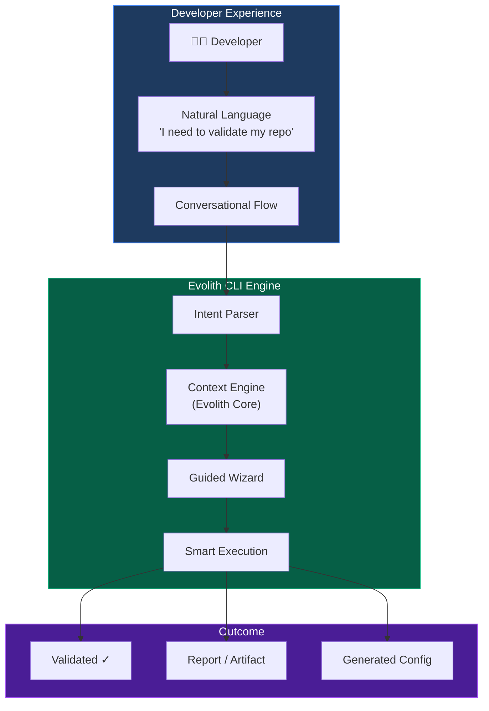
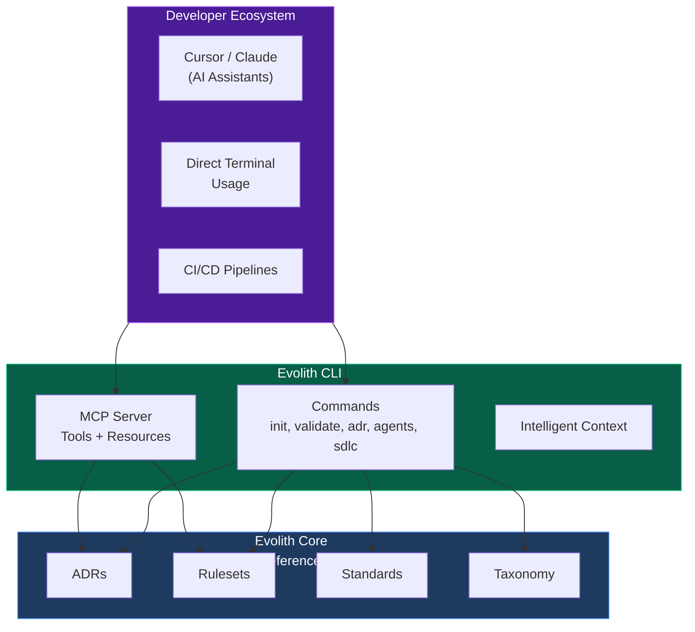
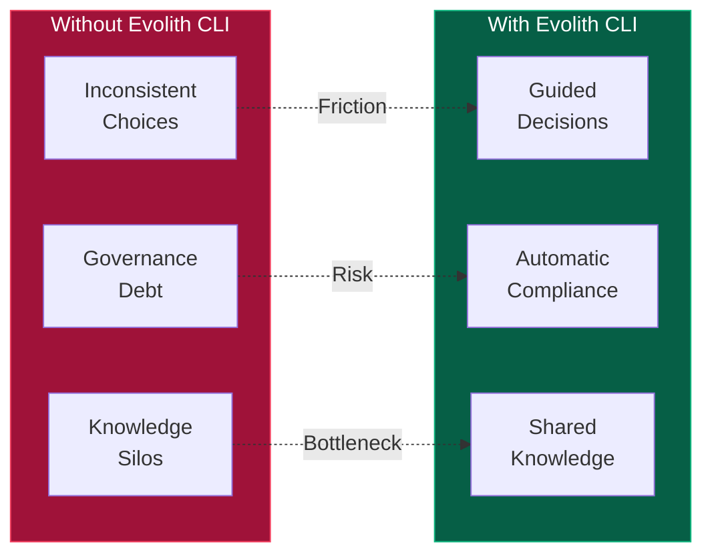
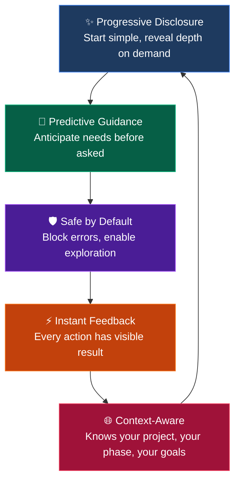
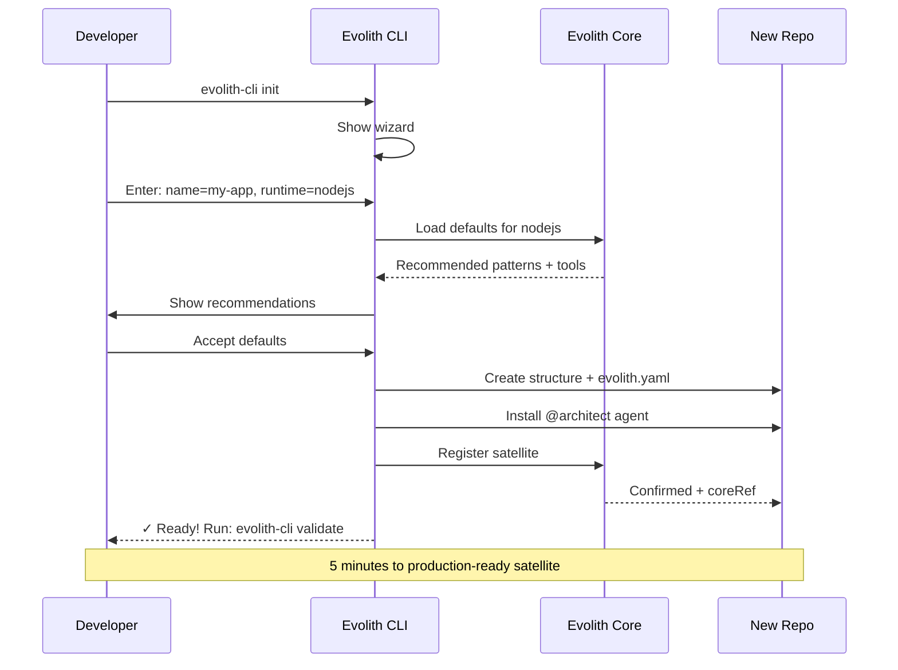
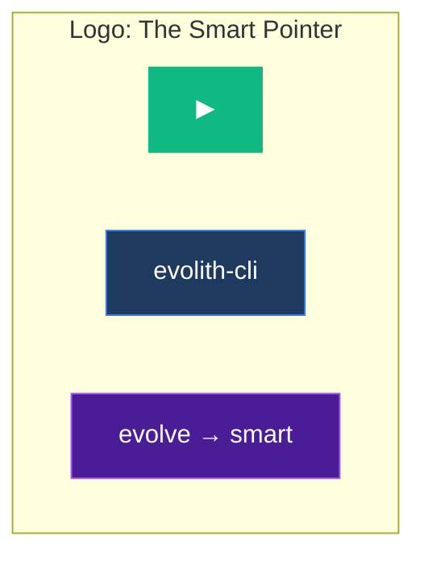
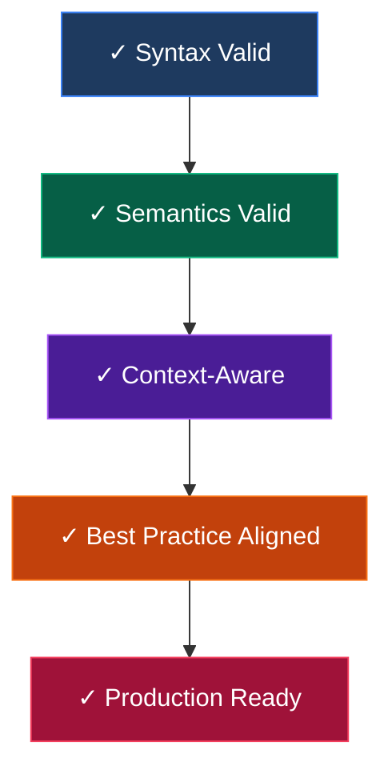

# Evolith CLI — Product Vision

> **Bilingual Navigation:** [Versión en Español](./VISION.es.md)
> **Status:** Draft
> **Owner:** Evolith Architecture Board
> **Last Updated:** 2026-06-06

---

## 1. Vision Statement

**Evolith CLI** is the intelligent command-line interface that makes Evolith governance accessible to every developer. It transforms complex architecture decisions into guided, conversational experiences — enabling teams to build compliant software without becoming governance experts.

> *"From complex governance to simple commands."*

---

## 2. Conceptual Image

### 2-1 The Evolith CLI as an AI Companion



### 2-2 The CLI as a Window to Evolith Core



---

## 3. Core Value Propositions

### 3-1 For Individual Developers

| Before (Without Evolith CLI) | After (With Evolith CLI) |
|---------------------------|------------------------|
| Read 50 pages of ADRs | Ask: `evolith-cli adr suggest --context authentication` |
| Manually validate 20 rules | Run: `evolith-cli validate --ruleset acl` |
| Guess architecture patterns | Get guided: `evolith-cli init --wizard` |
| Search docs for hours | `evolith-cli architecture ask "What's the auth pattern?"` |

### 3-2 For Teams



---

## 4. Product Concept: Three Modes

### 4-1 Interactive Mode (Default)

Guided wizards with rich UI:

```
┌─────────────────────────────────────────────────┐
│  🚀 Evolith CLI Init Wizard                       │
├─────────────────────────────────────────────────┤
│                                                 │
│  Let's set up your satellite repository.        │
│                                                 │
│  ◆ Project Name: [________________]             │
│                                                 │
│  ◆ Runtime:                                     │
│    ○ NodeJS / TypeScript                        │
│    ○ .NET / C#                                  │
│    ○ Android / Kotlin                           │
│                                                 │
│  ◆ Architecture:                                │
│    ○ Clean Architecture                         │
│    ○ Hexagonal (Ports & Adapters)               │
│    ○ DDD (Domain-Driven Design)                 │
│                                                 │
│  ◆ Monorepo:                                    │
│    ○ None (standalone)                          │
│    ○ Nx                                         │
│    ○ NPM Workspaces                             │
│                                                 │
│  ◆ Install Agents:                              │
│    □ @architect (recommended)                   │
│    □ @validator                                 │
│                                                 │
│           [Cancel]              [Create →]      │
└─────────────────────────────────────────────────┘
```

### 4-2 Batch Mode (CI/CD)

Silent execution with JSON output:

```bash
evolith-cli init --config project.yaml --output json | tee setup-report.json
```

### 4-3 MCP Mode (AI Integration)

stdio JSON-RPC for AI assistants:

```json
{
  "jsonrpc": "2.0",
  "method": "tools/call",
  "params": {
    "name": "evolith-validate",
    "arguments": { "path": "/repo", "format": "summary" }
  }
}
```

---

## 5. Experience Principles

### 5-1 Five-Star Developer Experience



### 5-2 Minimal Cognitive Load

```
┌─────────────────────────────────────────────────────────────┐
│                    cognitive load curve                      │
│                                                             │
│   ▲                                                         │
│   │         Without CLI        │    With Evolith CLI          │
│   │                            │                            │
│ 4 │    ┌───────────────────    │    ┌─                     │
│   │    │ Complex decisions     │    │  Guided defaults     │
│ 3 │    │ buried in docs        │    │  Context-aware help  │
│   │    └───────────────────────    │  ─────────────────────│
│ 2 │                                 │                      │
│   │                              ───┘                       │
│ 1 │    ┌─────────────────────────────────────────          │
│   │    │ Simple commands, clear outcomes                   │
│   │    └───────────────────────────────────────────────────
│   └────────────────────────────────────────────────────────►
│         Novice          Intermediate        Expert
│                        Developer Skill
└─────────────────────────────────────────────────────────────┘
```

---

## 6. User Journey: First 5 Minutes

### 6-1 Discovery → Production in 5 Minutes



### 6-2 Typical Session Flows

```mermaid
graph TB
    subgraph Morning["Morning Context Check"]
        M1["evolith-cli sdlc status"] --> M2["Phase gate health"]
        M2 --> M3["Gates: 3/5 passed ✓"]
    end

    subgraph Task["Development Task"]
        T1["evolith-cli validate"] --> T2["Rule checks: 15 passed"]
        T2 --> T3["Warnings: 2 (non-blocking)"]
        T3 --> T4["Fix suggestion: Run evolith-cli docs --fix"]
    end

    subgraph Review["Code Review"]
        R1["evolith-cli adr list"] --> R2["Show: 5 ADRs active"]
        R2 --> R3["Check: ADR-0023 still valid?"]
        R3 --> R4["Decision: still applies ✓"]
    end

    style Morning fill:#1e3a5f,stroke:#3b82f6,color:#fff
    style Task fill:#065f46,stroke:#10b981,color:#fff
    style Review fill:#4a1d96,stroke:#a855f7,color:#fff
```



---

## 7. Brand Identity

### 7-1 Visual Concept

```
╔═══════════════════════════════════════════════════════════════╗
║                                                                ║
║     ██████╗ ███████╗███╗   ██╗ ██████╗  ██████╗ ██████╗      ║
║     ██╔══██╗██╔════╝████╗  ██║██╔════╝ ██╔═══██╗██╔══██╗     ║
║     ██████╔╝█████╗  ██╔██╗ ██║██║  ███╗██║   ██║██████╔╝     ║
║     ██╔═══╝ ██╔══╝  ██║╚██╗██║██║   ██║██║   ██║██╔══██╗     ║
║     ██║     ███████╗██║ ╚████║╚██████╔╝╚██████╔╝██║  ██║     ║
║     ╚═╝     ╚══════╝╚═╝  ╚═══╝ ╚═════╝  ╚═════╝ ╚═╝  ╚═╝     ║
║                                                                ║
║              ╔═══════════════════════════════╗                ║
║              ║    evolith-cli — evolve smart    ║                ║
║              ╚═══════════════════════════════╝                ║
║                                                                ║
║     Colors:                                                    ║
║       Primary: #3B82F6 (Blue — Trust)                         ║
║       Accent:  #10B981 (Green — Success)                      ║
║       Dark:    #1E3A5F (Navy — Professional)                  ║
║       Alert:   #EF4444 (Red — Attention)                      ║
║                                                                ║
╚═══════════════════════════════════════════════════════════════╝
```

### 7-2 Logo Concept



**Concept:** The play button (▶) represents forward motion, intelligent progression, and action. The arrow suggests guidance toward better architecture decisions.

---

## 8. Success Metrics

### 8-1 Developer Adoption KPIs

| Metric | Target | Measurement |
|--------|--------|-------------|
| Time to first successful validation | < 2 min | Telemetry |
| Commands executed per session | > 5 | Analytics |
| MCP tool usage by AI assistants | Growing | Integration logs |
| Adherence index of CLI-guided projects | > 85% | Periodic audit |

### 8-2 Quality Gates



---

## 9. Roadmap

| Phase | Focus | Milestone |
|-------|-------|-----------|
| **Beta** | Core commands | validate, init, adr, agents |
| **v1.0** | MCP integration | Full tool suite + AI assistant support |
| **v1.1** | Phase guidance | Interactive SDLC wizard |
| **v2.0** | Autonomous agents | Self-healing architecture compliance |

---

*Evolith CLI — Making Evolith governance accessible, one command at a time.*

---

[Back to CLI Index](../README.md)