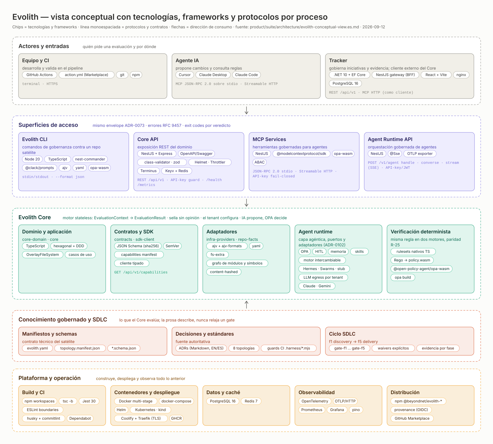

> **Navegación bilingüe:** [English version](./evolith-conceptual-view.md)

# Evolith — Vista Conceptual con Tecnologías, Frameworks y Protocolos por Proceso

> **Tipo de documento:** Vista de arquitectura (conceptual, nivel Suite)
> **Estado:** Activo · **Owner:** Evolith Architecture Board
> **Fecha:** 2026-09-12
> **Fuente de verdad:** el código — `package.json` de cada workspace, `product/infra/docker-compose.fullstack.yml`, `product/infra/deployment-topology.es.md` y el [Mapa de Ecosistema y Comunicación](../../products/ecosystem-and-communication.es.md). Este documento *describe*; si diverge del código, gana el código y se regenera el diagrama.

Esta vista responde a tres preguntas en una sola imagen: **qué procesos** componen Evolith (de quién pide una evaluación a qué la ejecuta y qué la sostiene), **con qué tecnologías y frameworks** está construido cada proceso, y **por qué protocolos y contratos** se comunican. Es una vista conceptual: agrupa por responsabilidad, no por repositorio ni por contenedor. Para la vista de componentes y superficies, ver el [Mapa de Ecosistema y Comunicación](../../products/ecosystem-and-communication.es.md); para la vista de despliegue, ver la [Topología de despliegue](../../infra/deployment-topology.es.md).

## Meta y Objetivos

> **Meta:** que cualquier persona — cliente, arquitecto, nuevo integrante — entienda en una imagen cómo funciona Evolith y con qué está hecho, sin leer el código.

**Objetivos:**

- Nombrar los cinco procesos de la plataforma y la dirección de consumo entre ellos: los actores entran por las superficies, las superficies consumen el Core, el Core evalúa el conocimiento gobernado, y la plataforma construye y observa todo lo anterior.
- Etiquetar cada proceso con sus tecnologías, frameworks y protocolos *reales*, leídos del código y no recordados.
- Mantener el diagrama bilingüe y regenerable desde un único modelo de datos, para que las dos mitades EN/ES no puedan divergir.

## 1. El diagrama



- Archivo compartible: [`assets/evolith-conceptual-view.es.svg`](./assets/evolith-conceptual-view.es.svg) (español) · [`assets/evolith-conceptual-view.svg`](./assets/evolith-conceptual-view.svg) (inglés). Son SVG autocontenidos (colores explícitos, fuentes del sistema, sin CSS externo): se pueden abrir en cualquier navegador, pegar en una presentación o enviar por correo.
- Generador: [`assets/generate-conceptual-view.mjs`](./assets/generate-conceptual-view.mjs). Produce ambos idiomas desde un solo modelo; ver §4.

**Cómo leerlo.** Cada carril es un proceso. Dentro de cada tarjeta: el título nombra el componente, la línea corta dice qué hace, los *chips* son tecnologías y frameworks, y la línea monoespaciada son los protocolos y contratos con los que se habla. Las flechas marcan la dirección de consumo (nunca al revés): las superficies consumen el Core y el Core evalúa el conocimiento gobernado; el conocimiento *alimenta* al Core, no lo redefine.

## 2. Lectura por proceso

### 2.1 Actores y entradas

Quién pide una evaluación y por qué puerta entra.

| Actor | Qué hace | Tecnologías y frameworks | Protocolos y contratos | Fuente |
|---|---|---|---|---|
| Equipo y CI | Desarrolla y valida en el pipeline | GitHub Actions, GitHub Action `action.yml` (publicable en Marketplace), git, npm | Terminal · HTTPS | [`action.yml`](../../../action.yml), `.github/workflows/` |
| Agente IA | Propone cambios y consulta reglas | Cursor, Claude Desktop, Claude Code | MCP JSON-RPC 2.0 sobre `stdio` · Streamable HTTP | [MCP Services](../../products/mcp-services/README.es.md) |
| Tracker | Gobierna iniciativas y evidencia; es cliente *externo* del Core (ADR-0074 / ADR-0075) | .NET 10 + EF Core (API), NestJS (gateway BFF), React + Vite (SPA servida por nginx), PostgreSQL 16 | REST `/api/v1` · MCP HTTP (como cliente) | [`docker-compose.fullstack.yml`](../../infra/docker-compose.fullstack.yml), [Hub del Tracker](../../products/evolith-tracker/README.es.md) |

### 2.2 Superficies de acceso

Las cuatro puertas resuelven por el mismo dominio y devuelven el mismo envelope [ADR-0073](../../../reference/core/architecture/adrs/core/0073-unified-cli-output-contract.es.md) (`success`, `data`, `meta`) con problem details RFC 9457 para errores y exit codes por veredicto en la CLI. Todas son síncronas request/response salvo el stream SSE de la Agent Runtime API.

| Superficie | Qué hace | Tecnologías y frameworks | Protocolos y contratos | Fuente |
|---|---|---|---|---|
| Evolith CLI (`src/sdk/cli`) | Comandos de gobernanza, validación y SDLC contra un repo satélite; incluye los MCP Services sin instalación aparte | Node 20, TypeScript, nest-commander, @clack/prompts, ajv + ajv-formats, yaml, @open-policy-agent/opa-wasm | `stdin`/`stdout` · `--format json` · exit codes por veredicto | [`src/sdk/cli/package.json`](../../../src/sdk/cli/package.json) |
| Core API (`src/apps/core-api`) | Capa oficial de exposición REST del dominio ([ADR-0074](../../../reference/core/architecture/adrs/core/0074-evolith-core-api-exposure-layer.es.md)) | NestJS + Express, OpenAPI/Swagger, class-validator y zod, Helmet, Throttler, Terminus, cache Keyv + Redis, nestjs-pino | REST `/api/v1` · guard de API-key ([ADR-0075](../../../reference/core/architecture/adrs/core/0075-core-api-auth-strategy.es.md)) · `/health` y `/metrics` neutrales de versión | [`src/apps/core-api/package.json`](../../../src/apps/core-api/package.json) |
| MCP Services (`src/packages/mcp-server`) | Herramientas gobernadas para agentes de IA | NestJS, @modelcontextprotocol/sdk, @open-policy-agent/opa-wasm, ABAC | JSON-RPC 2.0 sobre `stdio` · Streamable HTTP · API-key fail-closed | [`src/packages/mcp-server/package.json`](../../../src/packages/mcp-server/package.json) |
| Agent Runtime API (`src/apps/agent-runtime-api`) | Orquestación gobernada de agentes sobre `src/packages/agent-runtime` | NestJS, `@Sse`, exportador OTLP/HTTP | `POST /v1/agent` (`handle`, `converse`, `hermes`), `POST /v1/agent/stream` (SSE) · guard API-key/JWT | [`src/apps/agent-runtime-api/package.json`](../../../src/apps/agent-runtime-api/package.json) |

### 2.3 Evolith Core

Motor de evaluación *stateless* ([ADR-0101](../../../reference/core/architecture/adrs/core/0101-core-stateless-evaluation-engine.es.md)): recibe un `EvaluationContext` (repo, tenant e iniciativa son *contexto*, nunca entidades) y devuelve un `EvaluationResult` con veredicto, gates y evidencia. Tres principios lo atraviesan: el sellado no lleva lógica ni opinión, la validación de contenido la configura el tenant, y la IA solo propone — un verificador determinista decide.

| Componente | Paquetes | Tecnologías y frameworks | Protocolos y contratos | Fuente |
|---|---|---|---|---|
| Dominio y aplicación | `core-domain`, `core` | TypeScript, hexagonal + DDD, `OverlayFileSystem`, casos de uso | Puertos del dominio; sin dependencia de runtime ni de LLM | [`src/packages/core-domain`](../../../src/packages/core-domain/package.json), [`src/packages/core`](../../../src/packages/core/package.json) |
| Contratos y SDK | `contracts`, `sdk-client` | JSON Schema versionado con sha256, SemVer, manifiesto de capacidades, cliente tipado | `GET /api/v1/capabilities` | [`src/packages/contracts`](../../../src/packages/contracts/package.json), [`src/packages/sdk-client`](../../../src/packages/sdk-client/package.json) |
| Adaptadores | `infra-providers`, `repo-facts` | ajv + ajv-formats, yaml, fs-extra; grafo de módulos y símbolos content-hashed entregado *inline* en el contexto | Archivos estructurados (manifiestos, schemas, rulesets, `policy.wasm`) | [`src/packages/infra-providers`](../../../src/packages/infra-providers/package.json), [`src/packages/repo-facts`](../../../src/packages/repo-facts/package.json) |
| Agent runtime | `agent-runtime` | Capa agéntica hexagonal ([ADR-0102](../../../reference/core/architecture/adrs/core/0102-evolith-agent-runtime.es.md)): OPA, HITL, memoria, skills, Hermes; *LLM egress* con Claude y Gemini elegidos por tenant ([ADR-0128](../../../reference/core/architecture/adrs/core/0128-llm-provider-abstraction-per-tenant.es.md)) | Puertos y adaptadores; ningún proveedor de LLM es dependencia del dominio | [`src/packages/agent-runtime`](../../../src/packages/agent-runtime/package.json) |
| Verificación determinista | rulesets + OPA | Rulesets nativos en TypeScript y políticas Rego compiladas a `policy.wasm` (`opa build`), evaluadas con @open-policy-agent/opa-wasm | Paridad R-25: misma regla, mismo rule ID, en los dos motores; el gate de paridad falla ante drift | [`src/rulesets`](../../../src/rulesets/README.md), [Validación OPA](../../../reference/core/architecture/topologies/README.es.md) |

### 2.4 Conocimiento gobernado y SDLC

Lo que el Core evalúa. La prosa (Markdown) describe; la verdad validable por máquina vive en schemas, manifiestos, rulesets y políticas — por eso una edición solo de documentación no puede relajar un gate.

| Componente | Qué contiene | Tecnologías y formatos | Fuente |
|---|---|---|---|
| Manifiestos y schemas | El contrato técnico del satélite | `evolith.yaml`, `topology.manifest.json`, `*.schema.json` (JSON Schema) | [`evolith.yaml`](../../../evolith.yaml) |
| Decisiones y estándares | La fuente autoritativa de reglas | ADRs en Markdown bilingüe (EN/ES), 8 topologías, guards de CI en `.harness/scripts/ci/*.mjs` | [Registro de ADRs](../../../reference/core/architecture/adrs/README.es.md), [Topologías](../../../reference/core/architecture/topologies/README.es.md) |
| Ciclo SDLC | Las fases f1 discovery → f5 delivery, cada una cerrada por un gate obligatorio | `gate-f1` … `gate-f5`, waivers explícitos, evidencia por fase | [SDLC](../../../reference/core/sdlc/README.es.md) |

### 2.5 Plataforma y operación

Construye, despliega y observa todo lo anterior. Ningún componente de esta fila es una dependencia del dominio.

| Área | Tecnologías y productos | Fuente |
|---|---|---|
| Build y CI | npm workspaces, `tsc -b`, Jest 30, ESLint (reglas de fronteras), husky + commitlint, Dependabot | [`package.json`](../../../package.json), `.github/workflows/` |
| Contenedores y despliegue | Docker multi-stage, docker-compose, Helm, Kubernetes (kind en local), Coolify + Traefik con TLS en el VPS, imágenes en GHCR | [Topología de despliegue](../../infra/deployment-topology.es.md), [`product/infra/helm`](../../infra/helm/README.md) |
| Datos y caché | PostgreSQL 16 (Tracker), Redis 7 (caché de Core API) | [`docker-compose.fullstack.yml`](../../infra/docker-compose.fullstack.yml) |
| Observabilidad | OpenTelemetry (auto-instrumentación, OTLP/HTTP), Prometheus (`prom-client`, `/metrics`), Grafana, logs con pino | [`docker-compose.observability.yml`](../../infra/docker-compose.observability.yml), [Operaciones](../../operations/README.es.md) |
| Distribución | npm `@beyondnet/evolith-*` con provenance (OIDC desde Actions), GitHub Action publicable en Marketplace | [Hub del Evolith CLI](../../products/smart-cli/README.es.md) |

## 3. Reglas que el diagrama codifica

- **Dirección de dependencia unidireccional.** Los productos y superficies consumen Core; nunca lo redefinen. El Tracker llega al Core solo como cliente HTTP externo.
- **Una respuesta, muchas puertas.** CLI, REST, MCP y Agent Runtime devuelven el mismo envelope ADR-0073; una divergencia entre superficies bloquea el merge (agente exploratorio cross-surface en CI).
- **Síncrono salvo un stream.** Todas las llamadas de gobernanza son request/response; el único canal de streaming es `POST /v1/agent/stream` (SSE, iniciado por el cliente). No hay bus de eventos ni webhooks en las superficies entregadas.
- **La IA propone; el verificador decide.** Ningún veredicto sale de un modelo: sale de rulesets nativos y políticas OPA en paridad.
- **Abierto y elegido por tenant.** Todo apoyo externo (proveedor de LLM, nivel de validación) lo publica el Core como catálogo y lo elige el tenant; nada queda cableado.

## 4. Mantenimiento

**Cuándo actualizar.** Cuando aparezca o desaparezca un workspace en `src/`, cambie una dependencia de runtime relevante (framework, motor de políticas, cliente MCP), cambie un protocolo o ruta pública (`/api/v1`, `/v1/agent`, transportes MCP), o cambie el stack de despliegue (`docker-compose.fullstack.yml`, charts de Helm, Coolify).

**Cómo regenerar.** El modelo de datos (`LANES`) vive en el generador; se edita una sola vez y produce los dos idiomas:

```bash
node product/suite/architecture/assets/generate-conceptual-view.mjs product/suite/architecture/assets
```

**Cómo verificar el render.** Abrir el SVG en un navegador, o rasterizarlo con Chrome headless para revisarlo como imagen:

```bash
"/Applications/Google Chrome.app/Contents/MacOS/Google Chrome" --headless=new --disable-gpu --hide-scrollbars --window-size=1600,1414 --screenshot=/tmp/evolith-conceptual-view.png "file://$PWD/product/suite/architecture/assets/evolith-conceptual-view.es.svg"
```

**Qué no hacer.** No editar los SVG a mano (se pierden en la siguiente regeneración) y no actualizar una sola mitad del par EN/ES: el guard bilingüe de CI lo rechaza.

## Referencias relacionadas

- [Mapa de Ecosistema y Comunicación](../../products/ecosystem-and-communication.es.md) — vista de componentes, superficies, fases y fuente de verdad (diagramas Mermaid).
- [Topología de despliegue](../../infra/deployment-topology.es.md) — qué artefacto despliega qué servicio, dónde y con qué nombre.
- [Catálogo de Herramientas Validadas](../../infra/validated-tool-catalog.es.md) — herramientas aprobadas por fase, patrón y runtime.
- [ADR-0073](../../../reference/core/architecture/adrs/core/0073-unified-cli-output-contract.es.md) · [ADR-0074](../../../reference/core/architecture/adrs/core/0074-evolith-core-api-exposure-layer.es.md) · [ADR-0101](../../../reference/core/architecture/adrs/core/0101-core-stateless-evaluation-engine.es.md) · [ADR-0102](../../../reference/core/architecture/adrs/core/0102-evolith-agent-runtime.es.md) · [ADR-0128](../../../reference/core/architecture/adrs/core/0128-llm-provider-abstraction-per-tenant.es.md).

[Volver a Arquitectura de Suite](./README.es.md)
