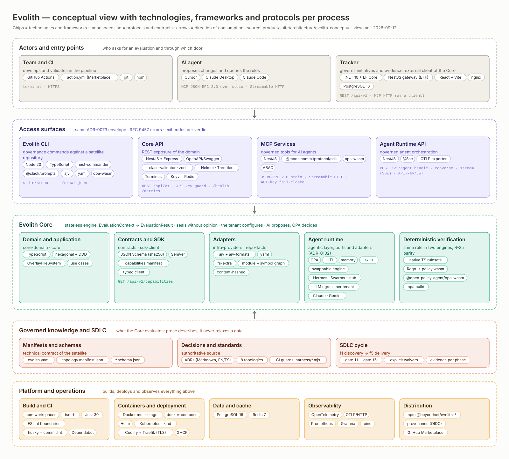

> **Bilingual Navigation:** [Ver versión en Español](./evolith-conceptual-view.es.md)

# Evolith — Conceptual View with Technologies, Frameworks and Protocols per Process

> **Document type:** Architecture view (conceptual, Suite level)
> **Status:** Active · **Owner:** Evolith Architecture Board
> **Date:** 2026-09-12
> **Source of truth:** the code — each workspace's `package.json`, `product/infra/docker-compose.fullstack.yml`, `product/infra/deployment-topology.md` and the [Ecosystem and Communication Map](../../products/ecosystem-and-communication.md). This document *describes*; when it diverges from the code, the code wins and the diagram is regenerated.

This view answers three questions in a single picture: **which processes** make up Evolith (from who asks for an evaluation to what executes it and what sustains it), **which technologies and frameworks** each process is built with, and **which protocols and contracts** they communicate through. It is a conceptual view: it groups by responsibility, not by repository or container. For the component and surface view, see the [Ecosystem and Communication Map](../../products/ecosystem-and-communication.md); for the deployment view, see the [Deployment topology](../../infra/deployment-topology.md).

## Goal and Objectives

> **Goal:** let anyone — a customer, an architect, a new team member — understand from one picture how Evolith works and what it is made of, without reading the code.

**Objectives:**

- Name the five processes of the platform and the direction of consumption between them: actors enter through the surfaces, surfaces consume the Core, the Core evaluates the governed knowledge, and the platform builds and observes everything above.
- Label each process with its *real* technologies, frameworks and protocols, read from the code rather than recalled.
- Keep the diagram bilingual and regenerable from a single data model, so the EN/ES halves cannot drift.

## 1. The diagram



- Shareable file: [`assets/evolith-conceptual-view.svg`](./assets/evolith-conceptual-view.svg) (English) · [`assets/evolith-conceptual-view.es.svg`](./assets/evolith-conceptual-view.es.svg) (Spanish). They are self-contained SVGs (explicit colors, system font stack, no external CSS): they open in any browser, paste into a slide deck, or travel by email.
- Generator: [`assets/generate-conceptual-view.mjs`](./assets/generate-conceptual-view.mjs). Produces both languages from one model; see §4.

**How to read it.** Each lane is a process. Inside each card: the title names the component, the short line says what it does, the *chips* are technologies and frameworks, and the monospace line lists the protocols and contracts it speaks. Arrows mark the direction of consumption (never the reverse): surfaces consume the Core and the Core evaluates the governed knowledge; the knowledge *feeds* the Core, it does not redefine it.

## 2. Reading per process

### 2.1 Actors and entry points

Who asks for an evaluation and through which door.

| Actor | What it does | Technologies and frameworks | Protocols and contracts | Source |
|---|---|---|---|---|
| Team and CI | Develops and validates in the pipeline | GitHub Actions, GitHub Action `action.yml` (Marketplace-publishable), git, npm | Terminal · HTTPS | [`action.yml`](../../../action.yml), `.github/workflows/` |
| AI agent | Proposes changes and queries the rules | Cursor, Claude Desktop, Claude Code | MCP JSON-RPC 2.0 over `stdio` · Streamable HTTP | [MCP Services](../../products/mcp-services/README.md) |
| Tracker | Governs initiatives and evidence; an *external* client of the Core (ADR-0074 / ADR-0075) | .NET 10 + EF Core (API), NestJS (gateway BFF), React + Vite (SPA served by nginx), PostgreSQL 16 | REST `/api/v1` · MCP HTTP (as a client) | [`docker-compose.fullstack.yml`](../../infra/docker-compose.fullstack.yml), [Tracker hub](../../products/evolith-tracker/README.md) |

### 2.2 Access surfaces

The four doors resolve through the same domain and return the same [ADR-0073](../../../reference/core/architecture/adrs/core/0073-unified-cli-output-contract.md) envelope (`success`, `data`, `meta`) with RFC 9457 problem details for errors and per-verdict exit codes in the CLI. All are synchronous request/response except the Agent Runtime API's SSE stream.

| Surface | What it does | Technologies and frameworks | Protocols and contracts | Source |
|---|---|---|---|---|
| Evolith CLI (`src/sdk/cli`) | Governance, validation and SDLC commands against a satellite repository; bundles the MCP Services with no separate install | Node 20, TypeScript, nest-commander, @clack/prompts, ajv + ajv-formats, yaml, @open-policy-agent/opa-wasm | `stdin`/`stdout` · `--format json` · per-verdict exit codes | [`src/sdk/cli/package.json`](../../../src/sdk/cli/package.json) |
| Core API (`src/apps/core-api`) | Official REST exposure layer of the domain ([ADR-0074](../../../reference/core/architecture/adrs/core/0074-evolith-core-api-exposure-layer.md)) | NestJS + Express, OpenAPI/Swagger, class-validator and zod, Helmet, Throttler, Terminus, Keyv + Redis cache, nestjs-pino | REST `/api/v1` · API-key guard ([ADR-0075](../../../reference/core/architecture/adrs/core/0075-core-api-auth-strategy.md)) · version-neutral `/health` and `/metrics` | [`src/apps/core-api/package.json`](../../../src/apps/core-api/package.json) |
| MCP Services (`src/packages/mcp-server`) | Governed tools for AI agents | NestJS, @modelcontextprotocol/sdk, @open-policy-agent/opa-wasm, ABAC | JSON-RPC 2.0 over `stdio` · Streamable HTTP · API-key fail-closed | [`src/packages/mcp-server/package.json`](../../../src/packages/mcp-server/package.json) |
| Agent Runtime API (`src/apps/agent-runtime-api`) | Governed agent orchestration over `src/packages/agent-runtime` | NestJS, `@Sse`, OTLP/HTTP exporter | `POST /v1/agent` (`handle`, `converse`, `hermes`), `POST /v1/agent/stream` (SSE) · API-key/JWT guard | [`src/apps/agent-runtime-api/package.json`](../../../src/apps/agent-runtime-api/package.json) |

### 2.3 Evolith Core

A *stateless* evaluation engine ([ADR-0101](../../../reference/core/architecture/adrs/core/0101-core-stateless-evaluation-engine.md)): it receives an `EvaluationContext` (repository, tenant and initiative are *context*, never entities) and returns an `EvaluationResult` with verdict, gates and evidence. Three principles run through it: sealing carries no logic or opinion, content validation is configured by the tenant, and AI only proposes — a deterministic verifier decides.

| Component | Packages | Technologies and frameworks | Protocols and contracts | Source |
|---|---|---|---|---|
| Domain and application | `core-domain`, `core` | TypeScript, hexagonal + DDD, `OverlayFileSystem`, use cases | Domain ports; no runtime or LLM dependency | [`src/packages/core-domain`](../../../src/packages/core-domain/package.json), [`src/packages/core`](../../../src/packages/core/package.json) |
| Contracts and SDK | `contracts`, `sdk-client` | JSON Schema versioned with sha256, SemVer, capability manifest, typed client | `GET /api/v1/capabilities` | [`src/packages/contracts`](../../../src/packages/contracts/package.json), [`src/packages/sdk-client`](../../../src/packages/sdk-client/package.json) |
| Adapters | `infra-providers`, `repo-facts` | ajv + ajv-formats, yaml, fs-extra; content-hashed module and symbol graph delivered *inline* on the context | Structured files (manifests, schemas, rulesets, `policy.wasm`) | [`src/packages/infra-providers`](../../../src/packages/infra-providers/package.json), [`src/packages/repo-facts`](../../../src/packages/repo-facts/package.json) |
| Agent runtime | `agent-runtime` | Hexagonal agentic layer ([ADR-0102](../../../reference/core/architecture/adrs/core/0102-evolith-agent-runtime.md)): OPA, HITL, memory, skills, Hermes; *LLM egress* with Claude and Gemini chosen per tenant ([ADR-0128](../../../reference/core/architecture/adrs/core/0128-llm-provider-abstraction-per-tenant.md)) | Ports and adapters; no LLM provider is a domain dependency | [`src/packages/agent-runtime`](../../../src/packages/agent-runtime/package.json) |
| Deterministic verification | rulesets + OPA | Native TypeScript rulesets and Rego policies compiled to `policy.wasm` (`opa build`), evaluated with @open-policy-agent/opa-wasm | R-25 parity: same rule, same rule ID, in both engines; the parity gate fails on drift | [`src/rulesets`](../../../src/rulesets/README.md), [OPA validation](../../../reference/core/architecture/topologies/README.md) |

### 2.4 Governed knowledge and SDLC

What the Core evaluates. Prose (Markdown) describes; the machine-validatable truth lives in schemas, manifests, rulesets and policies — which is why a documentation-only edit cannot relax a gate.

| Component | What it holds | Technologies and formats | Source |
|---|---|---|---|
| Manifests and schemas | The satellite's technical contract | `evolith.yaml`, `topology.manifest.json`, `*.schema.json` (JSON Schema) | [`evolith.yaml`](../../../evolith.yaml) |
| Decisions and standards | The authoritative source of rules | Bilingual (EN/ES) Markdown ADRs, 8 topologies, CI guards in `.harness/scripts/ci/*.mjs` | [ADR registry](../../../reference/core/architecture/adrs/README.md), [Topologies](../../../reference/core/architecture/topologies/README.md) |
| SDLC cycle | Phases f1 discovery → f5 delivery, each closed by a mandatory gate | `gate-f1` … `gate-f5`, explicit waivers, evidence per phase | [SDLC](../../../reference/core/sdlc/README.md) |

### 2.5 Platform and operations

Builds, deploys and observes everything above. Nothing in this row is a domain dependency.

| Area | Technologies and products | Source |
|---|---|---|
| Build and CI | npm workspaces, `tsc -b`, Jest 30, ESLint (boundary rules), husky + commitlint, Dependabot | [`package.json`](../../../package.json), `.github/workflows/` |
| Containers and deployment | Docker multi-stage, docker-compose, Helm, Kubernetes (kind locally), Coolify + Traefik with TLS on the VPS, images on GHCR | [Deployment topology](../../infra/deployment-topology.md), [`product/infra/helm`](../../infra/helm/README.md) |
| Data and cache | PostgreSQL 16 (Tracker), Redis 7 (Core API cache) | [`docker-compose.fullstack.yml`](../../infra/docker-compose.fullstack.yml) |
| Observability | OpenTelemetry (auto-instrumentation, OTLP/HTTP), Prometheus (`prom-client`, `/metrics`), Grafana, pino logs | [`docker-compose.observability.yml`](../../infra/docker-compose.observability.yml), [Operations](../../operations/README.md) |
| Distribution | npm `@beyondnet/evolith-*` with provenance (OIDC from Actions), Marketplace-publishable GitHub Action | [Evolith CLI hub](../../products/smart-cli/README.md) |

## 3. Rules the diagram encodes

- **One-way dependency direction.** Products and surfaces consume Core; they never redefine it. The Tracker reaches the Core only as an external HTTP client.
- **One answer, many doors.** CLI, REST, MCP and Agent Runtime return the same ADR-0073 envelope; a divergence between surfaces blocks the merge (cross-surface exploratory agent in CI).
- **Synchronous except for one stream.** Every governance call is request/response; the only streaming channel is `POST /v1/agent/stream` (SSE, client-initiated). There is no event bus and no webhook delivery in the shipped surfaces.
- **AI proposes; the verifier decides.** No verdict comes out of a model: it comes out of native rulesets and OPA policies kept in parity.
- **Open and chosen per tenant.** Every external support (LLM provider, validation level) is published by the Core as a catalog and chosen by the tenant; nothing is hard-wired.

## 4. Maintenance

**When to update.** When a workspace appears or disappears under `src/`, a relevant runtime dependency changes (framework, policy engine, MCP client), a public protocol or route changes (`/api/v1`, `/v1/agent`, MCP transports), or the deployment stack changes (`docker-compose.fullstack.yml`, Helm charts, Coolify).

**How to regenerate.** The data model (`LANES`) lives in the generator; edit it once and it produces both languages:

```bash
node product/suite/architecture/assets/generate-conceptual-view.mjs product/suite/architecture/assets
```

**How to verify the render.** Open the SVG in a browser, or rasterize it with headless Chrome to review it as an image:

```bash
"/Applications/Google Chrome.app/Contents/MacOS/Google Chrome" --headless=new --disable-gpu --hide-scrollbars --window-size=1600,1414 --screenshot=/tmp/evolith-conceptual-view.png "file://$PWD/product/suite/architecture/assets/evolith-conceptual-view.svg"
```

**What not to do.** Do not hand-edit the SVGs (the next regeneration overwrites them) and do not update only one half of the EN/ES pair: the bilingual CI guard rejects it.

## Related references

- [Ecosystem and Communication Map](../../products/ecosystem-and-communication.md) — component, surface, phase and source-of-truth view (Mermaid diagrams).
- [Deployment topology](../../infra/deployment-topology.md) — which artifact deploys which service, where, and under which name.
- [Validated Tool Catalog](../../infra/validated-tool-catalog.md) — approved tools per phase, pattern and runtime.
- [ADR-0073](../../../reference/core/architecture/adrs/core/0073-unified-cli-output-contract.md) · [ADR-0074](../../../reference/core/architecture/adrs/core/0074-evolith-core-api-exposure-layer.md) · [ADR-0101](../../../reference/core/architecture/adrs/core/0101-core-stateless-evaluation-engine.md) · [ADR-0102](../../../reference/core/architecture/adrs/core/0102-evolith-agent-runtime.md) · [ADR-0128](../../../reference/core/architecture/adrs/core/0128-llm-provider-abstraction-per-tenant.md).

[Back to Suite Architecture](./README.md)
