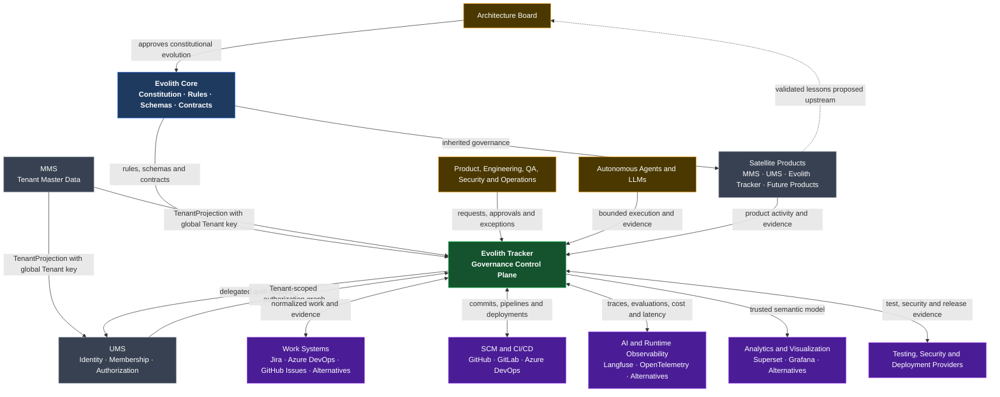
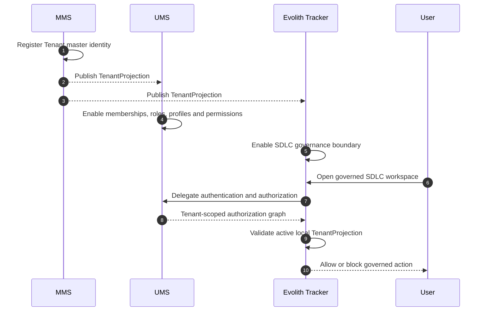
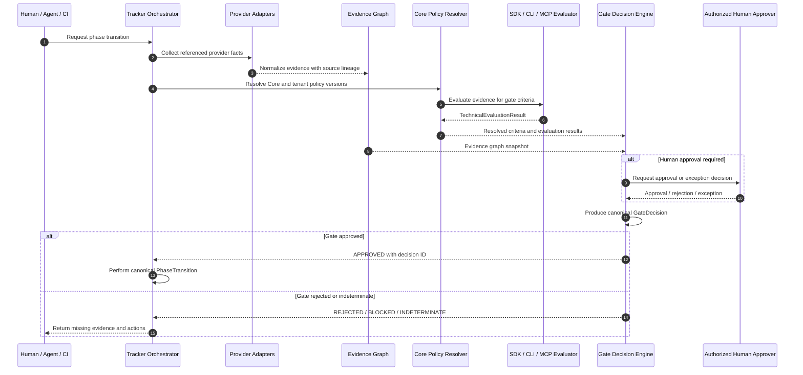
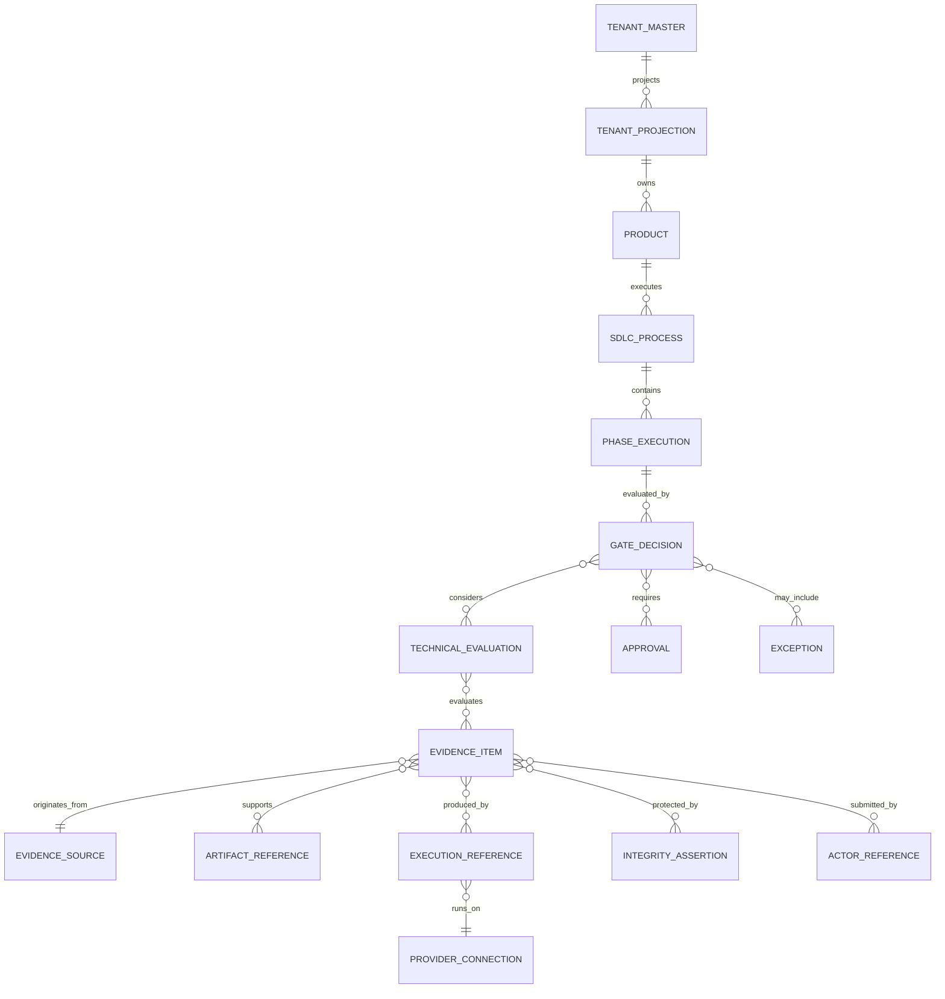
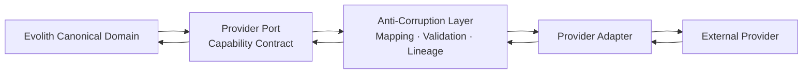
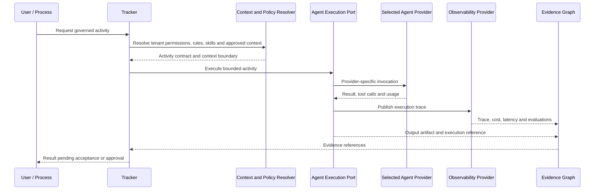
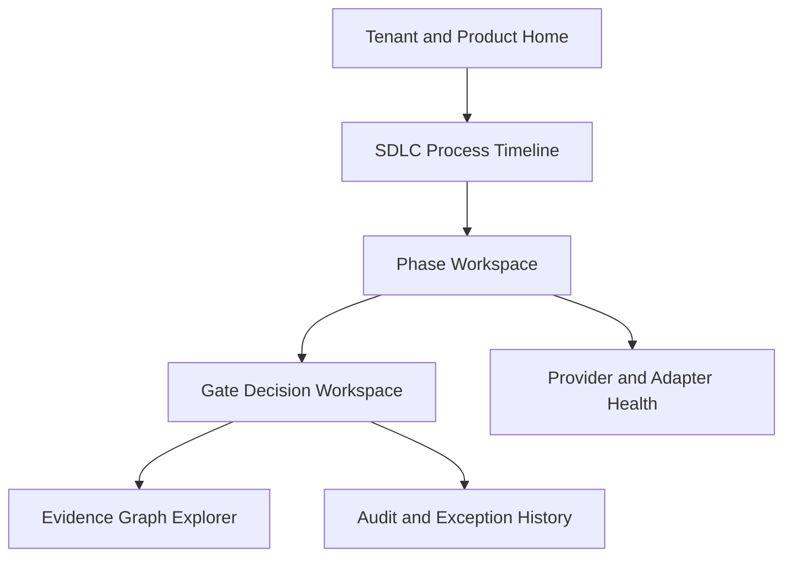

# Evolith — Governed Composition Target Design

> **Bilingual Navigation:** [Versión en Español](./evolith-governed-composition-target-design.es.md)

**Status:** Proposed Design — Architecture Board Review Required  
**Owner:** Evolith Architecture Board  
**Parent Vision:** [Evolith Product Vision Master](../vision/evolith-product-vision-master.md)  
**Created:** 2026-06-10  
**Implementation Status:** Design only — no code changes authorized by this document

---

## 1. Purpose

This document defines the target design that implements the new Evolith product vision before any source-code changes begin.

The central responsibility model is:

> **Core defines. Providers execute. CLI and MCP evaluate. Tracker decides and audits.**

The suite-level tenant responsibility model is:

> **MMS governs the Tenant master identity. UMS governs user identity and authorization inside the Tenant. Evolith Tracker governs the Tenant's SDLC operation.**

The design replaces the previous interpretation in which CLI, CI, or autonomous agents could appear to own the final Phase Gate verdict.

---

## 2. System Invariants

1. **Evolith Core is constitutional and read-only at runtime.** It defines rulesets, schemas, standards, taxonomies, gate definitions, and provider contracts.
2. **MMS owns canonical Tenant master data.** A Tenant is registered first in MMS and receives the global Tenant key used by all suite products.
3. **UMS owns user identity and authorization inside the Tenant.** It authenticates users, maintains memberships, profiles, roles, and permissions, and returns authorization graphs scoped to the global Tenant key.
4. **Evolith Tracker owns canonical runtime governance state.** It owns tenant SDLC projections, processes, phase state, decisions, approvals, exceptions, and audit history.
5. **Tenant records in UMS and Tracker are projections, not master identities.** They must reference the MMS global Tenant key and may be inactive, stale, or rejected independently by each consuming domain.
6. **CLI, MCP, CI, and agents are stateless evaluators or evidence producers.** They never mutate canonical phase state directly.
7. **External systems remain authoritative for their operational facts.** SCM owns commits, CI owns runs, observability owns traces, and work systems own their native work items.
8. **Tracker is authoritative for governance interpretation.** It decides whether collected evidence satisfies Core and tenant policy.
9. **Agents are replaceable executors, never approval authorities.**
10. **Every provider is isolated behind a provider-neutral port and Anti-Corruption Layer.**
11. **A green pipeline, completed task, generated document, or successful agent response cannot independently advance a phase.**
12. **Every canonical decision is reproducible from versioned rules, evidence references, approvals, and exceptions.**
13. **No implementation work begins until this design and its companion documents are approved.**

---

## 3. System Context



---

## 4. Container Architecture

```mermaid
flowchart TB
    classDef boundary fill:#f8fafc,stroke:#64748b,color:#0f172a
    classDef service fill:#14532d,stroke:#22c55e,color:#fff
    classDef core fill:#1e3a5f,stroke:#3b82f6,color:#fff
    classDef adapter fill:#4a1d96,stroke:#a855f7,color:#fff
    classDef data fill:#4a3800,stroke:#f59e0b,color:#fff

    subgraph TRACKER["Evolith Tracker"]
        UX["Unified Web Experience"]:::service
        API["Governance API"]:::service
        TENANT["Tenant Projection Service"]:::service
        ORCH["Process and Phase Orchestrator"]:::service
        DECISION["Gate Decision Engine"]:::service
        EVIDENCE["Evidence Graph Service"]:::service
        POLICY["Policy Resolution Service"]:::service
        AGENT["Agent Execution Coordinator"]:::service
        PROVIDERS["Provider and Adapter Registry"]:::service
        AUDIT["Audit and Exception Service"]:::service
        DB[("Tracker Governance Store")]:::data
    end

    CORE["Evolith Core\nRulesets · Schemas · Taxonomy · ADRs"]:::core
    CLI["Evolith SDK / CLI / MCP\nStateless Evaluation Runtime"]:::core
    MMS["MMS\nTenant Master Data"]:::adapter
    UMS["UMS\nIdentity and Authorization"]:::adapter

    subgraph EXTERNAL["External Providers"]
        WP["Work Management Adapter"]:::adapter
        RP["Repository Adapter"]:::adapter
        CP["CI/CD Adapter"]:::adapter
        OP["Observability Adapter"]:::adapter
        AP["Analytics Adapter"]:::adapter
        TP["Testing / Security Adapter"]:::adapter
        DP["Deployment Adapter"]:::adapter
    end

    UX --> API
    API --> TENANT
    API --> ORCH
    MMS -->|TenantProjection| TENANT
    API -->|delegated authentication and authorization| UMS
    UMS -->|authorization graph| API
    TENANT --> ORCH
    ORCH --> POLICY
    ORCH --> EVIDENCE
    ORCH --> DECISION
    DECISION --> AUDIT
    AGENT --> EVIDENCE
    PROVIDERS --> EVIDENCE

    POLICY -->|read-only rule resolution| CORE
    POLICY -->|evaluation request| CLI
    CLI -->|technical evaluation result| POLICY

    PROVIDERS --> WP
    PROVIDERS --> RP
    PROVIDERS --> CP
    PROVIDERS --> OP
    PROVIDERS --> AP
    PROVIDERS --> TP
    PROVIDERS --> DP

    ORCH --> DB
    TENANT --> DB
    EVIDENCE --> DB
    DECISION --> DB
    AUDIT --> DB
    AGENT --> DB
```



### 4.1 Container Responsibilities

| Container | Owns | Does Not Own |
|---|---|---|
| **Unified Web Experience** | Navigation, evidence views, governed actions, approvals and deep links | Provider operational truth |
| **Governance API** | Stable external contract and authorization boundary | Business rules duplicated from Core |
| **Tenant Projection Service** | Local active/inactive Tracker view of MMS Tenant identity and projection freshness | Tenant master identity, legal identity, user membership, or authorization graph |
| **Process and Phase Orchestrator** | Process lifecycle and transition requests | Final technical evaluation implementation |
| **Gate Decision Engine** | Canonical decision, policy combination, approval and exception handling | Source-tool execution |
| **Evidence Graph Service** | Evidence identity, lineage, relationships, integrity and retrieval | Raw provider data stores |
| **Policy Resolution Service** | Core plus tenant-policy resolution and version pinning | Canonical process state |
| **Agent Execution Coordinator** | Bounded activities, context, permissions, execution records and evidence | Final gate approval |
| **Provider Registry** | Provider metadata, capabilities, versions and adapter health | Provider-specific business rules leaking into the domain |
| **SDK / CLI / MCP** | Deterministic and stateless evaluation against versioned rules | Tracker state, approvals and phase transitions |

---

## 5. Tenant Master Data and Context Projections

The Tenant is created once in MMS as master data. UMS and Evolith Tracker consume Tenant projections so each bounded context can stay autonomous while still sharing the same global Tenant key.



### 5.1 Tenant Projection Rules

| System | Tenant Responsibility | Uses Global Tenant Key For | Must Not Own |
|---|---|---|---|
| **MMS** | Tenant master identity, lifecycle, canonical metadata and projection publication | Cross-suite identity correlation | User authorization or SDLC process state |
| **UMS** | User identity, memberships, profiles, roles and permissions inside the Tenant | Authorization graph scoping | Tenant master identity or SDLC gate decisions |
| **Evolith Tracker** | SDLC process, gates, evidence, approvers, exceptions, audit and tenant operational configuration | Governance boundary and evidence partitioning | Tenant master identity or user credential authority |

Tracker must reject governed actions when the UMS authorization graph references a Tenant that is missing, inactive, stale beyond policy, or mismatched against the local Tracker Tenant projection.

Tenant projection data is domain-local by design. A projection may carry the global Tenant key, display name, lifecycle status, data-classification profile, governance profile reference, projection version, and synchronization metadata. It must not become a copy of every MMS or UMS field.

---

## 6. Gate Evaluation and Decision Separation

### 6.1 Canonical Concepts

| Concept | Produced By | Meaning |
|---|---|---|
| **Evidence Item** | Human, agent, CI or provider | A fact or artifact offered as proof |
| **Technical Evaluation Result** | SDK, CLI, MCP or specialized evaluator | Deterministic assessment of evidence against a rule or criterion |
| **Gate Decision** | Tracker Gate Decision Engine | Canonical governance decision combining evaluations, approvals, exceptions and policy |
| **Phase Transition** | Tracker Process Orchestrator | State change executed only after an authorized Gate Decision |

### 6.2 Decision Flow



### 6.3 Status Vocabulary

```text
TechnicalEvaluationResult.status
  compliant | non_compliant | indeterminate | error

GateDecision.status
  approved | rejected | blocked | approved_with_exception

PhaseTransition.status
  requested | authorized | executed | failed | cancelled
```

The term `passed` may remain as a presentation label, but it must not obscure which object is technical and which object is canonical.

---

## 7. Evidence Graph Design



### 7.1 Minimum Evidence Metadata

Every accepted evidence item carries:

- stable evidence identifier;
- tenant, product, process, phase, gate and criterion references;
- source provider and external identifier;
- evidence type, schema version and content hash;
- producer actor, agent and model identity when applicable;
- prompt, skill and ruleset versions when applicable;
- commit, pipeline, test, deployment or document references;
- timestamps, cost, latency and integrity metadata;
- retention and data-classification policy;
- evaluation, approval, exception and final-decision references.

---

## 8. Provider and Adapter Design



### 8.1 Provider Contracts

| Port | Example Capabilities | Example Providers |
|---|---|---|
| **Work Management Port** | Search, import, link and update work items | Jira, Azure DevOps, GitHub Issues, open alternatives |
| **Agent Execution Port** | Run bounded activity and return execution evidence | Claude, OpenAI, Gemini, local agents |
| **LLM Observability Port** | Trace, evaluation, cost, latency and prompt versions | Langfuse and alternatives |
| **Analytics Port** | Publish governed datasets and embed trusted visualizations | Apache Superset, Grafana and alternatives |
| **Repository Port** | Commits, branches, pull requests and tags | GitHub, GitLab, Azure Repos |
| **CI/CD Port** | Builds, tests, artifacts and deployment runs | GitHub Actions, Azure Pipelines, GitLab CI |
| **Testing Port** | Test results, coverage and contract verification | Framework-specific adapters |
| **Security Port** | Findings, policy checks and risk classifications | CodeQL, Trivy, Snyk and alternatives |
| **Deployment Port** | Release, environment, rollout and rollback evidence | Kubernetes, cloud platforms and alternatives |
| **Collaboration Port** | Notifications, approvals and operational communication | Email, Teams, Slack and alternatives |

### 8.2 Adapter Certification Levels

```text
Community Adapter
    -> Contract-conformant and community maintained

Certified Adapter
    -> Security, compatibility and evidence-lineage validation passed

Managed Adapter
    -> Enterprise operations, monitoring, upgrades, support and SLA
```

---

## 9. Agent Execution Design



Agents cannot:

- approve a gate;
- mutate phase state directly;
- expand their context beyond the approved boundary;
- change tenant rules or Core rulesets;
- convert a generated artifact into accepted evidence without validation.

---

## 10. Unified Product Experience



The experience must show canonical Evolith state first and provider details second. External tools remain accessible through source links, but users must not manually reconstruct the governance story across products.

---

## 11. Minimum Provable Design Slice

The first implementation following this design will prove one vertical slice:

```text
One tenant
  -> one MMS Tenant master identity
  -> one active UMS Tenant projection
  -> one active Tracker Tenant projection
  -> one product
  -> one five-phase SDLC process
  -> one work-management provider
  -> one repository and CI provider
  -> one agent provider
  -> one observability provider
  -> one analytics provider
  -> one Evidence Graph
  -> five canonical Gate Decisions
```

The design is accepted only if:

- Tracker remains authoritative for every decision;
- MMS remains authoritative for Tenant master identity;
- UMS remains authoritative for user identity and authorization;
- Tracker validates an active local Tenant projection before any governed action;
- every evidence item preserves provider lineage;
- adapters can be replaced without changing canonical entities;
- agents remain bounded and non-authoritative;
- the user sees one coherent process;
- no provider-specific schema leaks into Core or Tracker domain logic.

---

## 12. Documentation Impact Before Code

The following documents must be aligned before implementation:

1. SDLC Tracker Technical Interface Design.
2. SDK / CLI / MCP Target Architecture.
3. Evidence and Traceability Model.
4. SDLC Artifact Mapping and Discovery templates.
5. Responsibility Matrix and Gate Decision semantics.
6. Open-Core and Adapter Ecosystem boundaries.
7. Executive one-pager and governance diagrams.
8. Evolutionary roadmap and maturity assessment.

Rulesets, schemas and source code are explicitly outside this first design-only change set.

---

## 13. Review Decisions Required

The Architecture Board must approve:

- the separation between technical evaluation and canonical decision;
- the Evidence Graph aggregate boundaries;
- the initial provider-port taxonomy;
- adapter certification levels;
- MMS-to-UMS and MMS-to-Tracker Tenant projection contract;
- UMS authorization graph contract consumed by Tracker;
- the minimum vertical slice;
- terminology for `compliant`, `approved`, and `passed`;
- which approval conditions remain tenant-configurable.

---

## 14. Related Documents

- [Evolith Product Vision Master](../vision/evolith-product-vision-master.md)
- [Strategic Validation and Composition Framework](../methods/evolith-strategic-validation-and-composition-framework.md)
- [SDLC Tracker Technical Interface Design](../../products/evolith-tracker/sdlc-tracker-technical-interfaces.md)
- [SDLC Traceability Model](../../../reference/core/sdlc/traceability-model.md)
- [AI-Assisted Product Validation Workflow](../methods/evolith-ai-assisted-validation-workflow.md)

---

*This document is the target design baseline for the new vision. It authorizes documentation alignment only; implementation requires a separately approved technical baseline and ADR set.*
