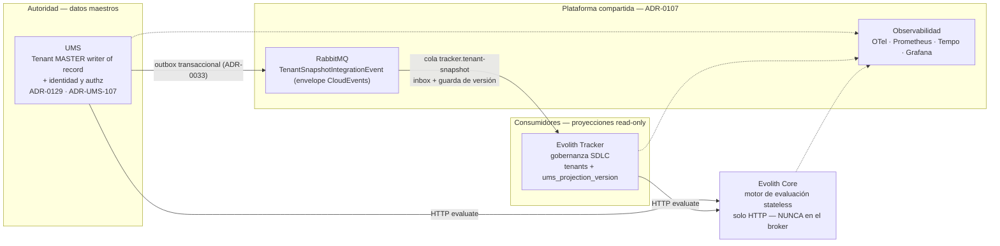
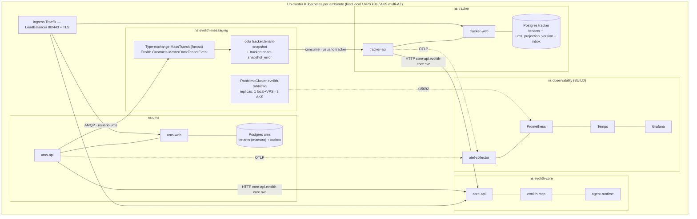

> **Navegación bilingüe:** [View English version](./evolith-suite-deployment-strategy.md)

# Suite Evolith — Estrategia de Despliegue (Kubernetes de Cluster Único)

> **Estado:** Propuesto (consolidado BMAD) · **Owner:** Evolith Architecture Board
> **Autoridad:** [ADR-0107](../../../reference/core/architecture/adrs/core/0107-single-cluster-kubernetes-deployment-topology.es.md) (topología de cluster único) · [ADR-0129](../../../reference/core/architecture/adrs/core/0129-ums-is-the-tenant-master.es.md) (el maestro de Tenant es UMS) · decisiones de los satélites: ADR-UMS-107 (emisor) y T-059 (consumidor)
> **Método:** producido por un análisis multi-agente BMAD — Winston (Arquitecto), experto DevOps, experto de Infraestructura — anclado en el estado real de los repos, y verificado adversarialmente por críticos de grounding/completitud/operación. Las correcciones verificadas están incorporadas (ver §5, §15).
> **Fecha:** 2026-07-09 · **Rebasado sobre la suite de tres productos:** 2026-08-23

> **Qué cambió el 2026-08-23.** Este plan se escribió para cuatro productos, y uno de ellos — **MMS** — nunca existió. ADR-0106 lo nombraba maestro de Tenant; ADR-0129 lo supersede, y los dos satélites ya se habían movido: UMS posee y publica el tenant (ADR-UMS-107) y el Tracker lo consume (T-059). Todo lo que tenía forma de MMS sale de este documento: su namespace, su base de datos, su pipeline de CI, sus riesgos, y la migración de ownership M0–M4 que existía para entregarle una autoridad que nunca iba a tener. La §5 de mensajería se redibuja sobre **un** productor y **una** cola consumidora.

---

## 1. Recomendación consolidada BMAD (una decisión por tema)

| Tema | Decisión | Detalle |
|---|---|---|
| Topología de despliegue | **Un cluster por ambiente, namespace-por-producto** (ADR-0107 — no se re-litiga) | §4 |
| Ambientes | **local kind → staging (VPS k3s) → prod-VPS (k3s/Coolify, GT-448) y prod-AKS (ruta de crecimiento)** | §4 |
| GitOps | **Flux CD v2** + charts Helm como OCI en GHCR (encaja con solo-founder + VPS de 7.8 GB; Argo CD descartado por footprint/UI sin uso) | §9 |
| Broker | **RabbitMQ compartido por cluster** (Cluster Operator; quorum solo con ≥3 nodos) | §5 |
| Propiedad de la topología del broker | **MassTransit es dueño de la topología de mensajes** (exchanges/colas/bindings); CRDs del Topology Operator solo para **Users/Permissions/Policies** — las CRDs de exchange/cola actuales en `tenant-topology.yaml` se **retiran** (eran letra muerta y riesgo de conflicto de declaración; ver §5) | §5 |
| Distribución de mensajes | **Fanout vía type-exchange de MassTransit** → una cola de endpoint por grupo consumidor. `x-consistent-hash` **nunca** es una herramienta pub/sub (divide el tráfico) — solo particionamiento dentro de un grupo consumidor si algún día hace falta | §5 |
| Mensajes veneno | **Convención `<queue>_error` de MassTransit** — alertar sobre profundidad de `_error`; CRDs de DLX retiradas | §5 |
| BD | **BD-por-producto**; StatefulSet local → CNPG (VPS) → Azure Database for PostgreSQL Flexible Server (AKS) | §8 |
| Secretos | K8s Secrets (local) → **OpenBao + ESO** (VPS) → **Azure Key Vault + CSI** (AKS); mismos nombres de Secret para que los charts no cambien | §7 |
| Ingress | **Traefik en todas partes** (los charts de Core+Tracker ya usan IngressRoute; k3s lo trae; el chart de UMS se reconstruye sobre el template set de Tracker) · 1 IP pública + routing por host · cert-manager + Let's Encrypt | §7 |
| Estrategia de despliegue | **RollingUpdate en todo** (`maxSurge:1, maxUnavailable:0` + PDB); sin blue-green/canary hasta tener tráfico real + dashboards SLO | §10 |
| Contrato | Namespace **`Evolith.Contracts.Tenancy`** — un namespace de SUITE, no del emisor, porque MassTransit enruta por namespace+tipo; expand-contract; **un solo major de schema por consumidor**. Hoy ningún paquete lo publica: el tipo está duplicado literalmente en UMS y en el Tracker | §11 |
| Migración de ownership | **Cerrada el 2026-08-22** por ADR-UMS-107 + T-059 — UMS siempre fue el escritor; el Tracker dejó de autorar lo que UMS posee | §12 |
| Gates de promoción | **Escalera G0–G4**; G3 = la maquinaria de gates de Evolith existente (`evolith-cli gate evaluate -p qa`, gate-F4 "RC Stamped") | §13 |
| Probes | **Readiness NUNCA depende de AMQP** — una caída del broker degrada frescura, no debe drenar la flota HTTP | §5.4 |

### Matriz de cobertura (petición del usuario → sección)

| # | Ítem | Sección |
|---|---|---|
| 1 | Arquitectura de deployment | §2, §3, §4 |
| 2 | Estrategia de ambientes | §4 |
| 3 | Mismo cluster vs separados | §4.1 |
| 4 | Aislamiento por sistema | §6 |
| 5 | Estrategia de dependencias RabbitMQ | §5 |
| 6 | Estrategia de despliegue (rolling/bg/canary) | §10 |
| 7 | Namespaces/config/secrets/observabilidad | §6, §7, §14 |
| 8 | Diseño del cluster y tipologías | §4 |
| 9 | Ingress/redes/IPs/DNS/TLS/policies | §7 |
| 10 | Validaciones pre-producción | §13 |
| 11 | How-to | §16 |

---

## 2. Mapa conceptual



## 3. Mapa técnico



---

## 4. Ambientes y tipologías de cluster

### 4.1 Un cluster por ambiente (nunca mezclar staging y prod)

Multi-cluster-por-producto se **rechaza**: obliga a federar/shovel RabbitMQ entre clusters (rompe el modelo de mensajería de un salto), cuesta 3–4× de operación a este tamaño de equipo, no es físicamente viable en la VPS GT-448, y su único beneficio real (separación de facturación) lo cubren en AKS las labels de namespace `evolith.dev/product` que ya existen en `deploy/kubernetes/namespaces.yaml`.

| | local (kind) | staging (VPS k3s) | prod-VPS (k3s/Coolify) | prod-AKS |
|---|---|---|---|---|
| Nodos | 1 (`deploy/kubernetes/kind-cluster.yaml`) | 1 | 1–2 (limitado por RAM: clase 7.8 GB) | system 2×B2s + user 3×D4as_v5 en 3 AZs, autoscaler 3→6 |
| CNI | **Cilium** (instalar con `disableDefaultCNI: true` — kindnet NO aplica NetworkPolicy; paridad con AKS) | default k3s o Cilium | idem | Azure CNI Overlay + dataplane **Cilium** |
| RabbitMQ | replicas **1** (overlay de values) | replicas 1, PV 5Gi | replicas **1** (3 réplicas en un nodo es HA falsa y triplica RAM; quorum=3 solo con ≥3 nodos) | replicas 3, anti-affinity de zona, PVs ZRS |
| Postgres | StatefulSet in-cluster por producto | **CloudNativePG** por producto + backups base/WAL fuera del nodo (S3-compatible) | idem | **Azure Database for PostgreSQL Flexible Server** por producto (zone-redundant para UMS — autoridad maestra; burstable para la proyección del Tracker) |
| Storage class | default kind | local-path | local-path + backups off-node obligatorios | managed-csi / premium+ZRS para broker y BD |
| TLS | ninguno/mkcert | cert-manager + issuer LE staging | cert-manager + LE prod | cert-manager + LE prod |
| Secretos | K8s Secrets planos | OpenBao + ESO | OpenBao + ESO (GT-112) | Azure Key Vault + CSI + workload identity |

**Regla de promoción:** la imagen se construye **una vez** (GHCR) y se promueve **por digest** local → staging → prod. Nunca se reconstruye por ambiente. La deriva de config vive solo en `values-<env>.yaml` junto a cada chart.

### 4.2 Postura de HA por ambiente (explícita)

- **prod-VPS: sin HA por diseño.** Disponibilidad = restauración rápida: CNPG PITR + WAL off-node, broker quorum-de-1 en PVs durables, RTO documentado (≤30 min) / RPO (≤5 min vía WAL). El **outbox** de UMS hace que la caída del broker sea sin pérdida para el productor; el consumidor se pone al día. **Disparador de HA real:** ≥3 nodos → broker replicas 3 + réplicas CNPG.
- **prod-AKS: el tier de HA real.** Nodos en 3 AZs, broker quorum 3 con anti-affinity de zona, Postgres de UMS zone-redundant.

### 4.3 Dimensionamiento (requests/limits — derivar de aquí los ResourceQuota por namespace)

| Componente | requests (VPS) | limits (VPS) | AKS |
|---|---|---|---|
| ums-api | 150m / 256Mi | 750m / 768Mi | 500m/512Mi → 1/1Gi |
| ums-web / tracker-web (nginx) | 25m / 32Mi | 100m / 64Mi | idem |
| tracker-api | 150m / 256Mi | 750m / 768Mi | 500m/512Mi → 1/1Gi |
| core-api + mcp + agent-runtime (c/u) | 100m / 192Mi | 500m / 512Mi | 250m/256Mi → 1/768Mi |
| Postgres ×2 (in-cluster) | 100m / 256Mi c/u | 500m / 512Mi c/u | gestionado (n/a) |
| RabbitMQ (replicas 1) | 250m / 512Mi | 1 / 1Gi | ×3 @ 500m/1Gi → 1/2Gi |
| Observabilidad (perfil mínimo) | 300m / 1Gi total | 1 / 2Gi total | perfil completo 2 / 4Gi |
| **Total (VPS, requests)** | **≈1.4 vCPU / ≈3.1 GiB** | cabe en 2 vCPU / 7.8 GB con margen | — |

---

## 5. Arquitectura de mensajería (correcciones verificadas — leer esta sección primero)

La verificación adversarial encontró que la topología CRD previamente declarada **no coincide con cómo MassTransit mueve mensajes en realidad**. Tres defectos verificados y sus resoluciones:

### 5.1 `x-consistent-hash` no hace fan-out (crítico, corregido por cambio de diseño)
Un exchange consistent-hash enruta cada mensaje a **exactamente una** cola enlazada. Con dos colas consumidoras enlazadas —la forma que este plan asumía— cada evento habría llegado a **una** o a **la otra** (~50/50 por hash de tenantId), nunca a ambas. Hoy la suite tiene un solo consumidor (`tracker.tenant-snapshot`), así que el reparto todavía no puede morder, y por eso justamente la regla se deja escrita en vez de borrarla: mordería en silencio el día que se enlace un segundo grupo consumidor. **Regla:** consistent-hash es una *herramienta de particionamiento dentro de un grupo consumidor*, nunca de distribución pub/sub. El fan-out requiere un exchange fanout/topic con un binding por grupo consumidor.

### 5.2 MassTransit es dueño de la topología de mensajes (crítico, decisión)
MassTransit auto-declara un **type-exchange fanout** (`Evolith.Contracts.Tenancy:TenantSnapshotIntegrationEvent`) y enlaza el exchange/cola de cada endpoint consumidor — esa es la topología por la que fluyó el E2E validado; el exchange CRD era letra muerta, y las colas pre-creadas por CRD con argumentos DLX harían fallar la re-declaración de MassTransit (`406 PRECONDITION_FAILED` → el endpoint falla para siempre mientras el pod sigue Ready — la clásica falla silenciosa de las 3 a.m.).

**Decisión — adoptar las convenciones de MassTransit:**
- **Retirar** las CRDs `Exchange`/`Queue`/`Binding` de `deploy/kubernetes/messaging/tenant-topology.yaml` para la ruta de mensajes.
- **Mantener** CRDs del Topology Operator para lo que MassTransit no puede declarar: **`User`/`Permission`** por producto (y `Policy` opcional).
- El nombre del endpoint consumidor queda fijado en código (`tracker.tenant-snapshot`, en `TenantSnapshotConsumerDefinition`).
- Permisos del broker como **regex sobre prefijos de nombres** (grants solo por verbo rompen el arranque de MassTransit): `ums` → configure/write sobre `^(Evolith\.Contracts\.Tenancy.*|ums\..*)$`; `tracker` → configure/write/read sobre `^(tracker\..*|Evolith\.Contracts\.Tenancy.*)$`.

### 5.3 Los mensajes veneno caen en `<queue>_error`, no en un DLX (mayor, decisión)
Agotados los reintentos, MassTransit **mueve** el mensaje fallido a `<queue>_error` — nunca hace nack, así que el `x-dead-letter-exchange` del broker jamás se dispara. **Decisión:** adoptar la convención de MassTransit — alertar sobre profundidad > 0 de `tracker.tenant-snapshot_error`; el runbook de reproceso hace shovel de `_error` a la cola principal; las CRDs DLX/DLQ se retiran junto con §5.2.

### 5.4 Regla de probes (contradicción resuelta)
**`/health/ready` verifica solo la BD propia del producto. La conectividad al broker NUNCA condiciona readiness** — los consumers de proyección viven dentro de `ums-api`/`tracker-api`; condicionar readiness a AMQP convertiría cualquier caída del broker en una caída HTTP total de la suite (auth incluida). La salud del broker es una señal separada de modo degradado: métrica + alerta (`bus disconnected`, `projection lag`).

### 5.5 Correctitud del consumidor — tres de cuatro defectos están cerrados
Esta sección listaba cuatro defectos P0 encontrados en los consumidores de la era MMS. T-059 reconstruyó ese consumidor contra el retrato de UMS y cerró tres; se conservan aquí porque lo que un consumidor futuro tiene que satisfacer son las *razones*, no porque el trabajo siga abierto.

1. ~~**Inbox no cableado realmente**~~ — **cerrado**. `TenantSnapshotConsumerDefinition` llama ahora a `endpointConfigurator.UseEntityFrameworkOutbox<TrackerDbContext>(context)` en el endpoint, que es lo que hace que `InboxState` se consulte de verdad; el `AddEntityFrameworkOutbox` a nivel de bus nunca lo hizo. Sobre el mismo contexto donde escribe el consumidor, así que deduplicar y proyectar caen en una sola transacción.
2. ~~**Carrera read-check-write**~~ — **cerrado**. El upsert es set-based y va guardado: `ON CONFLICT (id) DO UPDATE … WHERE ums_projection_version < EXCLUDED.ums_projection_version`. La guarda cubre lo que el inbox no puede — reentrega tras un reinicio y entrega desordenada, que para un bróker son comportamiento normal.
3. **Migraciones al arranque compiten con replicas>1** — **sigue abierto** para UMS y el Tracker: adoptar el patrón **migrate-Job** de Tracker (`evolith_tracker/product/infra/helm/evolith-tracker-api/templates/migrate-job.yaml`) en toda la suite.
4. ~~**Bug de fallback `Default` vs `DefaultConnection`**~~ — **sin objeto**. T-059 retiró la cadena de conexión aparte `MasterDataDb`; la proyección aterriza en el esquema propio del Tracker, así que no queda un segundo contexto que pueda caer a localhost.

### 5.6 Semántica de dependencia
Productor: el outbox transaccional de UMS (validado en vivo) hace que la caída del broker sea **sin pérdida** — los writes commitean, los eventos drenan al reconectar. El consumidor queda idle y se pone al día. La caída del broker degrada **solo frescura, nunca correctitud**. Sin init-containers de orden, sin esperas al arranque.

---

## 6. Matriz de aislamiento por sistema

| Eje | Decisión |
|---|---|
| BD | BD-por-producto (UMS guarda el tenant maestro; el Tracker su proyección, en su propio esquema) — sin acceso cross-producto, forzado por NetworkPolicy + credenciales distintas |
| Config | Un ConfigMap por namespace de producto, renderizado por su chart; claves estandarizadas: `DefaultConnection`, `RabbitMq` |
| Secretos | `<producto>-db`, `<producto>-broker` por namespace; **usuarios de broker por producto** vía CRDs (default-user compartido rechazado: una fuga = blast radius de toda la suite) |
| Cómputo | ResourceQuota + LimitRange por ns (valores en §4.3); HPA por deployment; PDB `minAvailable:1` donde replicas≥2 |
| Monitoreo | ServiceMonitor + PrometheusRule por producto, **dentro de su chart**, descubiertos por el Prometheus compartido vía label `evolith.dev/product` |
| Logs | stdout JSON → Alloy/Promtail → Loki (label de namespace) |
| Trazas | OTel SDK → collector compartido → Tempo; el `correlationId` del envelope es la clave de join; UMS debe añadir `AddSource("MassTransit")` |
| Health | `/health/live` (proceso) + `/health/ready` (solo BD propia — §5.4) |
| Releases | Un release Helm por producto; umbrella chart solo local (ADR-0107 §6) |

## 7. Ingress, redes, DNS, TLS, NetworkPolicies

- **Traefik en todas partes** (los charts de Core + Tracker ya templan `IngressRoute`; la VPS ya corre Traefik bajo Coolify; k3s lo trae — deshabilitar el bundled e instalar el chart pineado). El `httproute.yaml` Gateway-API de UMS (deshabilitado por defecto) se retira al reconstruir el chart de UMS sobre el template set de Tracker. Traefik v3 también implementa Gateway API — ninguna puerta se cierra.
- **Exposición: 1 IP pública + routing por host** (IPs por servicio rechazadas — costo + sprawl DNS, sin ganancia de aislamiento). Hosts: `ums|tracker|core.<zona>`; local `*.evolith.local` en /etc/hosts; staging `*.stg.<zona>`; `product/infra/deployment-topology.md` sigue siendo el mapa canónico de nombres.
- Este-oeste interno: solo ClusterIP + DNS del cluster — broker `evolith-rabbitmq.evolith-messaging.svc:5672`, Core `core-api.evolith-core.svc`. Solo frontends/APIs de usuario reciben IngressRoutes.
- **NetworkPolicy: default-deny ingress+egress por namespace de producto**, con allows explícitos: `{ums,tracker}→evolith-messaging:5672` · `{ums,tracker}→evolith-core:HTTP` · `ingress→productos:8080` · `observability→todos:metrics` · `cada producto→su BD:5432` · `todos→kube-dns:53` (+ OTLP 4317, solver de cert-manager). **Regla estructural: `evolith-core` NO tiene ruta al 5672** — "Core nunca en el broker" forzado por la red. El kind local debe correr **Cilium** o todo el modelo queda silenciosamente sin aplicar (§4.1).

## 8. Persistencia y backups

| Ambiente | BDs de producto | Broker |
|---|---|---|
| local | StatefulSet por producto (corregir el Postgres `emptyDir` del chart de UMS → PVC) | 1 réplica, PV |
| staging / prod-VPS | **CloudNativePG** por producto; backups base programados + archivado WAL **fuera del nodo** (MinIO/Backblaze). Un StatefulSet sin historia de backup no es producción | 1 réplica, PV durable |
| prod-AKS | **Flexible Server** por producto (zone-redundant para UMS) | 3 réplicas, ZRS premium |

## 9. CI/CD y GitOps (Flux CD v2)

- **Fleet repo:** `evolith/deploy/kubernetes/` crece con `clusters/{local,staging,prod-vps,prod-aks}/` — un `HelmRelease` por chart de producto; el umbrella chart vive solo bajo `clusters/local/` y **nunca** es target de Flux.
- **Tags de imagen:** `sha-<7>` inmutable en cada merge a develop **más un tag ordenable `develop-<sha>-<unix-ts>`** — ImagePolicy de Flux no puede ordenar shas puros; la automatización de staging se ancla al patrón con timestamp (`^develop-[a-f0-9]+-(?P<ts>[0-9]+)`, numérico asc). Tags de release `X.Y.Z`. Registry: `ghcr.io/beyondnetcode/*`.
- **Charts:** SemVer por chart, publicados como OCI en `ghcr.io/beyondnetcode/charts/`.
- **Staging:** auto-bump por Flux Image Automation (commit de vuelta al git = trazabilidad). **Prod:** chart exacto + imagen exacta pineados vía PR al fleet repo; el PR *es* el evento de promoción; el stamp gate-F4 es status check requerido.
- **Pipelines por repo (línea base corregida):** UMS **tiene** CI (build/test, SonarCloud, security, release-candidate, contract-validation) y Tracker **tiene** CI (build+test con Postgres real, contract-conformance). BUILD: jobs de build+push de imagen + publish de chart + Trivy en los tres repos; `docker-images.yml` de Core extendido con builds de develop-sha.

```
PR ──G0──▶ develop ──▶ GHCR (sha + develop-sha-ts) ──▶ Flux sube staging (auto)
   G1 nightly (kind efímero: matriz F1–F7) ── soak staging G2 (filas R/P/S, 24h cero-drift)
   ──▶ evolith-cli gate evaluate -p qa ──G3 stamp F4──▶ tag vX.Y.Z ──▶ PR a clusters/prod-* ──▶ Flux ──G4──▶ sano | git-revert
```

## 10. Estrategia de despliegue y rollback

| Componente | Estrategia | Notas |
|---|---|---|
| APIs stateless | RollingUpdate `maxSurge:1,maxUnavailable:0` + PDB | Toda superficie responde `/health/live` + `/health/ready` (§5.4) |
| Web SPAs | RollingUpdate | El patrón envsubst de tracker-web es la referencia |
| Consumers de proyección | Desplegar libremente — la cola bufferea; **orden/concurrencia resueltos por el upsert condicional de §5.5** | Escalar después con particiones hash por grupo, nunca asumiendo orden entre competing consumers |
| Postgres / RabbitMQ | Gestionados por operator; nunca en pipelines de producto | Cambios de topología solo aditivos |
| Schema de eventos | Expand-contract en el cable (§11) | Consumidores primero para aditivos; dual-publish para breaking |
| Migraciones EF | **Job de migración (hook Helm)** — nunca al arranque | §5.5 |
| Rollback | `git revert` del pin en el fleet repo → Flux reconcilia el anterior | `helm rollback` = solo break-glass, luego realinear git. **Nunca rollback a través de una migración contract**; restore-from-backup es la ruta DR. El rollback del consumidor es seguro por construcción (inbox + guarda de versión); UMS republica el retrato en el siguiente cambio del tenant, y su agregado es la ruta de rehidratación |
| Blue-green / canary | **Todavía no** — sin señal que analizar con 1–3 réplicas y sin spans OTel de MassTransit; revisitar en AKS con dashboards SLO vivos | — |

## 11. Versionado de contrato y eventos

- **Namespace:** `Evolith.Contracts.Tenancy` — un namespace de SUITE y no del emisor, porque MassTransit enruta por namespace+tipo; el namespace *es* el contrato de cable. **Hoy ningún paquete lo publica.** `Unimar.Ums.Sdk.Contracts` tiene metadatos de paquete pero nunca se publicó, así que `TenantSnapshotIntegrationEvent` está duplicado literalmente en UMS y en el Tracker. Dos copias de un tipo cuyo NOMBRE es la clave de enrutado divergen en silencio: renombrar un campo no rompe nada en compilación en ninguno de los dos repos y lo rompe todo en ejecución. Publicar ese paquete es el arreglo, y pertenece a esos repos.
- Cambio **aditivo** (campo opcional nuevo): bump minor; consumidores tolerantes; **desplegar consumidores primero, productor al final**.
- Cambio **breaking**: nuevo major → **nuevo tipo de evento**; UMS **dual-publica** durante la ventana; **un consumidor se suscribe a EXACTAMENTE UN major de schema** (nunca ambos — dos message ids con la misma `sequence` hacen que la guarda descarte datos v2 de forma no determinista). Contract test del productor: v2.data ⊇ v1.data.
- **Registry = git + CI:** fixtures JSON commiteados; el productor serializa y compara snapshot; los consumidores deserializan los mismos fixtures por su ruta real. Un servidor de registry (Apicurio, etc.) se rechaza hasta tener ≥3 familias de eventos.
- Los invariantes de orden/idempotencia (`sequence` monótono por tenant, `id` único, `subject`=tenantId) son parte del contrato; cambiarlos es breaking por definición.

## 12. Ownership del Tenant — cerrado el 2026-08-22

Esta sección llevaba una escalera M0–M4 para mover la autoridad del tenant desde UMS y el Tracker **hacia MMS**. Está cerrada, y no porque se subiera la escalera: MMS nunca se construyó, así que la autoridad hacia la que migraba jamás existió.

Lo que pasó de verdad, el 2026-08-22:

| Entonces (este plan) | Ahora |
|---|---|
| Dos escritores — UMS y el Tracker autoran tenants localmente | **UMS es el escritor.** Siempre lo fue: el agregado, los cinco comandos que mutan y los endpoints viven ahí (ADR-UMS-107) |
| M1 backfill: exportar tenants locales a `POST /tenants` en MMS | No hay nada que backfillear — el dato maestro nunca salió de UMS |
| M2/M3: congelar los escritores locales, cambiar las lecturas a la proyección | **Hecho por T-059**: `code`, `name`, `status` y la existencia del tenant los escribe solo `TenantSnapshotConsumer`; `display_name`, `contact_email`, `tier`, `settings` y la localización siguen siendo del Tracker, porque UMS no los conoce |
| M4: borrar rutas de escritura y agregados locales | El agregado del Tracker se **conserva** a propósito — sustituirlo por una proyección pelada perdería los cuatro campos de arriba |

El invariante que sí conviene arrastrar: el Tracker no debe convertirse en un segundo maestro de Tenant. Lo que lo protege no es una fase de migración, sino el reparto de escrituras de arriba más la guarda de versión de §5.5-2.

## 13. Escalera de gates (G0–G4)

| Gate | Dónde | Bloquea | Checks |
|---|---|---|---|
| G0 — CI | cada PR por repo | merge | build, unit, **contract tests**, Trivy, CodeQL. *(UMS/Tracker parcialmente EXISTE)* |
| G1 — Integración | nightly, kind efímero (sustrato + umbrella) | staging | **matriz F1–F7 automatizada** + las aserciones que exigieron los críticos: endpoint consumidor *arrancado* (salud del bus, no solo pod Ready), fila InboxState al consumir, un path de NetworkPolicy permitido Y uno denegado |
| G2 — Soak staging | ≥24 h por RC | candidatura RC | Resiliencia R1–R6 (matar broker → outbox drena; matar consumidor → catch-up; veneno → `_error` → reproceso), presupuestos P1–P3, reconciliación 24 h cero-drift, dashboards+alertas vivos |
| G3 — RC Stamped | `evolith-cli gate evaluate -p qa` (gate-F4) | PR de prod | Test Summary, Acceptance, Security scan, Integration evidence, Pyramid — el stamp F4 es check requerido en el PR de prod del fleet repo |
| G4 — Post-deploy | prod, tras reconciliar Flux | marca sano / dispara rollback | smoke: health en todos los pods; tenant sintético create en UMS → proyección visible en el Tracker dentro del SLO de lag → deactivate; profundidad `_error` sin cambio; ventana de error-rate de 30 min |

Reglas duras: las migraciones contract nunca viajan con features · orden consumidor-primero para cambios aditivos · el reparto de escrituras del tenant (§12) es un invariante, no un hito — una acción gobernada que escriba `code`/`name`/`status` en el Tracker es una regresión aunque todo lo demás esté verde.

## 14. Observabilidad

Stack (ns `observability`, BUILD — las configs ya existen bajo `product/operations/`, nada las despliega aún): kube-prometheus-stack + Loki (single-binary) + Tempo + OTel Collector; provisioning de Grafana, alertas Prometheus y config de Tempo reutilizados de `product/operations/{grafana,alerts,otel,tempo}`. Perfil VPS: réplica única, métricas 7d/trazas 3d; AKS: PVCs ZRS, 30d.

Deltas de código por producto (BUILD, prerequisito de G2): a UMS le falta `AddSource("MassTransit")` (spans de productor/consumidor invisibles); el consumidor de Tracker es solo ILogger. Métricas a AÑADIR — ninguna existe hoy, y el par `masterdata_projection_applied/discarded_total` que este plan nombraba tampoco tuvo nunca emisor: contadores de aplicados/descartados en el consumidor del retrato, lag del consumidor, profundidad de `_error`, histograma de latencia e2e. Hasta que existan, la profundidad de la cola y la columna `ums_projection_version` son las únicas señales honestas de frescura (ver el runbook de reproceso).

## 15. Registro consolidado de riesgos (deduplicado, verificado)

Las filas 1, 4, 5 y 7 se cerraron el 2026-08-22 con ADR-UMS-107 + T-059, y las 6, 11 y 14 eran de MMS: se van con el producto. Se dejan tachadas y no borradas, porque un registro de riesgos que pierde filas en silencio no se puede auditar.

| # | Riesgo | Sev | Owner | Mitigación | Fase |
|---|---|---|---|---|---|
| 1 | ~~Ownership de tenant con dos escritores (UMS/Tracker autoran)~~ | Crítico -> **cerrado** | Winston | T-059 repartió las escrituras: UMS posee `code`/`name`/`status` y la existencia; el Tracker conserva `tier`, `contact_email`, `settings`, localización (§12) | hecho 2026-08-22 |
| 2 | ~~El exchange consistent-hash reparte tráfico entre consumidores~~ **resuelto por la decisión §5.2** | Crítico -> resuelto | Arq | topología fanout gobernada por MassTransit | hecho en doc; retiro de CRDs BUILD |
| 3 | Conflicto de declaración CRD/código (406 → consumidor muerto en silencio) | Crítico | Arq | retirar CRDs de cola (§5.2); G1 asserta endpoint *arrancado* | pre-staging |
| 4 | ~~Dedup del inbox sin cablear en los consumidores~~ | Mayor -> **cerrado** | DevOps | `UseEntityFrameworkOutbox` en el endpoint dentro de `TenantSnapshotConsumerDefinition` (§5.5-1); G1 mantiene el assert de InboxState | hecho 2026-08-22 |
| 5 | ~~Carrera de concurrencia en la proyección (regresión permanente)~~ | Mayor -> **cerrado** | DevOps | upsert set-based con guarda de versión (§5.5-2) | hecho 2026-08-22 |
| 6 | ~~Probes de MMS requieren Development → CrashLoop en prod~~ | — | — | el producto no existe | retirado 2026-08-23 |
| 7 | ~~Fallback `Default`/`DefaultConnection` → consumidores en localhost~~ | Mayor -> **sin objeto** | Infra | T-059 eliminó por completo el contexto `MasterDataDb` aparte | hecho 2026-08-22 |
| 8 | Migraciones al arranque compiten con replicas>1 | Mayor | Infra | patrón migrate-Job en toda la suite (§5.5-3) | pre-staging |
| 9 | Alertas de mensaje veneno mirando la cola equivocada | Mayor | Infra | alerta de profundidad `_error` sobre `tracker.tenant-snapshot_error` + runbook de shovel (§5.3). Hasta el 2026-08-22 las alertas nombraban dos colas de la era MMS; `TenantProjectionQueueMissing` habría disparado crítico para siempre | hecho en doc; deploy BUILD |
| 10 | El bróker es dependencia crítica compartida | Mayor | Infra | outbox (probado) + quorum donde haya ≥3 nodos + degradación solo de frescura (§5.6) | permanente |
| 11 | ~~Credenciales en texto plano en values de mms-helm~~; default-user compartido | Menor | Infra | usuarios de broker por producto (CRDs) + ESO/AKV — la mitad de mms-helm se retira con el producto | pre-staging |
| 12 | Drift de contrato entre las copias del contrato de tenant | Menor | DevOps | hoy dos copias literales (UMS, Tracker) porque `Unimar.Ums.Sdk.Contracts` nunca se publicó; publicarlo + contract tests en G0 (§11) | permanente |
| 13 | El CNI de kind no aplica NetworkPolicies (trampa de paridad) | Menor | Infra | Cilium en kind + aserciones allow/deny en G1 | pre-staging |
| 14 | ~~El CRUD de tenants de MMS no tiene authN~~ | — | — | el producto no existe | retirado 2026-08-23 |
| 15 | Comportamiento del consumidor no observable (sin trazas/métricas de MassTransit) | Menor | Infra | deltas de código §14 como prerequisito de G2 — y ojo: las métricas de §14 no existen todavía, con ningún nombre | pre-staging |

## 16. Backlog BUILD priorizado

**P0 (bloquea staging):** retirar CRDs de ruta de mensajes + Users/Permissions por producto · el único punto de §5.5 que sigue abierto (migrate-Jobs con replicas>1) · commit del DI gating de UMS · `RabbitMq` explícito en los charts de ums/tracker.
**P1 (bloquea prod):** publicar el paquete de contratos compartido para que `TenantSnapshotIntegrationEvent` deje de vivir en dos copias, + contract tests · despliegue del stack de observabilidad + deltas de código · NetworkPolicies + Quotas + Cilium-en-kind · secretos a ESO/OpenBao · bootstrap de Flux + overlays `clusters/*` + tags ordenables · automatización G1 (matriz F1–F7 + las tres aserciones nuevas) · CNPG + backups off-node · reconstruir ums-helm sobre el template set de Tracker · re-alojar charts de Core al ns `evolith-core`.
**P2 (hardening/crecimiento):** overlay AKS (Terraform/Bicep + AKV CSI + Flexible Servers) · umbrella chart E2E local · hardening de pods (non-root, rootfs RO) · dashboards SLO → revisitar canary · external-dns · revisión semanal de `_error`.

## 17. How-to

| # | Paso | Comandos / assets |
|---|---|---|
| 1 | Cluster kind (Cilium) | `kind create cluster --config deploy/kubernetes/kind-cluster.yaml` (+ `disableDefaultCNI` + instalar Cilium) |
| 2 | Namespaces | `kubectl apply -f deploy/kubernetes/namespaces.yaml` |
| 3 | Broker | instalar Cluster-Operator; `kubectl apply -f deploy/kubernetes/messaging/rabbitmq-cluster.yaml` (+ overlay de réplicas); CRDs `User`/`Permission` por producto (BUILD) |
| 4 | Core | charts `evolith-core-api|mcp|agent-runtime` re-valuados (`product/infra/helm/`, `local-test.sh` construye/carga) → ns `evolith-core` |
| 5 | UMS | ums-helm reconstruido (template set de Tracker) con `ConnectionStrings__RabbitMq`; DI gating commiteado |
| 6 | Tracker | charts `evolith_tracker/product/infra/helm/*` + las claves de conexión en secret.yaml |
| 8 | Ingress/DNS/TLS | chart pineado de Traefik + cert-manager + IngressRoutes; `/etc/hosts` `*.evolith.local` |
| 9 | Bases de datos | Postgres por producto (StatefulSet local); correr migrate-Jobs |
| 10 | Secretos/config | Secrets planos en local; claves de conexión estandarizadas; bug de fallback corregido |
| 11 | Observabilidad | nuevo `deploy/kubernetes/observability/` desplegando kube-prometheus-stack/Loki/Tempo/OTel desde las configs de `product/operations/` |
| 12 | Tests de integración | automatizar la matriz F1–F7 (la fila de proyección en la BD del Tracker, con su `ums_projection_version`) |
| 13 | Validación RabbitMQ | R1–R6: matar broker → outbox drena; matar consumidor → catch-up; veneno → `_error` → shovel de vuelta; mgmt UI :30672 |
| 14 | Gates pre-staging | Musts de la matriz verdes + dashboards + alertas + 24 h cero-drift |
| 15 | **Promoción a staging** | 15a k3s en la VPS (o K8s gestionado por Coolify); 15b bootstrap de Flux (`flux bootstrap github …`), aplicar `clusters/staging/`; 15c ESO + OpenBao (`ClusterSecretStore` + `ExternalSecret` por ns); 15d issuer LE **staging** + DNS `*.stg`; 15e values-staging (réplicas 1, quotas §4.3); 15f correr el checklist de soak G2 |
| 16 | **Preparación de producción** | **16a prod-VPS:** secuencia GT-447/448 — k3s + Coolify, `clusters/prod-vps/` pinea versiones exactas, CNPG + WAL off-node, issuer LE prod, NetworkPolicies + Quotas aplicadas, runbooks `product/operations/incident-response-*.md` (service-outage, production-rollback, data-breach, dependency-cve). **16b prod-AKS:** cluster Terraform/Bicep (3 AZ, 2 pools) + AKV + CSI + workload identity + Flexible Server por producto + IP estática de LB + `clusters/prod-aks/`; mismos charts, `values-aks` |

## 18. Referencias

ADR-0129 · ADR-0107 · ADR-0033 · `deploy/kubernetes/README.md` (bring-up del sustrato) · `product/infra/deployment-topology.md` (mapa canónico de nombres) · `product/infra/helm/README.md` (charts de Core) · `product/infra/vps-coolify/README.md` · `product/operations/` (alertas, grafana, otel, tempo, load-tests, runbooks de incident-response) · ADR-UMS-107 (UMS publica el tenant) · Tracker ADR T-059 (el Tracker lo proyecta) · Tracker ADR T-037.
