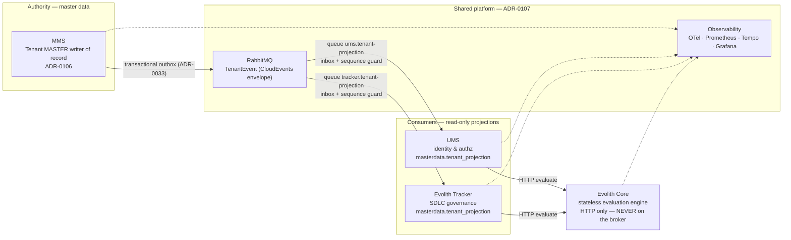
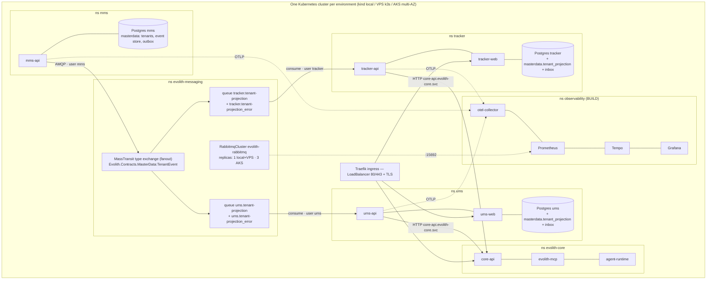

> **Bilingual Navigation:** [Ver versión en Español](./evolith-suite-deployment-strategy.es.md)

# Evolith Suite — Deployment Strategy (Single-Cluster Kubernetes)

> **Status:** Proposed (BMAD consolidated) · **Owner:** Evolith Architecture Board
> **Authority:** [ADR-0107](../../../reference/core/architecture/adrs/core/0107-single-cluster-kubernetes-deployment-topology.md) (single-cluster topology) · [ADR-0106](../../../reference/core/architecture/adrs/core/0106-master-tenant-context-projections.md) (tenant projections) · canonical flow design: `mms/docs/architecture/tenant-master-data-projection.md`
> **Method:** produced by a BMAD multi-agent analysis — Winston (Architect), DevOps expert, Infrastructure expert — grounded in the real state of the four repos (evolith, mms, ums, evolith_tracker), then adversarially verified by grounding/completeness/operational critics. Verified corrections are folded in (see §5, §15).
> **Date:** 2026-07-09

---

## 1. Consolidated BMAD recommendation (one decision per topic)

| Topic | Decision | Detail |
|---|---|---|
| Deployment topology | **One cluster per environment, namespace-per-product** (ADR-0107 — not re-litigated) | §4 |
| Environments | **local kind → staging (VPS k3s) → prod-VPS (k3s/Coolify, GT-448) and prod-AKS (growth path)** | §4 |
| GitOps | **Flux CD v2** + Helm charts as OCI in GHCR (fits solo-founder + 7.8 GB VPS; Argo CD rejected for footprint/unused UI) | §9 |
| Broker | **Shared RabbitMQ per cluster** (Cluster Operator; quorum only where ≥3 nodes) | §5 |
| Broker topology ownership | **MassTransit owns message topology** (exchanges/queues/bindings); Topology-Operator CRDs only for **Users/Permissions/Policies** — the current `tenant-topology.yaml` exchange/queue CRDs are **retired** (they were dead weight and a declare-conflict risk; see §5) | §5 |
| Message distribution | **Fanout via MassTransit type-exchange** → one endpoint queue per consumer group. `x-consistent-hash` is **never** a pub/sub tool (it splits traffic) — only a per-consumer-group partitioning tool if ever needed | §5 |
| Poison messages | **MassTransit `<queue>_error` convention** — alert on `_error` depth; broker DLX CRDs retired | §5 |
| DB | **DB-per-product**; local StatefulSet → CNPG (VPS) → Azure Database for PostgreSQL Flexible Server (AKS) | §8 |
| Secrets | K8s Secrets (local) → **OpenBao + ESO** (VPS) → **Azure Key Vault + CSI** (AKS); same Secret names so charts never change | §7 |
| Ingress | **Traefik everywhere** (Core+Tracker charts already use IngressRoute; k3s bundles it; UMS chart rebuilt onto the Tracker template set) · 1 public IP + host routing · cert-manager + Let's Encrypt | §7 |
| Deployment strategy | **RollingUpdate everywhere** (`maxSurge:1, maxUnavailable:0` + PDB); no blue-green/canary until real traffic + SLO dashboards exist | §10 |
| Contract | Shared **`Evolith.Messaging.Contracts`** NuGet (package id), C# namespace stays **`Evolith.Contracts.MasterData`** (MassTransit routes by namespace+type); expand-contract; **one schema major per consumer** | §11 |
| Ownership migration | Five gated phases **M0–M4** (plumb → backfill → freeze writers → switch reads → contract) | §12 |
| Promotion gates | **G0–G4 ladder**; G3 = the existing Evolith gate machinery (`smart-cli gate evaluate -p qa`, gate-F4 "RC Stamped") | §13 |
| Probes | **Readiness NEVER gates on AMQP** — broker outage degrades freshness, it must not drain the HTTP fleet | §5.4 |

### Coverage matrix (user request → section)

| # | Item | Section |
|---|---|---|
| 1 | Deployment architecture | §2, §3, §4 |
| 2 | Environment strategy | §4 |
| 3 | Same vs separate cluster | §4.1 |
| 4 | Per-system isolation | §6 |
| 5 | RabbitMQ dependency strategy | §5 |
| 6 | Deploy strategy (rolling/bg/canary) | §10 |
| 7 | Namespaces/config/secrets/observability | §6, §7, §14 |
| 8 | Cluster design & typologies | §4 |
| 9 | Ingress/networking/IPs/DNS/TLS/policies | §7 |
| 10 | Pre-production validations | §13 |
| 11 | How-to | §16 |

---

## 2. Conceptual map



## 3. Technical map



---

## 4. Environments & cluster typologies

### 4.1 One cluster per environment (never mix staging and prod)

Multi-cluster-per-product is **rejected**: it forces RabbitMQ federation/shovel across clusters (breaking the single-hop messaging model), costs 3–4× ops burden at this team size, is not physically viable on the GT-448 VPS, and its only real payoff (billing separation) is covered on AKS by the `evolith.dev/product` namespace labels that already exist in `deploy/kubernetes/namespaces.yaml`.

| | local (kind) | staging (VPS k3s) | prod-VPS (k3s/Coolify) | prod-AKS |
|---|---|---|---|---|
| Nodes | 1 (`deploy/kubernetes/kind-cluster.yaml`) | 1 | 1–2 (RAM-bound: 7.8 GB class) | system 2×B2s + user 3×D4as_v5 across 3 AZs, autoscaler 3→6 |
| CNI | **Cilium** (install with `disableDefaultCNI: true` — kindnet does not enforce NetworkPolicy; parity with AKS) | k3s default or Cilium | idem | Azure CNI Overlay + **Cilium** dataplane |
| RabbitMQ | replicas **1** (values overlay) | replicas 1, 5Gi PV | replicas **1** (3 replicas on one node is fake HA and triples RAM; quorum=3 only at ≥3 nodes) | replicas 3, zone anti-affinity, ZRS PVs |
| Postgres | in-cluster StatefulSet per product | **CloudNativePG** per product + off-node WAL/base backups (S3-compatible) | idem | **Azure Database for PostgreSQL Flexible Server** per product (zone-redundant for MMS — master authority; burstable for projections) |
| Storage class | kind default | local-path | local-path + mandatory off-node backups | managed-csi / premium+ZRS for broker & DB |
| TLS | none/mkcert | cert-manager + LE staging issuer | cert-manager + LE prod | cert-manager + LE prod |
| Secrets | plain K8s Secrets | OpenBao + ESO | OpenBao + ESO (GT-112) | Azure Key Vault + CSI + workload identity |

**Promotion rule:** an image is built **once** (GHCR), promoted **by digest** local → staging → prod. Never rebuilt per environment. Config drift lives only in `values-<env>.yaml` committed next to each chart.

### 4.2 HA posture per environment (explicit)

- **prod-VPS: no HA by design.** Availability = fast restore: CNPG PITR + off-node WAL, broker quorum-of-1 on durable PVs, documented RTO (≤30 min) / RPO (≤5 min via WAL). The MMS **outbox** makes broker downtime lossless for producers; consumers catch up. **Trigger to real HA:** ≥3 nodes → broker replicas 3 + CNPG replicas.
- **prod-AKS: the real HA tier.** 3-AZ node spread, broker quorum 3 with zone anti-affinity, zone-redundant MMS Postgres.

### 4.3 Sizing (requests/limits — derive namespace ResourceQuotas from this)

| Component | requests (VPS) | limits (VPS) | AKS |
|---|---|---|---|
| mms-api | 100m / 128Mi | 500m / 384Mi | 250m/256Mi → 1/512Mi |
| ums-api | 150m / 256Mi | 750m / 768Mi | 500m/512Mi → 1/1Gi |
| ums-web / tracker-web (nginx) | 25m / 32Mi | 100m / 64Mi | idem |
| tracker-api | 150m / 256Mi | 750m / 768Mi | 500m/512Mi → 1/1Gi |
| core-api + mcp + agent-runtime (each) | 100m / 192Mi | 500m / 512Mi | 250m/256Mi → 1/768Mi |
| Postgres ×3 (in-cluster) | 100m / 256Mi each | 500m / 512Mi each | managed (n/a) |
| RabbitMQ (replicas 1) | 250m / 512Mi | 1 / 1Gi | ×3 @ 500m/1Gi → 1/2Gi |
| Observability (min profile) | 300m / 1Gi total | 1 / 2Gi total | full profile 2 / 4Gi |
| **Total (VPS, requests)** | **≈1.6 vCPU / ≈3.6 GiB** | fits 2 vCPU / 7.8 GB with headroom | — |

---

## 5. Messaging architecture (verified corrections — read this section first)

The adversarial verification found that the previously-declared CRD topology **does not match how MassTransit actually moves messages**. Three verified defects and their resolutions:

### 5.1 ✂️ `x-consistent-hash` cannot fan out (critical, fixed by design change)
A consistent-hash exchange routes each message to **exactly one** bound queue — with `ums.tenant-projection` and `tracker.tenant-projection` both bound, each event would reach **either** UMS **or** Tracker (~50/50 by tenantId hash), never both. **Rule:** consistent-hash is a *partitioning tool inside one consumer group*, never a pub/sub distribution tool. Fan-out needs a fanout/topic exchange with one binding per consumer group.

### 5.2 ✂️ MassTransit owns the message topology (critical, decision)
MassTransit auto-declares a **fanout type-exchange** (`Evolith.Contracts.MasterData:TenantEvent`) and binds each consumer endpoint's exchange/queue to it — that is the topology the validated E2E actually flowed through; the CRD exchange was dead weight, and CRD-pre-created queues with DLX arguments would make MassTransit's re-declare fail (`406 PRECONDITION_FAILED` → endpoint faults forever while the pod stays Ready — the classic silent 3 a.m. failure).

**Decision — embrace MassTransit conventions:**
- **Retire** the `Exchange`/`Queue`/`Binding` CRDs in `deploy/kubernetes/messaging/tenant-topology.yaml` for the message path.
- **Keep** Topology-Operator CRDs for what MassTransit cannot declare: per-product **`User`/`Permission`** (and optional `Policy`) CRDs.
- Consumer endpoint names stay pinned in code (`ums.tenant-projection`, `tracker.tenant-projection` consumer definitions).
- Broker permissions as **regex over naming prefixes** (verb-only grants break MassTransit startup): `mms` → configure/write on `^(Evolith\.Contracts\.MasterData.*|mms\..*)$`; `ums` → configure/write/read on `^(ums\..*|Evolith\.Contracts\.MasterData.*)$`; `tracker` symmetric.

### 5.3 ✂️ Poison messages land in `<queue>_error`, not a DLX (major, decision)
After retries are exhausted MassTransit **moves** the faulted message to `<queue>_error` — it never nacks, so broker `x-dead-letter-exchange` never fires. **Decision:** adopt the MassTransit convention — alert on `ums.tenant-projection_error` / `tracker.tenant-projection_error` depth > 0; the reprocess runbook shovels from `_error` back to the main queue; the DLX/DLQ CRDs are retired with §5.2.

### 5.4 Probe rule (resolved contradiction)
**`/health/ready` checks the product's own DB only. Broker connectivity NEVER gates readiness** — the projection consumers live inside `ums-api`/`tracker-api`; gating readiness on AMQP would turn any broker outage into a full suite HTTP outage (auth included). Broker health is a separate degraded-mode signal: metric + alert (`bus disconnected`, `projection lag`).

### 5.5 P0 consumer-correctness code fixes (verified defects in current code)
1. **Inbox not actually wired:** both repos call `AddEntityFrameworkOutbox<TenantProjectionDbContext>()` at bus level but the consumer definitions never call `endpointConfigurator.UseEntityFrameworkOutbox<TenantProjectionDbContext>(context)` — `InboxState` exists but is never consulted. Add it in both `TenantProjectionConsumerDefinition`s.
2. **Read-check-write race:** the versioned upsert has no concurrency token; two in-flight events for one tenant can permanently regress the projection. Fix with a set-based conditional write: `INSERT … ON CONFLICT (tenant_id) DO UPDATE SET … WHERE tenant_projection.version < EXCLUDED.version` (cheapest; also removes a round-trip).
3. **Startup migrations race at replicas>1** (MMS `Program.cs` MigrateAsync, UMS/Tracker migrators): adopt Tracker's **migrate-Job** Helm-hook pattern (`evolith_tracker/product/infra/helm/evolith-tracker-api/templates/migrate-job.yaml`) suite-wide.
4. **`Default` vs `DefaultConnection` fallback bug** (UMS + Tracker DI): the projection context silently targets hardcoded localhost when `MasterDataDb` is unset — always set `ConnectionStrings__MasterDataDb` explicitly in charts and fix the fallback.

### 5.6 Dependency semantics
Producer: the MMS transactional outbox (validated live) makes broker outages **lossless** — writes commit, events drain on reconnect. Consumers: idle and catch up. Broker outage degrades **freshness only, never correctness**. No init-container ordering, no startup waits.

---

## 6. Per-system isolation matrix

| Axis | Decision |
|---|---|
| DB | DB-per-product; `masterdata` schema per repo (MMS master; UMS/Tracker projection) — no cross-product DB access, enforced by NetworkPolicy + distinct credentials |
| Config | One ConfigMap per product namespace, rendered by its own chart; standardized keys: `DefaultConnection`, `MasterDataDb`, `RabbitMq` |
| Secrets | `<product>-db`, `<product>-broker` per namespace; **per-product broker users** via CRDs (shared `default-user` rejected: one leak = suite-wide blast radius) |
| Compute | ResourceQuota + LimitRange per ns (values in §4.3); HPA per deployment; PDB `minAvailable:1` where replicas≥2 |
| Monitoring | ServiceMonitor + PrometheusRule per product, shipped **inside its chart**, discovered by shared Prometheus via `evolith.dev/product` label |
| Logs | stdout JSON → Alloy/Promtail → Loki (namespace label) |
| Traces | OTel SDK → shared collector → Tempo; `correlationId` from the envelope is the join key; UMS must add `AddSource("MassTransit")`; MMS must propagate incoming `traceparent` |
| Health | `/health/live` (process) + `/health/ready` (own DB only — §5.4) |
| Releases | One Helm release per product; umbrella chart local-only (ADR-0107 §6) |

## 7. Ingress, networking, DNS, TLS, NetworkPolicies

- **Traefik everywhere** (Core + Tracker charts already template `IngressRoute`; the VPS already runs Traefik under Coolify; k3s bundles it — disable bundled, install the pinned chart). UMS's disabled-by-default Gateway-API `httproute.yaml` is retired when the UMS chart is rebuilt on the Tracker template set. Traefik v3 also implements Gateway API — no door closed.
- **Exposure: 1 public IP + host-based routing** (per-service IPs rejected — cost + DNS sprawl, no isolation gain). Hosts: `mms|ums|tracker|core.<zone>`; local `*.evolith.local` in /etc/hosts; staging `*.stg.<zone>`; keep `product/infra/deployment-topology.md` as the canonical name map.
- Internal east-west: ClusterIP + cluster DNS only — broker `evolith-rabbitmq.evolith-messaging.svc:5672`, Core `core-api.evolith-core.svc`. Only user-facing frontends/APIs get IngressRoutes. ⚠️ **MMS tenant CRUD has no authentication today — authN is a hard precondition to any ingress exposure of MMS.**
- **NetworkPolicy: default-deny ingress+egress per product namespace**, explicit allows: `{mms,ums,tracker}→evolith-messaging:5672` · `{ums,tracker}→evolith-core:HTTP` · `ingress→products:8080` · `observability→all:metrics` · `each product→own DB:5432` · `all→kube-dns:53` (+ OTLP 4317, cert-manager solver). **Structural rule: `evolith-core` gets NO path to 5672** — "Core never on the broker" enforced by the network. Local kind must run **Cilium** or the whole model is silently unenforced (§4.1).

## 8. Persistence & backups

| Env | Product DBs | Broker |
|---|---|---|
| local | StatefulSet per product (fix UMS chart's `emptyDir` Postgres → PVC) | 1 replica, PV |
| staging / prod-VPS | **CloudNativePG** per product; scheduled base backups + WAL archiving **off-node** (MinIO/Backblaze). An unmanaged StatefulSet with no backup story is not production | 1 replica, durable PV |
| prod-AKS | **Flexible Server** per product (zone-redundant for MMS) | 3 replicas, premium ZRS |

## 9. CI/CD & GitOps (Flux CD v2)

- **Fleet repo:** `evolith/deploy/kubernetes/` grows `clusters/{local,staging,prod-vps,prod-aks}/` — one `HelmRelease` per product chart; the umbrella chart lives only under `clusters/local/` and is **never** a Flux target.
- **Image tags:** immutable `sha-<7>` on every merge to develop **plus an orderable tag `develop-<sha>-<unix-ts>`** — Flux ImagePolicy cannot order bare sha tags; staging automation keys on the timestamp pattern (`^develop-[a-f0-9]+-(?P<ts>[0-9]+)`, numerical asc). Release tags `X.Y.Z`. Registry: `ghcr.io/beyondnetcode/*`.
- **Charts:** SemVer per chart, published as OCI to `ghcr.io/beyondnetcode/charts/`.
- **Staging:** auto-bump by Flux Image Automation (git commit back = audit trail). **Prod:** exact chart + exact image pinned via PR to the fleet repo; the PR *is* the promotion event; the gate-F4 stamp is a required status check.
- **Pipelines per repo (corrected baseline):** UMS **has** CI (build/test, SonarCloud, security, release-candidate, contract-validation workflows) and Tracker **has** CI (build+test with real Postgres, contract-conformance); **MMS has none**. BUILD: MMS full pipeline; image build+push + chart-publish + Trivy jobs in all four repos; Core's `docker-images.yml` extended with develop-sha builds.

```
PR ──G0──▶ develop ──▶ GHCR (sha + develop-sha-ts) ──▶ Flux bumps staging (auto)
   nightly G1 (ephemeral kind: matrix F1–F7) ── staging soak G2 (R/P/S rows, 24h zero-drift)
   ──▶ smart-cli gate evaluate -p qa ──G3 F4 stamp──▶ tag vX.Y.Z ──▶ PR to clusters/prod-* ──▶ Flux ──G4──▶ healthy | git-revert
```

## 10. Deployment strategy & rollback

| Component | Strategy | Notes |
|---|---|---|
| Stateless APIs | RollingUpdate `maxSurge:1,maxUnavailable:0` + PDB | Precondition: real `/health` endpoints in MMS (today probes hit `/openapi/v1.json`, Development-only → prod CrashLoop) |
| Web SPAs | RollingUpdate | tracker-web's envsubst upstream pattern is the reference |
| Projection consumers | Deploy freely — queue buffers; **ConcurrentMessageLimit/order handled by the §5.5 conditional upsert** | Scale-out later via per-group hash partitions, never by assuming order across competing consumers |
| Postgres / RabbitMQ | Operator-managed; never in product pipelines | Topology changes additive-only |
| Event schema | Expand-contract on the wire (§11) | Consumers first for additive; dual-publish for breaking |
| EF migrations | **Migrate-Job Helm hook** (Tracker pattern) — never at startup | §5.5 |
| Rollback | `git revert` fleet-repo pin → Flux reconciles previous | `helm rollback` = break-glass only, then re-align git. **Never roll back across a contract migration**; restore-from-backup is the DR path. Consumer rollback is safe by construction (inbox + sequence guard); MMS event-store is the re-hydration path |
| Blue-green / canary | **Not yet** — no signal to analyze at 1–3 replicas without MassTransit OTel spans; revisit on AKS with live SLO dashboards | — |

## 11. Contract & event versioning

- **Package:** `Evolith.Messaging.Contracts` (NuGet, published from the MMS repo). **The C# namespace inside stays `Evolith.Contracts.MasterData`** — MassTransit routes by namespace+type; the namespace *is* the wire contract. Replaces the three verbatim copies.
- **Additive** change (new optional field): minor bump; consumers are tolerant readers; **deploy consumers first, producer last**.
- **Breaking** change: new major → **new event type**; MMS **dual-publishes** during the window; **a consumer version subscribes to EXACTLY ONE schema major** (never both — two message ids with the same `sequence` make the guard nondeterministically drop v2 data). Producer-side contract test: v2.data ⊇ v1.data.
- **Registry = git + CI:** committed JSON fixtures; producer serializes and snapshot-compares; consumers deserialize the same fixtures through their real path. A registry server (Apicurio, etc.) is rejected until ≥3 event families.
- Ordering/idempotency invariants (`sequence` monotonic per tenant, `id` unique, `subject`=tenantId) are part of the contract; changing them is breaking by definition.

## 12. Tenant ownership migration (the #1 architectural risk) — M0–M4

Two-writer state today: UMS (`CreateTenantCommand` + `TenantEndpoints`) and Tracker (`CreateTenantCommandHandler`) still author tenants locally against MMS mastership. (Tracker's `DevTenantSeedHostedService` is **already environment-gated inside the service** — verify only, not a production vector.)

| Phase | Action | Exit gate |
|---|---|---|
| M0 — Plumb | Broker + MasterDataDb wiring in ums/tracker charts; commit UMS DI gating; fix `Default` fallbacks; apply §5.5 fixes | Matrix F1–F3 green on kind |
| M1 — Backfill | Export existing local tenants → `POST /tenants` on MMS (MMS becomes ID authority; keep local→master ID map); event-store replays into projections | Reconciliation: projections == MMS, zero drift |
| M2 — Freeze writers | Feature-flag OFF the UMS/Tracker tenant write paths; creation only via MMS | No local tenant INSERTs for 7 days |
| M3 — Switch reads | Authz (UMS) and governance boundary (Tracker) read from `masterdata.tenant_projection` | 24 h zero-drift reconciliation |
| M4 — Contract | Delete local write paths, then local aggregates; tenant-scoped satellite data re-keyed to master tenantId | ADR-0083 / T-037 → Accepted |

Interim rule: between M0 and M2, local tenant creation is dev/demo-only by policy.

## 13. Gate ladder (G0–G4)

| Gate | Where | Blocks | Checks |
|---|---|---|---|
| G0 — CI | every PR per repo | merge | build, unit, **contract tests**, Trivy, CodeQL. *(UMS/Tracker partially EXISTS; MMS BUILD)* |
| G1 — Integration | nightly, ephemeral kind (substrate + umbrella) | staging | **matrix F1–F7 automated** + assertions the critics demanded: consumer endpoint *started* (bus health, not just pod Ready), InboxState row written on consume, an allowed AND a denied NetworkPolicy path |
| G2 — Staging soak | ≥24 h per RC | RC candidacy | R1–R6 resilience (broker kill → outbox drains; consumer kill → catch-up; poison → `_error` → reprocess), P1–P3 perf budgets, 24 h zero-drift reconciliation, dashboards+alerts live |
| G3 — RC Stamped | `smart-cli gate evaluate -p qa` (gate-F4) | prod PR | Test Summary, Acceptance, Security scan, Integration evidence, Pyramid — the F4 stamp is a required check on the prod fleet-repo PR |
| G4 — Post-deploy | prod, after Flux reconcile | marks healthy / triggers rollback | smoke: health all pods; synthetic tenant create → projection visible in UMS+Tracker within lag SLO → deactivate; `_error` depth unchanged; 30-min error-rate window |

Hard rules: contract migrations never ship with features · consumer-first ordering for additive changes · no prod promotion of tenant-projection features until the ownership migration (M-phases) is scheduled.

## 14. Observability

Stack (ns `observability`, BUILD — configs already exist under `product/operations/`, nothing ships them yet): kube-prometheus-stack + Loki (single-binary) + Tempo + OTel Collector; Grafana provisioning, Prometheus alerts, Tempo config reused from `product/operations/{grafana,alerts,otel,tempo}`. VPS profile: single-replica, 7d metrics/3d traces; AKS: ZRS PVCs, 30d.

Per-product code deltas (BUILD, prerequisites for G2): MMS has zero OTel; UMS `ObservabilityExtensions` misses `AddSource("MassTransit")` (consumer spans invisible); Tracker consumer is ILogger-only. Standard meters: `masterdata_projection_applied/discarded_total`, `consumer lag`, `_error` queue depth, e2e latency histogram (per the canonical design §11).

## 15. Consolidated risk register (deduplicated, verified)

| # | Risk | Sev | Owner | Mitigation | Phase |
|---|---|---|---|---|---|
| 1 | Two-writer tenant ownership (UMS/Tracker still author) | 🔴 | Winston | M0–M4 ladder (§12) | M-phases |
| 2 | ~~Consistent-hash exchange splits traffic between consumers~~ **fixed by §5.2 decision** | 🔴→✅ | Arch | MassTransit-owned fanout topology | done in doc; CRD retirement BUILD |
| 3 | CRD/code queue-declare conflict (406 → silent dead consumer) | 🔴 | Arch | retire queue CRDs (§5.2); G1 asserts endpoint *started* | M0 |
| 4 | Inbox dedup not wired in consumers | 🟠 | DevOps | `UseEntityFrameworkOutbox` on endpoints (§5.5-1) + G1 InboxState assert | M0 |
| 5 | Projection concurrency race (permanent regression) | 🟠 | DevOps | conditional set-based upsert (§5.5-2) | M0 |
| 6 | MMS probes require Development env → prod CrashLoop | 🟠 | Infra | real `/health` endpoints before first staging deploy | pre-staging |
| 7 | `Default`/`DefaultConnection` fallback → consumers silently on localhost | 🟠 | Infra | fix fallback + explicit `MasterDataDb` in charts | M0 |
| 8 | Startup migrations race at replicas>1 | 🟠 | Infra | migrate-Job pattern suite-wide | pre-staging |
| 9 | Poison-message alerts watching the wrong queue (DLX vs `_error`) | 🟠 | Infra | `_error`-depth alerts + shovel runbook (§5.3) | pre-staging |
| 10 | Broker = shared critical dependency | 🟠 | Infra | outbox (proven) + quorum where ≥3 nodes + freshness-only degradation (§5.6) | standing |
| 11 | Plaintext creds in mms-helm values; shared default-user | 🟡 | Infra | per-product broker users (CRDs) + ESO/AKV | pre-staging |
| 12 | Contract drift across 3 TenantEvent copies | 🟡 | DevOps | `Evolith.Messaging.Contracts` + G0 contract tests | M0–M1 |
| 13 | kind CNI doesn't enforce NetworkPolicies (parity trap) | 🟡 | Infra | Cilium on kind + G1 allow/deny assertions | pre-staging |
| 14 | MMS tenant CRUD has no authN | 🟡 | Arch | authN before any ingress exposure | pre-staging |
| 15 | Consumer behavior unobservable (no MassTransit traces/meters) | 🟡 | Infra | §14 code deltas as G2 prerequisite | pre-staging |

## 16. Prioritized BUILD backlog

**P0 (blocks any staging):** retire message-path CRDs + per-product broker Users/Permissions · §5.5 consumer fixes (inbox wiring, conditional upsert, migrate-Jobs, `Default` fallback) · MMS health endpoints · commit UMS DI gating · MMS CI pipeline · explicit `MasterDataDb`/`RabbitMq` in ums/tracker charts.
**P1 (blocks prod):** `Evolith.Messaging.Contracts` package + contract tests · observability stack deploy + code deltas · NetworkPolicies + Quotas + Cilium-on-kind · secrets to ESO/OpenBao · Flux bootstrap + `clusters/*` overlays + orderable image tags · G1 automation (matrix F1–F7 + the three new assertions) · CNPG + off-node backups · rebuild ums-helm on Tracker template set · re-home Core charts to `evolith-core` ns values.
**P2 (hardening/growth):** AKS overlay (Terraform/Bicep + AKV CSI + Flexible Servers) · umbrella chart local E2E · pod hardening (non-root, RO rootfs) · SLO dashboards → revisit canary · external-dns · weekly `_error` review task.

## 17. How-to (16 steps)

| # | Step | Commands / assets |
|---|---|---|
| 1 | kind cluster (Cilium) | `kind create cluster --config deploy/kubernetes/kind-cluster.yaml` (+ `disableDefaultCNI` + Cilium install) |
| 2 | Namespaces | `kubectl apply -f deploy/kubernetes/namespaces.yaml` |
| 3 | Broker | Cluster-Operator install; `kubectl apply -f deploy/kubernetes/messaging/rabbitmq-cluster.yaml` (+ replicas overlay); per-product `User`/`Permission` CRDs (BUILD) |
| 4 | Core | re-valued `evolith-core-api|mcp|agent-runtime` charts (`product/infra/helm/`, `local-test.sh` builds/loads) → ns `evolith-core` |
| 5 | MMS | `helm upgrade -i mms mms/infra/mms-helm -n mms -f values-local.yaml` (after health-endpoint fix) |
| 6 | UMS | rebuilt ums-helm (Tracker template set) with `ConnectionStrings__RabbitMq` + `__MasterDataDb`; DI gating committed |
| 7 | Tracker | `evolith_tracker/product/infra/helm/*` charts + the two connection keys in secret.yaml |
| 8 | Ingress/DNS/TLS | pinned Traefik chart + cert-manager + IngressRoutes; `/etc/hosts` `*.evolith.local` |
| 9 | Databases | per-product Postgres (StatefulSet local); run migrate-Jobs |
| 10 | Secrets/config | local plain Secrets; standardized connection keys; fallback bug fixed |
| 11 | Observability | new `deploy/kubernetes/observability/` shipping kube-prometheus-stack/Loki/Tempo/OTel from `product/operations/` configs |
| 12 | Integration tests | automate matrix F1–F7 (projection rows in UMS+Tracker DBs) |
| 13 | RabbitMQ validation | R1–R6: broker kill → outbox drains; consumer kill → catch-up; poison → `_error` → shovel back; mgmt UI :30672 |
| 14 | Pre-staging gates | matrix Musts green + dashboards + alerts + 24 h zero-drift |
| 15 | **Staging promotion** | 15a k3s on VPS (or Coolify-managed K8s); 15b Flux bootstrap (`flux bootstrap github …`), apply `clusters/staging/`; 15c ESO + OpenBao (`ClusterSecretStore` + `ExternalSecret` per ns); 15d LE **staging** issuer + `*.stg` DNS; 15e values-staging (replicas 1, quotas §4.3); 15f run G2 soak checklist |
| 16 | **Production prep** | **16a prod-VPS:** GT-447/448 sequence — k3s + Coolify, `clusters/prod-vps/` pins exact versions, CNPG + off-node WAL, LE prod issuer, NetworkPolicies + Quotas enforced, runbooks `product/operations/incident-response-*.md` (service-outage, production-rollback, data-breach, dependency-cve). **16b prod-AKS:** Terraform/Bicep cluster (3 AZ, 2 pools) + AKV + CSI + workload identity + Flexible Server per product + static LB IP + `clusters/prod-aks/`; same charts, `values-aks` |

## 18. References

ADR-0106 · ADR-0107 · ADR-0033 · `mms/docs/architecture/tenant-master-data-projection.md` (canonical flow) + `tenant-projection-test-matrix.md` · `deploy/kubernetes/README.md` (substrate bring-up) · `product/infra/deployment-topology.md` (canonical name map) · `product/infra/helm/README.md` (Core charts) · `product/infra/vps-coolify/README.md` · `product/operations/` (alerts, grafana, otel, tempo, load-tests, incident-response runbooks) · UMS ADR-0083 · Tracker ADR T-037.
