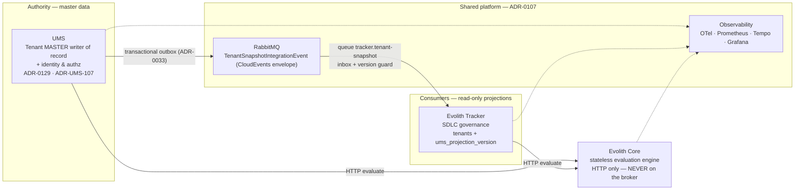
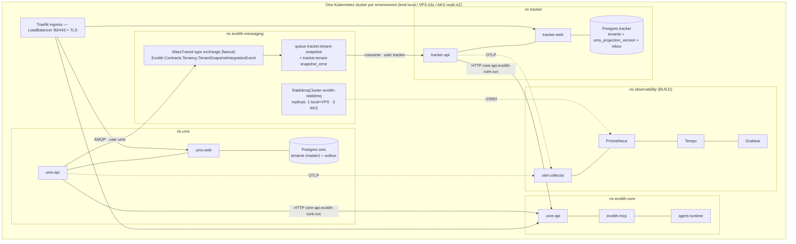

> **Bilingual Navigation:** [Ver versión en Español](./evolith-suite-deployment-strategy.es.md)

# Evolith Suite — Deployment Strategy (Single-Cluster Kubernetes)

> **Status:** Proposed (BMAD consolidated) · **Owner:** Evolith Architecture Board
> **Authority:** [ADR-0107](../../../reference/core/architecture/adrs/core/0107-single-cluster-kubernetes-deployment-topology.md) (single-cluster topology) · [ADR-0129](../../../reference/core/architecture/adrs/core/0129-ums-is-the-tenant-master.md) (the tenant master is UMS) · satellite decisions: ADR-UMS-107 (emitter) and T-059 (consumer)
> **Method:** produced by a BMAD multi-agent analysis — Winston (Architect), DevOps expert, Infrastructure expert — grounded in the real state of the repos, then adversarially verified by grounding/completeness/operational critics. Verified corrections are folded in (see §5, §15).
> **Date:** 2026-07-09 · **Rebased on the three-product suite:** 2026-08-23

> **What changed on 2026-08-23.** This plan was written for four products, one of which — **MMS** — never existed. ADR-0106 named it the tenant master; ADR-0129 supersedes that, and the two satellites had already moved: UMS owns and publishes the tenant (ADR-UMS-107), the Tracker consumes it (T-059). Everything MMS-shaped is gone from this document: its namespace, its database, its CI pipeline, its risks, and the M0–M4 ownership migration that existed to hand it authority it was never going to hold. The messaging §5 is redrawn around **one** producer and **one** consumer queue.

---

## 1. Consolidated BMAD recommendation (one decision per topic)

| Topic | Decision | Detail |
|---|---|---|
| Deployment topology | **One cluster per environment, namespace-per-product** (ADR-0107 — not re-litigated) | §4 |
| Environments | **local kind → staging (VPS k3s) → prod-VPS (k3s/Coolify, GT-448) and prod-AKS (growth path)** | §4 |
| GitOps | **Flux CD v2** + Helm charts as OCI in GHCR (fits solo-founder + 7.8 GB VPS; Argo CD rejected for footprint/unused UI) | §9 |
| Broker | **Shared RabbitMQ per cluster** (Cluster Operator; quorum only where ≥3 nodes) | §5 |
| Broker topology ownership | **MassTransit owns message topology** (exchanges/queues/bindings); Topology-Operator CRDs only for **Users/Permissions/Policies** — the current `tenant-topology.yaml` exchange/queue CRDs are **retired** (they were dead weight and a declare-conflict risk; see §5) | §5 |
| Message distribution | **Fanout via MassTransit type-exchange** → one endpoint queue per consumer group. `x-consistent-hash` is **never** a pub/sub tool (it splits traffic) — only a per-consumer-group partitioning tool if ever needed | §5 |
| Poison messages | **MassTransit `<queue>_error` convention** — alert on `_error` depth; broker DLX CRDs retired | §5 |
| DB | **DB-per-product**; local StatefulSet → CNPG (VPS) → Azure Database for PostgreSQL Flexible Server (AKS) | §8 |
| Secrets | K8s Secrets (local) → **OpenBao + ESO** (VPS) → **Azure Key Vault + CSI** (AKS); same Secret names so charts never change | §7 |
| Ingress | **Traefik everywhere** (Core+Tracker charts already use IngressRoute; k3s bundles it; UMS chart rebuilt onto the Tracker template set) · 1 public IP + host routing · cert-manager + Let's Encrypt | §7 |
| Deployment strategy | **RollingUpdate everywhere** (`maxSurge:1, maxUnavailable:0` + PDB); no blue-green/canary until real traffic + SLO dashboards exist | §10 |
| Contract | Namespace **`Evolith.Contracts.Tenancy`** — a SUITE namespace, not the emitter's, because MassTransit routes by namespace+type; expand-contract; **one schema major per consumer**. No package publishes it today: the type is duplicated verbatim in UMS and the Tracker | §11 |
| Ownership migration | **Closed 2026-08-22** by ADR-UMS-107 + T-059 — UMS was always the writer; the Tracker stopped authoring what UMS owns | §12 |
| Promotion gates | **G0–G4 ladder**; G3 = the existing Evolith gate machinery (`evolith-cli gate evaluate -p qa`, gate-F4 "RC Stamped") | §13 |
| Probes | **Readiness NEVER gates on AMQP** — broker outage degrades freshness, it must not drain the HTTP fleet | §5.4 |

### Coverage matrix (user request → section)

| # | Item | Section |
|---|---|---|
| 1 | Deployment architecture | §2, §3, §4 |
| 2 | Environment strategy | §4 |
| 3 | Same vs separate cluster | §4.1 |
| 4 | Per-system isolation | §6 |
| 5 | RabbitMQ dependency strategy | §5 |
| 6 | Deploy strategy (rolling/bg/canary) | §10 |
| 7 | Namespaces/config/secrets/observability | §6, §7, §14 |
| 8 | Cluster design & typologies | §4 |
| 9 | Ingress/networking/IPs/DNS/TLS/policies | §7 |
| 10 | Pre-production validations | §13 |
| 11 | How-to | §16 |

---

## 2. Conceptual map



## 3. Technical map



---

## 4. Environments & cluster typologies

### 4.1 One cluster per environment (never mix staging and prod)

Multi-cluster-per-product is **rejected**: it forces RabbitMQ federation/shovel across clusters (breaking the single-hop messaging model), costs 3–4× ops burden at this team size, is not physically viable on the GT-448 VPS, and its only real payoff (billing separation) is covered on AKS by the `evolith.dev/product` namespace labels that already exist in `deploy/kubernetes/namespaces.yaml`.

| | local (kind) | staging (VPS k3s) | prod-VPS (k3s/Coolify) | prod-AKS |
|---|---|---|---|---|
| Nodes | 1 (`deploy/kubernetes/kind-cluster.yaml`) | 1 | 1–2 (RAM-bound: 7.8 GB class) | system 2×B2s + user 3×D4as_v5 across 3 AZs, autoscaler 3→6 |
| CNI | **Cilium** (install with `disableDefaultCNI: true` — kindnet does not enforce NetworkPolicy; parity with AKS) | k3s default or Cilium | idem | Azure CNI Overlay + **Cilium** dataplane |
| RabbitMQ | replicas **1** (values overlay) | replicas 1, 5Gi PV | replicas **1** (3 replicas on one node is fake HA and triples RAM; quorum=3 only at ≥3 nodes) | replicas 3, zone anti-affinity, ZRS PVs |
| Postgres | in-cluster StatefulSet per product | **CloudNativePG** per product + off-node WAL/base backups (S3-compatible) | idem | **Azure Database for PostgreSQL Flexible Server** per product (zone-redundant for UMS — master authority; burstable for the Tracker's projection) |
| Storage class | kind default | local-path | local-path + mandatory off-node backups | managed-csi / premium+ZRS for broker & DB |
| TLS | none/mkcert | cert-manager + LE staging issuer | cert-manager + LE prod | cert-manager + LE prod |
| Secrets | plain K8s Secrets | OpenBao + ESO | OpenBao + ESO (GT-112) | Azure Key Vault + CSI + workload identity |

**Promotion rule:** an image is built **once** (GHCR), promoted **by digest** local → staging → prod. Never rebuilt per environment. Config drift lives only in `values-<env>.yaml` committed next to each chart.

### 4.2 HA posture per environment (explicit)

- **prod-VPS: no HA by design.** Availability = fast restore: CNPG PITR + off-node WAL, broker quorum-of-1 on durable PVs, documented RTO (≤30 min) / RPO (≤5 min via WAL). The UMS **outbox** makes broker downtime lossless for the producer; the consumer catches up. **Trigger to real HA:** ≥3 nodes → broker replicas 3 + CNPG replicas.
- **prod-AKS: the real HA tier.** 3-AZ node spread, broker quorum 3 with zone anti-affinity, zone-redundant UMS Postgres.

### 4.3 Sizing (requests/limits — derive namespace ResourceQuotas from this)

| Component | requests (VPS) | limits (VPS) | AKS |
|---|---|---|---|
| ums-api | 150m / 256Mi | 750m / 768Mi | 500m/512Mi → 1/1Gi |
| ums-web / tracker-web (nginx) | 25m / 32Mi | 100m / 64Mi | idem |
| tracker-api | 150m / 256Mi | 750m / 768Mi | 500m/512Mi → 1/1Gi |
| core-api + mcp + agent-runtime (each) | 100m / 192Mi | 500m / 512Mi | 250m/256Mi → 1/768Mi |
| Postgres ×2 (in-cluster) | 100m / 256Mi each | 500m / 512Mi each | managed (n/a) |
| RabbitMQ (replicas 1) | 250m / 512Mi | 1 / 1Gi | ×3 @ 500m/1Gi → 1/2Gi |
| Observability (min profile) | 300m / 1Gi total | 1 / 2Gi total | full profile 2 / 4Gi |
| **Total (VPS, requests)** | **≈1.4 vCPU / ≈3.1 GiB** | fits 2 vCPU / 7.8 GB with headroom | — |

---

## 5. Messaging architecture (verified corrections — read this section first)

The adversarial verification found that the previously-declared CRD topology **does not match how MassTransit actually moves messages**. Three verified defects and their resolutions:

### 5.1 `x-consistent-hash` cannot fan out (critical, fixed by design change)
A consistent-hash exchange routes each message to **exactly one** bound queue. With two consumer queues bound — the shape this plan assumed — each event would have reached **either** one **or** the other (~50/50 by tenantId hash), never both. The suite has one consumer today (`tracker.tenant-snapshot`), so the split cannot bite yet, and that is exactly why the rule is written down rather than deleted: it would bite silently the day a second consumer group binds. **Rule:** consistent-hash is a *partitioning tool inside one consumer group*, never a pub/sub distribution tool. Fan-out needs a fanout/topic exchange with one binding per consumer group.

### 5.2 MassTransit owns the message topology (critical, decision)
MassTransit auto-declares a **fanout type-exchange** (`Evolith.Contracts.Tenancy:TenantSnapshotIntegrationEvent`) and binds each consumer endpoint's exchange/queue to it — that is the topology the validated E2E actually flowed through; the CRD exchange was dead weight, and CRD-pre-created queues with DLX arguments would make MassTransit's re-declare fail (`406 PRECONDITION_FAILED` → endpoint faults forever while the pod stays Ready — the classic silent 3 a.m. failure).

**Decision — embrace MassTransit conventions:**
- **Retire** the `Exchange`/`Queue`/`Binding` CRDs in `deploy/kubernetes/messaging/tenant-topology.yaml` for the message path.
- **Keep** Topology-Operator CRDs for what MassTransit cannot declare: per-product **`User`/`Permission`** (and optional `Policy`) CRDs.
- The consumer endpoint name stays pinned in code (`tracker.tenant-snapshot`, in `TenantSnapshotConsumerDefinition`).
- Broker permissions as **regex over naming prefixes** (verb-only grants break MassTransit startup): `ums` → configure/write on `^(Evolith\.Contracts\.Tenancy.*|ums\..*)$`; `tracker` → configure/write/read on `^(tracker\..*|Evolith\.Contracts\.Tenancy.*)$`.

### 5.3 Poison messages land in `<queue>_error`, not a DLX (major, decision)
After retries are exhausted MassTransit **moves** the faulted message to `<queue>_error` — it never nacks, so broker `x-dead-letter-exchange` never fires. **Decision:** adopt the MassTransit convention — alert on `tracker.tenant-snapshot_error` depth > 0; the reprocess runbook shovels from `_error` back to the main queue; the DLX/DLQ CRDs are retired with §5.2.

### 5.4 Probe rule (resolved contradiction)
**`/health/ready` checks the product's own DB only. Broker connectivity NEVER gates readiness** — the projection consumers live inside `ums-api`/`tracker-api`; gating readiness on AMQP would turn any broker outage into a full suite HTTP outage (auth included). Broker health is a separate degraded-mode signal: metric + alert (`bus disconnected`, `projection lag`).

### 5.5 Consumer correctness — three of four defects are closed
This section listed four P0 defects found in the MMS-era consumers. T-059 rebuilt that consumer against the UMS snapshot and closed three of them; they are kept here because the *reasons* are what a future consumer has to satisfy, not because the work is open.

1. ~~**Inbox not actually wired**~~ — **closed**. `TenantSnapshotConsumerDefinition` now calls `endpointConfigurator.UseEntityFrameworkOutbox<TrackerDbContext>(context)` on the endpoint, which is what makes `InboxState` actually consulted; the bus-level `AddEntityFrameworkOutbox` never did. Same context the consumer writes to, so dedup and projection land in one transaction.
2. ~~**Read-check-write race**~~ — **closed**. The upsert is set-based and guarded: `ON CONFLICT (id) DO UPDATE … WHERE ums_projection_version < EXCLUDED.ums_projection_version`. The guard covers what the inbox cannot — redelivery after a restart and out-of-order delivery, which for a broker are normal behaviour.
3. **Startup migrations race at replicas>1** — **still open** for UMS and the Tracker: adopt Tracker's **migrate-Job** Helm-hook pattern (`evolith_tracker/product/infra/helm/evolith-tracker-api/templates/migrate-job.yaml`) suite-wide.
4. ~~**`Default` vs `DefaultConnection` fallback bug**~~ — **moot**. T-059 removed the separate `MasterDataDb` connection string; the projection lands in the Tracker's own schema, so there is no second context left to fall back to localhost.

### 5.6 Dependency semantics
Producer: the UMS transactional outbox (validated live) makes broker outages **lossless** — writes commit, events drain on reconnect. The consumer idles and catches up. Broker outage degrades **freshness only, never correctness**. No init-container ordering, no startup waits.

---

## 6. Per-system isolation matrix

| Axis | Decision |
|---|---|
| DB | DB-per-product (UMS holds the tenant master; the Tracker holds its projection in its own schema) — no cross-product DB access, enforced by NetworkPolicy + distinct credentials |
| Config | One ConfigMap per product namespace, rendered by its own chart; standardized keys: `DefaultConnection`, `RabbitMq` |
| Secrets | `<product>-db`, `<product>-broker` per namespace; **per-product broker users** via CRDs (shared `default-user` rejected: one leak = suite-wide blast radius) |
| Compute | ResourceQuota + LimitRange per ns (values in §4.3); HPA per deployment; PDB `minAvailable:1` where replicas≥2 |
| Monitoring | ServiceMonitor + PrometheusRule per product, shipped **inside its chart**, discovered by shared Prometheus via `evolith.dev/product` label |
| Logs | stdout JSON → Alloy/Promtail → Loki (namespace label) |
| Traces | OTel SDK → shared collector → Tempo; `correlationId` from the envelope is the join key; UMS must add `AddSource("MassTransit")` |
| Health | `/health/live` (process) + `/health/ready` (own DB only — §5.4) |
| Releases | One Helm release per product; umbrella chart local-only (ADR-0107 §6) |

## 7. Ingress, networking, DNS, TLS, NetworkPolicies

- **Traefik everywhere** (Core + Tracker charts already template `IngressRoute`; the VPS already runs Traefik under Coolify; k3s bundles it — disable bundled, install the pinned chart). UMS's disabled-by-default Gateway-API `httproute.yaml` is retired when the UMS chart is rebuilt on the Tracker template set. Traefik v3 also implements Gateway API — no door closed.
- **Exposure: 1 public IP + host-based routing** (per-service IPs rejected — cost + DNS sprawl, no isolation gain). Hosts: `ums|tracker|core.<zone>`; local `*.evolith.local` in /etc/hosts; staging `*.stg.<zone>`; keep `product/infra/deployment-topology.md` as the canonical name map.
- Internal east-west: ClusterIP + cluster DNS only — broker `evolith-rabbitmq.evolith-messaging.svc:5672`, Core `core-api.evolith-core.svc`. Only user-facing frontends/APIs get IngressRoutes.
- **NetworkPolicy: default-deny ingress+egress per product namespace**, explicit allows: `{ums,tracker}→evolith-messaging:5672` · `{ums,tracker}→evolith-core:HTTP` · `ingress→products:8080` · `observability→all:metrics` · `each product→own DB:5432` · `all→kube-dns:53` (+ OTLP 4317, cert-manager solver). **Structural rule: `evolith-core` gets NO path to 5672** — "Core never on the broker" enforced by the network. Local kind must run **Cilium** or the whole model is silently unenforced (§4.1).

## 8. Persistence & backups

| Env | Product DBs | Broker |
|---|---|---|
| local | StatefulSet per product (fix UMS chart's `emptyDir` Postgres → PVC) | 1 replica, PV |
| staging / prod-VPS | **CloudNativePG** per product; scheduled base backups + WAL archiving **off-node** (MinIO/Backblaze). An unmanaged StatefulSet with no backup story is not production | 1 replica, durable PV |
| prod-AKS | **Flexible Server** per product (zone-redundant for UMS) | 3 replicas, premium ZRS |

## 9. CI/CD & GitOps (Flux CD v2)

- **Fleet repo:** `evolith/deploy/kubernetes/` grows `clusters/{local,staging,prod-vps,prod-aks}/` — one `HelmRelease` per product chart; the umbrella chart lives only under `clusters/local/` and is **never** a Flux target.
- **Image tags:** immutable `sha-<7>` on every merge to develop **plus an orderable tag `develop-<sha>-<unix-ts>`** — Flux ImagePolicy cannot order bare sha tags; staging automation keys on the timestamp pattern (`^develop-[a-f0-9]+-(?P<ts>[0-9]+)`, numerical asc). Release tags `X.Y.Z`. Registry: `ghcr.io/beyondnetcode/*`.
- **Charts:** SemVer per chart, published as OCI to `ghcr.io/beyondnetcode/charts/`.
- **Staging:** auto-bump by Flux Image Automation (git commit back = audit trail). **Prod:** exact chart + exact image pinned via PR to the fleet repo; the PR *is* the promotion event; the gate-F4 stamp is a required status check.
- **Pipelines per repo (corrected baseline):** UMS **has** CI (build/test, SonarCloud, security, release-candidate, contract-validation workflows) and Tracker **has** CI (build+test with real Postgres, contract-conformance). BUILD: image build+push + chart-publish + Trivy jobs in all three repos; Core's `docker-images.yml` extended with develop-sha builds.

```
PR ──G0──▶ develop ──▶ GHCR (sha + develop-sha-ts) ──▶ Flux bumps staging (auto)
   nightly G1 (ephemeral kind: matrix F1–F7) ── staging soak G2 (R/P/S rows, 24h zero-drift)
   ──▶ evolith-cli gate evaluate -p qa ──G3 F4 stamp──▶ tag vX.Y.Z ──▶ PR to clusters/prod-* ──▶ Flux ──G4──▶ healthy | git-revert
```

## 10. Deployment strategy & rollback

| Component | Strategy | Notes |
|---|---|---|
| Stateless APIs | RollingUpdate `maxSurge:1,maxUnavailable:0` + PDB | Every surface answers `/health/live` + `/health/ready` (§5.4) |
| Web SPAs | RollingUpdate | tracker-web's envsubst upstream pattern is the reference |
| Projection consumer | Deploy freely — the queue buffers; **order is handled by the version-guarded upsert (§5.5-2)** | Scale-out later via per-group hash partitions, never by assuming order across competing consumers |
| Postgres / RabbitMQ | Operator-managed; never in product pipelines | Topology changes additive-only |
| Event schema | Expand-contract on the wire (§11) | Consumers first for additive; dual-publish for breaking |
| EF migrations | **Migrate-Job Helm hook** (Tracker pattern) — never at startup | §5.5 |
| Rollback | `git revert` fleet-repo pin → Flux reconciles previous | `helm rollback` = break-glass only, then re-align git. **Never roll back across a contract migration**; restore-from-backup is the DR path. Consumer rollback is safe by construction (inbox + version guard); UMS republishes the snapshot on the next tenant change, and its aggregate is the re-hydration path |
| Blue-green / canary | **Not yet** — no signal to analyze at 1–3 replicas without MassTransit OTel spans; revisit on AKS with live SLO dashboards | — |

## 11. Contract & event versioning

- **Namespace:** `Evolith.Contracts.Tenancy` — a SUITE namespace rather than the emitter's, because MassTransit routes by namespace+type; the namespace *is* the wire contract. **No package publishes it today.** `Unimar.Ums.Sdk.Contracts` carries package metadata but has never been published, so `TenantSnapshotIntegrationEvent` is duplicated verbatim in UMS and in the Tracker. Two copies of a type whose NAME is the routing key diverge silently: renaming a field breaks nothing at compile time in either repository and breaks everything at runtime. Publishing that package is the fix, and it belongs to those repos.
- **Additive** change (new optional field): minor bump; consumers are tolerant readers; **deploy consumers first, producer last**.
- **Breaking** change: new major → **new event type**; UMS **dual-publishes** during the window; **a consumer version subscribes to EXACTLY ONE schema major** (never both — two message ids with the same `sequence` make the guard nondeterministically drop v2 data). Producer-side contract test: v2.data ⊇ v1.data.
- **Registry = git + CI:** committed JSON fixtures; producer serializes and snapshot-compares; consumers deserialize the same fixtures through their real path. A registry server (Apicurio, etc.) is rejected until ≥3 event families.
- Ordering/idempotency invariants (`Version` monotonic per tenant — a database sequence, because an aggregate `RowVersion` does not order and a timestamp ties — `id` unique, `subject`=tenantId) are part of the contract; changing them is breaking by definition.

## 12. Tenant ownership — closed 2026-08-22

This section carried an M0–M4 ladder to move tenant authority from UMS and the Tracker **to MMS**. It is closed, and not because the ladder was climbed: MMS was never built, so the authority it was migrating toward never existed.

What actually happened, on 2026-08-22:

| Then (this plan) | Now |
|---|---|
| Two writers — UMS and the Tracker both author tenants locally | **UMS is the writer.** It always was: the aggregate, the five mutating commands and the endpoints live there (ADR-UMS-107) |
| M1 backfill: export local tenants to `POST /tenants` on MMS | Nothing to backfill — the master data never left UMS |
| M2/M3: freeze the local writers, switch reads to the projection | **Done by T-059**: `code`, `name`, `status` and the tenant's existence are written only by `TenantSnapshotConsumer`; `display_name`, `contact_email`, `tier`, `settings` and localisation stay the Tracker's, because UMS does not know them |
| M4: delete local write paths and aggregates | The Tracker's aggregate is deliberately **kept** — replacing it with a bare projection would lose the four fields above |

The one invariant worth carrying forward: the Tracker must not become a second tenant master. What guards it is not a migration phase but the write split above, plus the version guard in §5.5-2.

## 13. Gate ladder (G0–G4)

| Gate | Where | Blocks | Checks |
|---|---|---|---|
| G0 — CI | every PR per repo | merge | build, unit, **contract tests**, Trivy, CodeQL. *(UMS/Tracker partially EXISTS)* |
| G1 — Integration | nightly, ephemeral kind (substrate + umbrella) | staging | **matrix F1–F7 automated** + assertions the critics demanded: consumer endpoint *started* (bus health, not just pod Ready), InboxState row written on consume, an allowed AND a denied NetworkPolicy path |
| G2 — Staging soak | ≥24 h per RC | RC candidacy | R1–R6 resilience (broker kill → outbox drains; consumer kill → catch-up; poison → `_error` → reprocess), P1–P3 perf budgets, 24 h zero-drift reconciliation, dashboards+alerts live |
| G3 — RC Stamped | `evolith-cli gate evaluate -p qa` (gate-F4) | prod PR | Test Summary, Acceptance, Security scan, Integration evidence, Pyramid — the F4 stamp is a required check on the prod fleet-repo PR |
| G4 — Post-deploy | prod, after Flux reconcile | marks healthy / triggers rollback | smoke: health all pods; synthetic tenant create in UMS → projection visible in the Tracker within lag SLO → deactivate; `_error` depth unchanged; 30-min error-rate window |

Hard rules: contract migrations never ship with features · consumer-first ordering for additive changes · the tenant write split (§12) is an invariant, not a milestone — a governed action that writes `code`/`name`/`status` in the Tracker is a regression whatever else is green.

## 14. Observability

Stack (ns `observability`, BUILD — configs already exist under `product/operations/`, nothing ships them yet): kube-prometheus-stack + Loki (single-binary) + Tempo + OTel Collector; Grafana provisioning, Prometheus alerts, Tempo config reused from `product/operations/{grafana,alerts,otel,tempo}`. VPS profile: single-replica, 7d metrics/3d traces; AKS: ZRS PVCs, 30d.

Per-product code deltas (BUILD, prerequisites for G2): UMS `ObservabilityExtensions` misses `AddSource("MassTransit")` (producer/consumer spans invisible); the Tracker consumer is ILogger-only. Meters to ADD — none of these has an emitter today, and the `masterdata_projection_applied/discarded_total` pair this plan used to name never had one either: applied/discarded counters on the snapshot consumer, consumer lag, `_error` queue depth, e2e latency histogram. Until they exist, queue depth and the `ums_projection_version` column are the only honest freshness signals (see the reprocess runbook).

## 15. Consolidated risk register (deduplicated, verified)

Rows 1, 4, 5 and 7 were closed on 2026-08-22 by ADR-UMS-107 + T-059, and rows 6, 11 and 14 were MMS's — they leave with the product. They are listed as struck rather than deleted, because a risk register that quietly loses rows cannot be audited.

| # | Risk | Sev | Owner | Mitigation | Phase |
|---|---|---|---|---|---|
| 1 | ~~Two-writer tenant ownership (UMS/Tracker both author)~~ | Critical -> **closed** | Winston | T-059 split the writes: UMS owns `code`/`name`/`status` and existence; the Tracker keeps `tier`, `contact_email`, `settings`, localisation (§12) | done 2026-08-22 |
| 2 | ~~Consistent-hash exchange splits traffic between consumers~~ **fixed by §5.2 decision** | Critical -> resolved | Arch | MassTransit-owned fanout topology | done in doc; CRD retirement BUILD |
| 3 | CRD/code queue-declare conflict (406 → silent dead consumer) | Critical | Arch | retire queue CRDs (§5.2); G1 asserts endpoint *started* | pre-staging |
| 4 | ~~Inbox dedup not wired in consumers~~ | Major -> **closed** | DevOps | `UseEntityFrameworkOutbox` on the endpoint in `TenantSnapshotConsumerDefinition` (§5.5-1); G1 keeps the InboxState assert | done 2026-08-22 |
| 5 | ~~Projection concurrency race (permanent regression)~~ | Major -> **closed** | DevOps | version-guarded set-based upsert (§5.5-2) | done 2026-08-22 |
| 6 | ~~MMS probes require Development env → prod CrashLoop~~ | — | — | the product does not exist | withdrawn 2026-08-23 |
| 7 | ~~`Default`/`DefaultConnection` fallback → consumers silently on localhost~~ | Major -> **moot** | Infra | T-059 removed the separate `MasterDataDb` context entirely | done 2026-08-22 |
| 8 | Startup migrations race at replicas>1 | Major | Infra | migrate-Job pattern suite-wide (§5.5-3) | pre-staging |
| 9 | Poison-message alerts watching the wrong queue | Major | Infra | `_error`-depth alert on `tracker.tenant-snapshot_error` + shovel runbook (§5.3). The alerts named two MMS-era queues until 2026-08-22; `TenantProjectionQueueMissing` would have fired critical forever | done in doc; deploy BUILD |
| 10 | Broker = shared critical dependency | Major | Infra | outbox (proven) + quorum where ≥3 nodes + freshness-only degradation (§5.6) | standing |
| 11 | ~~Plaintext creds in mms-helm values~~; shared default-user | Minor | Infra | per-product broker users (CRDs) + ESO/AKV — the mms-helm half is withdrawn with the product | pre-staging |
| 12 | Contract drift across the copies of the tenant contract | Minor | DevOps | two verbatim copies today (UMS, Tracker) because `Unimar.Ums.Sdk.Contracts` was never published; publish it + G0 contract tests (§11) | standing |
| 13 | kind CNI doesn't enforce NetworkPolicies (parity trap) | Minor | Infra | Cilium on kind + G1 allow/deny assertions | pre-staging |
| 14 | ~~MMS tenant CRUD has no authN~~ | — | — | the product does not exist | withdrawn 2026-08-23 |
| 15 | Consumer behavior unobservable (no MassTransit traces/meters) | Minor | Infra | §14 code deltas as G2 prerequisite — and note §14's meters do not exist yet, under any name | pre-staging |

## 16. Prioritized BUILD backlog

**P0 (blocks any staging):** retire message-path CRDs + per-product broker Users/Permissions · the one §5.5 item still open (migrate-Jobs at replicas>1) · commit UMS DI gating · explicit `RabbitMq` in the ums/tracker charts.
**P1 (blocks prod):** publish the shared contracts package so `TenantSnapshotIntegrationEvent` stops living in two copies, + contract tests · observability stack deploy + code deltas · NetworkPolicies + Quotas + Cilium-on-kind · secrets to ESO/OpenBao · Flux bootstrap + `clusters/*` overlays + orderable image tags · G1 automation (matrix F1–F7 + the three new assertions) · CNPG + off-node backups · rebuild ums-helm on Tracker template set · re-home Core charts to `evolith-core` ns values.
**P2 (hardening/growth):** AKS overlay (Terraform/Bicep + AKV CSI + Flexible Servers) · umbrella chart local E2E · pod hardening (non-root, RO rootfs) · SLO dashboards → revisit canary · external-dns · weekly `_error` review task.

## 17. How-to

| # | Step | Commands / assets |
|---|---|---|
| 1 | kind cluster (Cilium) | `kind create cluster --config deploy/kubernetes/kind-cluster.yaml` (+ `disableDefaultCNI` + Cilium install) |
| 2 | Namespaces | `kubectl apply -f deploy/kubernetes/namespaces.yaml` |
| 3 | Broker | Cluster-Operator install; `kubectl apply -f deploy/kubernetes/messaging/rabbitmq-cluster.yaml` (+ replicas overlay); per-product `User`/`Permission` CRDs (BUILD) |
| 4 | Core | re-valued `evolith-core-api|mcp|agent-runtime` charts (`product/infra/helm/`, `local-test.sh` builds/loads) → ns `evolith-core` |
| 5 | UMS | rebuilt ums-helm (Tracker template set) with `ConnectionStrings__RabbitMq`; DI gating committed |
| 6 | Tracker | `evolith_tracker/product/infra/helm/*` charts + the connection keys in secret.yaml |
| 8 | Ingress/DNS/TLS | pinned Traefik chart + cert-manager + IngressRoutes; `/etc/hosts` `*.evolith.local` |
| 9 | Databases | per-product Postgres (StatefulSet local); run migrate-Jobs |
| 10 | Secrets/config | local plain Secrets; standardized connection keys; fallback bug fixed |
| 11 | Observability | new `deploy/kubernetes/observability/` shipping kube-prometheus-stack/Loki/Tempo/OTel from `product/operations/` configs |
| 12 | Integration tests | automate matrix F1–F7 (the projection row in the Tracker DB, with its `ums_projection_version`) |
| 13 | RabbitMQ validation | R1–R6: broker kill → outbox drains; consumer kill → catch-up; poison → `_error` → shovel back; mgmt UI :30672 |
| 14 | Pre-staging gates | matrix Musts green + dashboards + alerts + 24 h zero-drift |
| 15 | **Staging promotion** | 15a k3s on VPS (or Coolify-managed K8s); 15b Flux bootstrap (`flux bootstrap github …`), apply `clusters/staging/`; 15c ESO + OpenBao (`ClusterSecretStore` + `ExternalSecret` per ns); 15d LE **staging** issuer + `*.stg` DNS; 15e values-staging (replicas 1, quotas §4.3); 15f run G2 soak checklist |
| 16 | **Production prep** | **16a prod-VPS:** GT-447/448 sequence — k3s + Coolify, `clusters/prod-vps/` pins exact versions, CNPG + off-node WAL, LE prod issuer, NetworkPolicies + Quotas enforced, runbooks `product/operations/incident-response-*.md` (service-outage, production-rollback, data-breach, dependency-cve). **16b prod-AKS:** Terraform/Bicep cluster (3 AZ, 2 pools) + AKV + CSI + workload identity + Flexible Server per product + static LB IP + `clusters/prod-aks/`; same charts, `values-aks` |

## 18. References

ADR-0129 · ADR-0107 · ADR-0033 · `deploy/kubernetes/README.md` (substrate bring-up) · `product/infra/deployment-topology.md` (canonical name map) · `product/infra/helm/README.md` (Core charts) · `product/infra/vps-coolify/README.md` · `product/operations/` (alerts, grafana, otel, tempo, load-tests, incident-response runbooks) · ADR-UMS-107 (UMS publishes the tenant) · Tracker ADR T-059 (the Tracker projects it) · Tracker ADR T-037.
