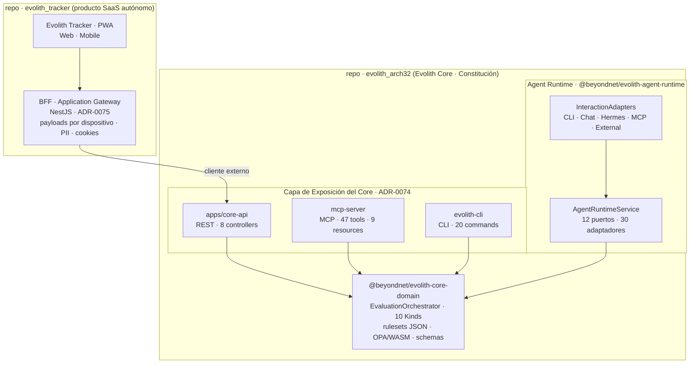

# Evolith — Visión Maestra del Producto

> **Navegación Bilingüe:** [English Version](./evolith-product-vision-master.md)

**Estado:** Aprobado  
**Propietario:** Evolith Architecture Board  
**Última Actualización:** 2026-07-11

---

## 1. Visión, Categoría y Propuesta de Valor

### 1.1 Declaración de Visión

**Evolith** democratiza la ingeniería de software de élite al convertir procesos de desarrollo fragmentados y de alto riesgo en una entrega de productos **predecible, asistida, gobernada y auditable**.

### 1.2 Categoría del Producto

Evolith es el **plano de control de gobernanza para la ingeniería de software AI-Native**.

Gobierna personas, agentes autónomos, herramientas de ingeniería, artefactos, evidencias y decisiones mediante una única cadena exigible desde la idea de negocio hasta producción. Evolith puede integrar productos externos de ejecución y analítica, pero conserva la autoridad sobre los Phase Gates, la aceptación de evidencias, las excepciones, la trazabilidad y el historial de auditoría.

> **Las plataformas de trabajo administran el trabajo. Los agentes ejecutan trabajo. Las plataformas de observabilidad inspeccionan la IA. Las plataformas analíticas visualizan datos. Evolith gobierna todo el proceso de ingeniería.**

### 1.3 Problema Objetivo e Hipótesis de Cliente

Evolith está dirigido a organizaciones que operan múltiples productos, repositorios, equipos, países o herramientas de entrega y sufren de:

- conocimiento arquitectónico y de procesos fragmentado;
- criterios inconsistentes de evidencia y aprobación;
- workflows específicos de herramientas que no producen trazabilidad E2E;
- dependencia excesiva del conocimiento tribal;
- ejecución no controlada de agentes y LLMs;
- auditorías costosas, retrabajo y architecture drift.

La hipótesis inicial de cliente es una organización mediana o grande que necesita una gobernanza de ingeniería más sólida sin reemplazar todos sus sistemas existentes. Esta hipótesis debe validarse mediante entrevistas y experimentos controlados de producto.

### 1.4 Propuesta de Valor

Evolith proporciona:

1. una Constitución de ingeniería heredada;
2. una taxonomía canónica de fases, artefactos, evidencias y decisiones;
3. un modelo exigible de Phase Gates;
4. una cadena de auditoría entre humanos, agentes, herramientas y código fuente;
5. una capa de gobernanza neutral respecto de proveedores;
6. un mecanismo de aprendizaje upstream desde productos satélite hacia Evolith Core.

### 1.5 Esencia y Punta de Lanza (Wedge)

La declaración de categoría (§1.2) es la narrativa **umbrella** (plataforma). La esencia del producto, en lenguaje simple, es:

> **Evolith hace que las decisiones de arquitectura se cumplan de verdad — automáticamente, incluso cuando quien programa es una IA.**

El principio nuclear es **READ vs CONTROL**. Todo el mercado (developer portals, suites de arquitectura) hace *READ*: expone su catálogo *a* los agentes de IA en modo lectura y confía en que se porten bien. Nadie hace *CONTROL*: restringir de forma determinista lo que el agente *produce*. Evolith ocupa ese frente — compila las decisiones (ADR, C4, Phase Gates) en guardrails ejecutables, se los impone al agente antes de generar, y bloquea el merge si se violan.

> **No le das contexto al agente. Le impones un contrato.**

Esta esencia es la **punta de lanza de entrada al mercado** (el wedge): la gobernanza de arquitectura ejecutable, que corresponde al **Phase Gate 3 (Architecture Drift)**. Se aterriza por ese frente —donde hoy no hay incumbente— y se expande hacia el plano de gobernanza completo del SDLC descrito en la declaración umbrella. El análisis competitivo de este segundo eje se detalla en el [Posicionamiento Estratégico y Panorama Comparativo](../positioning/evolith-strategic-positioning-comparative-landscape.es.md) (§§13-15).

---

## 2. Ecosistema y Núcleo de Gobernanza

### 2.1 Evolith Core (`evolith_arch32`)

Evolith Core es el Reference Corpus vivo y la **Constitución** de ingeniería. Es legible por humanos y consumible por máquinas.

```text
Reference Corpus (Constitución)
├── Directivas Arquitectónicas
├── ADRs Core y Específicos por Plataforma (incluyendo categoría ai-augmented/)
├── Estándares y Taxonomías
├── Rulesets (26 categorías) y Skills
├── Schemas de Artefactos y Evidencias
├── Definiciones de Phase Gates
├── OPA Policies (25+ .rego) con dual-engine parity
└── Contratos de Adaptadores e Integraciones
```

**ADR-0101: Core es un Evaluation Engine stateless.** Core recibe un `EvaluationContext` con identificadores opacos, ejecuta evaluaciones multi-kind (gate, artifact, evidence, architecture, blueprint, topology, checkpoint, deployment, rule, compliance) y devuelve un `EvaluationResult` con veredictos y recomendaciones no vinculantes. Core **no persiste** estado — Tracker es propietario del estado de gobernanza en runtime.

Core permanece neutral respecto de proveedores. Las decisiones específicas de productos pertenecen a adaptadores, referencias específicas de plataforma o repositorios satélite, salvo que se generalicen como patrones reutilizables respaldados por evidencia.

### 2.2 Evolith Tracker

Evolith Tracker es el **Orquestador y Auditor SaaS del SDLC** que ejecuta el modelo de gobernanza definido por Core.

No es simplemente un gestor de tareas. Tracker es propietario del estado de gobernanza en runtime para:

- productos satélite registrados;
- procesos SDLC activos;
- ejecuciones de fases;
- evaluaciones de gates;
- evidencias aceptadas y rechazadas;
- excepciones y aprobaciones;
- ejecuciones de agentes y sesiones conversacionales;
- historial inmutable de decisiones y auditoría.

> Repositorio: [`evolith_tracker`](https://github.com/beyondnetcode/evolith_tracker)

### 2.3 Núcleo Irreducible de Gobernanza

Evolith debe construir y poseer:

1. el SDLC canónico de cinco fases y la máquina de estados de Phase Gates;
2. rulesets (26 categorías), schemas, estándares, taxonomía y herencia del Core;
3. el modelo canónico de artefactos y evidencias;
4. el **EvaluationOrchestrator** stateless con 10 EvaluationKinds y 5 KindEvaluators;
5. la trazabilidad desde la intención de negocio hasta arquitectura, código, QA y release;
6. Architecture Drift y score de adherencia (eje progresivo F1/F2/F3);
7. el **Agent Runtime** con puertos hexagonales, adaptadores de interacción y orquestación gobernada;
8. rulesets OPA (25+ policies) con dual-engine parity (Native TypeScript + OPA/WASM);
9. contratos neutrales respecto del proveedor para sistemas de trabajo, agentes, observabilidad, analítica, repositorios, CI/CD, testing y despliegue;
10. autoridad final sobre cada transición de fase (recomendaciones no vinculantes; Tracker decide);
11. promoción de lecciones validadas de los satélites hacia Core.

### 2.4 Modos de Ejecución

Cada módulo soporta ejecución configurable mediante *Convention over Configuration*:

| Modo | Quién Ejecuta | Modelo de Gobernanza |
|---|---|---|
| **Human-Driven** | Equipos de ingeniería y producto | Los humanos ejecutan y aprueban bajo reglas Evolith |
| **Agent-Driven** | Agentes especializados de IA | Los agentes ejecutan actividades acotadas; los humanos gobiernan excepciones y decisiones críticas |

El chatbox es un intermediario, no la fuente de autoridad. Los LLMs y agentes seleccionados por cada tenant consumen contexto, rulesets, skills y permisos aprobados mediante contratos Evolith.

### 2.5 Capa de Interfaces Técnicas

> **Exposición en dos capas (ADRs [0074](../../../reference/core/architecture/adrs/core/0074-evolith-core-api-exposure-layer.es.md) + [0075](../../../reference/core/architecture/adrs/nodejs/0075-application-gateway-bff-nestjs.es.md)).** Evolith Core **expone** su capacidad a través de una **Capa de Exposición del Core** neutral respecto del producto — `apps/core-api` (REST) más el `mcp-server` (MCP) y el `evolith-cli` (CLI). El Evolith Tracker es un **cliente externo**: su **BFF / Application Gateway** (NestJS, ADR-0075, en el repositorio `evolith_tracker`) consume esa exposición y adapta payloads por dispositivo, recorta PII y gestiona sesión/cookies para la PWA. El BFF del Tracker **no** vive en Core — el [ADR-0074](../../../reference/core/architecture/adrs/core/0074-evolith-core-api-exposure-layer.es.md) **rechazó** explícitamente esa opción.



<details>
<summary>Diagrama de texto legado (mismas interfaces, previo a ADR-0074)</summary>

```text
                         Evolith Tracker
          ┌──────────────────────────────────────────┐
          │ Estado de Fase · Gates · Evidencia · Audit│
          └───────────────┬──────────────────────────┘
                          │
       ┌──────────────────┼──────────────────┐
       │                  │                  │
    REST API          MCP Tools          Event Bus
  UI y CI/CD        LLMs y Agentes     Flujos Reactivos
       │                  │                  │
       └──────────────────┼──────────────────┘
                          │
                    Evolith Core
          rulesets · schemas · ADRs · estándares
```

</details>

| Interfaz | Consumidor | Propósito |
|---|---|---|
| **API REST** | UI del Tracker, CI/CD e integraciones empresariales | 8 controllers, ~20 endpoints: evaluación, gates, fases, arquitectura, proyectos,.satélites, caché, salud |
| **MCP HTTP/SSE** | LLMs y agentes autónomos | 47 tools, 9 resources, 8 prompts: evaluación, validación, agentes, ADRs, MoSCoW, drift, configuración |
| **CLI** | Roles de ingeniería y producto | 20 comandos: validate, evaluate, gate, drift, scaffold, ADR lifecycle, agents, chat, satellite, sdlc |
| **Agent Runtime** | Agentes IA, chatboxes, triggers externos | 12 puertos hexagonales, 5 interaction adapters (CLI, Chat, Hermes, MCP, External), orquestación gobernada con OPA + HITL |
| **Webhook / Bus de Eventos** | Sistemas internos y externos | Propagar comandos, evidencias, cambios de estado y resultados de gates |

---

## 3. Composición Gobernada

### 3.1 Principio Estratégico

Evolith adopta **Composición Gobernada**:

> **Construir el núcleo irreducible de gobernanza. Componer capacidades commodity maduras mediante puertos, adaptadores y Anti-Corruption Layers reemplazables.**

El objetivo no es reconstruir cada producto especializado. El objetivo es hacer que las capacidades externas operen bajo un único modelo de gobernanza Evolith.

### 3.2 Capacidades que Evolith Debe Componer Normalmente

Evolith debería normalmente integrar o embeber:

- telemetría de LLM y agentes;
- experimentación y evaluación de prompts;
- dashboards analíticos y exploración de datos;
- mecánicas genéricas de backlog y tableros;
- control de fuentes y ejecución CI/CD;
- runners de pruebas, contract testing y escáneres de seguridad;
- plataformas de despliegue y release;
- motores de generación documental;
- agentes autónomos de propósito general;
- canales de colaboración y notificación.

### 3.3 Modelo de Decisión de Capacidades

Toda nueva capacidad debe recibir una disposición explícita:

| Disposición | Significado |
|---|---|
| **Adoptar** | Usar la capacidad externa prácticamente como se entrega |
| **Embeber** | Presentar una capacidad externa dentro de la experiencia Evolith |
| **Integrar** | Mantenerla externa e intercambiar comandos, eventos y evidencias |
| **Extender** | Añadir adaptadores, plugins o controles de gobernanza Evolith |
| **Construir** | Implementar nativamente por ser un diferenciador irreducible o un requisito no cubierto |
| **Rechazar** | Excluirla por riesgos de seguridad, licencia, lock-in, operación o arquitectura |

La decisión debe evaluar diferenciación estratégica, cobertura funcional, compatibilidad con la gobernanza, reemplazabilidad, propiedad de datos, aislamiento por tenant, seguridad, licenciamiento, experiencia de usuario, carga operativa y costo total de propiedad.

### 3.4 Taxonomía de Adaptadores

```text
Contratos de Proveedores Evolith
├── Work Management Port
├── Agent Execution Port (IAgentEnginePort)
├── LLM Observability Port
├── Analytics Port
├── Repository Port
├── CI/CD Port
├── Testing Port
├── Security Scanner Port
├── Deployment Port
├── Collaboration Port
├── Core Evaluation Port (ICoreEvaluationPort)
├── Policy Validation Port (IPolicyValidationPort)
├── Tracker Trace Port (ITrackerTracePort)
├── Memory Port (IMemoryPort)
├── Approval Port (IApprovalPort)
├── Scheduler Port (ISchedulerPort)
├── Harness Port (IHarnessPort)
└── Interaction Adapter Port (InteractionAdapterPort<T>)
     ├── SmartCliCommandInteractionAdapter
     ├── SmartCliChatInteractionAdapter
     ├── HermesChatBoxInteractionAdapter
     ├── McpInteractionAdapter (GT-405)
     └── ExternalTriggerInteractionAdapter
```

Ningún schema específico de proveedor puede filtrarse al modelo canónico de dominio. Cambiar un proveedor no debe exigir reescribir bounded contexts de Evolith.

---

## 4. Modelo Operativo y Autoridad

### 4.1 Gobernanza Federada

Evolith utiliza un modelo de herencia Hub-and-Spoke:

```text
Evolith Core (Nivel 0 — Constitución)
              │ hereda
              v
Producto Satélite (Nivel 1 — Instancia de Producto)
              │ propone mejora respaldada por evidencia
              v
Revisión del Architecture Board
              │ promoción aprobada
              v
Evolith Core evoluciona y todos los satélites heredan
```

Los satélites pueden definir configuración local de producto y tenant. Las reglas, patrones, schemas y estándares arquitectónicos reutilizables requieren aprobación upstream.

### 4.2 Anti-Corruption Layers

Las herramientas externas se integran mediante ACLs que:

- preservan identificadores de origen, timestamps y linaje de evidencias;
- mapean conceptos externos a artefactos canónicos Evolith;
- validan reglas del Core y del tenant;
- rechazan transiciones o evidencias no conformes;
- permanecen versionadas y reemplazables.

### 4.3 Autoridad y Propiedad de Datos

| Información | Fuente Autoritativa |
|---|---|
| Estado de fase y gate | Evolith Tracker |
| Definición de reglas Core | Evolith Core |
| Configuración de reglas, skills y modelos del tenant | Evolith Tracker bajo autorización del tenant |
| Decisión de excepción y aprobación | Evolith Tracker |
| Estado de código y commits | Plataforma SCM conectada |
| Ejecución de pipelines y despliegues | Plataforma CI/CD o de despliegue conectada |
| Trace y evaluación de agentes | Proveedor de observabilidad conectado, referenciado por Evolith |
| Estado operativo de work items | Sistema de trabajo conectado, mapeado mediante ACL |
| Definición oficial de métricas y umbrales | Evolith Core o gobernanza aprobada del tenant |
| Renderizado de dashboards | Evolith o proveedor analítico conectado |

Las herramientas externas producen hechos operativos y evidencias. Tracker decide si esas evidencias satisfacen la gobernanza.

### 4.4 Experiencia Unificada de Producto

Los usuarios deben experimentar un solo proceso Evolith coherente aunque las capacidades especializadas sean externas. Evolith proporciona:

- navegación unificada por tenant, producto, proceso, fase y gate;
- estado canónico y resúmenes de evidencias;
- acciones y aprobaciones gobernadas;
- deep links hacia herramientas de origen;
- identidad y autorización consistentes;
- linaje explícito y estado de proveedores;
- una narrativa única de auditoría desde la idea hasta producción.

---

## 5. El SDLC de Cinco Fases

### 5.1 Módulos de Fase

```text
Fase 1           Fase 2              Fase 3           Fase 4          Fase 5
Discovery ──── Spec-Driven ──── Construction ──── Automated QA ──── Release
                   Design                                              Planner
    │                 │                  │                │                │
    v                 v                  v                v                v
Business          Design             Successful       RC Stamped     Production
Sign-Off          Baseline            Build                            Live
```

| Módulo | Gate | Resultado Central |
|---|---|---|
| **Product Discovery e Ideation** | Business Sign-Off | Problema, cliente, ROI, KPIs, supuestos y estrategia de capacidades validados |
| **Architecture Spec-Driven** | Design Baseline | Intención funcional, contratos, ADRs, requisitos de evidencia y baseline de arquitectura aprobados |
| **Construction Tracking** | Successful Build | Trabajo implementado con trazabilidad a código, pipeline, especificación y drift |
| **Automated QA e Integration** | RC Stamped | Calidad, seguridad, contratos, regresión y excepciones aceptadas verificadas |
| **Dynamic Release Planner** | Production Live | Rollout, preparación operativa, observabilidad, rollback y evidencias de release aprobados |

### 5.2 Evidencias de Gates

| Gate | Evidencia Mínima | Autoridad de Pass |
|---|---|---|
| **Business Sign-Off** | Discovery Canvas, hipótesis de cliente, ROI, KPIs, supuestos y análisis build-versus-compose | Stakeholders responsables del negocio |
| **Design Baseline** | Historias funcionales, contratos, ADRs, análisis de amenazas y riesgos, plan de evidencias | Gobernanza de arquitectura y producto |
| **Successful Build** | Cambios de código, trabajo vinculado, CI exitoso, DoD y resultado de architecture drift | Política del gate de construcción y aprobadores autorizados |
| **RC Stamped** | Test summary, coverage, resultados de seguridad y contratos, estado de excepciones | Gobernanza de calidad |
| **Production Live** | Plan de release, observabilidad, rollback, sign-off operativo y evidencia de despliegue | Gobernanza de operaciones y release |

### 5.3 Requisito Build-versus-Compose

Discovery debe evaluar capacidades existentes open source, free-tier y comerciales antes de aprobar desarrollo nativo. La evidencia debe incluir:

- alternativas y cobertura funcional;
- disposición Adoptar, Embeber, Integrar, Extender, Construir o Rechazar;
- costo a tres años y carga operativa;
- restricciones de licencia y redistribución;
- seguridad, aislamiento por tenant y propiedad de datos;
- reemplazabilidad del proveedor;
- requisitos de prueba de concepto;
- justificación explícita de implementación nativa.

---

## 6. Evidence Graph y Gobernanza de Agentes

### 6.1 Evidence Graph Canónico

Toda evidencia aceptada debe ser trazable a:

- tenant y producto;
- proceso SDLC, fase, gate y criterio;
- artefacto e intención de negocio;
- proveedor de origen e identificador externo;
- actor humano o agente;
- versiones de modelo, prompt, ruleset y skill cuando corresponda;
- referencia a repositorio, commit, pipeline, prueba o despliegue;
- costo, latencia, timestamps y metadata de integridad;
- resultado de evaluación, aprobación, excepción y decisión final.

El grafo debe responder: **¿qué decisión de negocio produjo este cambio, qué reglas lo gobernaron, qué evidencia lo validó y quién autorizó producción?**

### 6.2 Ejecución Gobernada de Agentes

Los agentes son ejecutores reemplazables, no autoridades. Evolith es propietario de:

- el contrato de actividad;
- el contexto aprobado y los límites de datos;
- los permisos del tenant;
- el artefacto y evidencia esperados;
- los criterios de aceptación;
- los requisitos de aprobación humana;
- el vínculo de auditoría y el manejo de fallas.

### 6.3 Observabilidad de LLM y Agentes

Plataformas especializadas pueden producir traces, evaluaciones, costos, versiones de prompts, tool calls y latencia. Evolith mapea esos registros a su modelo canónico de evidencia y determina si satisfacen un criterio de gate.

---

## 7. Límites del Producto y No-Objetivos

### 7.1 Evolith No Es

Evolith no está obligado a ser:

- un reemplazo de Jira, Trello, Linear o Azure DevOps;
- una plataforma SCM o CI/CD;
- un producto especializado de observabilidad LLM;
- un motor BI de propósito general;
- un proveedor de modelos;
- un agente autónomo de escritorio;
- un reemplazo de todas las herramientas de testing, seguridad o despliegue.

Evolith puede proporcionar capacidades nativas cuando la evidencia demuestre valor estratégico, pero su categoría no depende de reemplazar esos productos.

### 7.2 Límite No Negociable

Ninguna plataforma externa, respuesta exitosa de un LLM, work item completado, documento generado o pipeline verde puede aprobar independientemente una transición de fase. Solo una evaluación de gate autorizada por Evolith puede cambiar el estado canónico de gobernanza.

---

## 8. Estrategia de Negocio y Ecosistema

### 8.1 Modelo Open-Core

```text
OPEN CORE                                  TRACKER ENTERPRISE
Constitución Core                          Gobernanza Multi-Tenant
ADRs, Estándares y Taxonomías              Orquestación Gobernada
Rulesets, Schemas y Contratos              Evidence Graph y Auditoría
Exposición CLI · MCP · REST/GraphQL        Adaptadores Gestionados y Certificados
SDK Comunitario de Adaptadores             Vistas Ejecutivas y de Compliance
Implementaciones de Referencia             Soporte Empresarial y SLA
```

### 8.2 Valor Enterprise

La monetización Enterprise se centra en:

- gobernanza y administración por tenant;
- consolidación de evidencias y auditoría inmutable;
- gates, políticas, excepciones y aprobaciones configurables;
- integraciones certificadas y gestionadas;
- paquetes regulatorios y de compliance;
- despliegue on-premise y controlado;
- catálogos privados de rules, skills y adaptadores;
- scorecards confiables e informes ejecutivos;
- soporte empresarial, SLA y managed hosting.

Evolith no monetiza únicamente por renderizar dashboards. Monetiza la confiabilidad, gobernanza y auditabilidad de la información y decisiones que existen detrás de ellos.

### 8.3 Ecosistema de Adaptadores

El ecosistema puede incluir adaptadores oficiales, certificados y comunitarios con:

- SDK y contratos estables;
- requisitos de compatibilidad y seguridad;
- políticas de versiones y deprecación;
- test harnesses y certificación;
- metadata de despliegue y licenciamiento;
- un marketplace futuro de integraciones.

---

## 9. Validación Antes de Construir

### 9.1 Workflow de Validación Asistida por IA

Antes de implementar, los equipos utilizan herramientas aprobadas de investigación e ingeniería con IA para cuestionar la hipótesis del producto:

```text
Paquete de Evidencia
    -> Investigación de Producto y Contraargumentos
    -> Revisión Humana
    -> Brainstorming u Office Hours de Producto
    -> Matriz de Disposición de Capacidades
    -> Registro de Decisión de Producto
    -> Revisión de Arquitectura e Ingeniería
    -> Plan Aprobado
    -> Implementación Controlada
    -> Evidencia Operacional
    -> Lecciones Upstream
```

El proveedor es reemplazable. Claude Chat, Research, Cowork, Claude Code, Superpowers, gstack o equivalentes futuros son opciones de ejecución, no dependencias del Core.

### 9.2 Resultados Obligatorios de Validación

Toda propuesta significativa de capacidad debe producir:

- reformulación del problema;
- registro de cliente y supuestos;
- contraargumento competitivo;
- matriz de disposición de capacidades;
- prueba de diferenciación;
- plan de experimentos falsables;
- registro de decisión aprobado por humanos;
- riesgos e incertidumbres no resueltos.

### 9.3 Salvaguardas

La salida de IA es análisis, no autoridad. Los humanos aprueban cambios de visión, rulesets, ADRs, excepciones y gates. Credenciales, secretos de producción y datos de clientes sin restricciones deben permanecer fuera de contextos no aprobados.

---

## 10. Producto Mínimo Comprobable

### 10.1 Corte Vertical

La primera prueba no debe implementar todos los módulos por completo. Debe ejecutar un corte controlado de producto a través de los cinco gates con:

- un tenant;
- un producto y proceso SDLC;
- un proveedor de gestión de trabajo;
- un repositorio y pipeline CI;
- un proveedor de agentes;
- un proveedor de observabilidad;
- un proveedor de analítica;
- un Evidence Graph canónico;
- cinco decisiones mínimas de gates.

### 10.2 Criterios de Éxito

La prueba tiene éxito cuando:

- Tracker permanece autoritativo para cada gate;
- el linaje de evidencias es completo y seguro por tenant;
- los proveedores pueden reemplazarse sin cambiar el modelo de dominio;
- los usuarios experimentan un solo proceso coherente;
- la entrega compuesta es más rápida que reconstruir herramientas commodity;
- Evolith produce valor medible por encima de las herramientas usadas independientemente.

---

## 11. Métricas y Madurez de Capacidades

### 11.1 Métricas de Ingeniería y Ejecutivas

Evolith consolida DORA y métricas SPACE seleccionadas preservando su fuente y definición de cálculo.

### 11.2 Métricas de Gobernanza

| Métrica | Propósito |
|---|---|
| **Evidence Completeness** | Porcentaje de decisiones con toda la evidencia obligatoria |
| **Gate Automation Rate** | Porcentaje de criterios evaluados automáticamente |
| **Traceability Coverage** | Porcentaje de cambios vinculados a intención, artefacto, evidencia y decisión |
| **Architecture Drift Prevention** | Violaciones bloqueadas antes de producción |
| **Decision Lead Time** | Tiempo desde evidencia completa hasta decisión autorizada |
| **Exception Rate** | Porcentaje y perfil de riesgo de aprobaciones mediante excepción |
| **Audit Preparation Time** | Esfuerzo requerido para producir una cadena lista para auditoría |
| **Provider Replacement Cost** | Esfuerzo requerido para reemplazar una capacidad integrada |
| **Integration Lead Time** | Tiempo requerido para incorporar un nuevo proveedor |
| **Rework Avoided** | Retrabajo estimado evitado por gobernanza temprana |
| **Governance Adoption** | Productos y equipos que utilizan activamente el modelo de gates |
| **Composed Value Index** | Beneficio medido frente a las mismas herramientas utilizadas independientemente |

### 11.3 Estados de Madurez de Capacidades

Toda capacidad importante debe declarar un estado:

| Estado | Significado |
|---|---|
| **Visioned** | Aprobada como parte de la visión objetivo del producto |
| **Designed** | Respaldada por especificaciones funcionales y técnicas aprobadas |
| **Prototyped** | Demostrada mediante una prueba técnica controlada |
| **Implemented** | Disponible en el producto |
| **Validated** | Probada con usuarios o clientes representativos |
| **Scaled** | Operada confiablemente bajo condiciones empresariales |

La documentación no debe presentar una capacidad Visioned o Designed como validada operacionalmente.

---

## 12. Posicionamiento Competitivo

### 12.1 Mensaje de Categoría

> **Evolith compone las mejores herramientas de ingeniería e IA bajo un único modelo de gobernanza ejecutable, preservando control, evidencia y auditabilidad desde la idea hasta producción.**

### 12.2 Diferenciador Defendible

Evolith se diferencia por la combinación de:

- Constitución ejecutable;
- Phase Gates respaldados por evidencia;
- Evidence Graph canónico;
- ejecución gobernada de humanos y agentes;
- composición neutral respecto de proveedores;
- adherencia arquitectónica y control de drift;
- aprendizaje upstream federado.

### 12.3 Prueba Estratégica

Un stack compuesto puede reemplazar muchas funciones visibles. Si Evolith no convierte su núcleo de gobernanza en algo operativo, medible y más fácil de adoptar que productos desconectados, el stack compuesto puede reemplazar gran parte de la idea del producto.

Por ello, el roadmap debe priorizar la prueba de gobernanza por encima del número de funcionalidades.

---

## 13. Relación con Este Repositorio

Este repositorio es Evolith Core: la Constitución autoritativa y Reference Corpus para productos satélite.

| Artefacto | Ubicación |
|---|---|
| Directivas Arquitectónicas | `reference/core/sdlc/standards/vision/architectural-directives.es.md` |
| Framework Estratégico de Validación y Composición | `reference/core/sdlc/standards/vision/evolith-strategic-validation-and-composition-framework.es.md` |
| Panorama Comparativo Estratégico | `reference/core/sdlc/standards/vision/evolith-strategic-positioning-comparative-landscape.es.md` |
| Workflow de Validación Asistida por IA | `reference/core/sdlc/standards/vision/evolith-ai-assisted-validation-workflow.es.md` |
| Roadmap de Estrategia Evolutiva | `reference/core/sdlc/standards/vision/evolutionary-strategy-roadmap.es.md` |
| Mapeo de Artefactos SDLC | `reference/core/sdlc/sdlc-evolith-artifact-mapping.es.md` |
| Rulesets y Schemas | `rulesets/` |

---

## 14. Lectura Suplementaria

- [Framework Estratégico de Validación y Composición](../methods/evolith-strategic-validation-and-composition-framework.es.md)
- [Posicionamiento Estratégico y Panorama Comparativo](../positioning/evolith-strategic-positioning-comparative-landscape.es.md)
- [Workflow de Validación de Producto Asistido por IA](../methods/evolith-ai-assisted-validation-workflow.es.md)
- [Directivas Arquitectónicas](../architecture/architectural-directives.es.md)
- [Roadmap de Estrategia Evolutiva](../strategy/evolutionary-strategy-roadmap.es.md)
- [Evaluación de Madurez](../../../reference/core/control-center/maturity-reports/maturity-assessment.es.md)
- [Mapeo de Artefactos SDLC](../../../reference/core/sdlc/sdlc-evolith-artifact-mapping.es.md)
- [SDLC Tracker — Diseño de Interfaces Técnicas](../../products/evolith-tracker/sdlc-tracker-technical-interfaces.es.md)

---

*Este documento constituye la visión oficial del producto Evolith. Todas las decisiones de producto, arquitectura, gobernanza y roadmap deben alinearse con él.*

---
[Volver al Índice de Visión](./README.es.md)
