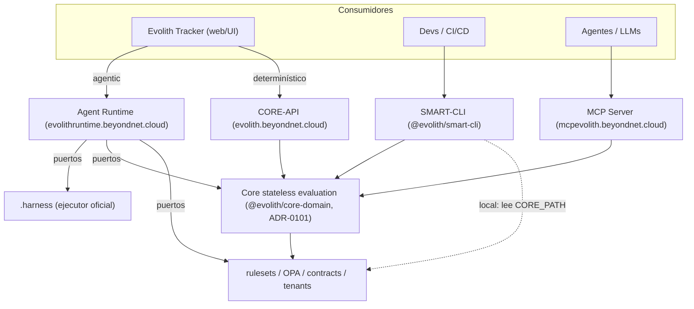

# Evolith Architecture Design

**Versión:** 2.3.0  
**Fecha:** 2026-06-30  
**Estado:** Aprobado — core-api y mcp-server desplegados y verificados en producción; Agent Runtime incorporado  
**Autor:** Alberto Arroyo Raygada · Revisado por Claude Sonnet 4.6

> **Cambios 2.3.0 (2026-06-30):** se retiró el registro de correcciones y pendientes
> operativos que vivía aquí (antes §2 "Problema Identificado", §13 "Tabla de
> Correcciones", §14 "Estado de Deployment", §15 "Cambios Pendientes", §16 "Riesgos"):
> el seguimiento de gaps/deuda es responsabilidad **única** del
> [Gap Tracking Board](../governance/standards/vision/gap-tracking.md), no de este
> documento. Los items que seguían abiertos están registrados como
> [`GT-390`](../governance/standards/vision/gap-reference-catalog.md#gt-390)…[`GT-394`](../governance/standards/vision/gap-reference-catalog.md#gt-394);
> el historial de fixes ya aplicados vive en el historial git. Este documento
> conserva solo el diseño arquitectónico vigente.

> **Cambios 2.2.0 (2026-06-29):** se incorpora **Evolith Agent Runtime** (capa
> agéntica desacoplada, dominio `evolithruntime.beyondnet.cloud`) al modelo;
> diagrama de sistema canónico en Mermaid (§1); `ApiKeyGuard` opt-in en CORE-API;
> aclaración del rol stateless de CORE-API frente a tenant/trazabilidad.

---

## 1. Visión General

Evolith es un framework de gobernanza de software que permite a organizaciones (tenants) gestionar el ciclo de vida de sus proyectos (satélites) mediante reglas, gates, validaciones y agentes IA. El sistema opera bajo los principios de **fuente de verdad estructurada**, **alta disponibilidad 24/7**, y **trazabilidad total**.

```
┌─────────────────────────────────────────────────────────┐
│                    CORPUS (fuente de verdad)             │
│  rulesets/*.rules.json   manifests/*.manifest.json       │
│  rulesets/opa/*.rego     rulesets/schema/*.schema.json   │
│  rulesets/tenants/{id}/  (overrides por tenant)          │
└───────────────────┬─────────────────────────────────────┘
                    │ sirve datos estructurados
               Core-API (REST)
    ┌───────────────┼──────────────┬─────────────────┐
  SmartCLI       MCP Server    Tracker BFF      Agentes IA
  (validate,     (SSE/stdio,   (UI + auth,      (MCP tools,
   gate-check,    tools,        state mgmt)      audit)
   scaffold)      resources)
                    │
               Interfaces humanas
               (Swagger UI, docs generados)
```

### 1.1 Diagrama de sistema (canónico)

Vista renderizable de las interfaces, el Core stateless, la capa de gobierno y el
ejecutor `.harness`. El **Agent Runtime** es la capa agéntica desacoplada: Tracker
la consume para acciones agentic y consume CORE-API para operaciones
determinísticas.



> **Aclaración de altitud (CORE-API stateless, ADR-0101):** CORE-API *evalúa*
> contra la configuración de tenant que recibe como contexto y *emite*
> recomendaciones no vinculantes; **no posee ni persiste** tenant, iniciativa ni
> trazabilidad. Esa propiedad operativa es de **Evolith Tracker**. Por eso CORE-API
> no expone CRUD de tenant ni un store de trazas: es correcto por diseño.

---

## 2. Principios Arquitectónicos Aplicados

1. **Structured-first**: toda información consumida por interfaces existe en formato estructurado. El Markdown es derivado o complementario.
2. **Single source of truth**: una sola ubicación canónica por artefacto. Duplicados eliminados.
3. **Fail-fast con degradación controlada**: JSON.parse con `Promise.allSettled` — un archivo malformado no elimina toda la respuesta.
4. **Path traversal prevention**: `WorkspaceReferenceResolverService.resolve()` valida con regex + path check antes de cualquier I/O.
5. **Cache en ms**: `cache-manager v7` usa milisegundos; todos los `CacheTTL` corregidos.
6. **Health ≠ Ready**: liveness probe (`/health/live`) nunca falla si el proceso vive; readiness probe (`/health/ready`) verifica el corpus real.
7. **SkipThrottle en health/metrics**: probes de k8s y scrapers de Prometheus no consumen el rate limit.

---

## 3. Fuente de Verdad Operativa

```
corpus/
  rulesets/                          ← FUENTE OPERATIVA
    phase-gates/
      phase-gates.rules.json         ← Canonical (rulesets/sdlc/ es alias legacy)
    schema/                          ← Contratos de todos los artefactos
      tenant.schema.json             ← NUEVO
      tenant-override.schema.json    ← NUEVO
      waiver.schema.json             ← NUEVO
      blueprint.schema.json          ← NUEVO
      rule-definition.schema.json    ← NUEVO
      sdlc-gate.schema.json          ← MOVIDO desde reference/
      sdlc-phase.schema.json         ← MOVIDO desde reference/
    opa/
      phase-gates.rego               ← NUEVO — valida gates con evidence + waivers
      multi-tenancy.rego             ← previene overrides que rompen gobernanza
    tenants/                         ← NUEVO
      {tenant-id}/
        tenant.json                  ← identidad y capacidades
        overrides.json               ← deltas sobre ruleset base
        waivers/{WVR-ID}.json        ← waivers activos
    topologies/
      */
        *.rules.json                 ← $schema paths corregidos
  reference/architecture/topologies/ ← topology.manifest.json (consumidos por API)

reference/                           ← LECTURA HUMANA ÚNICAMENTE
  governance/sdlc/playbooks/         ← procedimiento humano (no contrato)
  architecture/adrs/                 ← narrativas de decisión
```

**Regla:** ningún consumidor (CLI, MCP, Tracker, agente) parsea `.md` para tomar decisiones. Los `.md` son para el humano.

---

## 4. Relación Markdown ↔ Rulesets ↔ Schemas ↔ OPA

```
Tier 1 — Source of Truth (rulesets/)
  *.rules.json  →  validated by  →  *.schema.json
  *.rego        →  tested by     →  *.test.rego
  *.manifest.json

Tier 2 — Derivado automáticamente desde Tier 1
  Swagger UI           ← generado desde DTOs + OpenAPI decorators
  GET /api/v1/gates    ← lee phase-gates.rules.json en runtime
  GET /api/v1/topologies ← lee topology.manifest.json en runtime

Tier 3 — Escrito por humanos, no generado
  reference/governance/sdlc/playbooks/*.md  ← procedimiento
  reference/architecture/adrs/*.md          ← decisión narrativa
  reference/architecture/blueprints/*.md    ← contexto de blueprint
```

Invariante: si un `.md` de playbook menciona un artefacto obligatorio, ese artefacto debe existir en el `.rules.json` correspondiente. CI debe verificar esta consistencia.

---

## 5. Arquitectura de Alta Disponibilidad 24/7

### 5.1 Puntos de Falla Identificados y Mitigaciones

| Componente | Punto de Falla | Mitigación |
|-----------|---------------|-----------|
| Core-API | Pod único | Mínimo 2 réplicas + HPA en k8s |
| Core-API | Corpus montado en pod | Usar `ConfigMap` o `ReadOnlyMount` desde el repo; fallar en `/health/ready` si inaccesible |
| Redis | Instancia única | Redis Sentinel o Redis Cluster para HA; fallback a in-memory graceful |
| MCP Server | Pod único | 2+ réplicas con SSE stateless |
| OPA | `.wasm` ausente | Fallback a native evaluator (ya implementado); `.wasm` como artefacto de release |

### 5.2 Health Checks (implementado)

```
GET /health/live   → 200 siempre si el proceso responde (liveness)
GET /health/ready  → 200 solo si corpus accesible + MetricsService disponible (readiness)
GET /health        → estado completo (para monitoreo)
```

### 5.3 Probes en Docker / k8s

```yaml
livenessProbe:
  httpGet: { path: /health/live, port: 3000 }
  initialDelaySeconds: 15
  periodSeconds: 10

readinessProbe:
  httpGet: { path: /health/ready, port: 3000 }
  initialDelaySeconds: 20
  periodSeconds: 10
  failureThreshold: 3
```

### 5.4 Degradación Controlada

| Dependencia falla | Comportamiento |
|---|---|
| Redis no disponible | Cache silently disabled; requests served from disk (slower but correct) |
| `policy.wasm` ausente | OPA silently skips; native evaluator handles the request |
| Un `.rules.json` malformado | `Promise.allSettled` → el archivo se omite, los demás se sirven |
| MCP Server caído | CLI y API siguen operativos; agentes no pueden evaluar interactivamente |

---

## 6. Estrategia de Performance

### 6.1 Cache

```typescript
// cache-manager v7 usa MILISEGUNDOS: 5 minutos = 300_000 (no 300)
@CacheTTL(300_000)
```

| Endpoint | TTL | Estrategia |
|---------|-----|-----------|
| `GET /topologies` | 5 min | CacheInterceptor + Redis |
| `GET /rulesets` | 5 min | CacheInterceptor + Redis |
| `GET /gates/:id` | 5 min | Manual cache.get/set |
| `POST /gates/evaluate` | 1 min | Cache por hash(input) via CacheKeys.opa |
| `GET /health/live` | No cache | SkipThrottle |

### 6.2 Rate Limiting

```typescript
// Global: 100 requests / 60 segundos por IP
// Health y metrics: @SkipThrottle() (no consumen límite)
```

### 6.3 Pendientes de Implementar

- Paginación en `GET /rulesets` y `GET /topologies` (`?page=1&limit=50`)
- `ETag` + `If-None-Match` para cache HTTP en clientes
- Índice pre-computado de rulesets al arranque (evitar filesystem scan en cada request)

---

## 7. Estrategia de Resiliencia

### 7.1 Implementado

- `Promise.allSettled` en `listRulesets()` — un JSON malformado no bloquea el endpoint
- `CircuitBreakerService` en core-api (ya existía)
- `AuditThrottlerGuard` — rate limiting con logging de audit

### 7.2 Pendiente

- Circuit breaker en llamadas Redis (actualmente `try/catch` simple)
- Retry con backoff exponencial para llamadas MCP → Core-API
- Timeout por operación en use cases de larga duración (`validateSatellite`, `detectDrift`)
- Idempotency key en `POST /gates/evaluate` (mismo input → mismo resultado cacheado)

---

## 8. Estrategia de Observabilidad

### 8.1 Implementado

| Señal | Herramienta | Estado |
|-------|------------|--------|
| Traces | OpenTelemetry → OTLP → Tempo | `OTEL_ENABLED=true` activa |
| Logs | nestjs-pino → JSON estructurado | Activo en prod |
| Metrics | prom-client → `GET /metrics` | Activo; sin auth (ver `GT-393`) |
| Audit trail | `SecurityAuditInterceptor` | Activo en core-api |
| Correlation ID | `CorrelationIdMiddleware` | Activo; `x-correlation-id` header |

### 8.2 Gaps Pendientes

- `/metrics` necesita aislamiento de scrape (puerto interno / NetworkPolicy) — ver `GT-393`
- `CacheMetricsService.recordHit/Miss()` nunca se llaman — contadores en 0
- OTel en MCP server gateado estrictamente en `OTEL_ENABLED=true` — activar en staging por default

---

## 9. Estrategia de Seguridad y Gobernanza

### 9.1 Implementado

- `Helmet.js` en core-api
- `ValidationPipe` global con `whitelist: true, forbidNonWhitelisted: true`
- Path traversal prevention en `WorkspaceReferenceResolverService`
- CORS configurable via `CORS_ORIGINS` (ya no bloquea por defecto en prod)
- `allowedHeaders` ahora incluye `Authorization` y `x-api-key`
- `ComposableValidateController` ahora usa `workspaceRef` (opaque) en vez de paths raw
- `ApiKeyGuard` global opt-in (`EVOLITH_API_KEY`; `@Public()` en health; consistente con mcp-server)

### 9.2 Pendiente (requiere decisión arquitectónica)

- **Separar `/metrics`** detrás de un puerto interno (e.g., 9100) no expuesto en Traefik — ver `GT-393`
- **ABAC por-tenant** sobre el acceso al corpus en Core-API — ver `GT-394`
- **mTLS** entre servicios internos (core-api ↔ MCP server) cuando se despliegue en k8s

---

## 10. Modelo de Integración entre Componentes

```
Tracker BFF
  ├── Emite workspaceRef (opaque token)
  ├── Llama Core-API: POST /gates/:id/evaluate { workspaceRef, evidence }
  ├── Llama Core-API: POST /projects/initialize { workspaceRef, name, currentPhase, targetPhase }
  └── Lee Core-API: GET /topologies, GET /rulesets, GET /phases/:n/requirements

SmartCLI
  ├── Modo local: lee rulesets desde CORE_PATH directo (no necesita API)
  └── Modo remoto: usa sdk-client → Core-API REST

MCP Server
  ├── Tools: validate, gate-check, topology-list, sdlc-status, auto-fix, propose-advance
  ├── Resources: corpus (rulesets, manifests, schemas)
  └── Agentes Claude: consumen tools via SSE

Core-API
  ├── Lee corpus desde CORE_PATH/rulesets/ y CORE_PATH/reference/
  ├── Evalúa gates via OPA (wasm) + Native Engine
  └── Cachea en Redis; fallback in-memory

Agent Runtime (evolithruntime.beyondnet.cloud)
  ├── Recibe AgentRuntimeRequest (tenant/producto/iniciativa como contexto)
  ├── Resuelve skill/tool y aplica aprobación + política (OPA) + trazabilidad
  ├── Invoca capacidades vía puertos: IHarnessPort (.harness), ICoreEvaluationPort
  │     (Core), IPolicyValidationPort (OPA), ITrackerTracePort (Tracker)
  ├── Hermes (u otro motor) sólo como adapter detrás de IAgentEnginePort
  └── HTTP NestJS (POST /v1/agent/handle, GET /v1/agent/skills) + auth API key
```

> **Separación de responsabilidades.** El Agent Runtime *decide y orquesta*;
> `.harness` *ejecuta*; el Core *gobierna* (evaluación determinística); OPA aplica
> *política*. El runtime no reemplaza `.harness` ni acopla el Core a Hermes
> (ver [Agent Runtime](./agent-runtime/README.md) y [ADR-0102](./adrs/core/0102-evolith-agent-runtime.md)).

---

## 11. Modelo de Configuración por Tenant

```
rulesets/tenants/{tenant-id}/
  tenant.json          ← identidad (tier, topologías permitidas, fases)
  overrides.json       ← deltas sobre el ruleset base
  waivers/WVR-*.json   ← excepciones aprobadas

Reglas de override (OPA multi-tenancy.rego):
  Puede agregar evidencia adicional a un gate
  Puede activar waivers con autoridad declarada en el gate
  No puede eliminar blockingCriteria
  No puede cambiar waiverAuthority
  No puede reducir mandatoryEvidence sin waiver

Nuevos schemas (rulesets/schema/):
  tenant.schema.json
  tenant-override.schema.json
  waiver.schema.json
```

---

## 12. Recomendaciones Finales

1. **Una sola ubicación canónica para cada artefacto** — el patrón ya existe; aplicarlo rigurosamente. `rulesets/` para reglas, `reference/` para lectura humana, sin cruces.

2. **CI como contrato de consistencia** — agregar tres checks de CI:
   - `ajv validate` en todos `*.rules.json` contra su `$schema` (ver `GT-391`)
   - `opa test rulesets/opa/` — suite de tests OPA debe pasar
   - Cross-reference: toda `playbookRef` en `.rules.json` apunta a un `.md` existente

3. **Tenant model es el próximo hito** — los schemas están, el directorio está. El siguiente paso es la API de tenant discovery en Core-API y la evaluación de overrides en el gate evaluator.

4. **OTEL en staging siempre activo** — activar `OTEL_ENABLED=true` en el entorno de staging por defecto para capturar traces antes de llegar a producción.
