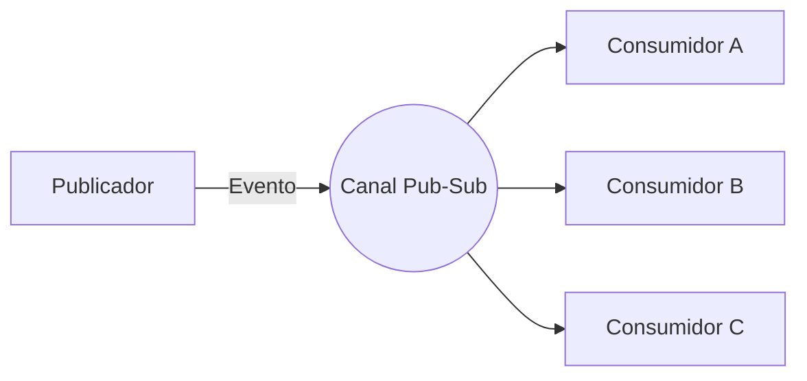
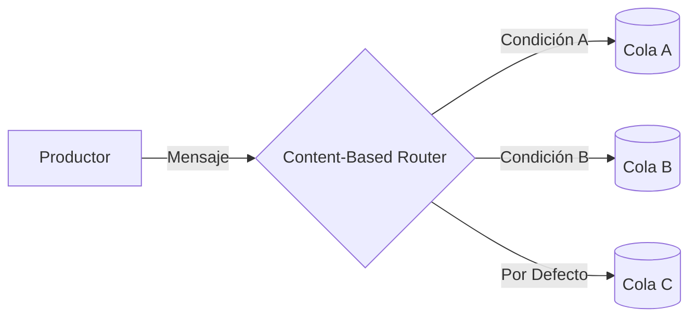
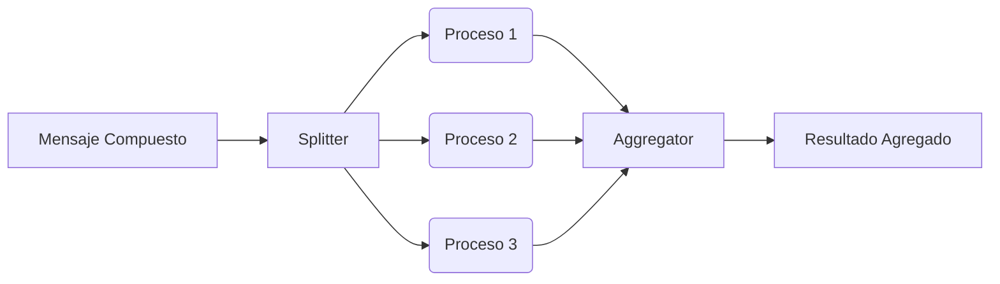
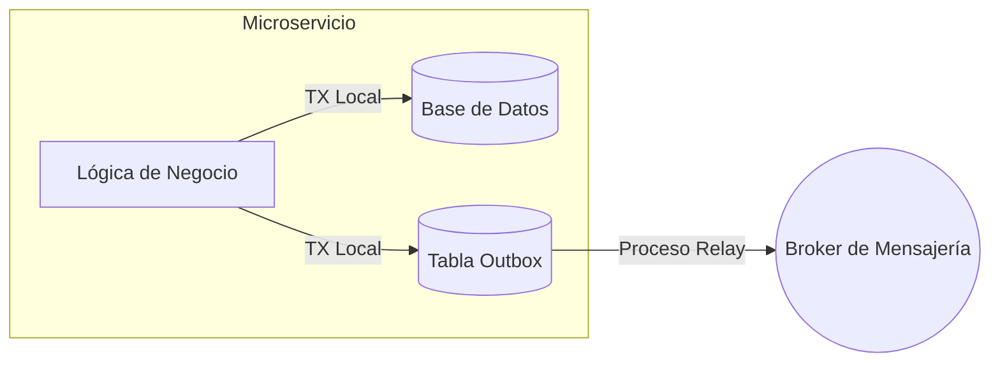
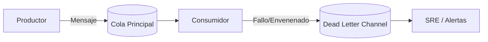
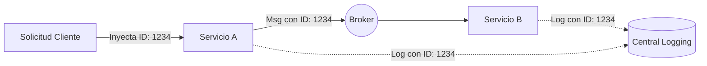

# Integration & Messaging Hub

Evolith define una estrategia progresiva para la integración empresarial, guiando la transición de monolitos modulares a microservicios distribuidos. Este hub describe nuestras estrategias de mensajería, topologías de integración y el modelo de gobernanza para la adopción de nuevos patrones.

## Nivel 1: El Directorio Referencial (La Fuente de Verdad)

Evolith reconoce oficialmente el catálogo de **Enterprise Integration Patterns (EIP)** de Gregor Hohpe (ver [enterpriseintegrationpatterns.com](https://www.enterpriseintegrationpatterns.com/)) como el estándar de la industria. Mapeamos nuestros desafíos de integración a sus categorías canónicas:
- **Messaging Channels (Canales de Mensajería):** Cómo se transportan los mensajes.
- **Message Routing (Enrutamiento de Mensajes):** Cómo se enrutan los mensajes a sus destinos.
- **Message Transformation (Transformación de Mensajes):** Cómo se modifican las cargas útiles.
- **Messaging Endpoints (Puntos de Enlace):** Cómo se conectan las aplicaciones al sistema de mensajería.

## Nivel 2: Patrones Canónicos Core (Just-in-Time)

Para soportar nuestra actual transición hacia microservicios, hemos adoptado formalmente los siguientes seis patrones esenciales.

### 1. Publish-Subscribe Channel
**Problema:** Una aplicación necesita hacer un broadcast de un evento a múltiples consumidores sin saber quiénes son.
**Solución:** Enviar el evento a un Publish-Subscribe Channel, el cual entrega una copia del mensaje a cada receptor suscrito.

### 2. Content-Based Router
**Problema:** Un mensaje debe ser enrutado a uno de múltiples destinos basándose en su contenido, manteniendo al productor desacoplado.
**Solución:** Utilizar un Content-Based Router para examinar el contenido del mensaje y enrutarlo al canal de destino apropiado.

### 3. Splitter / Aggregator
**Problema:** Un mensaje compuesto contiene múltiples elementos que deben procesarse individualmente, y los resultados deben combinarse en una única respuesta.
**Solución:** Usar un Splitter para dividir el mensaje compuesto en mensajes individuales, procesarlos, y luego usar un Aggregator para recolectar las respuestas individuales y ensamblarlas en un solo mensaje consolidado.

### 4. Transactional Outbox
**Problema:** Al publicar un evento en un broker de mensajería y actualizar una base de datos local, un fallo en cualquiera de los sistemas podría dejarlos en un estado inconsistente (el problema del dual-write).
**Solución:** Utilizar una tabla local en la base de datos como "Bandeja de Salida" (Outbox) para almacenar los eventos en la misma transacción que el cambio en los datos de negocio. Un proceso en segundo plano retransmite luego estos eventos desde el Outbox hacia el broker de mensajería, garantizando la consistencia eventual.

### 5. Dead Letter Channel
**Problema:** El sistema de mensajería no puede entregar un mensaje a su destinatario (ej. debido a un payload inválido, fallos repetidos de procesamiento, o problemas de red). Si se deja en la cola, podría bloquear otros mensajes o causar un bucle infinito de fallos.
**Solución:** Mover el mensaje problemático a un Dead Letter Channel (Canal de Letras Muertas) dedicado, permitiendo que el sistema principal continúe procesando otros mensajes, mientras que operaciones o SRE pueden inspeccionar y manejar el mensaje fallido más tarde.

### 6. Correlation Identifier
**Problema:** Una solicitud externa desencadena un flujo de trabajo que involucra múltiples mensajes asíncronos a través de varios microservicios. Sin una forma de vincular estos mensajes, la depuración y trazabilidad del ciclo de vida completo de la solicitud resulta imposible.
**Solución:** Adjuntar un identificador único (Correlation ID) a la solicitud inicial y propagar este ID en las cabeceras (headers) de todos los mensajes asíncronos y llamadas a servicios posteriores asociados con ese flujo.

## Nivel 3: Crecimiento Orgánico mediante ADRs (Gobernanza)

Evitamos el "Big Design Up Front" (BDUF). Si un equipo satélite necesita un patrón del Nivel 1 que aún no está documentado en el Nivel 2, deben seguir el flujo de crecimiento orgánico gobernado por el **Loop Engineer**:

1. **Identificar la Necesidad:** El equipo identifica un patrón faltante requerido para su contexto delimitado.
2. **Prueba de Concepto (PoC):** El Loop Engineer implementa una PoC en el perímetro de UMS (Referencia Aplicada).
3. **Redactar un ADR:** El Loop Engineer propone un Architectural Decision Record (ADR) respaldado por la evidencia de la PoC.
4. **Revisión de la Junta de Arquitectura:** El ADR se somete a la Junta de Arquitectura (Architecture Board) para su evaluación.
5. **Promoción:** Una vez aprobado, el patrón "asciende" al corpus principal de Evolith (Nivel 2) y se convierte en un estándar para todos los equipos satélite.
