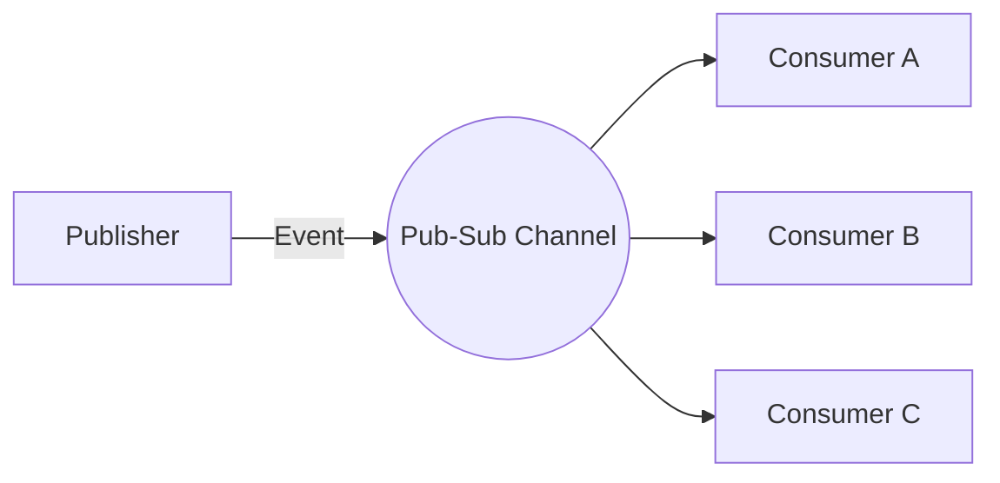
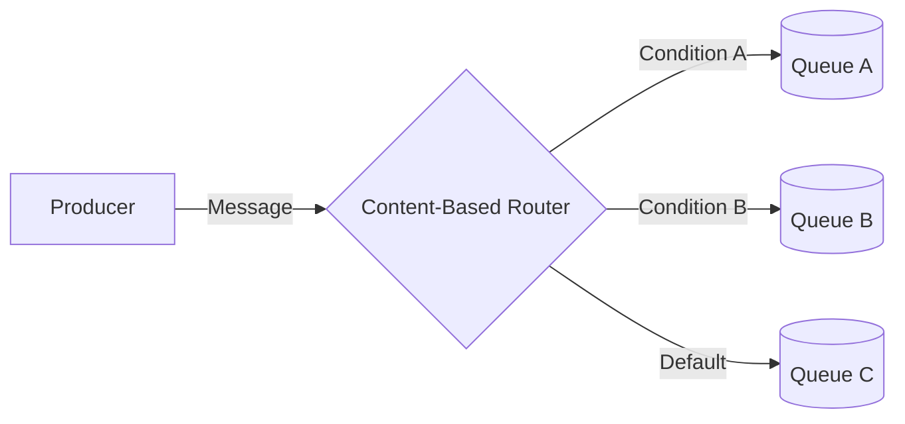
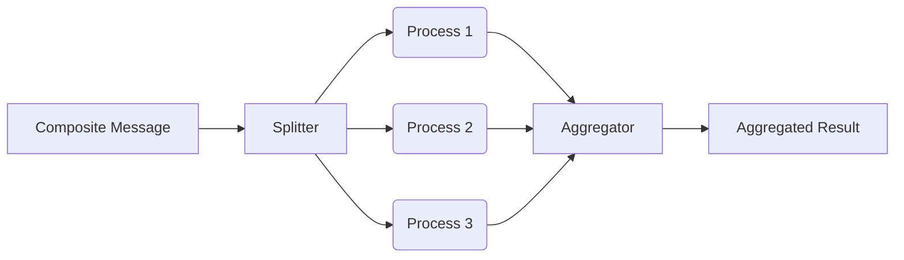
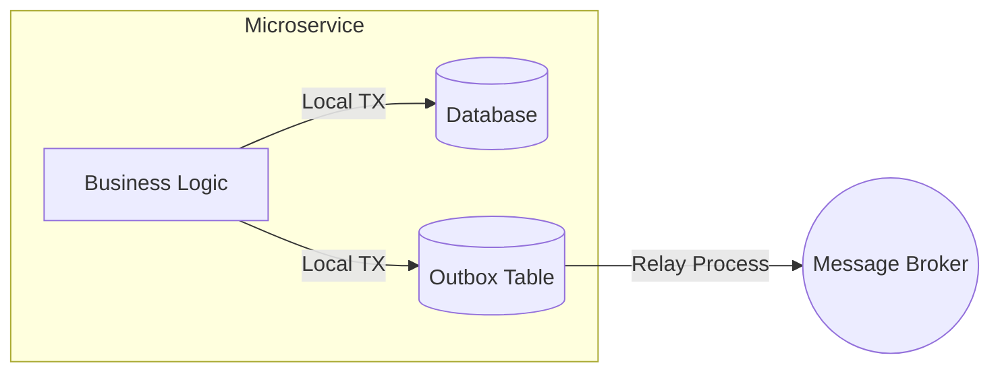
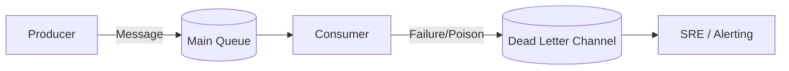
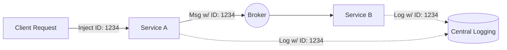

# Integration & Messaging Hub

Evolith defines a progressive strategy for enterprise integration, guiding the transition from modular monoliths to distributed microservices. This hub outlines our messaging strategies, integration topologies, and the governance model for adopting new patterns.

## Level 1: The Reference Directory (Single Source of Truth)

Evolith officially recognizes the **Enterprise Integration Patterns (EIP)** catalog by Gregor Hohpe (see [enterpriseintegrationpatterns.com](https://www.enterpriseintegrationpatterns.com/)) as the industry standard. We map our integration challenges to their canonical categories:
- **Messaging Channels:** How messages are transported.
- **Message Routing:** How messages are routed to their destinations.
- **Message Transformation:** How message payloads are modified.
- **Messaging Endpoints:** How applications connect to the messaging system.

## Level 2: Core Canonical Patterns (Just-in-Time)

To support our current transition towards microservices, we have formally adopted the following six essential patterns.

### 1. Publish-Subscribe Channel
**Problem:** An application needs to broadcast an event to multiple interested consumers without knowing who they are.
**Solution:** Send the event to a Publish-Subscribe Channel, which delivers a copy of the message to each subscribed receiver.

### 2. Content-Based Router
**Problem:** A message needs to be routed to one of multiple destinations based on its content, keeping the producer decoupled.
**Solution:** Use a Content-Based Router to examine the message content and route it to the appropriate destination channel.

### 3. Splitter / Aggregator
**Problem:** A composite message contains multiple elements that need to be processed individually, and the results must be combined back into a single response.
**Solution:** Use a Splitter to break the composite message into individual messages, process them, and then use an Aggregator to collect the individual responses and assemble them into a single comprehensive message.

### 4. Transactional Outbox
**Problem:** When publishing an event to a message broker and updating a local database, a failure in either system could leave them in an inconsistent state (the dual-write problem).
**Solution:** Use a local database table as an "Outbox" to store the events in the same transaction as the business data change. A separate background process then relays these events from the Outbox to the message broker, ensuring eventual consistency.

### 5. Dead Letter Channel
**Problem:** The messaging system cannot deliver a message to its intended recipient (e.g., due to an invalid payload, repeated processing failures, or network issues). If left in the queue, it might block other messages or cause an infinite loop of failures.
**Solution:** Move the problematic message to a dedicated Dead Letter Channel, allowing the main system to continue processing other messages while operations or SRE teams can inspect and handle the failed message later.

### 6. Correlation Identifier
**Problem:** An external request triggers a workflow involving multiple asynchronous messages across various microservices. Without a way to link these messages, debugging and tracing the full lifecycle of the request is impossible.
**Solution:** Attach a unique identifier (Correlation ID) to the initial request and propagate this ID in the headers of all subsequent asynchronous messages and service calls associated with that workflow.

## Level 3: Organic Growth via ADRs (Governance)

We avoid Big Design Up Front (BDUF). If a satellite team needs a Level 1 pattern that is not yet documented in Level 2, they must follow the organic growth flow governed by the **Loop Engineer**:

1. **Identify the Need:** The team identifies a missing pattern required for their bounded context.
2. **Proof of Concept (PoC):** The Loop Engineer implements a PoC in the UMS (Applied Reference) boundary.
3. **Draft an ADR:** The Loop Engineer proposes an Architectural Decision Record (ADR) backed by the PoC evidence.
4. **Architecture Board Review:** The ADR is submitted to the Architecture Board for evaluation.
5. **Promotion:** Once approved, the pattern "ascends" to the Evolith core corpus (Level 2) and becomes a standard for all satellite teams.
