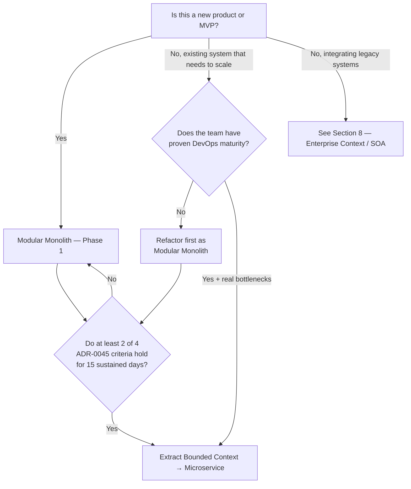
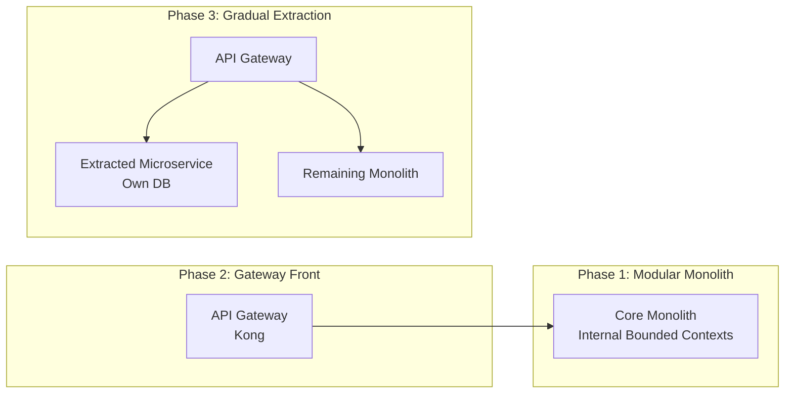

# [ADR 0047](0047-architectural-patterns-monolith-soa-microservices.md): Progressive Architecture Evolution Framework: Modular Monolith → Microservices

## 1. Metadata
* **ADR ID:** 0047
* **Title:** Progressive Architecture Evolution Framework: Modular Monolith → Microservices
* **Status:** Approved
* **Authors:** Enterprise Architecture Office
* **Reviewers:** Corporate Architecture Board, CTO Office
* **Date:** 2026-05-12
* **Tags:** `Governance`, `Architecture-Patterns`, `Scalability`, `Decision-Framework`
* **Related ADRs:**
  * [ADR-0006: Future Microservices Transition with Dapr](./0006-future-microservices-transition-dapr.md)
  * [ADR-0032: API Protocol Decision Matrix](./0032-api-protocol-decision-matrix-rest-grpc-graphql.md)
  * [ADR-0045: Microservice Extraction Readiness Criteria](./0045-microservice-extraction-readiness-criteria.md)

---

## Executive Summary (For the CTO)

Poor selection of an initial architectural pattern is the primary source of technical bankruptcy in modern engineering organizations. Adopting microservices prematurely destroys *Time-to-Market* through operational overload. Maintaining an excessively coupled monolith prevents organizational scaling across distributed teams.

This ADR establishes the official corporate stance: **every new system starts as a Modular Monolith** shielded by Ports and Adapters. It migrates toward Microservices only when business or operational drivers objectively demand it based on the numerical thresholds defined in this registry. Dogmatic imposition of distributed architectures is strictly forbidden.

SOA (Service-Oriented Architecture) **is not part of this evolution axis**. It is an integration paradigm for enterprise environments with pre-existing legacy systems and is addressed separately in Section 8.

---

## 2. Problem Context

Organizations face dynamic scaling challenges. The lack of a standard reference framework for deciding the architectural style of new products generates the following failure scenarios:

1. **Premature Over-Engineering:** Implementing microservices with fewer than 10 engineers, resulting in operational paralysis where 80% of effort is consumed by infrastructure instead of business value.
2. **Big Ball of Mud Effect:** Monoliths that started well but lost their logical boundaries, requiring regression cycles spanning weeks and deployments failing constantly due to lateral coupling.
3. **Premature Extraction Without Quantitative Criteria:** Teams extracting modules to microservices due to organizational pressure or technology trends, without real bottlenecks to justify the cost.

This document mitigates these risks by establishing clear, quantifiable decision rules aligned with business realities.

---

## 3. Architectural Drivers

Each alternative is evaluated against the following critical drivers:

1. **Time-to-Market (TTM):** The speed of bringing a feature from idea to production.
2. **Team Autonomy:** The ability of a team to design, develop, and deploy without synchronization with other teams.
3. **Operational Complexity:** The level of specialized DevOps and platform engineering skills required to operate the system.
4. **Maintainability:** The ease of understanding, debugging, and modifying source code.
5. **Scalability (Compute/Data):** Efficiency in handling load increases in specific system functions.
6. **Resilience / Fault Isolation:** The ability to prevent a crash in one domain from taking down the entire ecosystem.
7. **Deployment Frequency:** The number of successful deployments possible in a given period.
8. **Upfront vs. Ongoing Costs:** Budgetary efficiency in both short and long term.
9. **Observability:** The effort to diagnose errors across business flow interactions.
10. **Testing:** Complexity of unit, integration, and end-to-end (E2E) testing cycles.
11. **Data Governance:** Centralization vs. decentralization of the data lifecycle.
12. **Cloud Readiness:** Ease of execution in Cloud Native vs. traditional server architectures.
13. **Compliance:** Regulatory requirements for physical or regional data isolation.

---

## 4. The Two Options on the Evolith Axis

### Option A — Modular Monolith (Phase 1, Default Posture)

A single deployment artifact hosting all domain business logic. The corporate standard mandates the **Modular Monolith** sub-pattern with **Hexagonal Architecture**: absolute isolation at the code level even if the runtime process and database schema are unified. Modules are bounded contexts that can be extracted in the future without rewriting domain logic.

* **Advantages:**
  * Low intra-process latency (in-memory calls).
  * Trivial cross-module refactoring.
  * Straightforward CI/CD with low operational overhead.
  * Native ACID transactions guaranteed by the database engine.
  * Simplified E2E testing without excessive network mocking.
* **Disadvantages:**
  * Single point of deployment failure.
  * Homogeneous scaling: scaling one module forces scaling the entire process.
  * Team saturation starting at >25-30 concurrent engineers.
* **When to Use:** Phase 1 of any product; MVP; teams with <15 engineers; highly transactional domains.
* **When to Stop Using:** See Section 7 — Evolution Signals.

### Option B — Microservices (Phase 2+, Only When Thresholds Are Met)

Decomposing the application into small, autonomous, independently deployable services aligned strictly with DDD Bounded Contexts. Each service owns its own data storage (*Database-per-service*) and communicates over the network using lightweight protocols (REST, gRPC, Pub/Sub).

* **Advantages:**
  * Complete operational autonomy per team.
  * Selective per-module scaling.
  * Absolute fault isolation between domains.
  * Fully independent deployment cycles.
* **Disadvantages:**
  * Complex distributed transactions (Saga Pattern).
  * Requires serious DevOps maturity, CI/CD, and Observability.
  * Forced eventual consistency of data.
  * Very high base operational cost.
* **When to Use:** When at least 2 of the 4 quantitative criteria in ADR-0045 are sustained for 15 days.

---

## 5. Comparative Matrix

| Attribute | Modular Monolith | Cloud-Native Microservices |
| :--- | :--- | :--- |
| **Initial Complexity** | Very Low | Critical |
| **Initial Time-to-Market** | Immediate | Very Slow |
| **Team Autonomy** | Limited (>25 devs) | Maximum |
| **Compute Scalability** | Vertical / Homogeneous | Granular / Selective |
| **Data Consistency** | Strongly ACID | Eventual Consistency |
| **Debugging / Support** | Simple (Local) | Extremely Complex |
| **Deployment (DevOps)** | Docker Compose / VM | Kubernetes / Service Mesh |
| **Observability** | Standard Logs/APM | W3C Distributed Tracing |
| **Fault Tolerance** | None (Single process) | Excellent (Circuit Breaker) |
| **Base Operating Cost** | Very Low ($) | Critical ($$$$) |

---

## 6. Decision Framework

### Decision Tree

### Microservices Enablement Checklist

Before authorizing the extraction of any bounded context, the team MUST answer **"Yes"** to a minimum of 4 of the following 5 items:

1. `[ ]` **Mature CI/CD:** Can we deploy automatically in <10 minutes without manual human intervention?
2. `[ ]` **Production Monitoring:** Do we have centralized logs and operational distributed tracing fully instrumented?
3. `[ ]` **Data Separation:** Do we understand and accept the impact of migrating from a shared database to a decentralized model with eventual consistency?
4. `[ ]` **Platform Staff:** Do we have a Platform Engineering team capable of operating K8s clusters or service meshes?
5. `[ ]` **Real Scaling Pain:** Have we empirically identified a production bottleneck that CANNOT be resolved with vertical scaling or queue isolation within the monolith?

---

## 7. Architectural Evolution Signals

### When to extract a module to Microservice (see also ADR-0045):
* **Pull Request Saturation:** Engineers spend more time resolving merge conflicts or waiting to deploy than writing valuable code.
* **Disproportionate Scalability:** A specific module consumes 90% of resources, forcing massive monolith instances to spin up at unsustainable costs.
* **Divergent Security / Compliance Needs:** A sub-domain handles sensitive data (e.g., PCI DSS) and must be physically extracted to limit audit scope.

### When NOT to extract to Microservice:
* **"The code is messy":** Migrating a spaghetti monolith to microservices produces a **Spaghetti Distributed Monolith** — exponentially worse. First clean up the code as a Modular Monolith.
* **"We want to use trendy technologies":** Architecture must never be decided via CV-Driven Development.
* **"We are a team of 5 people":** There is insufficient bandwidth to maintain the governance overhead of a microservices network.

---

## 8. Enterprise Context: SOA and Legacy Systems

SOA (Service-Oriented Architecture) **is not part of the Evolith evolution axis**. It is an integration paradigm designed for environments where pre-existing heterogeneous legacy systems coexist: mainframes, ERPs, Core Banking systems, packaged CRMs. It is mentioned here solely so architects can recognize it in enterprise contexts and understand why Evolith does not adopt it as a pattern for building new products.

### What SOA Is

Systems expose capabilities through interoperable services with strict contracts (SOAP or REST), typically governed by an Enterprise Service Bus (ESB). SOA does not pursue building new modular applications — it pursues **reusing and connecting existing assets**.

### Why Evolith Does Not Build on SOA

| Dimension | SOA | Evolith (Modular Monolith → Microservices) |
| :--- | :--- | :--- |
| **Purpose** | Integrate heterogeneous existing systems | Build new products progressively |
| **Unit of evolution** | Service contract (static) | Bounded Context (extractable) |
| **Data governance** | Centralized in ESB | Schema-per-context, own database per service |
| **Rate of change** | Slow (rigid contracts) | High (CI/CD per bounded context) |
| **Structural bottleneck** | ESB accumulates business logic | Domain encapsulated in the module, not in the network |

### When an Evolith Product Interacts with SOA Environments

If an Evolith product must integrate with legacy platforms governed by SOA / ESB, the strategy is:

1. **Anticorruption Layer (ACL):** Expose an infrastructure adapter that translates ESB contracts into the Evolith domain language. The domain never speaks directly to the ESB.
2. **API Gateway as Boundary:** Kong acts as the single entry point; contract translation logic lives in the adapter, not in the Gateway.
3. **Versioned Contracts:** Publish explicit OpenAPI / AsyncAPI contracts toward the legacy ecosystem to guarantee decoupling during evolution.

---

## 9. Anti-Patterns and Common Errors

1. **The Distributed Monolith:** Services that are physically separated but call each other synchronously and sequentially via HTTP to complete simple transactions. This breaks availability geometrically ($0.99^5 = 0.95$).
2. **Nanoservices:** Ridiculous atomic decomposition (e.g., one service to "CreateUser", another to "UpdateUser"). Generates an unmanageable tangle of dependencies.
3. **Shared Database Integration:** Multiple microservices hitting the same tables in a centralized database. A single schema change breaks all services at once.
4. **Business Logic in Gateway or ESB:** Writing complex transformation scripts and business rules inside the API Gateway. Concentrates core business mechanics outside of controlled domain code.

---

## 10. Recommendation by Organization Type

| Type | Evolith Posture |
| :--- | :--- |
| **Startup / MVP** | Modular Monolith mandatory. Zero premature operational complexity. |
| **Multi-Tenant SaaS** | Modular Monolith Phase 1 → Microservices for high-compute core when ADR-0045 authorizes it. |
| **Fintech / High-Scale E-commerce** | Hybrid architecture: Microservices for transaction processing; Modular Monolith for administrative back-office. |
| **Enterprise with Legacy / Banking** | Modular Monolith as the product + ACL toward the legacy ecosystem (see Section 8). The SOA/ESB integration layer is infrastructure, not product architecture. |

---

## 11. Canonical Evolution Strategy (Strangler Fig)

Monolith evolution is executed using the **Strangler Fig** pattern governed by the Corporate API Gateway, eliminating the risk of a "Big Bang rewrite":

1. **Step 1 — Modularize:** Refactor the monolith into physically clean modules under Ports and Adapters. No direct cross-module imports.
2. **Step 2 — Gateway Front:** Position Kong in front of the monolith. All external communication routes through it from the start.
3. **Step 3 — Isolate Data:** Separate the candidate bounded context's data schema within the current database engine (schema-per-context).
4. **Step 4 — Extract Service:** Convert the module into an independent network process and transparently reroute traffic at the Gateway. The rest of the monolith does not notice.

---

## 12. Adoption Consequences

### Positive (Expected Benefits):
* **Budget Efficiency:** Significant reduction in infrastructure costs by avoiding oversized clusters in Phase 1.
* **Organizational Clarity:** Technical leaders know exactly what metrics to look for before service extraction is debated, eliminating dogmatic friction.
* **Low Structural Debt:** The Modular Monolith with Ports and Adapters ensures that eventual microservice migrations require zero core business logic rewrites.

### Negative (Accepted Risks):
* **Engineering Resistance:** Engineers with a strong Cloud-Native bias may perceive "Monolith First" as a technical step backward, requiring cultural mentorship on the economics of architecture.
* **Greater Internal Rigor:** Keeping a Modular Monolith clean demands rigorous static boundary analysis tooling (`ArchUnit`, `NetArchTest`, `eslint-plugin-boundaries`) enforced in CI.

---

## Strategic Conclusion

The **Modular Monolith** is not an obsolete technology: it is the correct starting point for any new product because it maximizes initial velocity and guarantees domain cohesion. **Microservices** are not the ultimate goal — they are the right tool when the quantitative thresholds of ADR-0045 objectively justify the operational cost.

**SOA does not belong to this evolution path.** It is an enterprise integration paradigm for environments with pre-existing legacy systems, not a stage in the journey of a new product.

Corporate posture: **Strict modularity always. Network distribution only when the pain is measurable and verifiable.**

## Objective and Scope

> Backfill pending — tracked as [GT-20](../../../governance/standards/vision/gap-tracking.md#gt-20) (ADR standardization 2026-06-10).

## Related Decisions and Standards

> Backfill pending — tracked as [GT-20](../../../governance/standards/vision/gap-tracking.md#gt-20) (ADR standardization 2026-06-10).

---
[Back to Index](./README.md)
