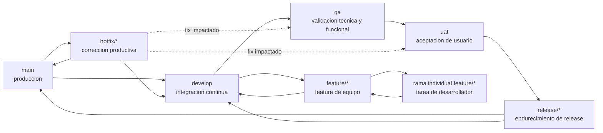

# ADR 0050: Estandarizacion de la Estrategia de Ramas Gitflow

## Estado
Aceptado

## Contexto
Los repositorios satelite necesitan un modelo comun de ramas que mantenga estable la produccion sin esconder el trabajo en ramas locales de larga vida. La linea base debe soportar integracion continua, validacion tecnica, aceptacion de usuario, preparacion de releases y correcciones urgentes de produccion sin agregar complejidad innecesaria para equipos pequenos.

Gitflow sigue siendo el estandar, extendido con ramas explicitas de promocion `qa` y `uat`. Estas ramas representan estados desplegables por ambiente, no carriles paralelos de desarrollo. El trabajo de funcionalidades sigue integrandose mediante `develop`; la promocion hacia `qa`, `uat` y `main` queda condicionada por evidencia.

Este ADR se alinea con [ADR-0005 CI/CD Quality CodeQL](./0005-ci-cd-quality-codeql.es.md), [ADR-0018 Testing Pyramid Quality Gates](./0018-testing-pyramid-quality-gates.es.md), y el ruleset ejecutable [`rulesets/adr/adr-0050-gitflow-branching.rules.json`](../../../../rulesets/adr/adr-0050-gitflow-branching.rules.json).

## Decision
Adoptar Gitflow como la estrategia obligatoria de ramas para los sistemas satelite que usan esta referencia de arquitectura progresiva y el toolset Evolith. Las ramas permanentes requeridas son `main`, `develop`, `qa` y `uat`. Las ramas temporales son `feature/*`, ramas individuales derivadas de una rama de feature, `release/*` y `hotfix/*` cuando correspondan.

### Modelo de Ramas
| Rama | Proposito | Creada Desde | Fusionada Hacia | Duracion |
|---|---|---|---|---|
| `main` | Fuente de verdad de produccion e historial de releases. | Inicializacion del repositorio o estado productivo anterior. | Ninguna directamente; solo PRs aprobados de release y hotfix. | Permanente |
| `develop` | Integracion continua del siguiente candidato de release. | `main` al iniciar el proyecto; luego se mantiene continuamente. | `qa`, `release/*` o PRs de estabilizacion de features. | Permanente |
| `qa` | Candidato para validacion tecnica y funcional. | PR de promocion desde `develop`. | `uat` despues de aprobacion QA; los fixes vuelven a `develop`. | Permanente |
| `uat` | Candidato para validacion de usuario. | PR de promocion desde `qa`. | `release/*` o `main` segun el tamano del release. | Permanente |
| `feature/*` | Incremento funcional o tecnico bajo responsabilidad de un equipo. | `develop`. | `develop` mediante PR. | Temporal |
| Ramas individuales de feature | Ramas de tarea de desarrollador bajo una feature activa. | `feature/*`. | Rama padre `feature/*` mediante PR o merge revisado. | Temporal |
| `release/*` | Endurecimiento de release, metadatos de version y fixes finales de regresion. | `uat` o `develop` para productos pequenos sin UAT separado. | `main` y retorno a `develop`. | Dias a semanas |
| `hotfix/*` | Correccion urgente de produccion. | `main` en el tag afectado. | `main`, `develop` y ramas activas `qa`/`uat`/`release/*` cuando esten impactadas. | Horas a dias |

### Diagrama Gitflow


### Flujo de Ramas
1. Crear `feature/<ticket-id>-<descripcion-corta>` desde `develop`.
2. Crear ramas individuales desde la rama padre de feature cuando varios desarrolladores trabajen en la misma funcionalidad, por ejemplo `feature/UMS-123-user-onboarding-api`.
3. Fusionar ramas individuales en su `feature/*` padre mediante PR revisado o una regla protegida equivalente del repositorio.
4. Fusionar la `feature/*` terminada en `develop` mediante PR despues de aprobar checks automaticos, revision y evidencia de pruebas requerida.
5. Promover `develop` a `qa` mediante PR de promocion. El PR debe resumir alcance, modulos modificados, migraciones, feature flags y notas de rollback.
6. Promover `qa` a `uat` solo despues de la aprobacion de QA sobre validacion tecnica y funcional.
7. Crear `release/<version>` desde `uat` para endurecimiento cuando el producto necesite una rama formal de release. Productos pequenos pueden promover `uat` directamente a `main` si aplican los mismos gates.
8. Fusionar `release/*` en `main`, crear el tag del release y fusionar la misma rama de release de vuelta a `develop`.
9. Eliminar ramas temporales despues del merge. Las ramas sin merge y sin actividad por mas de 30 dias deben revisarse, refrescarse o cerrarse.

### Criterios de Promocion
| Promocion | Criterios Minimos | Bloqueantes |
|---|---|---|
| `feature/*` a `develop` | PR aprobado, lint/build/unit tests exitosos, documentacion afectada actualizada, sin hallazgos criticos de seguridad. | CI fallando, falta de revision del owner, decision arquitectonica sin resolver. |
| `develop` a `qa` | Suite de integracion exitosa, auditoria de dependencias limpia o aceptada, migraciones revisadas, feature flags documentados, candidato desplegable creado. | Pruebas de integracion rotas, cambios de base de datos sin revisar, riesgo operativo no documentado. |
| `qa` a `uat` | Aprobacion QA, regresion funcional exitosa, defectos exploratorios triados, borrador de release notes disponible. | Defectos criticos/altos abiertos, escenarios de aceptacion incompletos, notas de rollback ausentes. |
| `uat` a `main` | Aceptacion del product owner o delegado, aprobacion del responsable de release, checklist productivo completo, ventana de despliegue confirmada. | UAT rechazado, plan de tag ausente, excepcion de seguridad o cumplimiento sin resolver. |
| `hotfix/*` a `main` | Evidencia de reproduccion, fix acotado, prueba de regresion o aceptacion explicita de riesgo, aprobacion expedita. | Expansion de alcance fuera del incidente, plan de back-merge ausente. |

### Responsables por Ambiente
| Rama de Ambiente | Responsable Principal | Controles Requeridos |
|---|---|---|
| `develop` | Lider de ingenieria | CI, lint, unit tests, validacion de commits, auditoria de dependencias, guardrails arquitectonicos. |
| `qa` | Lider QA con soporte de ingenieria | Despliegue desde `qa`, suite de regresion, pruebas de integracion/E2E, triage de defectos, evidencia de pruebas. |
| `uat` | Product owner o delegado de negocio | Escenarios de aceptacion, revision de release notes, sign-off de usuario, conocimiento de rollback. |
| `main` | Release manager o lider tecnico | PR protegido de release, gate de seguridad, aprobacion de despliegue productivo, tag firmado cuando la plataforma lo soporte. |

### Nombres de Ramas
Usar descripciones en minusculas, separadores con guion y un ticket o identificador trazable.

| Tipo | Patron | Ejemplo |
|---|---|---|
| Feature | `feature/<ticket-id>-<descripcion-corta>` | `feature/UMS-123-user-onboarding` |
| Rama individual de feature | `feature/<ticket-id>-<descripcion-corta>-<tarea>` | `feature/UMS-123-user-onboarding-api` |
| Fix antes de release | `bugfix/<ticket-id>-<descripcion-corta>` | `bugfix/UMS-231-fix-token-refresh` |
| Hotfix | `hotfix/<incident-id>-<descripcion-corta>` | `hotfix/PROD-789-patch-login-timeout` |
| Release | `release/<semver>` | `release/1.4.0` |
| Chore | `chore/<ticket-id>-<descripcion-corta>` | `chore/OPS-45-update-ci-cache` |

### Estandar de Commits
Los commits deben seguir Conventional Commits:

```text
<type>[optional scope]: <description>

[optional body]

[optional footer(s)]
```

Los tipos aceptados son `feat`, `fix`, `docs`, `style`, `refactor`, `test`, `build`, `ci`, `chore`, `perf` y `revert`. Usar `!` o un footer `BREAKING CHANGE:` para cambios incompatibles.

Ejemplos:

```text
feat(auth): add passwordless enrollment flow
fix(api): handle expired refresh token
docs(adr): clarify qa promotion criteria
```

### Pull Requests, Revisiones y Merge
- Todo cambio hacia `develop`, `qa`, `uat`, `main`, `release/*` y `hotfix/*` debe usar Pull Requests.
- Los PR deben incluir proposito, alcance, evidencia de validacion, notas de riesgo, ticket vinculado y capturas o evidencia API cuando cambie comportamiento visible para usuarios.
- Se requiere al menos una aprobacion para `develop`; se requieren al menos dos aprobaciones para `qa`, `uat`, `main`, `release/*` y `hotfix/*`, salvo excepcion explicita de politica de incidentes.
- El autor no puede ser el unico aprobador. Los code owners deben revisar las areas bajo su propiedad.
- Usar squash merge de `feature/*` hacia `develop` salvo que el repositorio tenga una razon aceptada para preservar historia de commits. Usar merge commits o estrategia auditable equivalente para `release/*` y `hotfix/*` para conservar visible la ascendencia del release.
- Resolver conversaciones de revision antes del merge. No fusionar con checks requeridos fallando.

### Versionado, Tags y Releases
- Usar Semantic Versioning para releases productivos: `v<major>.<minor>.<patch>`, por ejemplo `v1.4.0`.
- Crear tags desde `main` despues de fusionar el PR de release.
- Las ramas de release usan la version sin prefijo `v`: `release/1.4.0`.
- Los hotfix incrementan la version patch salvo que el responsable de release documente otro impacto SemVer.
- Las release notes deben resumir funcionalidades, fixes, migraciones, cambios operativos, problemas conocidos y consideraciones de rollback.
- Fusionar de vuelta cada release y hotfix en `develop` para evitar regresiones en el siguiente ciclo.

### Proteccion de Ramas
Proteger `main`, `develop`, `qa`, `uat` y `release/*`. La proteccion debe bloquear pushes directos, exigir PRs, exigir checks de CI vigentes, requerir conversaciones resueltas, impedir force pushes y restringir eliminacion. `main` debe exigir ademas aprobacion del release manager y commits o tags firmados cuando la plataforma lo soporte.

### Controles Automaticos
Cada repositorio debe aplicar los controles que correspondan a su perfil de runtime:

- Validacion de nombre de rama.
- Validacion de mensajes de commit con `commitlint` o equivalente.
- Linting, formato y analisis estatico.
- Unit tests y umbral de cobertura.
- Pruebas de integracion y E2E para candidatos promovidos.
- Escaneo de dependencias y secretos.
- SAST, CodeQL o analisis de seguridad equivalente.
- Escaneo de contenedores o infraestructura cuando se produzcan artefactos desplegables.
- Validacion de links, anchors, encoding y Mermaid para cambios documentales.
- Reporte de tendencia de cobertura para evitar reducciones silenciosas de proteccion.

### Herramientas Estandar
Linea base recomendada:

| Control | Herramientas Estandar |
|---|---|
| Nombres de ramas | Reglas del repositorio, GitHub Actions, GitLab CI o hooks pre-receive. |
| Formato de commits | Conventional Commits, `commitlint`, Husky o checks server-side nativos. |
| Calidad de PR | CODEOWNERS, ramas protegidas, checks requeridos, plantillas de PR. |
| Calidad de codigo | Linters de runtime, formatters, type checks, SonarQube o equivalente donde este adoptado. |
| Seguridad | CodeQL, dependency review, Dependabot o equivalente, secret scanning. |
| Pruebas y cobertura | Framework de pruebas del runtime, reporter de cobertura, runner E2E cuando aplique. |
| Automatizacion de release | Semantic versioning, generacion de changelog, tags firmados cuando se soporte. |

### Adopcion Incremental
Los equipos deben adoptar este estandar en pasos pequenos:

1. Proteger `main` y exigir PRs.
2. Agregar `develop` y exigir PRs desde ramas de feature.
3. Agregar validacion de nombres de ramas y Conventional Commits.
4. Agregar ramas de promocion `qa` y `uat` cuando existan ambientes o stakeholders.
5. Agregar ramas de release solo cuando el trabajo de estabilizacion necesite aislamiento.
6. Agregar automatizacion de hotfix despues del primer ejercicio de incidente productivo.
7. Endurecer gates de cobertura, seguridad y evidencia de release a medida que el producto madura.

No agregar ramas permanentes mas alla de `main`, `develop`, `qa` y `uat` sin una excepcion ADR. Preferir feature flags, ramas cortas y evidencia de promocion sobre forks permanentes por ambiente.

## Consecuencias
- **Pros**:
  - Separacion clara entre integracion, validacion, aceptacion y produccion.
  - Ruta de promocion auditable con responsables y evidencia explicita.
  - Releases, hotfixes y planificacion de rollback mas seguros.
  - Compatible con equipos pequenos porque los gates de `qa`, `uat` y `release/*` pueden adoptarse incrementalmente.
- **Cons**:
  - Mas proceso que trunk-based development.
  - Requiere higiene activa de ramas y back-merges disciplinados.
  - Una automatizacion pobre puede convertir las ramas de promocion en cuellos de botella manuales.


## Objetivo y Alcance

> Backfill pendiente — trazado como [GT-20](../../../governance/standards/vision/gap-tracking.es.md#gt-20) (estandarización de ADRs 2026-06-10).

## Decisiones y Estándares Relacionados

> Backfill pendiente — trazado como [GT-20](../../../governance/standards/vision/gap-tracking.es.md#gt-20) (estandarización de ADRs 2026-06-10).

---
[Volver al Indice](./README.es.md)
