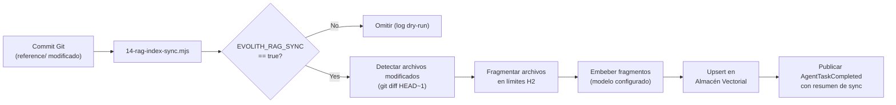

> **Bilingual Navigation:** [View English version](./0090-rag-knowledge-governance.md)

# ADR-0090: Estándar de Gobernanza de Conocimiento RAG

## Estado
Aceptado

## Fecha
2026-06-20

## Contexto y Problema
El corpus arquitectónico de Evolith — 101 ADRs, 142 entradas de gaps, 25 rulesets y sus contrapartes bilingües — no cabe en una única ventana de contexto de LLM a escala completa. A medida que el corpus crece, los asistentes arquitectónicos (como Wilson) que dependen de lecturas estáticas de archivos producirán respuestas cada vez más incompletas o desactualizadas.

La Generación Aumentada por Recuperación (RAG) resuelve esto dividiendo los documentos en unidades semánticamente coherentes, incrustándolas en un almacén vectorial y recuperando solo los fragmentos más relevantes en el momento de la consulta. Sin embargo, sin un estándar de gobernanza para **cómo** se dividen los documentos, qué **metadatos** llevan, y **cuándo** se regeneran los embeddings, los resultados RAG se vuelven poco confiables y divergen de la fuente markdown autoritativa.

## Decisión
Establecemos un **Estándar de Gobernanza de Conocimiento RAG** que define el contrato de fragmentación, el esquema de metadatos, las reglas de embedding y el disparador de sincronización para todos los archivos en el árbol `reference/`. Este ADR gobierna el *contrato*, no el proveedor específico de base de datos vectorial.

---

### 1. Estrategia de Fragmentación

Los documentos se dividen en **límites de sección H2** (`## Encabezado`). Cada fragmento resultante es una unidad semántica autocontenida con un identificador estable.

| Regla | Detalle |
|---|---|
| **Límite de división** | Cada encabezado `## ` inicia un nuevo fragmento |
| **Tamaño mínimo** | Los fragmentos menores a 100 tokens se fusionan con el siguiente hermano |
| **Tamaño máximo** | Los fragmentos mayores a 512 tokens se dividen recursivamente en límites `### ` |
| **Fragmento de nivel de archivo** | El encabezado del documento (frontmatter + H1 + primer párrafo antes del primer H2) siempre es un fragmento independiente |

---

### 2. Esquema de Metadatos del Fragmento

Cada fragmento embebido DEBE llevar los siguientes campos de metadatos. Estos campos se almacenan junto al vector en la base de datos y se usan para filtrado, atribución e invalidación de caché.

```json
{
  "chunk_id": "hash-sha256-de-source_file+section_heading",
  "source_file": "reference/architecture/adrs/core/0086-agentic-ai-telemetry-cost-control.md",
  "section_heading": "## Decisión",
  "adr_id": "0086",
  "gap_ids": ["GT-135"],
  "language": "en",
  "last_modified": "ISO-8601",
  "corpus_version": "sha-del-commit-git"
}
```

---

### 3. Reglas de Embedding

| Regla | Justificación |
|---|---|
| **Solo archivos EN** | El almacén vectorial embebe únicamente archivos en inglés (`*.md`). Las contrapartes en español (`*.es.md`) son para consumo humano; los LLMs comprenden ambos idiomas desde los embeddings EN. |
| **Re-embeber al cambiar** | Cualquier commit que modifique un archivo `reference/` dispara el re-embedding delta solo para los fragmentos afectados. |
| **Disparador de re-indexación completa** | Una re-indexación completa del corpus se dispara cuando cambia la estrategia de fragmentación o el esquema de metadatos (es decir, cuando se revisa este ADR). |
| **Agnosticismo del modelo** | El modelo de embedding no es obligatorio. Las implementaciones DEBEN declarar el nombre del modelo en los metadatos de `corpus_version` para compatibilidad con la invalidación de caché. |

---

### 4. Contrato de Sincronización

El pipeline de sincronización se define como un paso de CI (`14-rag-index-sync.mjs`) protegido por la bandera de entorno `EVOLITH_RAG_SYNC=true`.

**Flujo de sincronización:**



---

### 5. Agnosticismo del Almacén Vectorial

Este estándar **no** obliga a una base de datos vectorial específica. Todos los siguientes son objetivos de implementación válidos, siempre que soporten filtrado de metadatos en los campos definidos en la Sección 2:

| Proveedor | Notas |
|---|---|
| **pgvector** | Preferido para despliegues auto-alojados alineados con PostgreSQL |
| **Qdrant** | Preferido para despliegues agnósticos a la nube con alto rendimiento |
| **Chroma** | Adecuado para desarrollo local y pruebas |
| **Pinecone** | Adecuado para despliegues en la nube gestionados |

> Los equipos de implementación DEBEN documentar su proveedor elegido en el perfil `reference/knowledge/` del repositorio, no en este ADR.

## Consecuencias

### Positivas
- **Escalabilidad**: Wilson y los agentes futuros pueden consultar semánticamente el corpus completo de 101 ADRs sin agotamiento de la ventana de contexto.
- **Confiabilidad**: La sincronización delta garantiza que el almacén vectorial nunca esté más de un commit detrás del markdown autoritativo.
- **Auditabilidad**: El `corpus_version` (SHA de git) en los metadatos de cada fragmento permite reconstruir exactamente qué versión del conocimiento se usó para cualquier consulta.

### Negativas
- **Dependencia operacional**: Se requiere un almacén vectorial activo para agentes habilitados con RAG. Los entornos sin uno vuelven a las lecturas estáticas de archivos.
- **Mantenimiento de fragmentación**: Los cambios en la estructura del documento (agregar secciones H2 a los ADRs) pueden causar que los IDs de fragmentos cambien, requiriendo una re-indexación parcial.

## Referencias
- [ADR-0069: Integración del Protocolo de Contexto de Agente de IA](./0069-ai-agent-context-protocol-integration.md)
- [ADR-0079: Corpus de Referencia Multi-Topología](./0079-multi-topology-reference-corpus.md)
- [ADR-0086: Telemetría y Control de Costos de IA Agéntica](./0086-agentic-ai-telemetry-cost-control.md)
- [ADR-0088: Identidad Soberana para IA Agéntica](./0088-sovereign-identity-agentic-ai.md)
- [ADR-0089: Flujos de Trabajo Agénticos Orientados a Eventos](./0089-event-driven-agentic-workflows.md)

---
[Volver al Índice de ADRs Core](./README.md)

> **Agent Signature:** Architect Agent
