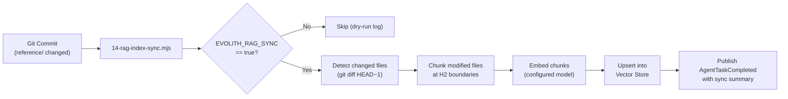

> **Bilingual Navigation:** [Ver versión en Español](./0090-rag-knowledge-governance.es.md)

# ADR-0090: RAG Knowledge Governance Standard

## Status
Accepted

## Date
2026-06-20

## Context and Problem
The Evolith architectural corpus — 101 ADRs, 142 gap entries, 25 rulesets, and their bilingual counterparts — cannot fit within a single LLM context window at full scale. As the corpus grows, architectural assistants (like Wilson) relying on static file reads will produce increasingly incomplete or stale responses.

Retrieval-Augmented Generation (RAG) solves this by chunking documents into semantically coherent units, embedding them into a vector store, and retrieving only the most relevant chunks at query time. However, without a governance standard for **how** documents are chunked, what **metadata** they carry, and **when** embeddings are regenerated, RAG results become untrustworthy and diverge from the authoritative markdown source.

## Decision
We establish a **RAG Knowledge Governance Standard** that defines the chunking contract, metadata schema, embedding rules, and synchronization trigger for all files in the `reference/` tree. This ADR governs the *contract*, not the specific vector database provider.

---

### 1. Chunking Strategy

Documents are split at **H2 section boundaries** (`## Heading`). Each resulting chunk is a self-contained semantic unit with a stable identifier.

| Rule | Detail |
|---|---|
| **Split boundary** | Every `## ` heading starts a new chunk |
| **Minimum size** | Chunks smaller than 100 tokens are merged with the next sibling |
| **Maximum size** | Chunks larger than 512 tokens are recursively split at `### ` boundaries |
| **File-level chunk** | The document header (frontmatter + H1 + first paragraph before the first H2) is always a standalone chunk |

---

### 2. Chunk Metadata Schema

Every embedded chunk MUST carry the following metadata fields. These fields are stored alongside the vector in the database and are used for filtering, attribution, and cache invalidation.

```json
{
  "chunk_id": "sha256-hash-of-source_file+section_heading",
  "source_file": "reference/architecture/adrs/core/0086-agentic-ai-telemetry-cost-control.md",
  "section_heading": "## Decision",
  "adr_id": "0086",
  "gap_ids": ["GT-135"],
  "language": "en",
  "last_modified": "ISO-8601",
  "corpus_version": "git-commit-sha"
}
```

---

### 3. Embedding Rules

| Rule | Rationale |
|---|---|
| **EN files only** | The vector store embeds only English (`*.md`) files. Spanish (`*.es.md`) counterparts are for human consumption; LLMs understand both languages from EN embeddings. |
| **Re-embed on change** | Any commit modifying a `reference/` file triggers delta re-embedding for the affected chunks only. |
| **Full re-index trigger** | A full corpus re-index is triggered when the chunking strategy or metadata schema changes (i.e., when this ADR is revised). |
| **Model agnosticism** | The embedding model is not mandated. Implementations MUST declare the model name in `corpus_version` metadata for cache invalidation compatibility. |

---

### 4. Synchronization Contract

The sync pipeline is defined as a CI step (`14-rag-index-sync.mjs`) guarded by the `EVOLITH_RAG_SYNC=true` environment flag.

**Sync flow:**



---

### 5. Vector Store Agnosticism

This standard does **not** mandate a specific vector database. All of the following are valid implementation targets, provided they support metadata filtering on the fields defined in Section 2:

| Provider | Notes |
|---|---|
| **pgvector** | Preferred for self-hosted, PostgreSQL-aligned deployments |
| **Qdrant** | Preferred for high-throughput, cloud-agnostic deployments |
| **Chroma** | Suitable for local development and testing |
| **Pinecone** | Suitable for managed cloud deployments |

> Implementation teams MUST document their chosen provider in the repository's `reference/knowledge/` profile, not in this ADR.

## Consequences

### Positive
- **Scalability**: Wilson and future agents can query the full 101-ADR corpus semantically without context-window exhaustion.
- **Trustworthiness**: Delta sync ensures the vector store never lags more than one commit behind the authoritative markdown.
- **Auditability**: The `corpus_version` (git SHA) in each chunk's metadata allows exact reconstruction of which version of knowledge was used for any given query.

### Negative
- **Operational dependency**: A live vector store is required for RAG-enabled agents. Environments without one fall back to static file reads.
- **Chunking maintenance**: Changes to document structure (adding H2 sections to ADRs) may cause chunk IDs to shift, requiring a partial re-index.

## References
- [ADR-0069: AI Agent Context Protocol Integration](./0069-ai-agent-context-protocol-integration.md)
- [ADR-0079: Multi-Topology Reference Corpus](./0079-multi-topology-reference-corpus.md)
- [ADR-0086: Agentic AI Telemetry & Cost Control](./0086-agentic-ai-telemetry-cost-control.md)
- [ADR-0088: Sovereign Identity for Agentic AI](./0088-sovereign-identity-agentic-ai.md)
- [ADR-0089: Event-Driven Agentic Workflows](./0089-event-driven-agentic-workflows.md)

---
[Back to Core ADR Index](./README.md)

> **Agent Signature:** Architect Agent
