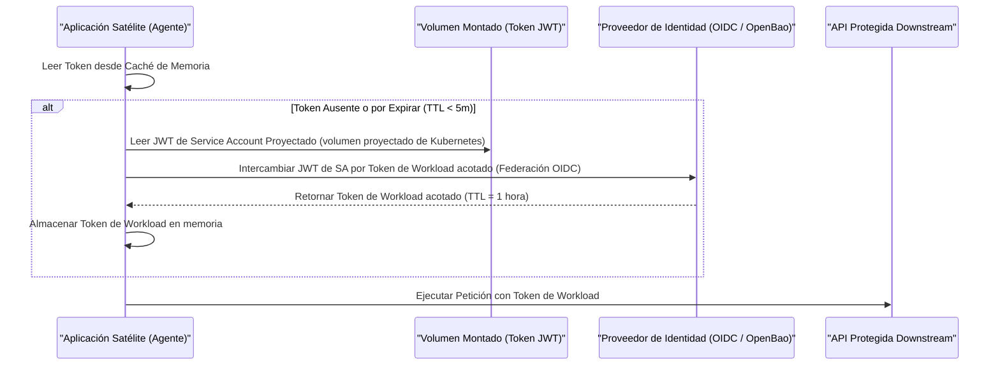

> **Navegación Bilingüe:** [View English version](./0091-workload-identity-token-rotation.md)

# ADR-0091: Estándar de Rotación de Tokens de Identidad de Workload

## Estado
Aceptado

## Fecha
2026-06-20

## Contexto y Problema
El ADR-0088 (Identidad Soberana para IA Agéntica) define las estructuras de delegación de claims de oauth (Patrón A) y los perfiles dedicados de Identidad de Carga de Trabajo o Workload Identity (Patrón B) para agentes. Sin embargo, las arquitecturas satélites aguas abajo enfrentan riesgos de seguridad si implementan tokens estáticos o si carecen de bucles de refresco claros y libres de credenciales.

Específicamente, los tokens de carga de trabajo que no expiran o que se persisten en sistemas de archivos locales o bases de datos aumentan el radio de impacto de una vulneración del contenedor o del sandbox del agente. Además, los equipos que construyen servicios satélite necesitan directrices de referencia sobre cómo integrarse automáticamente con proveedores de tokens OIDC de la plataforma (como OpenBao, proyección de tokens de Service Account de Kubernetes o SPIFFE/SPIRE) sin escribir lógica propietaria que transporte claves en el código base de la aplicación.

## Decisión
Estandarizamos los **contratos de ciclo de vida y rotación de tokens de Identidad de Carga de Trabajo** para todas las implementaciones satélite. Evolith Core permanece completamente libre de credenciales; este ADR define los contratos arquitectónicos que los servicios satélite deben hacer cumplir.

---

### 1. Restricciones de Tiempo de Vida del Token y Caché

Los servicios satélite DEBEN aplicar límites estrictos de Tiempo de Vida (TTL) y almacenamiento únicamente en memoria para todos los tokens en tiempo de ejecución:

| Tipo de Token | TTL Máximo | Requisito de Almacenamiento | Disparador de Refresco |
|---|---|---|---|
| **Token de Delegación** (Patrón A) | 5 minutos | Solo Caché en Memoria (no DB/Disco) | Umbral de expiración (TTL < 30s) |
| **Token de Workload** (Patrón B) | 1 hora | Solo Caché en Memoria (no DB/Disco) | Umbral de expiración (TTL < 5m) |

*Nota: Los tokens nunca deben persistirse en una base de datos o en un almacenamiento de archivos compartido. Si un contenedor o proceso se reinicia, debe volver a autenticarse para adquirir un nuevo token.*

---

### 2. Patrón OIDC de Refresco de Tokens de Carga de Trabajo

Para agentes autónomos (Patrón B), la aplicación cliente debe implementar un bucle de refresco de cliente OIDC utilizando caché de memoria local. El código de la aplicación permanece libre de contraseñas estáticas, claves de API o credenciales maestras de larga duración.



---

### 3. Planos de Integración de Plataforma

En lugar de construir la lógica de rotación de tokens dentro de la aplicación, los equipos de infraestructura satélite DEBEN aprovechar los mecanismos de proyección de tokens nativos de la plataforma.

#### A. Proyección de Tokens de Service Account de Kubernetes
Las aplicaciones que se ejecutan en Kubernetes deben usar tokens de Service Account proyectados en lugar de secretos por defecto de larga duración.
- El kubelet proyecta automáticamente un token de corta duración en un volumen local (`/var/run/secrets/tokens/vault-token`).
- El kubelet rota automáticamente este archivo al cumplir el 80% de su tiempo de vida.
- La aplicación solo necesita leer el archivo dinámicamente desde el disco al adquirir las credenciales, asegurando que la aplicación permanezca stateless y libre de credenciales.

```yaml
# Referencia de Spec de Pod de Kubernetes
spec:
  containers:
  - name: agent-workload
    volumeMounts:
    - mountPath: /var/run/secrets/tokens
      name: workload-token
  volumes:
  - name: workload-token
    projected:
      sources:
      - serviceAccountToken:
          path: workload-token
          expirationSeconds: 3600
          audience: https://identity.evolith.internal
```

#### B. API de Workload SPIFFE/SPIRE
Para despliegues bare-metal, VM o híbridos, los satélites deben obtener tokens directamente a través de la API de Workload de SPIFFE utilizando un Unix Domain Socket local.
- El Agente SPIRE rota las claves fuera de banda.
- La aplicación llama a la API de Workload a través de gRPC sobre el socket (`unix:///run/spiffe-workload-api.sock`) para obtener su SVID actual (Documento de Identidad Verificable SPIFFE), eliminando todo almacenamiento de credenciales locales.

## Consecuencias

### Positivas
- **Sin secretos estáticos**: Las aplicaciones satélite no requieren, almacenan ni gestionan claves de API maestras o contraseñas.
- **Tokens de corta duración**: Reducción de la ventana de exposición en caso de vulneración del sandbox del agente.
- **Desacoplamiento a nivel de plataforma**: El código de la aplicación depende de montajes de volumen locales o sockets, delegando la gestión de la seguridad a Kubernetes o SPIFFE/SPIRE.

### Negativas
- **Sobrecarga de infraestructura**: Requiere que los entornos de despliegue satélite soporten volmenes proyectados, agentes SPIRE o un proveedor federado OIDC.

## Referencias
- [ADR-0088: Identidad Soberana para IA Agéntica](./0088-sovereign-identity-agentic-ai.md)
- [ADR-0075: Estrategia de Autenticación de Core API](./0075-core-api-auth-strategy.es.md)
- [ADR-0016: Registro de Auditoría de Negocio Inmutable](./0016-immutable-business-audit-trail.es.md)

---
[Volver al Índice de ADRs Core](./README.md)

> **Agent Signature:** Architect Agent
