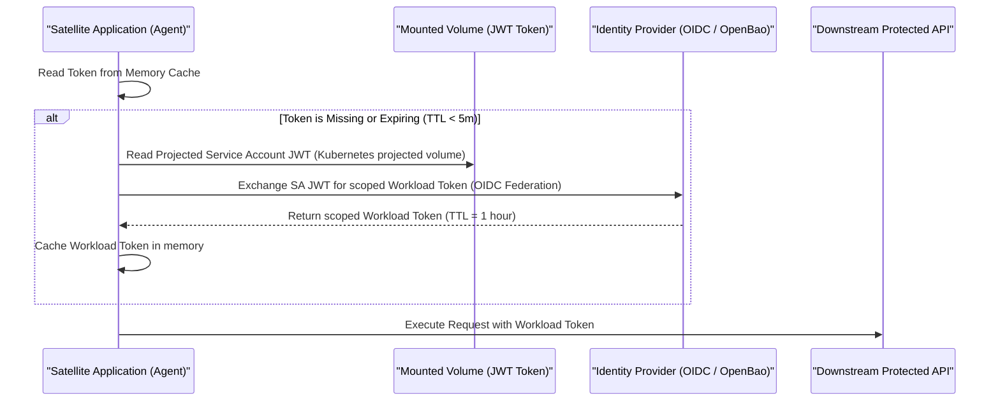

> **Bilingual Navigation:** [Ver versión en Español](./0091-workload-identity-token-rotation.es.md)

# ADR-0091: Workload Identity Token Rotation Standard

## Status
Accepted

## Date
2026-06-20

## Context and Problem
ADR-0088 (Sovereign Identity for Agentic AI) defines the oauth claim delegation structures (Pattern A) and dedicated Workload Identity profiles (Pattern B) for agents. However, downstream satellite architectures face security risks if they implement static tokens or lack clear, credential-free refresh loops. 

Specifically, workload tokens that do not expire or are persisted in local filesystems/databases increase the blast radius of container or sandbox compromise. Additionally, teams building satellite services need reference guidelines on how to integrate automatically with platform OIDC token providers (like OpenBao, Kubernetes Service Account token projection, or SPIFFE/SPIRE) without writing proprietary, key-carrying logic in the application codebase.

## Decision
We standardize the **Workload Identity Token Rotation and Lifecycle contracts** for all satellite implementations. Evolith Core remains completely credential-free; this ADR defines the architectural contracts that satellite services must enforce.

---

### 1. Token Lifetime & Cache Constraints

Satellite services MUST enforce strict Time-To-Live (TTL) limits and memory-only storage for all runtime tokens:

| Token Type | Maximum TTL | Storage Requirement | Refresh Trigger |
|---|---|---|---|
| **Delegation Token** (Pattern A) | 5 minutes | Memory Cache only (no DB/Disk) | Expiry threshold (TTL < 30s) |
| **Workload Token** (Pattern B) | 1 hour | Memory Cache only (no DB/Disk) | Expiry threshold (TTL < 5m) |

*Note: Tokens must never be persisted to a database or shared file storage. If a container or process is restarted, it must re-authenticate to acquire a fresh token.*

---

### 2. OIDC Workload Token Refresh Pattern

For autonomous agents (Pattern B), the client application must implement an OIDC client refresh loop using local memory caching. The application code remains free of static passwords, API keys, or long-lived master credentials.



---

### 3. Platform Integration Blueprints

Rather than building token rotation logic inside the application, satellite infrastructure teams MUST leverage platform-native token projection mechanisms.

#### A. Kubernetes Service Account Token Projection
Applications running in Kubernetes must use Projected Service Account Tokens instead of default long-lived secrets.
- The kubelet automatically projects a short-lived token onto a local volume (`/var/run/secrets/tokens/vault-token`).
- Kubelet automatically rotates this file at 80% of its lifetime.
- The application only needs to read the file dynamically from disk when acquiring credentials, ensuring the app remains stateless and credential-free.

```yaml
# Kubernetes Pod Spec Reference
spec:
  containers:
  - name: agent-workload
    volumeMounts:
    - mountPath: /var/run/secrets/tokens
      name: workload-token
  volumes:
  - name: workload-token
    projected:
      sources:
      - serviceAccountToken:
          path: workload-token
          expirationSeconds: 3600
          audience: https://identity.evolith.internal
```

#### B. SPIFFE/SPIRE Workload API
For bare-metal, VM, or hybrid deployments, satellites should fetch tokens directly via the SPIFFE Workload API using a local Unix Domain Socket.
- The SPIRE Agent rotates keys out-of-band.
- The application calls the Workload API via gRPC over socket (`unix:///run/spiffe-workload-api.sock`) to fetch its current SVID (SPIFFE Verifiable Identity Document), eliminating all local credential storage.

## Consequences

### Positive
- **No static secrets**: Satellite applications do not require, store, or manage master API keys or passwords.
- **Short-lived tokens**: Reduced exposure window on agent sandbox compromises.
- **Platform-level decoupling**: The application code relies on local volume mounts or sockets, offloading security management to Kubernetes or SPIFFE/SPIRE.

### Negative
- **Infrastructure Overhead**: Requires satellite deployment environments to support projected volumes, SPIRE agents, or an OIDC federated provider.

## References
- [ADR-0088: Sovereign Identity for Agentic AI](./0088-sovereign-identity-agentic-ai.md)
- [ADR-0075: Core API Auth Strategy](./0075-core-api-auth-strategy.md)
- [ADR-0016: Immutable Business Audit Trail](./0016-immutable-business-audit-trail.md)

---
[Back to Core ADR Index](./README.md)

> **Agent Signature:** Architect Agent
