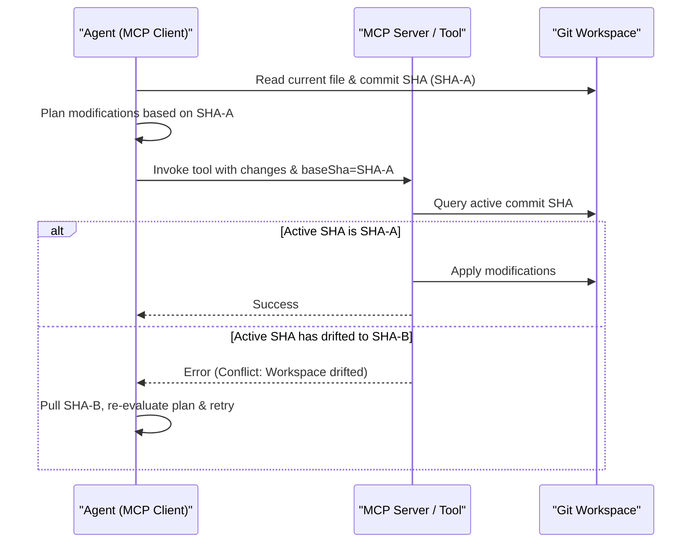

> **Bilingual Navigation:** [Ver versión en Español](./0093-mcp-concurrency-locking.es.md)

# ADR-0093: Concurrency Control and Resource Locking Standard for MCP Tools

## Status
Accepted

## Date
2026-06-20

## Context and Problem
Model Context Protocol (MCP) servers expose tools that allow autonomous agents to read and modify local systems (such as writing files, refactoring code, or mutating database records). When multiple agents operate in parallel, or a single complex workflow spawns concurrent subagents, they may attempt to write to the same files or database records simultaneously.

Without concurrency control and resource locking rules, satellite services face three critical risks:
1. **Dirty Writes / Lost Updates**: Agent B overwrites changes made by Agent A, leading to silent code regression or state corruption.
2. **Race Conditions**: Two agents attempting to edit a file concurrently create partial, syntax-broken, or malformed merges.
3. **Workspace Drift**: An agent plans changes based on a file state that has already drifted due to another agent's execution.

This ADR defines standard architectural patterns for optimistic and pessimistic locking that satellite MCP tools must implement to prevent concurrent write anomalies, while keeping Evolith Core credential-free.

## Decision
We standardize two concurrency strategies for satellite MCP tools: **Optimistic State Verification** for repository files, and **Pessimistic Resource Locking** for exclusive operations.

---

### 1. Optimistic State Verification (Git-First Validation)

MCP tools mutating repository files MUST implement optimistic locking using the source repository's version state.

- **Required Parameter**: Mutative tools (e.g. `evolith-apply-patch`, `evolith-write-file`) must declare a `baseSha` string parameter.
- **Verification Rule**: Before executing the write operation, the tool must verify that the current local Git commit SHA matches the provided `baseSha`.
- **Conflict Handling**: If the local repository's HEAD SHA differs from the `baseSha`, the tool must reject the write and return a conflict error. This forces the agent to fetch the updated state, re-evaluate its plan, and retry.



---

### 2. Pessimistic Resource Locking

For non-git database operations or long-running exclusive tasks, satellite tools must use a temporary pessimistic lock.

- **Lock Scope**: Exclusive write operations on a resource (e.g., database entity ID, path string).
- **Mechanism**:
  1. A transient, unique lock identifier is generated (e.g., writing a `.lock` file to the workspace directory or utilizing a distributed lock provider like Redis or Consul).
  2. The lock contains metadata: `lockedBy` (Agent ID), `expiresAt` (timestamp, maximum TTL of 2 minutes to prevent deadlocks), and `correlationId`.
  3. If another agent calls the same tool on that resource before the lock expires or is released, the tool rejects the call immediately.

---

### 3. Concurrency Error Contracts

When a write operation is rejected due to a lock conflict or SHA mismatch, the MCP tool MUST return a standardized error response:

```json
{
  "success": false,
  "error": {
    "code": "CONCURRENCY_CONFLICT",
    "message": "Resource is locked or base state has drifted.",
    "meta": {
      "conflict_type": "git_sha_mismatch",
      "expected_sha": "f12f060ebb72",
      "actual_sha": "a3f9256612df",
      "locked_by": "agent-reviewer-01"
    }
  }
}
```

## Consequences

### Positive
- **Integrity protection**: Eliminates lost updates and broken syntax merges caused by parallel agent writes.
- **Stateless core**: Concurrency check logic is processed within individual tools using local git metrics or local locks, keeping Evolith Core stateless.
- **Fail-fast loop**: Agents discover workspace drifts immediately and can self-correct dynamically.

### Negative
- **Agent complexity**: Agents must be designed to handle transaction failures, fetch updated context, and retry.

## References
- [ADR-0087: ABAC for Agentic Tool Execution](./0087-abac-agentic-tool-execution.md)
- [ADR-0089: Event-Driven Agentic Workflows](./0089-event-driven-agentic-workflows.md)

---
[Back to Core ADR Index](./README.md)

> **Agent Signature:** Architect Agent
