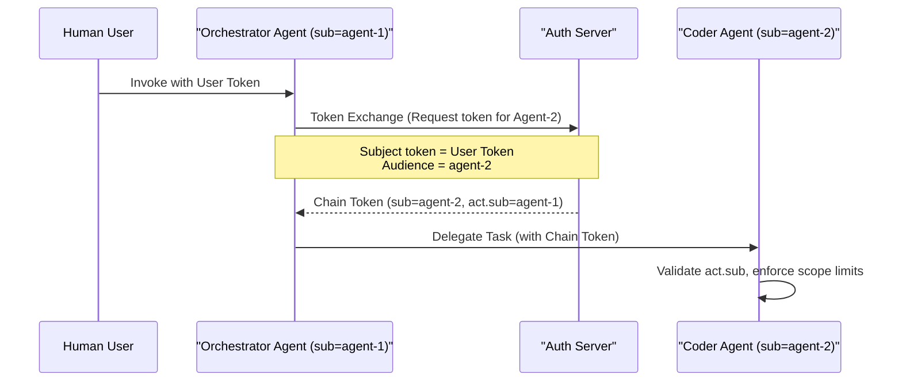

> **Bilingual Navigation:** [Ver versión en Español](./0094-multi-agent-handoff.es.md)

# ADR-0094: Multi-Agent Handoff and Task Delegation Standards

## Status
Accepted

## Date
2026-06-20

## Context and Problem
As autonomous agent topologies expand, complex workflows require multiple specialized agents delegating sub-tasks to one another. For example, a high-level orchestration agent receives a system request, delegates code modifications to a coding agent, which subsequently delegates security analysis to a scanner agent.

Without formal standards for agent handoff and delegation, satellite services face three critical risks:
1. **Correlation Fragmentation**: Telemetry context is lost between call boundaries, preventing developers from tracing a complete multi-agent workflow in OpenTelemetry.
2. **Privilege Escalation or Leakage**: A subordinate agent runs with the broad permissions of the calling orchestrator, or conversely, is blocked due to missing delegation tokens.
3. **Inconsistent Task Serialization**: Agents exchange task data in ad-hoc, proprietary payloads, causing runtime parse errors and high coupling.

This ADR defines standard architectural metadata schemas, token-forwarding contracts, and context propagation rules for multi-agent delegation, keeping the core codebase credential-free.

## Decision
We standardize the **Multi-Agent Task Delegation Envelope**, the **Token Chaining Contract**, and the **Context Propagation Protocol** for all satellite implementations.

---

### 1. The Task Delegation Envelope Schema

All agent-to-agent task invocations MUST wrap their payloads in a standardized JSON delegation envelope:

```json
{
  "task_id": "job-88392-1a",
  "session_id": "session-90021-z",
  "delegation_metadata": {
    "delegated_by": "agent-orchestrator-prod-01",
    "delegated_to": "agent-security-scanner-02",
    "timestamp": "2026-06-20T18:10:00Z",
    "scopes": ["read:repository", "scan:security"]
  },
  "context": {
    "traceparent": "00-4bf92f3577b34da6a3ce929d0e0e4736-00f067aa0ba902b7-01",
    "tracestate": "evolith.agent.depth=2"
  },
  "payload": {
    "repository_url": "https://github.com/beyondnet/some-repo",
    "target_commit": "8c238ec7"
  }
}
```

---

### 2. Token Chaining Contract (Delegated Authorization)

To enforce least-privilege during handoffs without utilizing static secrets, agents must leverage **Chained Delegation Tokens**.

1. **Exchange Requirement**: The calling agent must never share its own raw workload identity key with the subordinate agent.
2. **OAuth 2.0 Act-Claim Chaining**: The calling agent exchanges its current token for a new token targeting the subordinate agent's audience, adding itself to the actor claim:
   - `sub`: Subordinate Agent ID.
   - `act.sub`: Calling Agent ID.
   - `act.act.sub`: Original Human User ID (if applicable).
3. **Scope Contraction**: The new token's scopes must be a strict subset of the calling agent's active scopes.



---

### 3. Trace Context Propagation Protocol

To preserve end-to-end trace correlation across queues (RabbitMQ/MassTransit) and HTTP endpoints:

- **OpenTelemetry Conformance**: Satellites must inject and extract trace context using the W3C Trace Context specification (`traceparent`, `tracestate`).
- **Log Correlation**: Subordinate agents must log all actions with the active `session_id` and `task_id` parsed from the delegation envelope, ensuring auditability under ADR-0016.

## Consequences

### Positive
- **End-to-end auditability**: Developers can trace a request from the triggering human through all subordinate agent hops in a single OpenTelemetry session.
- **Scope control**: Subordinate agents are restricted to the subset of permissions explicitly delegated by the caller.
- **Stateless standardization**: Core remains decoupled from runtime execution; standard formats are parsed locally by satellite endpoints.

### Negative
- **Integration complexity**: Satellite agents require OTel middleware and token-exchange logic configured in their deployment platforms.

## References
- [ADR-0088: Sovereign Identity for Agentic AI](./0088-sovereign-identity-agentic-ai.md)
- [ADR-0089: Event-Driven Agentic Workflows](./0089-event-driven-agentic-workflows.md)
- [ADR-0016: Immutable Business Audit Trail](./0016-immutable-business-audit-trail.md)

---
[Back to Core ADR Index](./README.md)

> **Agent Signature:** Architect Agent
