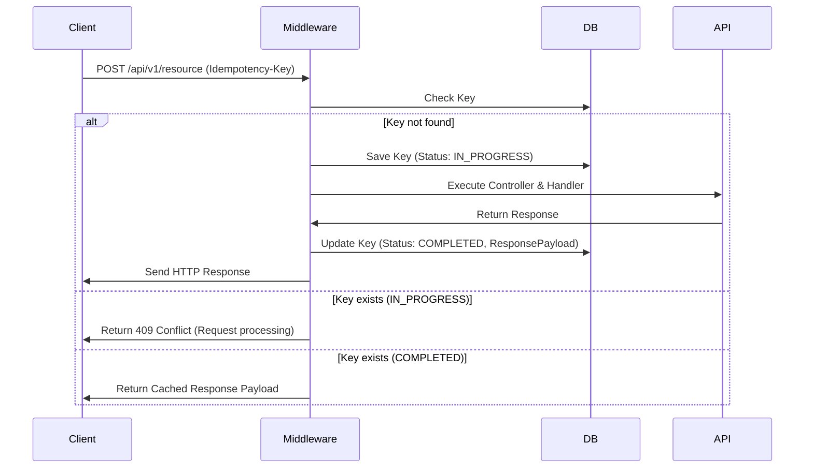

# [ADR 0063](0063-dotnet-b2b-idempotency-middleware.md): Middleware de Idempotencia para Peticiones B2B en ASP.NET Core

## 1. Estado
**Estado**: Propuesto
**Fecha**: 2026-05-23
**Alcance**: Stack Tecnológico - Integración y Confiabilidad en APIs .NET

---

## 2. Contexto
En APIs empresariales orientadas a B2B, las conexiones a menudo viajan a través de NATs compartidas o gateways corporativos expuestos a micro-cortes. Si un cliente reintenta una llamada de creación o mutación de recursos (`POST`/`PUT`) debido a una caída de la conexión, el servidor puede procesar la solicitud duplicadamente, provocando registros inconsistentes o condiciones de carrera. Es fundamental proveer un mecanismo automático en ASP.NET Core que intercepte y dedulique peticiones idénticas.

---

## 3. Decisión
Se implementa un **Middleware Interceptor de Idempotencia** en el pipeline HTTP de ASP.NET Core:

### A. Reglas de Implementación
1. **Identificación de Cabecera**: Intercepta llamadas decoradas con metadatos de idempotencia requiriendo la cabecera HTTP `Idempotency-Key`.
2. **Registro Persistente**: Almacena el hash de la petición (`IdempotencyKey` + `UserId` + `RequestPath`) en una tabla persistente de control.
3. **Buffering de Respuesta**:
   - Si la clave es nueva: Registra el estado como *In-Flight* (En progreso). Tras la ejecución, persiste el código de estado y el payload retornado.
   - Si la clave está en proceso: Retorna HTTP 409 Conflict para bloquear carreras simultáneas.
   - Si la clave ya está completada: Omite la ejecución y retorna inmediatamente la respuesta almacenada en caché.

### B. Diagrama de Flujo

---

## 4. Consecuencias

### Positivas
- **Seguridad en la API**: Garantiza que reintentos de red no alteren la consistencia de datos de negocio.
- **Transparencia**: El cliente recibe una respuesta unificada y consistente sin importar micro-cortes de red intermediarios.

### Negativas
- **Crecimiento de Almacenamiento**: Requiere trabajadores automatizados de limpieza para purgar registros expirados periódicamente.

---

## 5. Revisión
Evaluar las métricas de acierto del caché de idempotencia y eficiencia de depuración en la sesión operativa del Q3.

## Objetivo y Alcance

> Backfill pendiente — trazado como [GT-20](../../../governance/standards/vision/gap-reference-catalog.es.md#gt-20) (estandarización de ADRs 2026-06-10).

## Opciones Consideradas

> Backfill pendiente — trazado como [GT-20](../../../governance/standards/vision/gap-reference-catalog.es.md#gt-20) (estandarización de ADRs 2026-06-10).

## Evidencias y Criterios de Evaluación

> Backfill pendiente — trazado como [GT-20](../../../governance/standards/vision/gap-reference-catalog.es.md#gt-20) (estandarización de ADRs 2026-06-10).

## Decisiones y Estándares Relacionados

> Backfill pendiente — trazado como [GT-20](../../../governance/standards/vision/gap-reference-catalog.es.md#gt-20) (estandarización de ADRs 2026-06-10).

## Vigilancia Tecnológica (Tendencias, Madurez, Adopción, Soporte)

> Backfill pendiente — trazado como [GT-20](../../../governance/standards/vision/gap-reference-catalog.es.md#gt-20) (estandarización de ADRs 2026-06-10).

## Fuentes Actuales

> Backfill pendiente — trazado como [GT-20](../../../governance/standards/vision/gap-reference-catalog.es.md#gt-20) (estandarización de ADRs 2026-06-10).

---
[Volver al Índice](./README.es.md)
