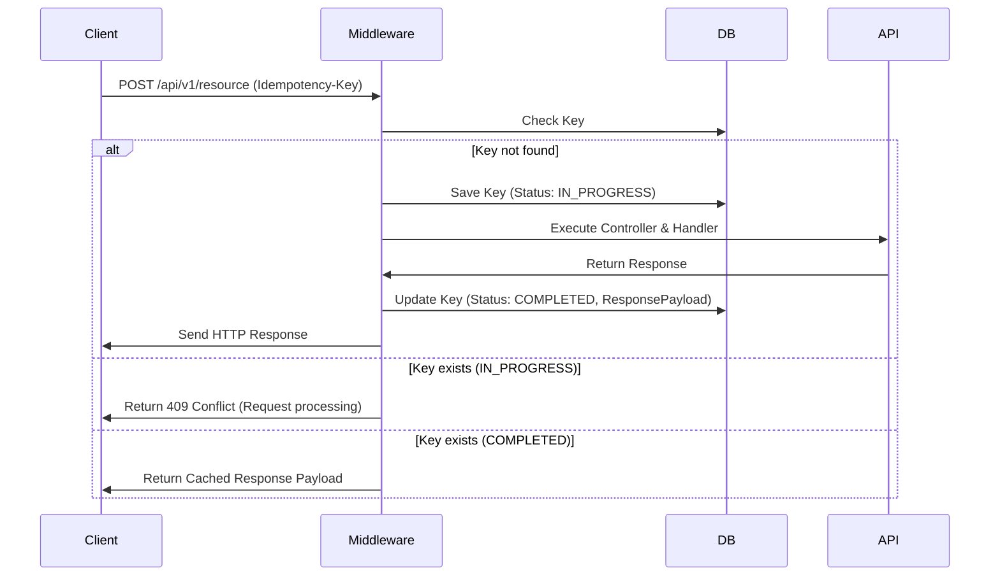

# [ADR 0063](0063-dotnet-b2b-idempotency-middleware.md): B2B Request Idempotency Middleware in ASP.NET Core

## 1. Status
**Status**: Proposed
**Date**: 2026-05-23
**Scope**: Technology Stack - .NET API Integration & Reliability

---

## 2. Context
In enterprise B2B APIs, client requests often route through shared corporate NATs or gateways, exposing network transactions to transient timeouts. If a client retries a write or creation call (e.g. `POST`) due to a drop in the response connection, the server may process the request twice, leading to duplicate database records or race conditions. To prevent these failures, we need an ASP.NET Core middleware that detects, tracks, and returns cached responses for identical requests.

---

## 3. Decision
We implement a unified **Idempotency Interceptor Middleware** in the ASP.NET Core pipeline:

### A. Implementation Rules
1. **Header Identification**: Intercept endpoints decorated with idempotency metadata using the `Idempotency-Key` HTTP header.
2. **Transaction Database Check**: Cache request hashes (`IdempotencyKey` + `UserId` + `RequestPath`) inside a persistent `IdempotencyRequests` table.
3. **Response Buffering**:
   - If key is new: Mark request as *In-Flight* and proceed. Once complete, save the HTTP status code and response payload.
   - If key is currently processing: Return HTTP 409 Conflict to block concurrent races.
   - If key exists and is completed: Bypass execution and immediately return the cached response payload and status.

### B. Lifecycle Pattern

---

## 4. Consequences

### Positive
- **API Safety**: Prevents duplicate resource initialization and race conditions from automated retries.
- **Client Transparency**: The client receives a correct, consistent response even during network drops.

### Negative
- **Storage Backing**: Requires cache sweep workers to periodically purge expired keys from the idempotency log.

---

## 5. Review
Assess idempotency cache hit rates and sweep cleanups in the Q3 operations review.

---
[Back to Index](./README.md)
