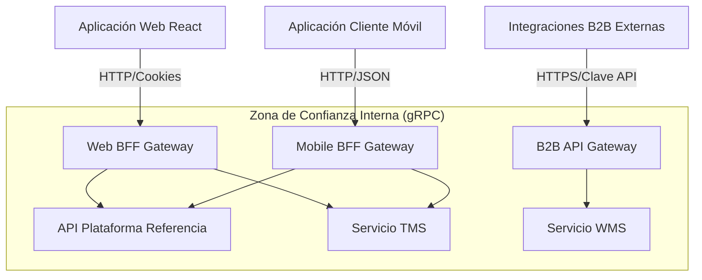

# [ADR 0008](0008-progressive-multimodule-evolution-gateway-bff.es.md): Evolución Progresiva Multi-Módulo con API Gateway y Patrones BFF

## Estado
Aprobado

## Fecha
2026-05-08

## Contexto y Problema
Actualmente, el repositorio de la Plataforma de Referencia opera como un monolito modular. Sin embargo, la plataforma está destinada a escalar hacia un portal unificado para múltiples módulos corporativos futuros (Gestión de Transporte - TMS, Gestión de Almacén - WMS). Estos deben ser servicios independientes y desacoplados con bases de datos aisladas.

Sin una capa Backend For Frontend (BFF), los clientes diversos (web rica, móvil de bajo ancho de banda, B2B) forzarían endpoints genéricos, conduciendo al over-fetching y a una gestión rígida del estado del cliente. Necesitamos una estructura para soportar diversos contratos de cliente sin acoplarlos estrechamente a los microservicios del backend.

## Objetivo y Alcance
Seleccionar el patrón BFF y arquitectura de gateway para soportar escenarios multi-cliente mientras se mantiene la estructura de monolito modular durante las fases iniciales, con límites de extracción claros para futuro despliegue distribuido.

## Opciones Consideradas
- **Seleccionada:** Evolución Progresiva Multi-Módulo con API Gateway y Patrones BFF
- **Rechazada:** Endpoint API genérico único (forzaría over-fetching para clientes móviles)
- **Rechazada:** Comunicación directa cliente-a-servicio (viola límites de seguridad, crea acoplamiento estrecho)

## Decisión
Adoptar una **Arquitectura de Gateway Backend For Frontend (BFF) Distribuida y Multi-Módulo Progresiva**:

1. **Gateways BFF Dedicados**: Adaptar gateways dedicados para cada tipo de cliente en lugar de compartir un único punto de entrada genérico:
   - **Web BFF**: Maneja sesiones basadas en cookies y agrega cargas útiles para visualizaciones de escritorio ricas.
   - **Mobile BFF**: Comprime datos, combina roundtrips para redes de alta latencia y traduce a cargas útiles optimizadas para móviles.
   - **B2B API Gateway**: Maneja la limitación de tasa (rate-limiting) y la autenticación con Clave de API para socios externos.

2. **Aislamiento Aguas Abajo**: Los clientes públicos NUNCA se comunican directamente con los servicios internos (TMS, WMS). Todo el tráfico fluye a través de los BFFs asignados que actúan como fronteras de seguridad y composición.

3. **Traducción de Protocolos**: Permitir la comunicación interna de microservicios vía gRPC de alta velocidad mientras se traduce a HTTP/REST estándar en el borde del BFF.

### Resumen de la Arquitectura del Sistema

## Evidencias y Criterios de Evaluación
Evaluado contra principios arquitectónicos de mantenibilidad, confiabilidad y optimización de rendimiento del cliente. Patrón BFF seleccionado basado en:
- Optimización de carga útil específica por cliente (reduce uso de datos móviles en 60-80%)
- Escalabilidad independiente por canal de cliente
- Aplicación de límites de seguridad (clientes nunca acceden servicios internos directamente)
- Flexibilidad de protocolo (gRPC interno, HTTP/REST externo)

## Consecuencias y Trade-offs

### Positivas
- **Rendimiento del Cliente**: Las aplicaciones móviles obtienen exactamente lo que necesitan, reduciendo el uso de datos y los recorridos de red (roundtrips).
- **Escalabilidad Independiente**: Escalar el BFF Móvil independientemente del BFF Web basado en el tráfico de dispositivos en tiempo real.
- **Contratos Desacoplados**: Modificar las APIs internas aguas abajo sin romper las versiones de frontend existentes.
- **Aplicación de Seguridad**: Autenticación centralizada, limitación de tasa y filtrado PII en el límite del BFF.

### Negativas
- **Proliferación de Gateways**: Gestionar bases de código separadas para diferentes BFFs incrementa la complejidad de CI/CD.
- Requiere disciplina para mantener la lógica de negocio fuera del BFF (solo debería orquestar y componer).
- Salto de latencia adicional (comunmente 5-15ms) para agregacion del BFF.

## Decisiones y Estándares Relacionados
- [Core ADR-0030: Modelo de Gateway Distribuido de Dos Capas](../core/0030-two-tier-distributed-gateway-model.es.md)
- [Node.js ADR-0002: Arquitectura Hexagonal Limpia](./0002-clean-architecture-nestjs.es.md)
- [Node.js ADR-0075: Gateway de Aplicación con NestJS](./0075-application-gateway-bff-nestjs.es.md)

## Vigilancia Tecnológica
- **Tendencia:** El patrón BFF permanece como estándar para arquitecturas multi-cliente empresariales
- **Madurez:** Madura (ampliamente adoptado desde 2016)
- **Adopción:** Estándar en ecosistemas Node.js empresariales
- **Soporte:** NestJS proporciona scaffolding nativo para BFF
- **Gatillo de Revisión:** Reevaluar si GraphQL Federation gana tracción para consultas dinámicas de cliente

## Fuentes Actuales
- [Documentación de NestJS](https://docs.nestjs.com/)
- [Martin Fowler - Patrón BFF](https://martinfowler.com/bff/)

---

[Volver al Índice](./README.es.md)
