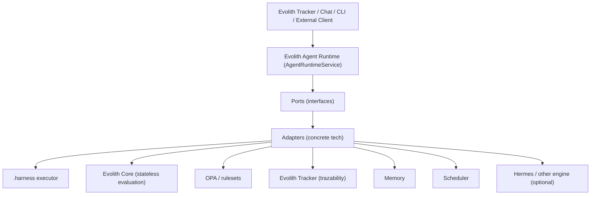
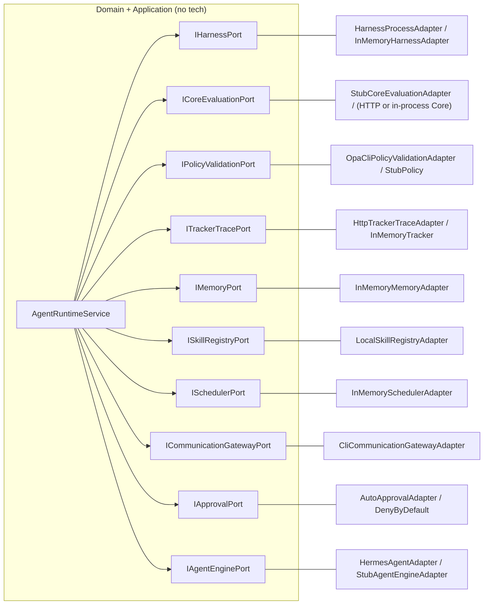
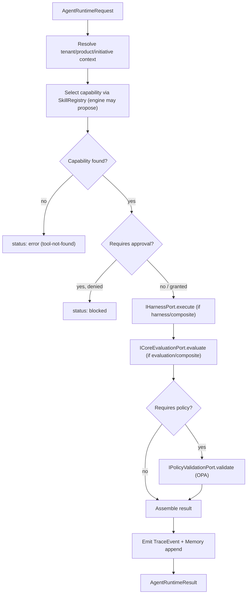
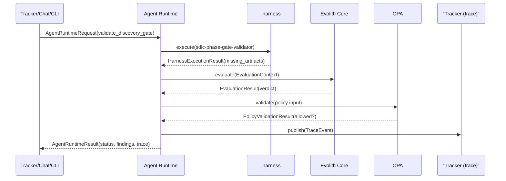
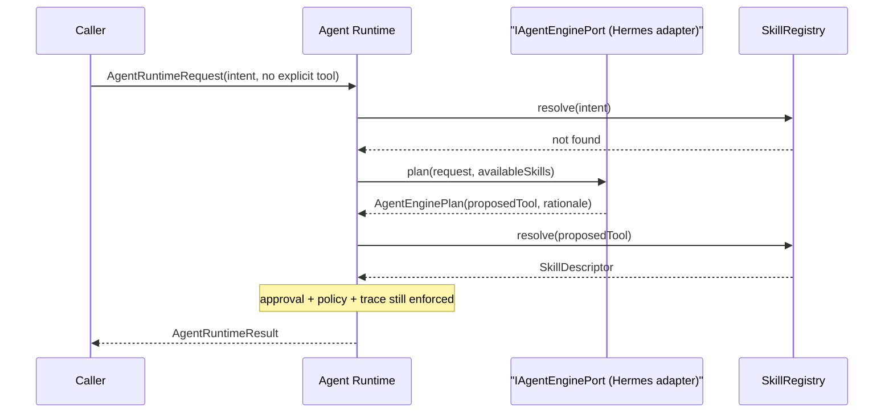

# Evolith Agent Runtime — Arquitectura

> **Navegación bilingüe:** [English version](./architecture.md)

Este documento describe las capas, el flujo de ejecución, la separación de
responsabilidades y los diagramas del Evolith Agent Runtime. Consulta también
[Puertos y Adaptadores](./ports-and-adapters.es.md) e
[Integración con .harness](./harness-integration.es.md).

## 1. Qué es

El Agent Runtime es una capa de orquestación delgada y gobernada. Dado un
`AgentRuntimeRequest`, resuelve el contexto tenant/producto/iniciativa,
selecciona una capacidad gobernada, invoca los puertos adecuados, ejecuta
validaciones, devuelve un `AgentRuntimeResult` y emite trazabilidad. Está
implementada en
[`packages/agent-runtime`](../../../packages/agent-runtime/README.es.md)
siguiendo **Puertos y Adaptadores** para que ninguna tecnología de runtime/LLM
se convierta en dependencia del dominio.

> **Importante:** Las capacidades del runtime y la madurez de su implementación (como el `InteractionAdapterPort`) están estrictamente gobernadas por la [Matriz de Madurez de Capacidades de Adaptadores](../../governance/standards/vision/maturity-assessment.es.md#5-madurez-de-capacidades-de-adaptadores-agent-runtime).

## 2. Por qué una nueva capa que no reemplaza .harness

`.harness` es el mecanismo oficial, versionado y auditable que **ejecuta**
scripts, playbooks, validators, audits y skills. El Agent Runtime atiende otra
preocupación: **decide qué ejecutar, lo gobierna y lo registra**. Mantenerlos
separados implica:

- `.harness` sigue siendo el único ejecutor gobernado; el runtime lo invoca por
  un puerto (`IHarnessPort`) y nunca lo reimplementa.
- El runtime puede conversar, recordar, programar y recomendar, preocupaciones
  que no pertenecen a un ejecutor determinístico.
- Cada lado evoluciona de forma independiente: un ejecutor `.harness`
  remoto/aislado es un cambio de adaptador; un nuevo motor de razonamiento es
  otro cambio de adaptador.

## 3. Visión general de la arquitectura



El runtime depende únicamente de la fila **Puertos**. Todo lo que está por
debajo es reemplazable sin tocar el runtime.

## 4. Mapa de puertos y adaptadores



Catálogo completo: [Puertos y Adaptadores](./ports-and-adapters.es.md).

## 5. Flujo de ejecución

El flujo base combina la ejecución de `.harness` y la evaluación del Core en un
único resultado gobernado, luego valida con OPA y registra trazabilidad.



El pipeline de contratos de datos, nombrado explícitamente:

```text
AgentRuntimeRequest
  -> HarnessExecutionRequest -> HarnessExecutionResult
  -> EvaluationContext (CoreEvaluationRequest) -> EvaluationResult
  -> PolicyValidationResult
  -> AgentRuntimeResult
  -> TrackerTraceEvent
```

Validación de un gate como secuencia:



Ejecución con el motor opcional Hermes (solo **propone**; el runtime sigue
gobernando):



## 6. Separación de responsabilidades

Cada resultado lleva un bloque `trace` que nombra **quién hizo qué**, de modo que
las auditorías nunca tienen que confiar en el resumen del propio runtime:

| Campo | Valor | Significado |
|---|---|---|
| `executedBy` | `agent_runtime` | El runtime orquestó la llamada |
| `validatedBy` | `.harness` | La capacidad que produjo los hechos |
| `governedBy` | `evolith_core` | El Core evaluó contra contratos/rulesets |
| `policyEngine` | `opa` | OPA aplicó la política sobre el resultado |

El runtime nunca afirma haber gobernado; lo hacen el Core y OPA. Este es el
mecanismo que mantiene honesta a la capa agéntica.

## 7. Tenant, producto e iniciativa como contexto

Tenant/producto/iniciativa se **reciben por petición** como identificadores
opacos en `RuntimeContext`, se reflejan en las trazas y se reenvían al Core como
contexto de evaluación temporal únicamente (según el contrato del Core sin
estado). Nunca se embeben en `.harness` ni los persiste el runtime. Evolith
Tracker sigue siendo el sistema de registro; el runtime solo enruta, gobierna y
traza sobre esos identificadores.

## 8. Alcance del MVP frente a extensiones futuras

| Capacidad | MVP | Extensión futura |
|---|---|---|
| Pipeline gobernado completo | Sí | — |
| Adaptadores stub/in-memory | Sí | — |
| Adaptador de proceso `.harness` | Sí | Ejecutor remoto/aislado |
| Adaptador de política OPA CLI | Sí | Adaptador de servidor OPA persistente |
| Adaptador Tracker por HTTP | Sí | Batching, reintentos, perfiles de auth |
| Adaptador de evaluación del Core | Stub | `EvaluationOrchestrator` en proceso / Core REST |
| Motor | Stub determinístico | Cliente Hermes real; enrutado multimotor |
| Scheduler | In-memory | Adaptador cron/cola durable |
| Aprobación | Auto / deny-by-default | Flujo HITL en chat/Tracker |
