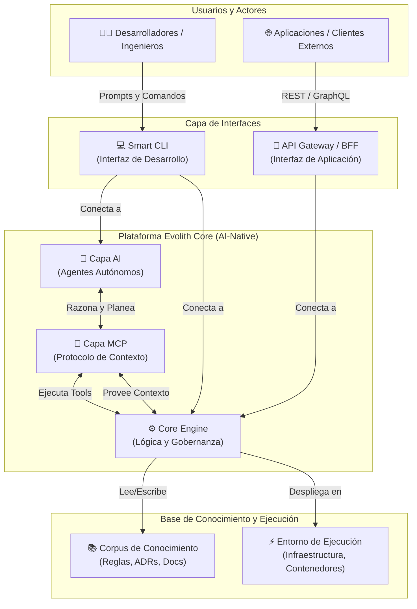
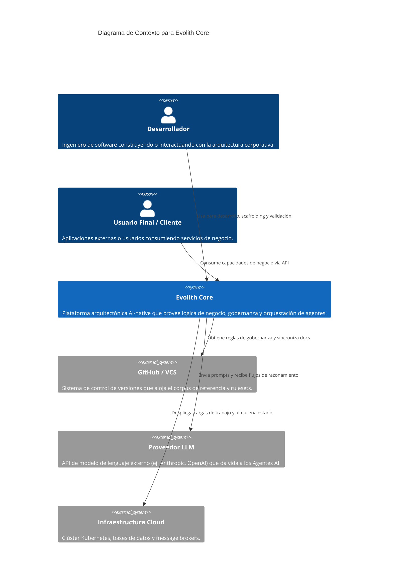
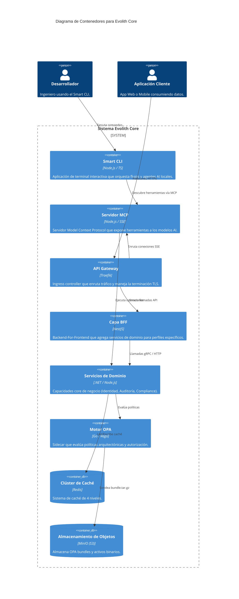
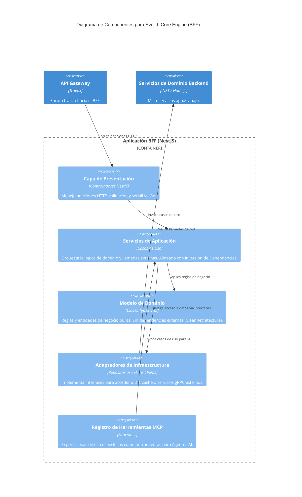
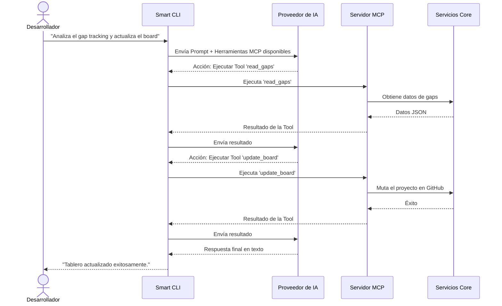
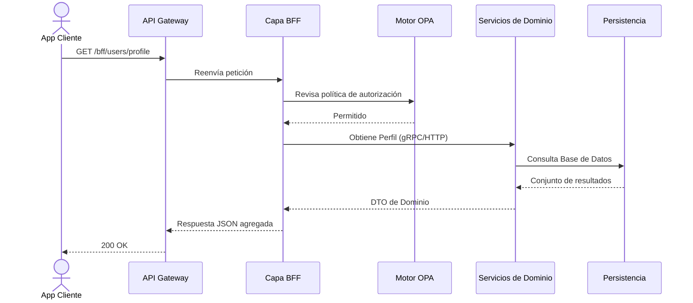

# Zona Producto: Arquitectura Evolith Core

## 1. Visión Arquitectónica

Evolith Core es una arquitectura de referencia AI-native diseñada para comenzar simple, madurar hacia un monolito modular y evolucionar a servicios distribuidos solo cuando el producto y la escala lo justifiquen. Sirve tanto como la línea base arquitectónica corporativa como un producto ejecutable fundacional.

### Visión Conceptual de la Plataforma

El siguiente diagrama ilustra el flujo conceptual de alto nivel sobre cómo los usuarios interactúan con la plataforma, y cómo la Inteligencia Artificial y el Model Context Protocol (MCP) amplifican las capacidades core.

## 2. Modelos de Arquitectura C4

Los siguientes diagramas siguen el framework [C4 Model](https://c4model.com/) para descomponer el ecosistema Evolith Core desde el contexto del sistema hasta sus componentes internos.

### Nivel 1: Diagrama de Contexto del Sistema

Proporciona una vista macroscópica de Evolith Core, sus usuarios y sus dependencias externas.

### Nivel 2: Diagrama de Contenedores

Descompone el sistema "Evolith Core" en sus contenedores principales de ejecución.

### Nivel 3: Diagrama de Componentes

Vista interna de la **Capa BFF / Core Engine** para demostrar la alineación con Clean Architecture y DDD.

## 3. Flujos de Interacción

Diagramas de secuencia ilustrando escenarios operativos clave dentro de la plataforma.

### Caso 1: Desarrollador usando Smart CLI

Demuestra el flujo AI-native donde un desarrollador pide al CLI realizar una tarea, la cual es delegada a un LLM que usa herramientas MCP.

### Caso 2: Cliente consumiendo el BFF

Demuestra el flujo estándar de una petición de aplicación a través de la infraestructura.

## 4. Catálogo de Componentes

| Componente | Propósito y Responsabilidad | Dependencias Clave | Entrada / Salida | Evolución Futura |
| :--- | :--- | :--- | :--- | :--- |
| **Smart CLI** | Interfaz de desarrollador para gestionar la arquitectura, generar código y ejecutar flujos asistidos por IA. | Node.js, APIs LLM, Sistema de Archivos | **In:** Comandos/prompts. **Out:** Cambios en código, salida en consola. | Transición a un daemon/agente autónomo en segundo plano. |
| **Servidor MCP** | Expone capacidades del repositorio y la arquitectura como herramientas estandarizadas para cualquier cliente MCP. | Transporte SSE, Evolith SDK | **In:** Peticiones de ejecución de tools. **Out:** Resultados (JSON). | Expandir el set de herramientas para incluir aprovisionamiento dinámico cloud. |
| **Capa BFF** | Agrega y adapta datos del backend para perfiles específicos de frontend (Web, Mobile, B2B). | Traefik, Servicios de Dominio, OPA | **In:** Peticiones HTTP del cliente. **Out:** Payloads JSON a medida. | Adopción de GraphQL Federation para consultas dinámicas complejas. |
| **Servicios de Dominio** | Las capacidades core de negocio (Identidad, Auditoría) implementadas como módulos independientes. | Persistencia, Event Bus | **In:** Peticiones BFF o MCP. **Out:** Respuestas / Eventos de dominio. | Escalamiento de Monolito Modular a Microservicios distribuidos según la carga. |
| **Motor OPA** | Punto centralizado de decisión para gobernanza arquitectónica y autorización. | MinIO (Distribución de Bundles S3) | **In:** Solicitudes de evaluación de contexto. **Out:** Decisiones de permitir/denegar. | Integración con ejecución basada en WASM más cerca del edge. |

## 5. Roadmap Arquitectónico

Evolith Core está diseñado para mejora progresiva. La arquitectura actual representa la **Fase 2 (Arquitectura Modular con Herramientas IA)**.

- **Fase 1:** Estructura Monolítica Simple (Completado).
- **Fase 2:** Monolito Modular + BFF + Integración MCP (Actual).
- **Fase 3:** Orquestación Autónoma Multi-Agente (Planeado). Los Agentes AI monitorearán autónomamente el entorno y propondrán correcciones de desviación arquitectónica.
- **Fase 4:** Microservicios Orientados a Eventos (Planeado según necesidad). División de servicios de dominio de alta carga en contenedores independientes vía RabbitMQ/Dapr.
