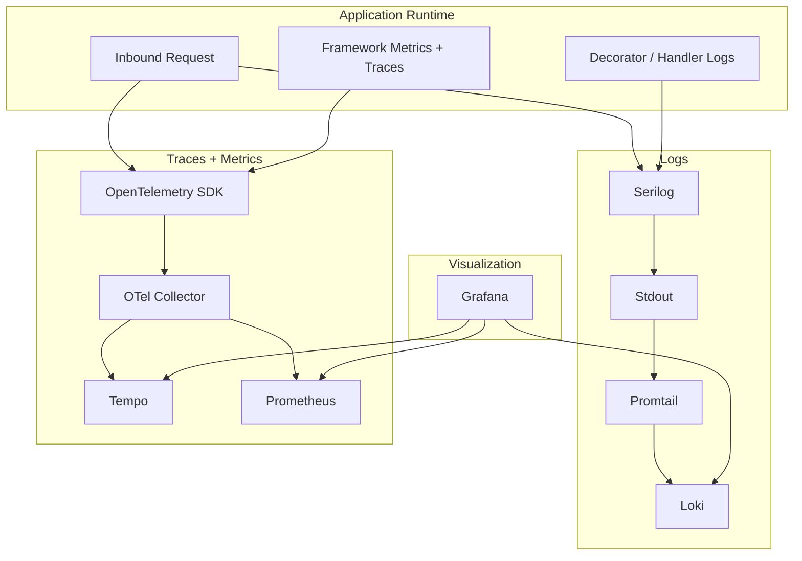
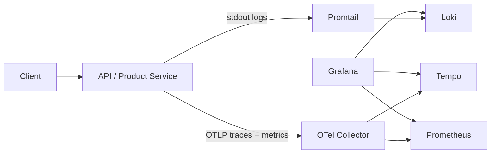

# Observability Architecture Flow

This blueprint explains how a modern Evolith-aligned service should propagate request correlation, session correlation, traces, logs, and metrics across middleware, application decorators, runtime instrumentation, and the observability platform.

It is intentionally runtime-oriented and complements:
- [Observability Playbook](../../governance/standards/engineering/observability-playbook.md)
- [CP-01: Request-Scope Context Propagation](../canonical-patterns/dotnet/cp-01-request-scope-context-propagation.md)
- [CP-02: PII-Safe Serilog Logging](../canonical-patterns/dotnet/cp-02-pii-safe-serilog-logging.md)
- [CP-04: AOP Logging Decorator](../canonical-patterns/dotnet/cp-04-aop-logging-decorator.md)
- [ADR-0064: .NET Request-Scope Observability Context](../adrs/dotnet/0064-dotnet-request-scope-observability-context.md)

## 1. Logical Signal Flow

```mermaid
flowchart LR
    Client["Client / Browser / Upstream Consumer"]
    Correlation["Correlation Middleware"]
    Session["Session Tracking Middleware"]
    Context["Request Execution Context"]
    RequestLog["Structured Request Logging"]
    Endpoint["REST / GraphQL / gRPC Endpoint"]
    Handler["Application Handler / Use Case"]
    Aop["AOP Logging Decorator"]
    ProductLogger["Product Structured Logger"]
    Activity["Activity.Current / W3C Context"]
    Mel["Microsoft ILogger"]
    Serilog["Serilog Pipeline"]
    Stdout["Stdout / Console"]
    OTel["OpenTelemetry SDK"]
    Collector["OTel Collector"]
    Tempo["Tempo"]
    Promtail["Promtail"]
    Loki["Loki"]
    Prometheus["Prometheus"]
    Grafana["Grafana"]

    Client -->|"X-Correlation-Id\nX-Session-Tracking-Id"| Correlation
    Correlation --> Session
    Correlation -->|"baggage: correlation.id"| Activity
    Session --> Context
    Session -->|"baggage/tag: session.tracking_id"| Activity
    Session --> RequestLog
    RequestLog --> Endpoint
    Endpoint --> Handler
    Handler --> Aop
    Aop --> ProductLogger
    ProductLogger -->|"CorrelationId\nSessionTrackingId\nTraceId\nSpanId\nBoundedContext\nTenantId or Scope"| Mel
    Mel --> Serilog
    Serilog --> Stdout
    Stdout --> Promtail
    Promtail --> Loki

    Endpoint -. "ASP.NET / HttpClient / Runtime" .-> OTel
    Activity -. current trace/span .-> OTel
    OTel -->|"OTLP traces + metrics"| Collector
    Collector --> Tempo
    Collector --> Prometheus

    Grafana --> Loki
    Grafana --> Tempo
    Grafana --> Prometheus
```

## 2. Responsibilities by Layer

| Component | Responsibility |
| --- | --- |
| Correlation middleware | Resolve or generate a per-request correlation identifier and propagate it into headers, log scope, and `Activity` baggage. |
| Session tracking middleware | Resolve or generate a session tracking identifier and persist it in request-scoped context plus `Activity` baggage/tags. |
| Request execution context | Provide a framework-safe snapshot that can be consumed by AOP decorators, exception handlers, request logging, and background handoffs. |
| Structured request logging | Emit one operational log per request with timing, path, status code, correlation, session, trace, and span metadata. |
| AOP logging decorator | Instrument handler entry, exit, duration, and exception flows without coupling business logic to logging infrastructure. |
| Product structured logger | Apply product-specific enrichment such as `TenantId`, `BoundedContext`, `CorrelationId`, `SessionTrackingId`, `TraceId`, and `SpanId`. |
| OpenTelemetry SDK | Generate traces and metrics from framework instrumentation and the active `Activity`. |
| OTel Collector | Receive OTLP signals and fan out to trace and metrics backends. |
| Promtail | Ship stdout log streams to Loki when direct log OTLP export is not used. |

## 3. Routing by Signal Type

## 4. Canonical Correlation Rules

1. The client should send `X-Session-Tracking-Id` on every request when business journey correlation matters.
2. The service must always echo `X-Correlation-Id` and `X-Session-Tracking-Id`.
3. Request logs, decorator logs, and exception logs must share the same correlation envelope.
4. `SessionTrackingId` must not be emitted as a general metric label because it is high-cardinality.
5. Product-specific context such as `TenantId` must be enriched by the product logger adapter, not by generic middleware.

## 5. Deployment View

## 6. Important Clarification

Two valid deployment styles exist:

- **Logs via stdout shipper**  
  `Serilog -> stdout -> Promtail -> Loki`
- **Logs via direct OTLP exporter**  
  `Serilog -> OTLP -> OTel Collector -> log backend`

Both are compatible with Evolith. The first is simpler for local and containerized environments. The second can reduce moving parts when the runtime and sink strategy justify it.

## 7. Promotion Decision

This blueprint belongs in Evolith because it is not product-specific. It generalizes the same concerns across any `.NET + Serilog + OpenTelemetry + AOP` service aligned with the platform.
