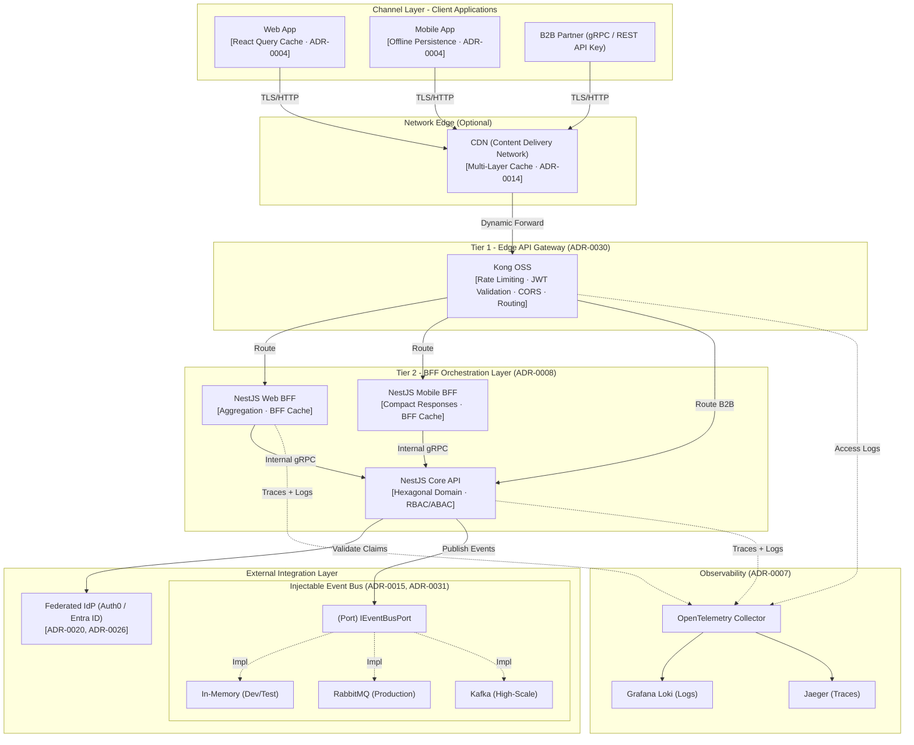
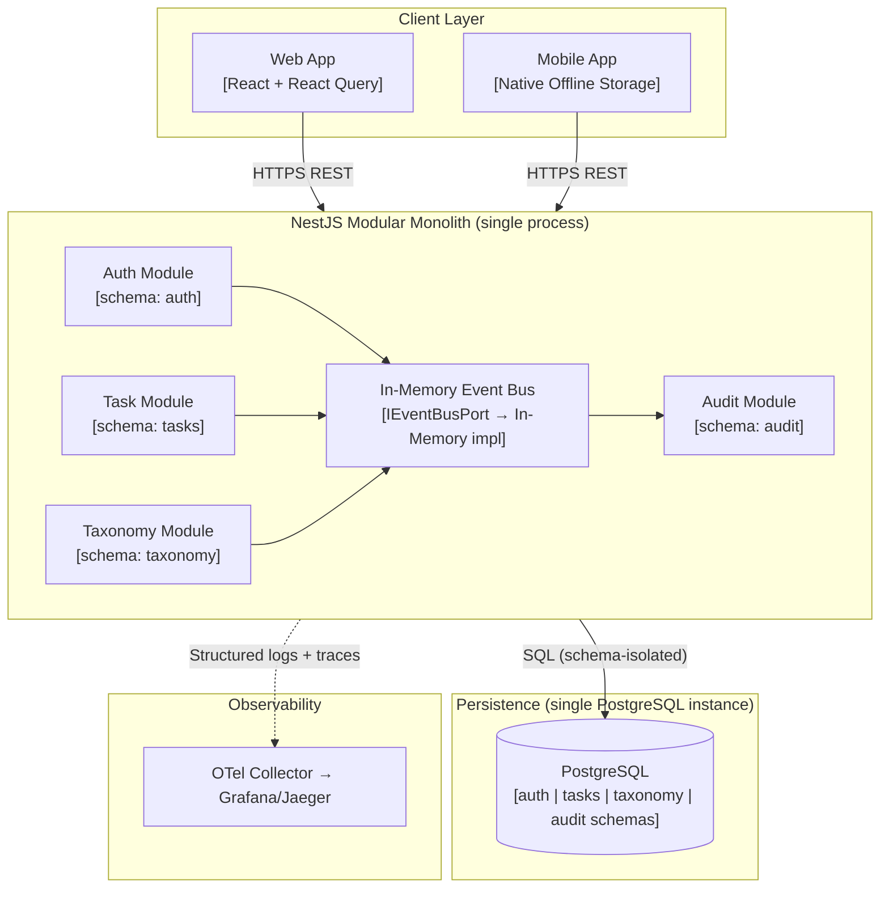
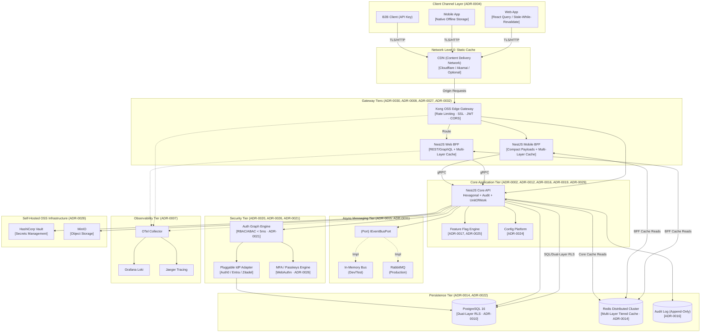
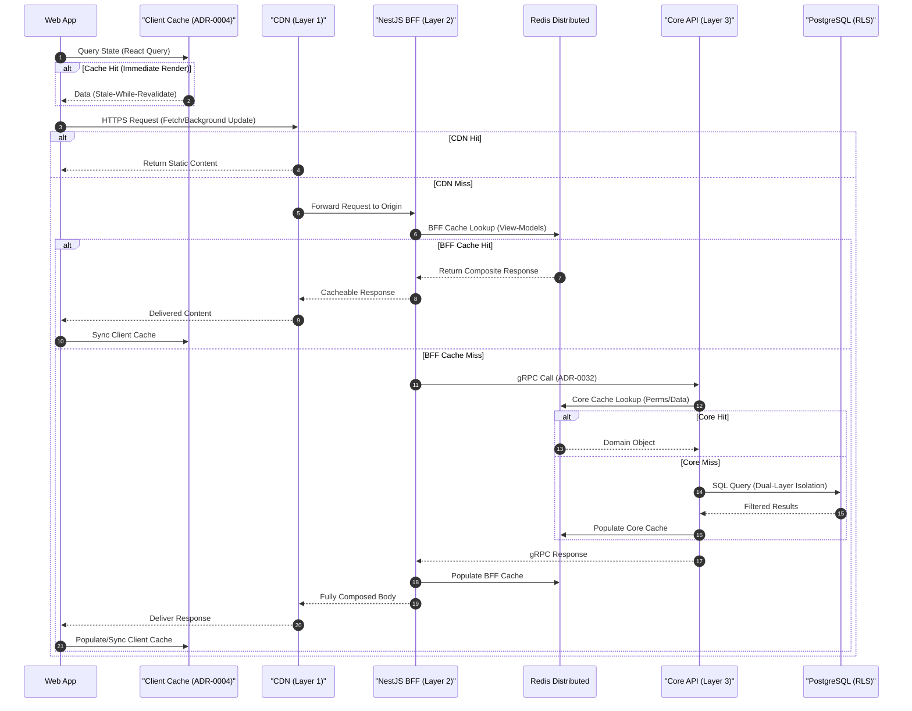
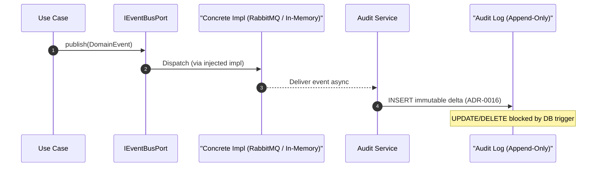
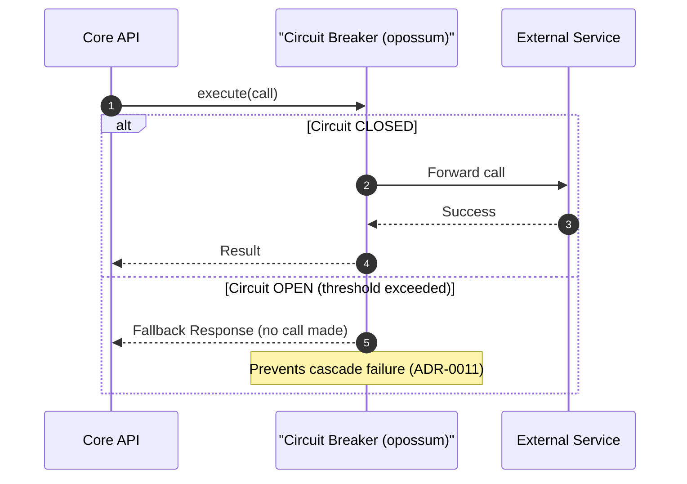
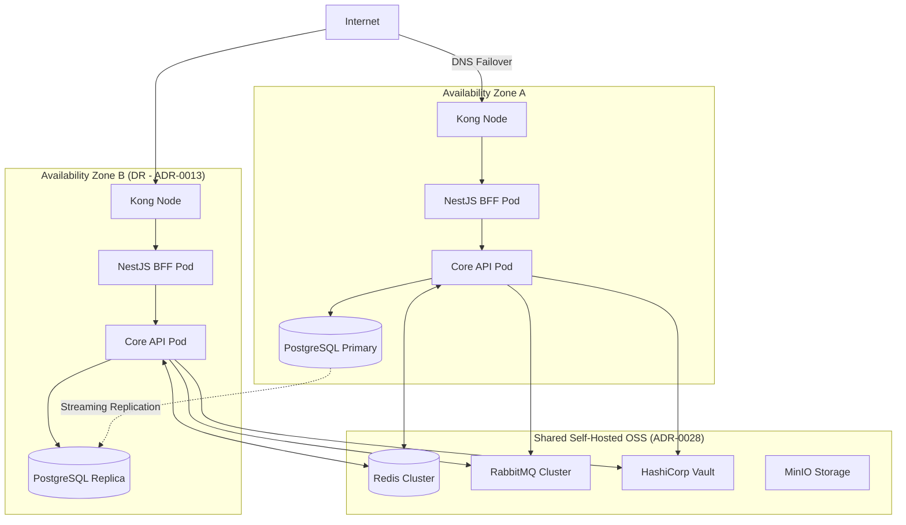

# Corporate Reference Architecture (Multi-Runtime / arc42)

> [!IMPORTANT]
> **Unified Corporate Reference Blueprint**: This document defines the global architectural model across the organization. Architectural constraints and design principles are runtime-agnostic. Concrete technology labels, diagrams, and examples represent a reference implementation profile and must not be interpreted as universal product mandates.

> [!NOTE]
> **Abstraction rule**: use this document to understand boundaries, responsibilities, evolution stages, quality attributes, and decision logic. Use runtime stack profiles to select concrete tools. Use demo documentation when you need a specific executable example.

---

## 1. Introduction and Goals

This reference architecture provides a standardized blueprint for building modern, highly scalable systems.

### 1.1 Purpose and Applicability
This pattern is designed specifically for systems that:
* Have a strong orientation towards **intensive API utilization** with multi-channel clients (Web, Mobile, B2B).
* Require native **SaaS multi-tenant isolation** at the database engine level ([ADR-0010](../adrs/core/0010-multi-tenancy-architecture-strategy.md)).
* Must support **progressive evolution** from Modular Monolith to Distributed Microservices.

> [!IMPORTANT]
> **Canon of Progressive Evolution**: Architecture evolves via incremental complexity. Phase 1 is deliberately simple and does not mandate technologies, patterns, or processes that exceed the core needs of a modular monolith. Every additional requirement is introduced precisely at the phase where system architecture objectively warrants it, never before.

### 1.2 Corporate Multi-Runtime Strategy (Políglota)
The organization promotes a deliberate polyglot architecture where runtimes are chosen strictly based on workload suitability, validated via ADR:

| Runtime | Canonical Role | Typical Use Case |
| :--- | :--- | :--- |
| **Node.js / TypeScript** | Web/API runtime profile | REST/gRPC APIs, BFF orchestration, transactional web services, frontend SSR. |
| **.NET (C#)** | Enterprise backend/runtime profile | APIs, batch compute, ETL pipelines, heavy computational tasks, legacy interoperability. |
| **Android (Kotlin/Java)** | Native Mobile Client | Industrial operative apps, offline capture, hardware scan/GPS integration. |

> **Rule of Contracts**: Communication between distinct runtimes MUST strictly utilize explicit, versioned contract definitions (OpenAPI for HTTP, Protobuf for gRPC, AsyncAPI for Messaging) guaranteeing absolute implementation opacity.

### 1.3 Mandatory Quality Attributes
| Quality Attribute | Source ADR | Target |
| :--- | :--- | :--- |
| **Progressive Evolution** | [ADR-0006](../adrs/core/0006-future-microservices-transition-dapr.md), [ADR-0008](../adrs/nodejs/0008-progressive-multimodule-evolution-gateway-bff.md) | Zero-refactoring path to microservices via Dapr |
| **SaaS Multi-Tenancy** | [ADR-0010](../adrs/core/0010-multi-tenancy-architecture-strategy.md) | Dual-Layer Isolation (Application Filters + Native DB Failsafe) |
| **Strict Decoupling** | [ADR-0002](../adrs/nodejs/0002-clean-architecture-nestjs.md), [ADR-0003](../adrs/nodejs/0003-strict-typescript-standards.md) | ESLint boundary enforcement |
| **Resilience** | [ADR-0011](../adrs/core/0011-fault-tolerance-resiliency-patterns.md) | Distributed Circuit Breakers (Redis + Kong) |
| **Security** | [ADR-0005](../adrs/core/0005-ci-cd-quality-codeql.md), [ADR-0012](../adrs/nodejs/0012-advanced-authorization-rbac-abac.md), [ADR-0020](../adrs/core/0020-identity-provider-abstraction-strategy.md), [ADR-0026](../adrs/nodejs/0026-mfa-passwordless-adaptive-authentication.md) | Zero-trust perimeter + RBAC/ABAC |
| **Internal API Latency** | [ADR-0014](../adrs/core/0014-distributed-caching-strategy-redis.md), [ADR-0021](../adrs/nodejs/0021-high-performance-auth-and-graph-compilation.md) | 4-Tier Cache (Client + CDN + BFF + Core) |
| **Observability** | [ADR-0007](../adrs/nodejs/0007-observability-telemetry-loki-opentelemetry.md), [ADR-0046](../adrs/core/0046-dapr-unified-observability.md) | OTel + Loki + distributed tracing |
| **Immutable Auditing** | [ADR-0016](../adrs/core/0016-immutable-business-audit-trail.md) | Append-only audit ledger |
| **Tech Sovereignty** | [ADR-0002](../adrs/nodejs/0002-clean-architecture-nestjs.md), [ADR-0028](../adrs/core/0028-self-hosted-hybrid-infrastructure-on-premise.md) | 100% Swappable Infra/AOP without logic impact |
| **UI Modularization** | [ADR-0055](../adrs/core/0055-microfrontends-architecture-strategy.md) | Microfrontends (Module Federation) for Phase 3+ |

#### Supplemental Strategic Frameworks
To deeply understand the mathematical and risk posture of this architecture, consult:
* -> **[Design Maturity and Patterns Evaluation](../../governance/standards/vision/maturity-evaluation.md)**
* -> **[CAP Theorem Strategic Analysis](./cap-strategic-analysis.md)**
* -> **[Multi-Cloud Deployment Scenarios](./multi-cloud-deployment-scenarios.md)**

---

## 2. Architecture Constraints and Baseline Pillars

Any system based on this blueprint must adhere to the following non-negotiable pillars:

* **Stack Governance ([ADR-0001](../adrs/core/0001-monorepo-orchestration-nx.md))**: Nx Monorepo + npm Workspaces for centralized dependency governance.
* **Engineering Mandate ([ADR-0002](../adrs/nodejs/0002-clean-architecture-nestjs.md), [ADR-0003](../adrs/nodejs/0003-strict-typescript-standards.md))**: SOLID, Clean Code, Hexagonal Architecture (mandatory simple Ports/Adapters), strict TypeScript.
* **Dependency Safety ([ADR-0009](../adrs/core/0009-strict-dependency-pinning-vulnerability-management.md))**: All dependency versions pinned. No `^` or `~` ranges. Automated vulnerability scanning in CI.
* **Quality Gates ([ADR-0018](../adrs/core/0018-testing-pyramid-quality-gates.md))**: Automated testing pyramid. Minimum 70% coverage enforced in CI.
* **Infrastructure Portability ([ADR-0028](../adrs/core/0028-self-hosted-hybrid-infrastructure-on-premise.md))**: Self-hosted OSS (MinIO, RabbitMQ, Vault) prioritized over cloud lock-in.

---

## 3. Context and Scope (Operational Model)

### 3.1 General Context Pattern - Full Stack with Gateway Tiers and Injectable Event Bus

This diagram captures the complete system context. It reflects:
- **[ADR-0030](../adrs/core/0030-api-gateway-kong-vs-nestjs.md)**: Two-Tier Gateway (Kong Edge + NestJS BFF)
- **[ADR-0008](../adrs/nodejs/0008-progressive-multimodule-evolution-gateway-bff.md)**: Progressive Multi-Module evolution with dedicated BFF per client channel
- **[ADR-0015](../adrs/core/0015-event-driven-architecture-intra-domain.md)**: Injectable `IEventBusPort` abstraction (In-Memory -> RabbitMQ -> Kafka)
- **[ADR-0020](../adrs/core/0020-identity-provider-abstraction-strategy.md)**: Pluggable Identity Provider via Strategy Pattern
- **[ADR-0007](../adrs/nodejs/0007-observability-telemetry-loki-opentelemetry.md)**: OpenTelemetry tracing across all tiers

---

## 4. Solution Strategy

### 4.1 Hexagonal Architecture - Ports and Adapters ([ADR-0002](../adrs/nodejs/0002-clean-architecture-nestjs.md))
All business logic in the Domain and Application layers has **zero runtime dependencies** on frameworks, ORMs, or cloud services. The infrastructure layer implements pure TypeScript Ports.

### 4.2 SaaS Multi-Tenancy Strategy ([ADR-0010](../adrs/core/0010-multi-tenancy-architecture-strategy.md))
Employs **Dual-Layer Isolation Defense**. (Layer 1) Persistence adapters automatically append `tenant_id` filtering to generic queries. (Layer 2) The selected database engine may enforce native row-level containment as a secondary failsafe, such as PostgreSQL RLS or SQL Server RLS backed by session context.

### 4.3 Two-Tier Gateway Pattern ([ADR-0030](../adrs/core/0030-api-gateway-kong-vs-nestjs.md))
| Tier | Technology | Responsibility |
| :--- | :--- | :--- |
| **Tier 1 - Edge** | Kong OSS (NGINX/OpenResty) | Rate Limiting, JWT validation, SSL termination, Routing |
| **Tier 2 - BFF** | NestJS | Data aggregation, payload shaping, client-specific logic |

### 4.4 Injectable Event Bus ([ADR-0015](../adrs/core/0015-event-driven-architecture-intra-domain.md))
The domain never imports a concrete message broker. All async communication is routed through `IEventBusPort`. The concrete implementation (In-Memory / RabbitMQ / Kafka) is injected by the NestJS DI container at startup, controlled by an environment variable.

### 4.5 Progressive Evolution Route ([ADR-0006](../adrs/core/0006-future-microservices-transition-dapr.md))
1. **Milestone 1 - Modular Monolith**: Single process, logically isolated domain modules.
2. **Milestone 2 - Service Extraction**: Critical domains extracted as Nx micro-projects with isolated DBs, consumed via gRPC/Dapr.
3. **Milestone 3 - Full Microservices Mesh**: Dapr Sidecars, Service Mesh, Kong as unified API surface, and **Microfrontend extraction** ([ADR-0055](../adrs/core/0055-microfrontends-architecture-strategy.md)).

---

## 5. Technical Building Blocks

### 5.0 Phase 1 Container View — Lean MVP (Modular Monolith)

> [!NOTE]
> **Start here.** This diagram reflects the **actual Phase 1 deployment** — a single process, minimal infrastructure, and no external messaging broker. It is the recommended starting point for all new products. The full diagram in Section 5.1 shows the mature Phase 3+ state.

**Phase 1 rules:**
- One NestJS process. One PostgreSQL instance. Docker Compose for local dev.
- No Kong gateway — direct HTTPS to the app. Add Kong at Phase 2 when a second client channel or external partner is onboarded.
- In-Memory event bus. Replace with RabbitMQ only when cross-service async delivery is needed ([ADR-0015](../adrs/core/0015-event-driven-architecture-intra-domain.md)).
- Redis is optional. Add only when a specific latency threshold is breached ([ADR-0014](../adrs/core/0014-distributed-caching-strategy-redis.md)).

---

### 5.1 Full Container View — Mature Architecture (Phase 3+)

This C4 Level-2 Container diagram reflects **all active ADRs** in their physical runtime positions.

---

## 6. Runtime View - Request Flow Patterns

### 6.1 Authenticated Request Flow ([ADR-0030](../adrs/core/0030-api-gateway-kong-vs-nestjs.md), [ADR-0008](../adrs/nodejs/0008-progressive-multimodule-evolution-gateway-bff.md), [ADR-0021](../adrs/nodejs/0021-high-performance-auth-and-graph-compilation.md), [ADR-0014](../adrs/core/0014-distributed-caching-strategy-redis.md))

### 6.2 Asynchronous Event Flow - Injectable Bus ([ADR-0015](../adrs/core/0015-event-driven-architecture-intra-domain.md), [ADR-0016](../adrs/core/0016-immutable-business-audit-trail.md))

### 6.3 Resilience Flow - Circuit Breaker ([ADR-0011](../adrs/core/0011-fault-tolerance-resiliency-patterns.md))

---

## 7. Deployment View - Target Cloud Infrastructure ([ADR-0013](../adrs/core/0013-cloud-infrastructure-topology-dr.md), [ADR-0028](../adrs/core/0028-self-hosted-hybrid-infrastructure-on-premise.md))
> [!IMPORTANT]
> **Progressive Deployment Strategy**: The following diagram reflects the target deployment architecture in its mature state (**Phase 3+**). Following the Progressive Complexity principle, **Phase 1 (Monolith)** supports direct container hosting on minimal compute assets (VMs, Container Apps, or Docker Compose), scaling into fully managed clusters only as modular extraction demands increase. In this phase, **Microfrontends** ([ADR-0055](../adrs/core/0055-microfrontends-architecture-strategy.md)) are deployed independently to their respective clusters or CDN origins.

---

## 8. Transversal Corporate Concepts - Full ADR Matrix

| Architectural Concern | Implementing ADR(s) | Pattern / Technology | Diagram Section |
| :--- | :--- | :--- | :--- |
| **Monorepo Governance** | [ADR-0001](../adrs/core/0001-monorepo-orchestration-nx.md) | Nx + npm workspaces | 2 |
| **Hexagonal Architecture** | [ADR-0002](../adrs/nodejs/0002-clean-architecture-nestjs.md) | Ports and Adapters | 4.1, 5 |
| **TypeScript Standards** | [ADR-0003](../adrs/nodejs/0003-strict-typescript-standards.md) | Strict mode + ESLint Boundaries | 2 |
| **Frontend Resilience** | [ADR-0004](../adrs/nodejs/0004-frontend-offline-resilience.md) | React Query offline cache | 3.1 |
| **CI/CD Security** | [ADR-0005](../adrs/core/0005-ci-cd-quality-codeql.md) | CodeQL + GitHub Actions | 2 |
| **Microservices Path** | [ADR-0006](../adrs/core/0006-future-microservices-transition-dapr.md) | Dapr Sidecar migration triggers | 4.5 |
| **Observability** | [ADR-0007](../adrs/nodejs/0007-observability-telemetry-loki-opentelemetry.md) | OpenTelemetry + Loki + Jaeger | 3.1, 5, 6 |
| **BFF Gateway Pattern** | [ADR-0008](../adrs/nodejs/0008-progressive-multimodule-evolution-gateway-bff.md) | NestJS BFF per client channel | 3.1, 4.3, 5 |
| **Dependency Pinning** | [ADR-0009](../adrs/core/0009-strict-dependency-pinning-vulnerability-management.md) | Exact versions + `npm audit` | 2 |
| **Multi-Tenancy (SaaS)** | [ADR-0010](../adrs/core/0010-multi-tenancy-architecture-strategy.md) | Application filters + runtime-specific request context + native DB failsafe | 4.2, 5, 6.1 |
| **Circuit Breakers** | [ADR-0011](../adrs/core/0011-fault-tolerance-resiliency-patterns.md) | `opossum` + Exponential Backoff | 5, 6.3 |
| **RBAC/ABAC Authorization** | [ADR-0012](../adrs/nodejs/0012-advanced-authorization-rbac-abac.md) | JWT Claims + NestJS Guards | 5 |
| **Cloud DR Topology** | [ADR-0013](../adrs/core/0013-cloud-infrastructure-topology-dr.md) | Multi-AZ + Streaming Replication | 7 |
| **Distributed Caching** | [ADR-0014](../adrs/core/0014-distributed-caching-strategy-redis.md) | Multi-Layer Tiered Cache behind `ICachePort` | 5, 6.1 |
| **Event-Driven (Injectable Bus)** | [ADR-0015](../adrs/core/0015-event-driven-architecture-intra-domain.md) | `IEventBusPort` -> In-Mem / RabbitMQ | 3.1, 4.4, 5, 6.2 |
| **Immutable Audit Trail** | [ADR-0016](../adrs/core/0016-immutable-business-audit-trail.md) | Append-only table + DB trigger | 5, 6.2 |
| **Feature Flagging** | [ADR-0017](../adrs/core/0017-feature-flagging-strategy.md) | `IFeatureFlagPort` (Unleash/ConfigCat) | 5 |
| **Testing Pyramid** | [ADR-0018](../adrs/core/0018-testing-pyramid-quality-gates.md) | Unit + Contract (Pact) + E2E | 2 |
| **Result / Functional Patterns** | [ADR-0019](../adrs/core/0019-tactical-design-patterns-future-proofing.md) | `Result<T,E>` instead of exceptions | 4.1 |
| **Identity Provider Abstraction** | [ADR-0020](../adrs/core/0020-identity-provider-abstraction-strategy.md) | Strategy Pattern -> Auth0/Entra/Zitadel | 3.1, 5 |
| **Auth Graph Compilation** | [ADR-0021](../adrs/nodejs/0021-high-performance-auth-and-graph-compilation.md) | Redis-cached permission graph < 5ms | 5 |
| **Pluggable Projections** | [ADR-0022](../adrs/nodejs/0022-contextual-auth-and-pluggable-projections.md) | Context-aware read projections | 5 |
| **Centralized Auth Kernel** | [ADR-0023](../adrs/nodejs/0023-centralized-ums-vs-decentralized-access.md) | Shared authorization core kernel | 5 |
| **Config and Feature Platform** | [ADR-0024](../adrs/core/0024-configuration-feature-management-platform.md) | Multi-IdP parameter engine | 5 |
| **Feature Flag Abstraction** | [ADR-0025](../adrs/core/0025-feature-flag-provider-abstraction.md) | `IFeatureFlagPort` pluggable providers | 5 |
| **MFA and Passkeys** | [ADR-0026](../adrs/nodejs/0026-mfa-passwordless-adaptive-authentication.md) | WebAuthn + Passkeys + TOTP + Adaptive | 5 |
| **Dual Protocol REST/gRPC** | [ADR-0027](../adrs/nodejs/0027-dual-protocol-rest-grpc-api-gateway.md) | REST (external) + gRPC (internal) | 3.1 |
| **Self-Hosted OSS Infra** | [ADR-0028](../adrs/core/0028-self-hosted-hybrid-infrastructure-on-premise.md) | MinIO + RabbitMQ + Vault OSS | 5, 7 |
| **Tactical DDD Primitives** | [ADR-0029](../adrs/nodejs/0029-tactical-ddd-primitives-library.md) | `@nestjslatam/ddd` via barrel re-exports | 4.1 |
| **Two-Tier Gateway** | [ADR-0030](../adrs/core/0030-api-gateway-kong-vs-nestjs.md) | Kong (Edge) + NestJS BFF (Aggregation) | 3.1, 4.3, 5, 6.1 |
| **Domain Event Catalog** | [ADR-0031](../adrs/core/0031-schema-per-context-domain-event-catalog.md) | Multi-schema extraction + Async Contracts | 5, 6.2 |
| **Protocol Selection** | [ADR-0032](../adrs/core/0032-api-protocol-decision-matrix-rest-grpc-graphql.md) | gRPC (Int) vs REST (Ext) vs GraphQL | 3.1, 5, 6.1 |
| **Transactional Outbox** | [ADR-0033](../adrs/core/0033-transactional-outbox-pattern.md) | Atomic DB + Event atomic guarantee | 6.2 |
| **CQRS Separation** | [ADR-0034](../adrs/core/0034-cqrs-pattern-applicability-matrix.md) | Evaluation Matrix for Read/Write Models | 5, 6.1 |
| **Distributed Sagas** | [ADR-0035](../adrs/core/0035-distributed-saga-pattern-strategy.md) | Compensating Transaction Strategy | 6.2 |
| **Messaging Strategy** | [ADR-0036](../adrs/core/0036-message-bus-delivery-strategy-fifo-dlq.md) | FIFO vs Fire and Forget vs DLQ Policies | 6.2 |
| **Performance Testing** | [ADR-0037](../adrs/core/0037-performance-concurrency-chaos-strategy.md) | K6 Load + Pact Contract Verification | 5, 6.3 |
| **Error Management** | [ADR-0038](../adrs/nodejs/0038-error-handling-result-pattern-strategy.md) | Result Pattern + Unified Boundaries | 5, 6.3 |
| **Deployment Switcher** | [ADR-0039](../adrs/core/0039-deployment-topology-abstraction-switcher.md) | Factory-based Topology Abstraction | 7 |
| **Polyglot Selection** | [ADR-0040](../adrs/core/0040-multi-runtime-selection-contracts.md) | Workload Matrix and Type-Safe Contracts | 1.2 |
| **.NET Arch Canonical** | [ADR-0041](../adrs/dotnet/0041-canonical-dotnet-backend-architecture.md) | Clean Arch C# / Minimal APIs | 1.2 |
| **Android Arch Canonical** | [ADR-0042](../adrs/android/0042-canonical-android-mobile-architecture.md) | Native Kotlin / Compose / Offline | 1.2 |
| **Configurable Security Strategy** | [ADR-0044](../adrs/core/0044-configurable-security-persistence-strategy.md) | APP_FILTER vs INFRA_NATIVE persistence strategy | 4.2 |
| **Microservice Extraction Criteria** | [ADR-0045](../adrs/core/0045-microservice-extraction-readiness-criteria.md) | Quantitative "2 of 4" extraction triggers | 4.5 |
| **Dapr Observability Unification** | [ADR-0046](../adrs/core/0046-dapr-unified-observability.md) | W3C TraceContext unification with Dapr sidecar | 3.1, 5 |
| **Architecture Style Selection** | [ADR-0047](../adrs/core/0047-architectural-patterns-monolith-soa-microservices.md) | Monolith vs SOA vs Microservices decision framework | 4.5 |
| **Enterprise Taxonomy Layout** | [ADR-0048](../adrs/core/0048-enterprise-taxonomy-reference-layout.md) | Repository structure, root layout, dot-folder tooling | 2 |
| **Naming Semantics Policy** | [ADR-0049](../adrs/core/0049-naming-semantics-clean-code-policy.md) | Clean Code naming conventions | 2 |
| **Gitflow Branching Strategy** | [ADR-0050](../adrs/core/0050-gitflow-branching-strategy.md) | Gitflow: main / develop / feature / release / hotfix | 2 |
| **Enterprise DB Engine Strategy** | [ADR-0051](../adrs/core/0051-enterprise-database-engine-strategy.md) | SQL Server (.NET), PostgreSQL/MongoDB (Node.js) | 4.2, 5 |
| **Unit Testing Isolation** | [ADR-0052](../adrs/core/0052-unit-testing-isolation-strategy.md) | Stubs vs Mocks — Double-Centric Isolation per layer | 2 |
| **Integration & E2E Testing** | [ADR-0053](../adrs/core/0053-integration-e2e-testing-strategy.md) | Testcontainers real-infra strategy | 2 |
| **DB Design Normalization** | [ADR-0054](../adrs/core/0054-database-design-normalization-standards.md) | 3NF SQL + access-optimized NoSQL standards | 4.2, 5 |
| **Microfrontends** | [ADR-0055](../adrs/core/0055-microfrontends-architecture-strategy.md) | Runtime UI Module Federation | 4.5, 7 |
| **Enterprise Naming Conventions** | [ADR-0056](../adrs/core/0056-enterprise-naming-design-conventions.md) | Multi-language, multi-platform naming standard (supersedes ADR-0049) | 2 |

---

## 9. Quality Requirements (NFR Benchmark)

| Metric | Target | Enforcing ADR(s) |
| :--- | :--- | :--- |
| **API Latency (P95)** | < 50ms | [ADR-0014](../adrs/core/0014-distributed-caching-strategy-redis.md), [ADR-0021](../adrs/nodejs/0021-high-performance-auth-and-graph-compilation.md) |
| **Auth Graph Resolution** | < 5ms | [ADR-0021](../adrs/nodejs/0021-high-performance-auth-and-graph-compilation.md) |
| **SAST Vulnerabilities** | 0 High/Critical | [ADR-0005](../adrs/core/0005-ci-cd-quality-codeql.md), [ADR-0009](../adrs/core/0009-strict-dependency-pinning-vulnerability-management.md) |
| **Test Coverage** | 70% | [ADR-0018](../adrs/core/0018-testing-pyramid-quality-gates.md) |
| **Memory Footprint** | Low idle (microservice density) | [ADR-0002](../adrs/nodejs/0002-clean-architecture-nestjs.md), [ADR-0006](../adrs/core/0006-future-microservices-transition-dapr.md) |
| **Tenant Data Bleed** | Zero tolerance | [ADR-0010](../adrs/core/0010-multi-tenancy-architecture-strategy.md) (Dual-Layer Isolation) |

---

## 10. Canonical Reference Implementation

-> **[Back to Project Root and Quick Start](../../README.md)**

Implemented using:
- **Framework**: NestJS (v10) with strict Hexagonal boundaries.
- **ORM**: TypeORM with native PostgreSQL RLS support.
- **Gateway**: Kong OSS (DB-less YAML) + NestJS BFF layers.
- **Event Bus**: `IEventBusPort` defaulting to In-Memory, injectable with RabbitMQ.
- **Testing**: Jest (unit/integration) + Pact (contract tests).

---

## 11. Risks and Technical Debt

Strategic tracking of current design limitations and acknowledged system risks.

### 11.1 Inherent Risks
| Risk ID | Description | Mitigation Strategy | Severity |
| :--- | :--- | :--- | :--- |
| **R-01** | **Shared DB Performance** — Physical DB packing creates single failure domain. | Enforce strict read replication and query timeout ceilings. | Medium |
| **R-02** | **RabbitMQ Overflow** | In-memory message spikes during outage. | Mandatory **[ADR-0036](../adrs/core/0036-message-bus-delivery-strategy-fifo-dlq.md)** Flow Control / Quotas. | High |
| **R-03** | **gRPC Polyglot Coupling** | Non-backward compatible proto changes. | Mandatory **Pact JS** Contract verification in CI. | High |

### 11.2 Known Technical Debt
* **Monorepo Bloat**: As library counts exceed 200+, Nx cache management will require migration from Local to Cloud caching.
* **Zero-Day Library Vulnerability**: Fast update cycles imposed by strict dependency pinning ([ADR-0009](../adrs/core/0009-strict-dependency-pinning-vulnerability-management.md)) may consume 5-10% dev bandwidth monthly.

---

## 12. Glossary of Architectural Concepts

Reference nomenclature used by this blueprint.

* **ACL (Anti-Corruption Layer)**: Isolates internal domain model from foreign schemas/contracts.
* **BFF (Backend for Frontend)**: Single-purpose edge API optimizing payloads for a specific client.
* **Bounded Context**: Strategic logic boundary owning its private database schema.
* **Clean Architecture**: Design paradigm where control flow always points inward toward dependencies.
* **Distributed Circuit Breaker**: Mechanism to halt request delivery to failing upstreams sharing state across pods via Redis.
* **Hexagonal Architecture**: See *Ports and Adapters*.
* **Port**: Explicit contract (Interface) that the application requires to talk to external systems.
* **RLS (Row-Level Security)**: Native DB engine security constraining table rows to active session user.
* **Saga Pattern**: Managing distributed transactional consistency via compensating events.

---
[Back to Index](./README.md)
