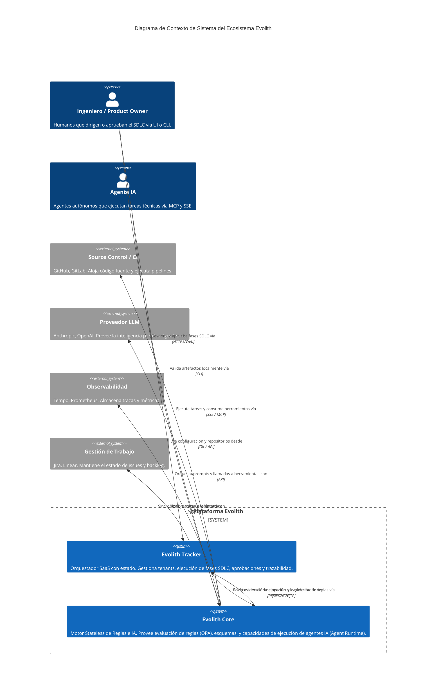

# C4 Nivel 1: System Context

> **Navegación Bilingüe:** [Ver Versión en Inglés](./level-1-system-context.md)

**Estado:** Aprobado  
**Nivel:** 1 - System Context  
**Padre:** [C4 Master Architecture](../C4-MASTER-ARCHITECTURE.es.md)

## 1. Visión General del Sistema

Evolith está diseñado para actuar como el motor de gobernanza autoritativo de todo el SDLC. En el nivel más alto, interactúa con Humanos, Agentes de IA y plataformas SaaS externas.

El sistema se compone fundamentalmente de **Evolith Tracker** (el producto SaaS con estado que gestiona procesos y UI) y **Evolith Core** (el motor stateless de evaluación y orquestación de agentes IA).

## 2. Diagrama de Contexto

## 3. Interacciones Clave

1. **Tracker hacia Core:** Tracker es un cliente del Core. Solicita al Core validar evidencia contra los rulesets OPA, o pide al Agent Runtime del Core ejecutar una tarea compleja.
2. **Agentes hacia Core:** Los agentes se conectan al Core mediante streams MCP o SSE para recibir contexto gobernado y herramientas. *No* se conectan directamente a Tracker.
3. **Core hacia Externos:** Core se conecta a LLMs para inteligencia, y a Git para recuperar los rulesets corporativos (el corpus de referencia).

## 4. Acercamiento (Zoom In)

A continuación, miramos dentro del sistema **Evolith Core** para ver sus principales contenedores.
**[Ir al Nivel 2: Contenedores](./level-2-containers.es.md)**

---
[Volver a la Arquitectura Maestra](../C4-MASTER-ARCHITECTURE.es.md)
