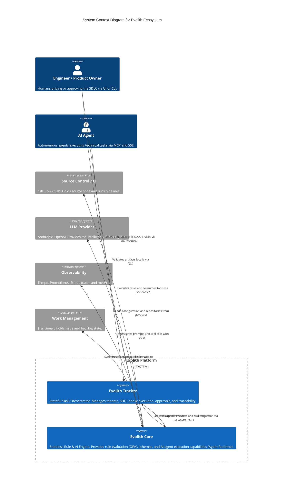

# C4 Level 1: System Context

> **Bilingual Navigation:** [Versión en Español](./level-1-system-context.es.md)

**Status:** Approved  
**Level:** 1 - System Context  
**Parent:** [C4 Master Architecture](../C4-MASTER-ARCHITECTURE.md)

## 1. System Overview

Evolith is designed to act as the authoritative governance engine for the entire SDLC. At the highest level, it interacts with Humans, AI Agents, and external SaaS platforms.

The system is fundamentally composed of **Evolith Tracker** (the stateful SaaS product that manages processes and UI) and **Evolith Core** (the stateless evaluation and AI agent orchestration engine).

## 2. Context Diagram

## 3. Key Interactions

1. **Tracker to Core:** Tracker is a client of Core. It asks Core to validate evidence against OPA rulesets, or asks Core's Agent Runtime to execute a complex task.
2. **Agents to Core:** Agents connect to Core via MCP or SSE streams to receive governed context and tools. They do *not* connect to Tracker directly.
3. **Core to External:** Core connects to LLMs for intelligence, and Git for retrieving the corporate rulesets (the reference corpus).

## 4. Zoom In

Next, we look inside the **Evolith Core** system to see its major containers.
**[Go to Level 2: Containers](./level-2-containers.md)**

---
[Back to Master Architecture](../C4-MASTER-ARCHITECTURE.md)
