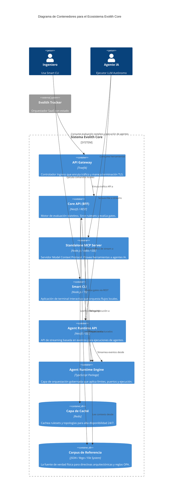

# C4 Nivel 2: Contenedores

> **Navegación Bilingüe:** [Ver Versión en Inglés](./level-2-containers.md)

**Estado:** Aprobado  
**Nivel:** 2 - Contenedores  
**Padre:** [C4 Nivel 1: System Context](./level-1-system-context.es.md)

## 1. Visión General de Contenedores

Esta vista se acerca al **Ecosistema Evolith Core** para revelar sus principales contenedores de ejecución. Evolith Core adopta una arquitectura modular, exponiendo sus reglas y capacidades a través de APIs especializadas (REST para evaluación stateless, SSE para Agent Runtime, y MCP para herramientas interactivas de IA).

> *Nota: Evolith Tracker (el SaaS) y su BFF se tratan como sistemas externos que consumen estos contenedores.*

## 2. Diagrama de Contenedores

## 3. Desglose de Contenedores del Core

| Contenedor | Tecnología | Responsabilidad |
|------------|------------|-----------------|
| **Core API (REST)** | NestJS | Motor de evaluación stateless. Procesa reglas OPA, retorna resultados de evaluación técnica (NO estado canónico). |
| **Agent Runtime API (SSE)** | NestJS / RxJS | Expone el endpoint de Server-Sent Events (`/v1/agent/stream`) para ejecutar procesos asíncronos de agentes de múltiples turnos. |
| **Standalone MCP Server** | Node.js | Expone el conjunto de herramientas de Evolith mediante el Model Context Protocol para Anthropic Claude y otros agentes capaces. Completamente desacoplado de la CLI. |
| **Smart CLI** | Node.js / Commander | Interfaz amigable para humanos para interactuar con el corpus, andamiaje (scaffolding) y comprobaciones locales. |
| **Agent Runtime Engine** | TypeScript (`@evolith/agent-runtime`) | Capa de orquestación (ports-and-adapters). Decide *cómo* se ejecuta una tarea de agente sin acoplarse directamente a `.harness` o Hermes. |
| **Redis Cache** | Redis | Caché de alta disponibilidad para asegurar que Evolith pueda validar reglas incluso si la E/S en disco es lenta. |

## 4. Acercamiento (Zoom In)

A continuación, miramos dentro de estos contenedores específicos para comprender sus componentes internos (casos de uso, controladores, adaptadores).
**[Ir al Nivel 3: Componentes](./level-3-components/README.es.md)**

---
[Volver al Nivel 1: System Context](./level-1-system-context.es.md) | [Volver a la Arquitectura Maestra](../C4-MASTER-ARCHITECTURE.es.md)
