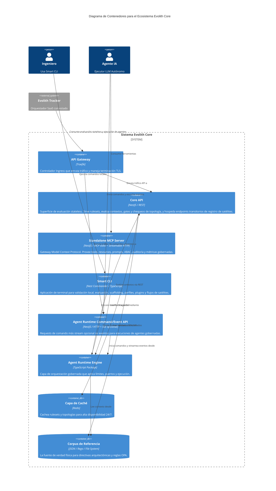

# C4 Nivel 2: Contenedores

> **Navegación Bilingüe:** [Ver Versión en Inglés](./level-2-containers.md)

**Estado:** Aprobado  
**Nivel:** 2 - Contenedores  
**Padre:** [C4 Nivel 1: System Context](./level-1-system-context.es.md)

## 1. Visión General de Contenedores

Esta vista se acerca al **Ecosistema Evolith Core** para revelar sus principales contenedores de ejecución. Evolith Core adopta una arquitectura modular, exponiendo sus reglas y capacidades a través de APIs especializadas (REST para evaluación stateless, una API de comandos/eventos para Agent Runtime, MCP para herramientas interactivas de IA y comandos CLI para flujos locales).

> *Nota: Evolith Tracker (el SaaS) y su BFF se tratan como sistemas externos que consumen estos contenedores.*

## 2. Diagrama de Contenedores

## 3. Desglose de Contenedores del Core

| Contenedor | Tecnología | Responsabilidad |
|------------|------------|-----------------|
| **Core API (REST)** | NestJS | Motor de evaluación stateless. Expone `/api/v1/evaluate`, endpoints de rulesets/referencia, gates/fases, chequeos de arquitectura y un registro in-memory transitorio de satélites. Retorna resultados técnicos de evaluación, no decisiones vinculantes de Tracker. |
| **Agent Runtime Command/Event API** | NestJS / RxJS | Expone `POST /v1/agent/handle` para ejecución request/response, `POST /v1/agent/stream` para envío de comando más entrega de eventos, y `GET /v1/agent/skills` para descubrimiento. SSE es un transporte de eventos, no el canal de comandos. |
| **Standalone MCP Server** | NestJS / Node.js | Expone tools, resources, prompts, ABAC, auditoría, métricas y transportes stdio/Streamable HTTP mediante Model Context Protocol. Está desacoplado del CLI pero comparte paquetes de dominio. |
| **Smart CLI** | Nest Commander / TypeScript | Interfaz amigable para validación local, evaluación canónica, scaffolding, perfiles, plugins, satélites e inspección de APIs. |
| **Agent Runtime Engine** | TypeScript (`@evolith/agent-runtime`) | Capa de orquestación (ports-and-adapters). Decide *cómo* se ejecuta una tarea de agente sin acoplarse directamente a `.harness` o Hermes. |
| **Redis Cache** | Redis / cache-manager | Caché opcional de alta disponibilidad para lecturas de topología/referencia y rendimiento de servicio. Core conserva fallback seguro cuando Redis no está disponible. |

## 4. Acercamiento (Zoom In)

A continuación, miramos dentro de estos contenedores específicos para comprender sus componentes internos (casos de uso, controladores, adaptadores).
**[Ir al Nivel 3: Componentes](./level-3-components/README.es.md)**

---
[Volver al Nivel 1: System Context](./level-1-system-context.es.md) | [Volver a la Arquitectura Maestra](../C4-MASTER-ARCHITECTURE.es.md)
