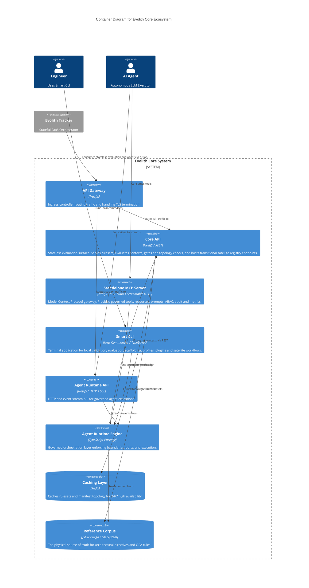

# C4 Level 2: Containers

> **Bilingual Navigation:** [Versión en Español](./level-2-containers.es.md)

**Status:** Approved  
**Level:** 2 - Containers  
**Parent:** [C4 Level 1: System Context](./level-1-system-context.md)

## 1. Container Overview

This view zooms into the **Evolith Core Ecosystem** to reveal its major executing containers. Evolith Core adopts a modular architecture, exposing its rulesets and capabilities via specialized APIs (REST for stateless evaluation, HTTP/SSE for Agent Runtime, MCP for interactive AI tools, and CLI commands for local workflows).

> *Note: Evolith Tracker (the SaaS) and its BFF are treated as external systems consuming these containers.*

## 2. Container Diagram

## 3. Core Containers Breakdown

| Container | Technology | Responsibility |
|-----------|------------|----------------|
| **Core API (REST)** | NestJS | Stateless evaluation engine. Exposes `/api/v1/evaluate`, ruleset/reference endpoints, gate/phase endpoints, architecture checks, and a transitional in-memory satellite registry. It returns technical evaluation results, not binding Tracker decisions. |
| **Agent Runtime API (HTTP/SSE)** | NestJS / RxJS | Exposes `POST /v1/agent/handle`, `POST /v1/agent/stream`, and `GET /v1/agent/skills` for governed agent processes. |
| **Standalone MCP Server** | NestJS / Node.js | Exposes Evolith tools, resources, prompts, ABAC, audit, metrics, and stdio/Streamable HTTP transports through the Model Context Protocol. It is decoupled from the CLI but shares domain packages. |
| **Smart CLI** | Nest Commander / TypeScript | Human-friendly interface for local validation, canonical evaluation, scaffolding, profiles, plugins, satellites, and API inspection. |
| **Agent Runtime Engine** | TypeScript (`@evolith/agent-runtime`) | The ports-and-adapters orchestration layer. Decides *how* an agent task is executed without coupling to `.harness` or Hermes directly. |
| **Redis Cache** | Redis / cache-manager | Optional high-availability cache for topology/reference reads and service performance. Core still falls back safely when Redis is unavailable. |

## 4. Zoom In

Next, we look inside these specific containers to understand their internal components (use cases, controllers, adapters).
**[Go to Level 3: Components](./level-3-components/README.md)**

---
[Back to Level 1: System Context](./level-1-system-context.md) | [Back to Master Architecture](../C4-MASTER-ARCHITECTURE.md)
