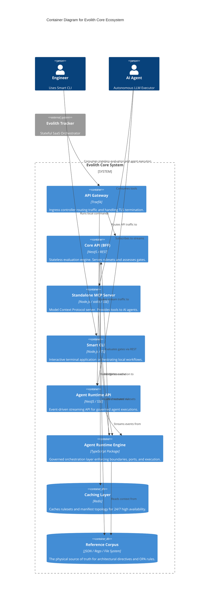

# C4 Level 2: Containers

> **Bilingual Navigation:** [Versión en Español](./level-2-containers.es.md)

**Status:** Approved  
**Level:** 2 - Containers  
**Parent:** [C4 Level 1: System Context](./level-1-system-context.md)

## 1. Container Overview

This view zooms into the **Evolith Core Ecosystem** to reveal its major executing containers. Evolith Core adopts a modular architecture, exposing its rulesets and capabilities via specialized APIs (REST for stateless evaluation, SSE for Agent Runtime, and MCP for interactive AI tools).

> *Note: Evolith Tracker (the SaaS) and its BFF are treated as external systems consuming these containers.*

## 2. Container Diagram

## 3. Core Containers Breakdown

| Container | Technology | Responsibility |
|-----------|------------|----------------|
| **Core API (REST)** | NestJS | Stateless evaluation engine. Processes OPA rulesets, returns technical evaluation results (NOT canonical state). |
| **Agent Runtime API (SSE)** | NestJS / RxJS | Exposes the Server-Sent Events endpoint (`/v1/agent/stream`) to execute multi-turn agent processes asynchronously. |
| **Standalone MCP Server** | Node.js | Exposes Evolith's toolset via the Model Context Protocol to Anthropic Claude and other capable agents. Completely decoupled from CLI. |
| **Smart CLI** | Node.js / Commander | Human-friendly interface for interacting with the reference corpus, scaffolding, and executing local checks. |
| **Agent Runtime Engine** | TypeScript (`@evolith/agent-runtime`) | The ports-and-adapters orchestration layer. Decides *how* an agent task is executed without coupling to `.harness` or Hermes directly. |
| **Redis Cache** | Redis | High-availability caching to ensure Evolith can validate rules even if I/O is slow. |

## 4. Zoom In

Next, we look inside these specific containers to understand their internal components (use cases, controllers, adapters).
**[Go to Level 3: Components](./level-3-components/README.md)**

---
[Back to Level 1: System Context](./level-1-system-context.md) | [Back to Master Architecture](../C4-MASTER-ARCHITECTURE.md)
