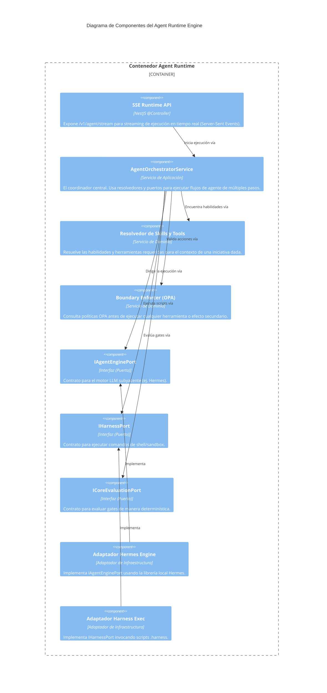

# C4 Nivel 3: Componentes del Agent Runtime

> **Navegación Bilingüe:** [Ver Versión en Inglés](./agent-runtime-components.md)

**Estado:** Aprobado  
**Nivel:** 3 - Componentes  
**Padre:** [C4 Nivel 3: Hub de Componentes](./README.es.md)

## 1. Contexto del Contenedor

El **Agent Runtime Engine** orquesta ejecuciones gobernadas de agentes de IA. Recibe tareas desde el Tracker o vía streams SSE, resuelve las habilidades, hace cumplir los límites mediante políticas OPA, e invoca capacidades a través de puertos abstraídos (de modo que no está acoplado directamente a `.harness` o a Hermes).

Utiliza la **Arquitectura Hexagonal (Ports and Adapters)**.

## 2. Diagrama de Componentes

## 3. Desglose de Componentes Clave

| Componente | Responsabilidad |
|------------|-----------------|
| **SSE Runtime API** | Recibe un `AgentRuntimeRequest` y mantiene una conexión HTTP persistente, haciendo streaming del estado y los logs de ejecución de herramientas hacia el cliente. |
| **AgentOrchestratorService** | Coordina el ciclo completo del agente. Recupera la tarea, pregunta al motor LLM por la siguiente acción, ejecuta la acción si está permitida, y repite hasta completar. |
| **Resolvedor de Skills y Tools** | Inspecciona el `workspaceRef` y el contexto del tenant para determinar qué herramientas y prompts específicos tiene permitido usar el agente. |
| **Puertos (IAgentEnginePort, etc)** | Definen contratos estrictos. El orquestador depende *solo* de los puertos, asegurando que el motor subyacente o el ejecutor de scripts puedan ser intercambiados. |
| **Adaptador Hermes Engine** | Conecta el motor de ejecución interno Hermes en el runtime. |

---
[Volver al Nivel 3: Hub de Componentes](./README.es.md)
