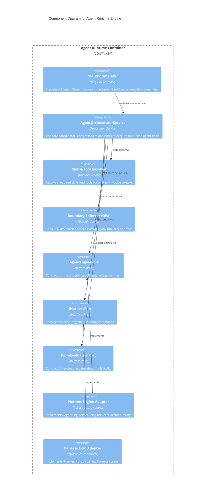

# C4 Level 3: Agent Runtime Components

> **Bilingual Navigation:** [Versión en Español](./agent-runtime-components.es.md)

**Status:** Approved  
**Level:** 3 - Components  
**Parent:** [C4 Level 3: Components Hub](./README.md)

## 1. Container Context

The **Agent Runtime Engine** orchestrates governed AI agent executions. It receives tasks from the Tracker or SSE streams, resolves skills, enforces boundaries using OPA, and invokes capabilities via abstracted ports (so it isn't coupled directly to `.harness` or Hermes).

It uses **Ports and Adapters (Hexagonal Architecture)**.

## 2. Component Diagram

## 3. Key Components Breakdown

| Component | Responsibility |
|-----------|----------------|
| **SSE Runtime API** | Receives an `AgentRuntimeRequest` and maintains a long-lived HTTP connection, streaming state updates and tool execution logs back to the client. |
| **AgentOrchestratorService** | Coordinates the entire agent loop. It retrieves the task, asks the LLM engine for the next action, executes the action if allowed, and loops until completion. |
| **Skill & Tool Resolver** | Inspects the `workspaceRef` and tenant context to determine what specific tools or prompts the agent is allowed to use. |
| **Ports (IAgentEnginePort, etc)** | Define strict contracts. The orchestrator depends *only* on the ports, ensuring the underlying engine or script executor can be swapped out. |
| **Hermes Engine Adapter** | Plugs the internal Hermes execution engine into the runtime. |

---
[Back to Level 3: Components Hub](./README.md)
