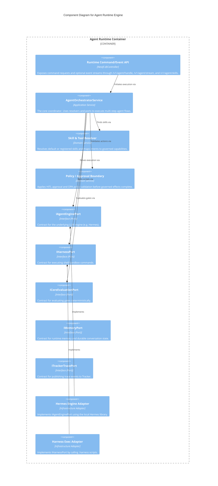

# C4 Level 3: Agent Runtime Components

> **Bilingual Navigation:** [Versión en Español](./agent-runtime-components.es.md)

**Status:** Approved  
**Level:** 3 - Components  
**Parent:** [C4 Level 3: Components Hub](./README.md)

## 1. Container Context

The **Agent Runtime Engine** orchestrates governed AI agent executions. It receives tasks from Tracker, MCP, CLI, or HTTP clients, resolves skills, enforces approval and policy boundaries, invokes capabilities through abstracted ports, and publishes trace/memory events.

It uses **Ports and Adapters (Hexagonal Architecture)**.

## 2. Component Diagram

## 3. Key Components Breakdown

| Component | Responsibility |
|-----------|----------------|
| **Runtime Command/Event API** | Receives an `AgentRuntimeRequest` through explicit HTTP commands. `POST /v1/agent/handle` returns one result envelope; `POST /v1/agent/stream` starts the command and keeps an event stream open for progress/tool-result/violation/final events. `GET /v1/agent/skills` exposes discovery. |
| **AgentOrchestratorService** | Coordinates the entire agent loop. It retrieves the task, asks the LLM engine for the next action, executes the action if allowed, and loops until completion. |
| **Skill & Tool Resolver** | Resolves default or registered capabilities such as gate validation, artifact checks, OPA audits, ADR validation, unblock recommendations, and trace publishing. |
| **Ports (IAgentEnginePort, etc)** | Define strict contracts for LLM planning, harness execution, Core evaluation, policy validation, Tracker trace publishing, memory, approval, and scheduling. |
| **Adapters** | Production adapters include HTTP Core evaluation, OPA CLI policy validation, harness process execution, HTTP Tracker trace publishing, and file-backed memory. Safe stubs remain available for local bootstrapping and tests. |

---
[Back to Level 3: Components Hub](./README.md)
