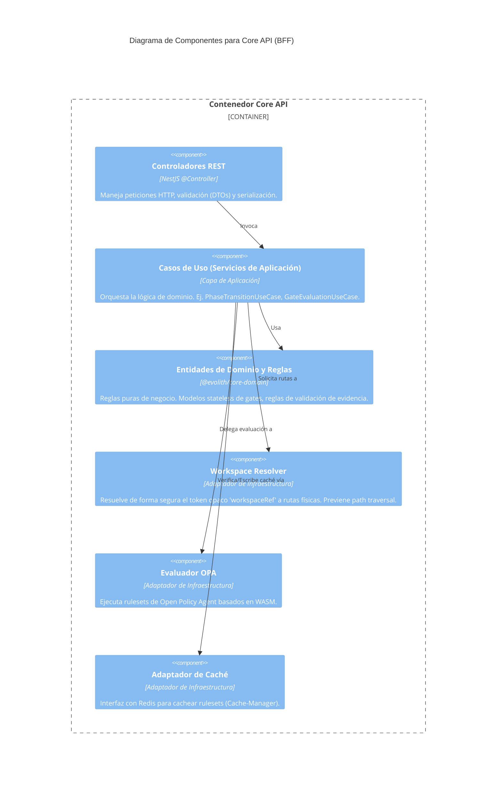

# C4 Nivel 3: Componentes del Core API

> **Navegación Bilingüe:** [Ver Versión en Inglés](./core-api-components.md)

**Estado:** Aprobado  
**Nivel:** 3 - Componentes  
**Padre:** [C4 Nivel 3: Hub de Componentes](./README.es.md)

## 1. Contexto del Contenedor

El **Core API (BFF)** es el motor de evaluación stateless de Evolith. Recibe peticiones HTTP REST, resuelve referencias de workspaces para encontrar el corpus de referencia apropiado, evalúa gates usando OPA o un Motor Nativo, y retorna un resultado de evaluación técnica.

Se adhiere estrictamente a **Clean Architecture**.

## 2. Diagrama de Componentes

## 3. Desglose de Componentes Clave

| Componente | Responsabilidad |
|------------|-----------------|
| **Controladores REST** | Exponen endpoints como `POST /v1/gates/evaluate`. Aseguran que los payloads cumplan con los esquemas DTO. |
| **Casos de Uso** | Coordinan el flujo: recibir input -> resolver workspace -> obtener ruleset (caché o disco) -> evaluar vía OPA -> retornar resultado. |
| **@evolith/core-domain** | La lógica central de negocio, desacoplada de NestJS. Define qué es un `Gate` o qué es una `Evidence`. |
| **Workspace Resolver** | Límite de seguridad. Traduce un token opaco `workspaceRef` (provisto por Tracker) en una ruta absoluta y segura al corpus de referencia en disco. |
| **Evaluador OPA** | Carga políticas `.wasm` compiladas de Rego, inyecta los rulesets JSON y la evidencia de entrada, y retorna el resultado de evaluación. |

---
[Volver al Nivel 3: Hub de Componentes](./README.es.md)
